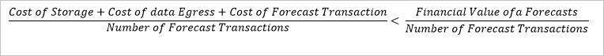
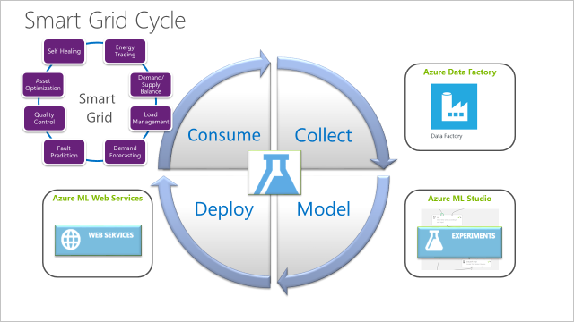
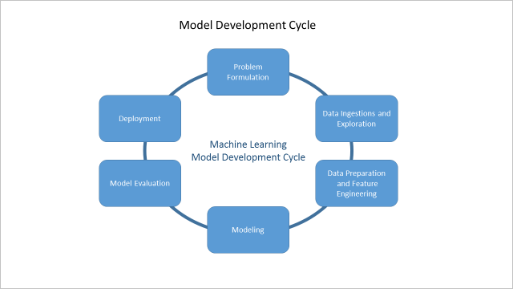
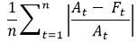
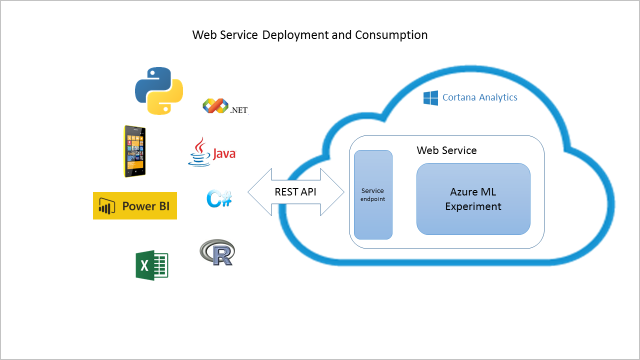
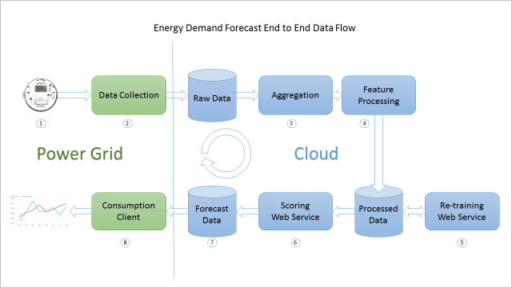
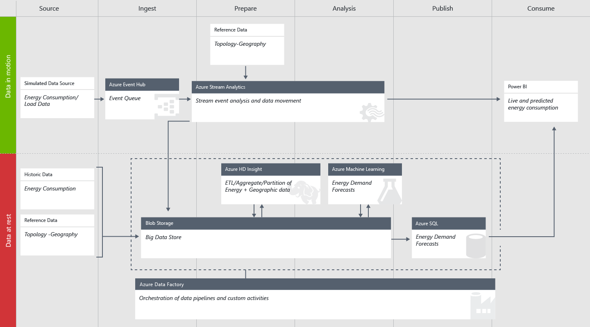

<properties
	pageTitle="Cortana Intelligence Solution Template Playbook for demand forecasting of energy | Microsoft Azure"
	description="A Solution Template with Microsoft Cortana Intelligence that helps forecast demand for an energy utility company."
	services="cortana-analytics"
	documentationCenter=""
	authors="ilanr9"
	manager="ilanr9"
	editor="yijichen"/>

<tags
	ms.service="cortana-analytics"
	ms.workload="data-services"
	ms.tgt_pltfrm="na"
	ms.devlang="na"
	ms.topic="article"
	ms.date="01/24/2016"
	ms.author="ilanr9;yijichen;garye"/>

# Cortana Intelligence Solution Template Playbook for Demand Forecasting of Energy  

## Executive Summary  

In the past few years, Internet of Things (IoT), alternative energy sources, and big data have merged to create vast opportunities in the utility and energy domain. At the same time, the utility and the entire energy sector have seen consumption flattening out with consumers demanding
better ways to control their use of energy. Hence, the utility and smart grid companies are in great need to innovate and renew themselves. Furthermore, many power and utility grids are becoming outdated and very costly to maintain and manage. During the last year, the team has been
working on a number of engagements within the energy domain. During these engagements, we have encountered many cases in which the utilities or ISVs (Independent Software Vendors) have been looking into forecasting for future energy demand. These forecasts play an important role in their current and future business and have become the foundation for various use cases. These include short and long-term power load forecast, trading, load balancing, grid optimization etc. Big data and Advanced Analytics (AA) methods such as Machine Learning (ML) are the key enablers for producing accurate and reliable forecasts.  

In this playbook, we put together the business and analytical guidelines needed for a successful development and deployment of energy demand forecast solution. These proposed guidelines can help utilities, data scientists, and data engineers in establishing fully operationalized, cloud-based, demand-forecasting solutions. For companies who are just starting their big data and advanced analytics journey, such a solution can represent the initial seed in their long-term smart grid strategy.

>[AZURE.TIP] To download a diagram that provides an architectural overview of this template, see [Cortana Intelligence Solution Template architecture for demand forecasting of energy](cortana-analytics-architecture-demand-forecasting-energy.md).  

## Overview  

This document covers the business, data, and technical aspects of using Cortana Intelligence and in particular Azure Machine Learning (AML) for the implementation and deployment of Energy Forecasting Solutions. The document consists of three main parts:  

1. Business understanding  
2. Data understanding  
3. Technical implementation

The **Business Understanding** part outlines the business aspect one needs to understand and consider prior to making an investment decision. It explains how to qualify the business problem at hand to ensure that predictive analytics and machine learning are indeed effective and applicable. The document further explains the basics of machine learning and how it is used to address energy-forecasting problems. It outlines the prerequisites and the qualification criteria of a use case. Some sample use cases and business case scenarios are also provided.

Data is the main ingredient for any machine learning solution. The **Data Understanding** part of this document covers some important aspects of the data. It outlines the kind of data that is needed for energy forecasting, data quality requirements, and what data sources typically exist. We also explain how the raw data is used to prepare data features that actually drive the modeling part.

The third part of the document covers the **Technical Implementation** aspect of a solution. Feature engineering and modeling are at the core of the data science process and are therefore being discussed in some detail. It covers the concept of web services, which are an important vehicle for cloud deployment of predictive analytics solutions. We also outline a typical architecture of an end-to-end operationalized solution.

In addition, the document includes reference material that you can use to gain further understanding of the domain and technology.

It is important to note that we do not intend to cover in this document the deeper data science process, its mathematical and technical aspects. These details can be found in [Azure ML
documentation](http://azure.microsoft.com/services/machine-learning/) and [blogs](http://blogs.microsoft.com/blog/tag/azure-machine-learning/).

### Target Audience   
The target audience for this document is both business and technical personnel who would like to gain knowledge and understanding of Machine Learning based solutions and how these are being used specifically within the energy-forecasting domain.

Data scientists can also benefit from reading this document to gain a better understanding of the high level process that drives the deployment of an energy forecasting solution. In this context it can also be used to establish a good baseline and starting point for more
detailed and advanced material.

### Industry Trends  
In the past few years, IoT, alternative energy sources, and big data have merged to create vast opportunities in the utility and energy space. At the same time, the utility and the entire energy sectors have seen consumption flattening out with consumers demanding better ways to control
their use of energy.

Many utility and smart energy companies have been pioneering the [smart grid](https://en.wikipedia.org/wiki/Smart_grid) by deploying a number of use cases that make use of the data generated by the grid. Many use cases revolve around the inherent characteristics of electricity
production: it cannot be accumulated nor stored aside as inventory. So, what is produced must be used. Utilities that want to become more efficient need to forecast power consumption simply because that will give them greater ability to **balance supply and demand**, thus preventing energy wastage, **reduce greenhouse gas emission**, and control cost.

When talking of costs, there is another important aspect, which is price. New abilities to trade power between utilities have brought in a great need to **forecast future demand and future price of electricity**. This can help companies determine their production volumes.

When we use the word 'smart', we actually refer to a grid that can learn and then make predictions. It can anticipate seasonal changes in consumption as well as **foresee temporary overload situations and automatically adjust for it**. By remotely regulating consumption (with
the help of these smart meters), localized overload situations can be handled. **By first predicting and then acting**, the grid makes itself smarter over time.

For the rest of this document we will focus on a specific family of use cases that cover forecasting of future, short term, and long-term energy demand. We have been working in these areas for a few months and have gained some knowledge and skill that allow us to produce industry grade results. Other use cases will be covered as well in the document in the near
future.

## Business Understanding

### Business Goals
The **Energy Demo** goal is to demonstrate a typical predictive analytics and machine learning solution that can be deployed in a very short time frame. Specifically, our current focus is on enabling energy demand forecast solutions so that its business value can be quickly realized and
leveraged upon. The information in this playbook can help the customer accomplishing the following goals:
-   Short time to value of machine learning based solution
-   Ability to expand a pilot use case to other use cases or to a broader scope based on their business need
-   Quickly gain Cortana Intelligence Suite product knowledge

With these goals in mind, this playbook aims at delivering the business and technical knowledge that will assist in achieving these goals.

### Power Load and Demand Forecasting
Within the energy sector, there could be many ways in which demand forecasting can help solve critical business problems. In fact, demand forecasting can be considered the foundation for many core use cases in the industry. In general, we consider two types of energy demand forecasts: short term and long term. Each one may serve a different purpose and utilize a different approach. The main difference between the two is the forecasting horizon, meaning the range of time into the future for which we would forecast.

#### Short Term Load Forecasting
Within the context of energy demand, Short Term Load Forecasting (STLF) is defined as the aggregated load that is forecasted in the near future on various parts of the grid (or the grid as a whole). In this context, short term is defined to be time horizon within the range of 1 hour to 24 hours. In some cases, a horizon of 48 hours is also possible. Therefore, STLF is very common in an operational use case of the grid. Here are some examples of STLF driven use cases:
-   Supply and demand balancing
-   Power trading support
-   Market making (setting power price)
-   Grid operational optimization
-   [Demand response](https://en.wikipedia.org/wiki/Demand_response)
-   Peak demand forecasting
-   Demand side management
-   Load balancing and overload prevention
-   Long Term Load Forecasting
-   Fault and anomaly detection
-   Peak curtailment/leveling 

STLF model are mostly based on the near past (last day or week) consumption data and use forecasted temperature as an important predictor. Obtaining accurate temperature forecast for the next hour and up to 24 hours is becoming less of a challenge now days. These models are less sensitive to seasonal patterns or long-term consumption trends.

SLTF solutions are also likely to generate high volume of prediction calls (service requests) since they are being invoked on an hourly basis and in some cases even with higher frequency. It is also very common to see implantation where each individual substation or transformer is represented as a standalone model and therefore the volume of prediction requests are even greater.

#### Long Term Load Forecasting
The goal of Long Term Load Forecasting (LTLF) is to forecast power demand with a time horizon ranging from 1 week to multiple months (and in some cases for a number of years). This range of horizon is mostly applicable for planning and investment use cases.

For long-term scenarios, it is important to have high quality data that covers a span of multiple years (minimum 3 years). These models will typically extract seasonality patterns from the historical data and make use of external predicators such as weather and climate patterns.

It is important to clarify that the longer the forecasting horizon is, the less accurate the forecast may be. It is therefore important to produce some confidence intervals along with the actual forecast that would allow humans to factor the possible variation into their planning
process.

Since the consumption scenario for LTLF is mostly planning, we can expect much lower prediction volumes (as compared to STLF). We would typically see these predictions embedded into visualization tools such as Excel or PowerBI and be invoked manually by the user.

### Short Term vs. Long Term Prediction
The following table compares STLF and LTLF in respect to the most important attributes:

|Attribute|Short Term Load Forecast|Long Term Load Forecast|
|---|---|---|
|Forecast Horizon|From 1 hour to 48 hours|From 1 to 6 months or more|
|Data granularity|Hourly|Hourly or daily|
|Typical use cases|<ul><li>Demand/Supply balancing</li><li>Pick hour forecasting</li><li>Demand response</li></ul>|<ul><li>Long term planning</li><li>Grid assets planning</li><li>Resource planning</li></ul>|
|Typical predictors|<ul><li>Day or week</li><li>Hour of day</li><li>Hourly temperature</li></ul>|<ul><li>Month of year</li><li>Day of month</li><li>Long term temperature and climate</li></ul>|
|Historical data range|Two to three years' worth of data|Five to 10 years' worth of data|
|Typical accuracy|MAPE* of 5% or lower|MAPE* of 25% or lower|
|Forecast frequency|Produced every hour or every 24 hours|Produced once monthly, quarterly or yearly|
\*[MAPE](https://en.wikipedia.org/wiki/Mean_absolute_percentage_error) –
Mean Average Percent Error

As can be seen from this table, it is quite important to distinguish between the short and the long term forecasting scenarios as these represent different business needs and may have different deployment and consumption patterns.

### Example Use Case 1: eSmart Systems – Overload optimization
An important role of a [smart grid](https://en.wikipedia.org/wiki/Smart_grid) is to dynamically and constantly optimize and adjust for the changing consumption patterns. Power consumption can be impacted by short-term changes that are mainly caused by temperature fluctuations (*e.g.*, more power is used for air condition or heating). At the same time, power consumption is also
influenced by long-term trends. These may include seasonality effects, national holidays, long-term consumption growth, and even economic factors such as consumer index, oil price, and GDP.

In this use case, [eSmart](http://www.esmartsystems.com/) wanted to deploy a cloud-based solution that enables predicting the propensity of an overload situation on any given substation of the grid. In particular, eSmart wanted to identify substations that are likely to overload within the next hour, so an immediate action could be taken to avoid or resolve that situation.

An accurate and fast performing prediction requires implementation of three predictive models:
-   Long term model that enables forecasting of power consumption on each substation during the next few weeks or months
-   Short term model that enables prediction of overload situation on a given substation during the next hour
-   Temperature model that provides forecasting of future temperature over multiple scenarios

The objective of the long-term model is to rank the substations by their propensity to overload (given their power transmission capacity) during the next week or month. This allows the creation of a short list of substations that would serve as an input for the short-term prediction. As temperature is an important predictor for the long-term model, there is a need to constantly produce multi-scenario temperature forecasts and feed them as input into to the long-term model. The short term forecast is then invoked to predict which substation is likely to overload over the next hour.

The short-term and long-term models are deployed individually per each substation. Therefore, the practical execution of these models requires extensive orchestration. To gain higher prediction accuracy in the short term, a more granular model is dedicated for each hour of the day. All these models are executed every hour and finish execution within a few minutes to allow sufficient time to respond and take preventive actions if needed. This collection of models is kept up-to-date by periodical retraining using the most recent data.

More information about this use case can be found [here](https://customers.microsoft.com/Pages/CustomerStory.aspx?recid=18945).

#### Use Case Qualification Criteria – Prerequisites
The main strength of Cortana Intelligence is in its powerful ability to deploy and scale machine learning centric solutions. It is designed to support thousands of predictions that are executed concurrently. It can automatically scale to meet a changing consumption pattern. A solution's
focus therefore, is on accuracy and computational performance. For example, a utility company is interested in producing accurate energy demand forecast for the next hour, and for each hour of the day. On the other hand, we are less interested in answering the question of why the demand is predicted to be as it is (the model itself will take care of that).

It is therefore important to realize that not all use cases and business problems can be effectively solved using machine learning.

Cortana Intelligence and machine learning could be highly effective in solving a given business problem when the following criteria are met:
-   The business problem in hand is **predictive** in nature. A predictive use case example is a utility company that would like to predict power load on a given substation during the next hour. On the other hand, analyzing and ranking drivers of historical demand would be **descriptive** in nature and therefore less applicable.
-   There is a clear **path of action** to be taken once the prediction is available. For example, predicting an overload on a substation during the next hour can trigger a proactive action of reducing load that is associated with that substation and thus potentially preventing an overload.
-   The use case represents a **typical type of problem** such that when solved it can pave the way to solving other similar use cases.
-   The customer can set **quantitative and qualitative goals** to demonstrate a successful solution implementation. For example, a good quantitative goal for energy demand forecast would be the required accuracy threshold (*e.g.*, up to 5% error is allowed) or when predicting substation overload then the precision (rate of true positives) and recall (extent of true positives) should be above a given threshold. These goals should be derived from the customer's business goals.
-   There is a clear **integration scenario** with the company's business workflow. For example, the substation load forecast can be integrated into the grid control center to allow overload prevention activities.
-   The customer has ready to use **data with sufficient quality** to support the use case (see more in the next section, **Data Quality**, of this playbook).
-   The customer embraces cloud centric data architecture or **cloud-based machine learning**, including Azure ML and other Cortana Intelligence Suite components.
-   The customer is willing to establish **an end to end data flow** that facilities the delivery of data into the cloud on an ongoing basis, and is willing to **operationalize** the solution.
-   The customer is ready to **dedicate resources** who will be actively engaged during the initial pilot implementation so that knowledge and ownership of the solution can be transferred to the customer upon successful completion.
-   The customer resource should be a **skilled data professional**, preferably a data scientist.

Qualification of a use case based on the above criteria can greatly improve the success rates of a use case and establish a good beachhead for the implementation of future use cases.

### Cloud-Based Solutions
Cortana Intelligence Suite on Azure is an integrated environment that resides in the cloud. The deployment of an advanced analytics solution in a cloud environment holds substantial benefits for businesses and at the same time may mean big change for companies that still use on-premise IT
solutions. Within the energy sector, there is a clear trend of gradual migration of operations into the cloud. This trend goes hand in hand along with the development of the smart grid as discussed above, in **Industry Trends**. As this playbook is focused on a cloud-based solution in the energy domain, it is important to explain the benefits and other considerations of deploying a cloud-based solution.

Perhaps the biggest advantage of a cloud-based solution is the cost. As a solution makes use of cloud-deployed components, there is no upfront costs or COGS (Cost of Goods Sold) component costs associated with it. That means that there is no need to invest in hardware, software, and IT maintenance, and therefore there is a substantial reduction in business risk.

Another important advantage is the pay-as-you-go cost structure of cloud-based solutions. Cloud-based servers for computing or storage can be deployed and scaled on a just-as-needed basis. This represents the cost efficiency advantage of a cloud-based solution.

Finally, there is no need for investing in IT maintenance or future infrastructure development as all this is part of the cloud-based offering. To that extent, Cortana Intelligence Suite includes the best in class services and its road map keeps evolving. New features, components, and capabilities are constantly being introduced and evolve.

For a company that is just starting its transition into the cloud, we are highly recommending to take a gradual approach by implementing a cloud migration road map. We believe that for utilities and companies in the energy domain, the use cases that are discussed in this playbook
represent an excellent opportunity for piloting predictive analytics solutions in the cloud.

#### Business Case Justification Considerations
In many cases, the customer may be interested in making a business justification for a given use case in which a cloud-based solution and Machine Learning are important components. Unlike an on-premise solution, in the case of a cloud-based solution, the upfront cost component is minimal and most of the cost elements are associated with actual usage. When it comes to deploying an energy forecasting solution on Cortana Intelligence Suite, multiple services can be integrated with a single common cost structure. For example, databases (*e.g.*, SQL Azure) can be used to store the raw data and then for the actual forecasts Azure ML is used to host the forecasting services. In this example, the cost structure could include storage and transactional components.

On the other hand, one should have a good understanding of the business value of operating an energy demand forecasting (short or long term). In fact, it is important to realize the business value of each forecast operation. For example, accurately forecasting power load for the next
24 hours can prevent overproduction or can help prevent overloads on the grid and this can be quantified in terms of financial savings on a daily basis.

A basic formula for calculating the financial benefit of demand forecast solution would be:

Since Cortana Intelligence Suite provides a pay-as-you-go pricing model, there is no need for incurring a fixed cost component to this formula. This formula can be calculated on a daily, monthly, or annual basis.

Current Cortana Intelligence Suite and Azure ML pricing plans can be found [here](http://azure.microsoft.com/pricing/details/machine-learning/).

### Solution Development Process
The development cycle of an energy demand forecasting solution typically involves 4 phases, in all of which we make use of cloud-based technologies and services within the Cortana Intelligence Suite.

This is illustrated in the following diagram:

The following paragraph describes this 4 step process:

1.  **Data Collection** – Any advanced analytics based solution relies on data (see **Data Understanding**). Specifically, when it comes to predictive analytics and forecasting, we rely on ongoing, dynamic flow of data. In the case of energy demand forecasting, this data can be sourced directly from smart meters, or be already aggregated on an on-prem database. We also rely on other external sources of data such as weather and temperature. This ongoing flow of data must be orchestrated, scheduled, and stored. [Azure Data Factory](http://azure.microsoft.com/services/data-factory/) (ADF) is our main workhorse for accomplishing this task.
2.  **Modeling** – For accurate and reliable energy forecasts, one must develop (train) and maintain a great model that makes use of the historical data and extracts the meaningful and predictive patterns in the data. The area of Machine Learning (ML) has been growing rapidly with more advanced algorithms being routinely developed. Azure ML Studio provides a great user experience that helps utilize the most advanced ML algorithms within a complete work flow. That workflow is illustrated in an intuitive flow diagram and includes the data preparation, feature extraction, modeling, and model evaluation. The user can pull in hundreds of various models that are included in this environment. By the end of this phase a data scientist will have a working model that is fully evaluated and ready for deployment.

	The following diagram is an illustration of a typical workflow:

	

3.  **Deployment** – With a working model in hand, the next step is deployment. Here the model is converted into a web service that exposes a RESTful API that can be concurrently invoked over the     Internet from various consumption clients. Azure ML provides a simple way of deploying a model directly from the Azure ML Studio with a single click of a button. The entire deployment process happens under the hood. This solution can automatically scale to meet the required consumption.

4.  **Consumption** – In this phase, we actually make use of the forecasting model to produce predictions. The consumption can be driven from a user application (*e.g.*, dashboard) or directly from an operational system such as demand/supply balancing system or a grid optimization solution. Multiple use cases can be driven from a single model.

## Data Understanding
After covering the business considerations (see **Business Understanding**) of an energy demand forecasting solution, we are now ready to discuss the data part. Any predictive analytics solution relies on reliable data. For energy demand forecasting, we rely on historical consumption data with various levels of granularity. That historical data is used as the raw material. It will undergo a careful analysis in which the data scientist will identify predictors (also referred to as features) that can be put into a model which will eventually generate the required forecasts.

In the rest of this section, we will describe the various steps and considerations for understanding the data and how to bring it to a usable form.

### The Model Development Cycle
Producing good forecasting models requires some careful preparation and planning. Breaking down the modeling process into multiple steps and focusing on one step at a time could dramatically improve the outcome of the entire process.

The following diagram illustrates how the modeling process could be broken down into multiple steps:

As can be seen the cycle consists of six steps:
-   Problem formulation
-   Data ingestion and data exploration
-   Data preparation and feature engineering
-   Modeling
-   Model evaluation
-   Development

In the rest of this section we will describe the individual steps and items to consider at each step.

### Problem Formulation
We can consider the problem formulation as the most critical step one needs to take prior to implementing any predictive analytics solution. Here we would transform the business problem and decompose it to specific elements which can be solved by using data and modeling techniques. It is a good practice to formulate the problem as a set of questions we would like to answer. Here are some possible questions that might be applicable within the scope of energy demand forecasting:
-   What is the expected load on an individual substation in the next hour or day?
-   At what time of the day will my grid experience peak demand?
-   How likely is my grid to sustain the expected peak load?
-   How much power should the power station generate during each hour of the day?

Formulating these questions allows us to focus on getting the right data and implementing a solution that is fully aligned with the business problem at hand. Furthermore, we can then set some key metrics that allow us to evaluate the performance of the model. For example, how
accurate should the forecast be and what is the range of error that would still be acceptable by the business?

### Data Sources
The modern smart grid collects data from various parts and components of the grid. This data represents various aspects of the operation and the utilization of the power grid. Within the scope of the energy demand forecast, we are limiting the discussion on data sources that reflect the actual demand consumption. One important source of energy consumption are smart meters. Utilities around the globe are rapidly deploying smart meters for their consumers. Smart meters record the actual power consumption and constantly relay this data back to the utility company. Data is collected and sent back at a fixed interval, ranging from every 5 minutes to 1 hour. More advanced smart meters can be programmed remotely to control and balance the actual consumption within a household. Smart meter data is relatively reliable and includes a time stamp. That makes it an important ingredient for demand forecast. Meter data can be aggregated (summed up) at various levels within the grid topology: transformer, substation, region, *etc*. We can then pick the required aggregation level to build a forecasting model for it. For example, if the utility company would like to forecast future load on each of its grid substations then all meters' data can be aggregated for each individual substation and used as an input for the forecasting model. We refer to smart meters as an internal data source.

A reliable energy demand forecast will also rely on other external data sources. One important factor that affects power consumption is the weather, or more precisely the temperature. Historical data shows strong correlation between outside temperature and power consumption. During hot summer days, consumers make use of their air conditioners and during the winter power on heating systems. A reliable source of historical temperatures at the grid location is therefore key. Furthermore, we also rely on accurate forecast of temperature as a predictor of power
consumption.

Other external data sources can also help in building energy demand forecast models. These may include long term climate changes, economical indexes (*e.g.*, GDP), and others. In this document we will not include these other data sources.

### Data Structure
After identifying the required data sources, we would like to ensure that raw data that has been collected includes the correct data features. To build a reliable demand forecast model, we would need to ensure that the data collected includes data elements that can help predict the future demand. Here are some basic requirements concerning the data structure (schema) of the raw data.

The raw data consists of rows and columns. Each measurement is represented as a single row of data. Each row of data includes multiple columns (also referred to as features or fields).

1.  **Time stamp** – the timestamp field represents the actual time when the measurement was recorded. It should comply with one of the common date/time formats. Both date and time parts should be included. In most cases, there is no need for the time to be recorded till the second level of granularity. It is important to specify the time zone in which the data is recorded.
2.  **Meter ID** - This field identifies the meter or the measurement device. It is a categorical variable and can be a combination of digits and characters.
3.  **Consumption value** – This is the actual consumption at a given date/time. The consumption can be measured in kWh (kilowatt-hour) or any other preferred units. It is important to note that the measurement unit must stay consistent across all measurements in the data. In some cases, consumption can be supplied over 3 power phases. In that case we would need to collect all the independent consumption phases.
4.  **Temperature** – the temperature is typically collected from an independent source. However, it should be compatible with the consumption data. It should include a timestamp as described above that will allow it to be synchronized with the actual consumption data. The temperature value can be specified in degrees Celsius or Fahrenheit but should stay consistent across all measurements.
5.  **Location –** The location field is typically associated with the place where the temperature data has been collected. It can be represented as a zip-code number or in latitude/longitude (lat/long) format.

The following tables shows examples of a good consumption and temperature data format:

|**Date**|**Time**|**Meter ID**|**Phase 1**|**Phase 2**|**Phase 3**|
|--------|--------|------------|-----------|-----------|-----------|
|7/1/2015|10:00:00|ABC1234     |7.0        |2.1        |5.3        |
|7/1/2015|10:00:01|ABC1234     |7.1        |2.2        |4.3        |
|7/1/2015|10:00:02|ABC1234     |6.0        |2.1        |4.0        |

|**Date**|**Time**|**Location**|**Temperature**|
|--------|--------|-------------|---------------|
|7/1/2015|10:00:00|11242        |24.4           |
|7/1/2015|10:00:01|11242        |24.4           |
|7/1/2015|10:00:02|11242        |24.5           |

As can be seen above, this example includes 3 different values for consumption associated with 3 power phases. Also, note that the date and time fields are separated, however they can also be combined into a single column. In this case the location column is represented in a 5-digit zip-code format and the temperature in a degree Celsius format.

### Data Format
Cortana Intelligence Suite can support the most common data formats like CSV, TSV, JSON, *etc*. It is important that the data format stays consistent for the entire life cycle of the project.

### Data Ingestion
Since energy demand forecast is constantly and frequently predicted, we must ensure that the raw data is flowing by means of a solid and reliable data ingestion process. The ingestion process must guarantee that the raw data is available for the forecasting process at the required time. That implies that the data ingestion frequency should be greater than the forecasting frequency.

For example: If our demand forecasting solution would generate a new forecast at 8:00AM on a daily basis then we need to ensure that all the data that has been collected during the last 24 hours has been fully ingested till that point and has to even include the last hour of
data.

In order to accomplish this, Cortana Intelligence Suite offers various ways to support a reliable data ingestion process. This will be further discussed in the **Deployment** section of this document.

### Data Quality
The raw data source that is required for performing reliable and accurate demand forecasting must meet some basic data quality criteria. Although advanced statistical methods can be used to compensate for some possible data quality issue, we still need to ensure that we are crossing some base data quality threshold when ingesting new data. Here are a few considerations concerning raw data quality:
-   **Missing value** – this refers to the situation when specific measurement was not collected. The basic requirement here is that the missing value rate should not be greater than 10% for any given time period. In case that a single value is missing it should be indicated by using a pre-defined value (for example: '9999') and not '0' which could be a valid measurement.
-   **Measurement accuracy** – the actual value of consumption or temperature should be accurately recorded. Inaccurate measurements will produce inaccurate forecasts. Typically, the measurement error should be lower than 1% relative to the true value.
-   **Time of measurement** – it is required that the actual timestamp of the data collected will not deviate by more than 10 seconds relative to the true time of the actual measurement.
-   **Synchronization** – When multiple data sources are being used (*e.g.*, consumption and temperature) we must ensure that there are no time synchronization issues between them. This means that the time difference between the collected timestamp from any two independent data sources should not exceed more than 10 seconds.
-   **Latency** - As discussed above, in **Data Ingestion**, we are dependent on a reliable data flow and ingestion process. To control that we must ensure that we control the data latency. This is specified as the time difference between the time that the actual measurement was taken and the time at which it has been loaded into the Cortana Intelligence Suite storage and is ready for use. For short term load forecasting the total latency should not be greater than 30 minutes. For long term load forecasting the total latency should not be greater than 1 day.

### Data Preparation and Feature Engineering
Once the raw data has been ingested (see **Data Ingestion**) and has been securely stored, it is ready to be processed. The data preparation phase is basically taking the raw data and converting (transforming, reshaping) it into a form for the modeling phase. That may include
simple operations such as using the raw data column as is with its actual measured value, standardized values,  more complex operations such as [time lagging](https://en.wikipedia.org/wiki/Lag_operator), and others. The newly created data columns are referred to as data features and the process of generating these is referred to as feature engineering. By the end of this process we would have a new data set that has been derived from the raw data and can be used for modeling. In addition, the data preparation phase needs to take care of missing values (see **Data Quality**) and compensate for them. In some cases, we would also need to normalize the data to ensure that all values are represented in the same scale.

In this section we list some of the common data features that are included in the energy demand forecast models.

**Time driven features:**
These features are derived from the date/timestamp data. These are extracted and converted into categorical features like:
-   Time of day – This is the hour of the day which takes values from 0 to 23
-   Day of week – This represents the day of the week and takes values from 1 (Sunday) to 7 (Saturday)
-   Day of month – This represents the actual date and can take values from 1 to 31
-   Month of year – This represents the month and takes values from 1 (January) to 12 (December)
-   Weekend – This is a binary value feature that takes the values of 0 for weekdays or 1 for weekend
-   Holiday - This is a binary value feature that takes the values of 0 for a regular day or 1 for a holiday
-   Fourier terms – The Fourier terms are weights that are derived from the timestamp and are used to capture the seasonality (cycles) in the data. Since we may have multiple seasons in our data we may need multiple Fourier terms. For example, demand values may have yearly, weekly, and daily seasons/cycles which will result in 3 Fourier terms.

**Independent measurement features:**
The independent features include all the data elements that we would like to use as predictors in our model. Here we exclude the dependent feature which we would need to predict.
-   Lag feature – these are time shifted values of the actual demand. For example, lag 1 features will hold the demand value in the previous hour (assuming hourly data) relative to the current timestamp. Similarly, we can add lag 2, lag 3, *etc*. The actual combination of lag features that are used are determined during the modeling phase by evaluation of the model results.
-   Long term trending – this feature represents the linear growth in demand between years.

**Dependent feature:**
The dependent feature is the data column which we would like our model to predict. With [supervised machine learning](https://en.wikipedia.org/wiki/Supervised_learning), we need to
first train the model using the dependent features (which is also referred to as labels). This allows the model to learn the patterns in the data associated with the dependent feature. In energy demand forecast we typically want to predict the actual demand and therefore we would use it as the dependent feature.

**Handling of missing values:**
During the data preparation phase, we would need to determine the best strategy to handle missing values. This is mostly done by using the various statistical [data imputation methods](https://en.wikipedia.org/wiki/Imputation_(statistics)). In the case of energy demand forecasting, we typically impute missing values by using moving average from previous available data points.

**Data Normalization:**
Data normalization is another type of transformation which is used to bring all numeric data such as demand forecast into a similar scale. This typically helps improve the model accuracy and precision. We would typically do this by dividing the actual value by the range of the data.
This will scale the original value down into a smaller range, typically between -1 and 1.

## Modeling
The modeling phase is where the conversion of the data into a model takes place. In the core of this process there are advanced algorithms that scan the historical data (training data), extract patterns, and build a model. That model can be later used to predict on new data that
has not been used to build the model.

Once we have a working reliable model we can then use it to score new data that is structured to include the required features (X). The scoring process will make use of the persisted model (object from the training phase) and predict the target variable that is denoted by Ŷ.

### Demand Forecasting Modeling Techniques
In the case of demand forecasting we make use of historical data which is ordered by time. We generally refer to data that includes the time dimension as [time series](https://en.wikipedia.org/wiki/Time_series). The goal in time series modeling is to find time related trends, seasonality, auto-correlation (correlation over time), and formulate those into a model.

In recent years advanced algorithms have been developed to accommodate time series forecasting and to improve forecasting accuracy. We briefly discuss a few of them here.

> [AZURE.NOTE] This section is not intended to be used as a machine learning and forecasting overview but rather as a short survey of modeling techniques that are commonly used for demand forecasting. For more information and educational material about time series forecasting, we highly
recommend the online book [Forecasting: principles and practice](https://www.otexts.org/book/fpp).

#### [**MA (Moving Average)**](https://www.otexts.org/fpp/6/2)
Moving average is one of the first analytical techniques that has been used for time series forecasting and it is still one of the most commonly used techniques as of today. It is also the foundation for more advanced forecasting techniques. With moving average we are forecasting
the next data point by averaging over the K most recent points, where K denotes the order of the moving average.

The moving average technique has the effect of smoothing the forecast and therefore may not handle well large volatility in the data.

#### [**ETS (Exponential Smoothing)**](https://www.otexts.org/fpp/7/5)
Exponential Smoothing (ETS) is a family of various methods which use weighted average of recent data points in order to predict the next data point. The idea is to assign higher weights to more recent values and gradually decrease this weight for older measured values. There are a
number of different methods with this family, some of them include handling of seasonality in the data such as [Holt-Winters Seasonal Method](https://www.otexts.org/fpp/7/5).

Some of these methods also factor in the seasonality of the data.

#### [**ARIMA (Auto Regression Integrated Moving Average)**](https://www.otexts.org/fpp/8)
Auto Regression Integrated Moving Average (ARIMA) is another family of methods which is commonly used for time series forecasting. It practically combines auto-regression methods with moving average. Auto-regression methods use regression models by taking previous time series values in order to compute the next date point. ARIMA methods also apply differencing methods that include calculating the difference between data points and using those instead of the original measured value. Finally, ARIMA also makes use of the moving average
techniques that are discussed above. The combination of all of these methods in various ways is what constructs the family of ARIMA methods.

ETS and ARIMA are widely used today for energy demand forecasting and many other forecasting problems. In many cases these are combined together to deliver very accurate results.

**General Multiple Regression**
Regression models could be the most important modeling approach within the domain of machine learning and statistics. In the context of time series we use regression to predict the future values (*e.g.*, of demand). In regression we take a linear combination of the predictors and learn
the weights (also referred to as coefficients) of those predictors during the training process. The goal is to produce a regression line that will forecast our predicted value. Regression methods are suitable when the target variable is numeric and therefore also fits time series forecasting. There is a wide range of regression methods including very simple regression models such as [Linear Regression](https://en.wikipedia.org/wiki/Linear_regression) and more advanced ones such as decision trees, [Random Forests](https://en.wikipedia.org/wiki/Random_forest), [Neural Networks](https://en.wikipedia.org/wiki/Artificial_neural_network), and Boosted Decision Trees.

Constructing energy demand forecasting as a regression problem gives us a lot of flexibility in selecting our data features which can be combined from the actual demand time series data and external factors such as temperature. More information about the selected features are discussed in the Feature Engineering (see **Data Preparation and Feature Engineering**) section of this playbook.

From our experience with implementation and deployment of energy demand forecasts pilot, we have found that the advanced regression models that are available in Azure ML tend to produce the best results and we make use of them.

## Model Evaluation
Model evaluation has a critical role within the **Model Development Cycle**. At this step we look into validating the model and its performance with real life data. During the modeling step we use a part of the available data for training the model. During the evaluation phase we take the remainder of the data to test the model. Practically it means that we are feeding the model new data that has been restructured and contains the same features as the training dataset. However, during the validation process, we use the model to predict the target variable rather than provide the available target variable. We often refer to this process as model scoring. We would then use the true target values and compare them with the predicted ones. The goal here is to measure and minimize the prediction error, meaning the difference between the predictions and the true value. Quantifying the error measurement is key since we would like to fine-tune the model and validate whether the error is actually decreasing. Fine-tuning the model can be done by modifying model parameters that control the learning process, or by adding or removing data features (referred to as [parameters sweep](https://channel9.msdn.com/Blogs/Windows-Azure/Data-Science-Series-Building-an-Optimal-Model-With-Parameter-Sweep)). Practically that means that we may need to iterate between the feature engineering, modeling, and model evaluation phases multiple times until we are able to reduce the error to the required level.

It is important to emphasis that the prediction error will never be zero as there is never a model that can perfectly predict every outcome. However, there is a certain magnitude of error that is acceptable by the business. During the validation process, we would like to ensure that
our model prediction error is at the level or better than the business tolerance level. It is therefore important to set the level of the tolerable error at the beginning of the cycle during the **Problem Formulation** phase.

### Typical Evaluation Techniques
There are various ways in which prediction error can be measured and quantified. In this section we will focus the discussion on evaluation techniques relevant to time series and in specific for energy demand forecast.

#### [**MAPE**](https://en.wikipedia.org/wiki/Mean_absolute_percentage_error)
MAPE stands for Mean Absolute Percentage Error. With MAPE we are computing the difference between each forecasted point and the actual value of that point. We then quantify the error per point by calculating the proportion of the difference relative to the actual value. At the
last step we average these values. The mathematical formula used for MAPE is the following:

*Where At is the actual value, Ft is the predicted value, and n is the forecast horizon.*

## Deployment
Once we have nailed down the modeling phase and validated the model performance we are ready to go into the deployment phase. In this context, deployment means enabling the customer to consume the model by running actual predictions on it at large scale. The concept of deployment is key in Azure ML since our main goal is to constantly invoke predictions as opposed to just obtaining the insight from the data. The deployment phase is the part where we enable the model to be consumed at large scale.

Within the context of energy demand forecast, our aim is to invoke continuous and periodic forecasts while ensuring that fresh data is available for the model and that the forecasted data is sent back to the consuming client.

### Web Services Deployment
The main deployable building block in Azure ML is the web service. This is the most effective way to enable consumption of a predictive model in the cloud. The Web service encapsulates the model and wraps it up with a [RESTful](http://www.restapitutorial.com/) API (Application Programming Interface). The API can be used as part of any client code as illustrated in the diagram below.

As can be seen, the web service is deployed in the Cortana Intelligence Suite cloud and can be invoked over its exposed REST API endpoint. Different type of clients across various domains can invoke the service through the Web API simultaneously. The web service can also scale to
support thousands of concurrent calls.

### A Typical Solution Architecture
When deploying an energy demand forecasting solution, we are interested in deploying an end to end solution that goes beyond the prediction web service and facilitates the entire data flow. At the time we invoke a new forecast, we would need to make sure that the model is fed with the
up-to-date data features. That implies that the newly collected raw data is constantly ingested, processed, and transformed into the required feature set on which the model was built. At the same time, we would like to make the forecasted data available for the end consuming
clients. An example data flow cycle (or data pipeline) is illustrated in the diagram below:

These are the steps that take place as part of the energy demand forecast cycle:
1.  Millions of deployed data meters are constantly generating power consumption data in real time.
2.  This data is being collected and uploaded into a cloud repository (*e.g.*, Azure Blob).
3.  Before being processed, the raw data is aggregated to a substation or regional level as defined by the business.
4.  The feature processing (see **Data Preparation and Feature Processing**) then takes place and produces the data that is required for model training or scoring – the feature set data is stored in a database (*e.g.*, SQL Azure).
5.  The re-training service is invoked to re-train the forecasting model – that updated version of the model is persisted so that it can be used by the scoring web service.
6.  The scoring web service is invoked on a schedule that fits the required forecast frequency.
7.  The forecasted data is stored in a database that can be accessed by the end consumption client.
8.  The consumption client retrieves the forecasts, applies it back into the grid, and consumes it in accordance with the required use case.

It is important to note that this entire cycle is fully automated and runs on a schedule. The entire orchestration of this data cycle can be done by using tools such as [Azure Data Factory](http://azure.microsoft.com/services/data-factory/).

### End to End Deployment Architecture
In order to practically deploy an energy demand forecast solution on Cortana Intelligence, we need to ensure that the required components are established and configured correctly.

The following diagram illustrates a typical Cortana Intelligence based architecture that implements and orchestrates the data flow cycle that is described above:

For more information about each of the components and the entire architecture please refer to the Energy Solution Template.
