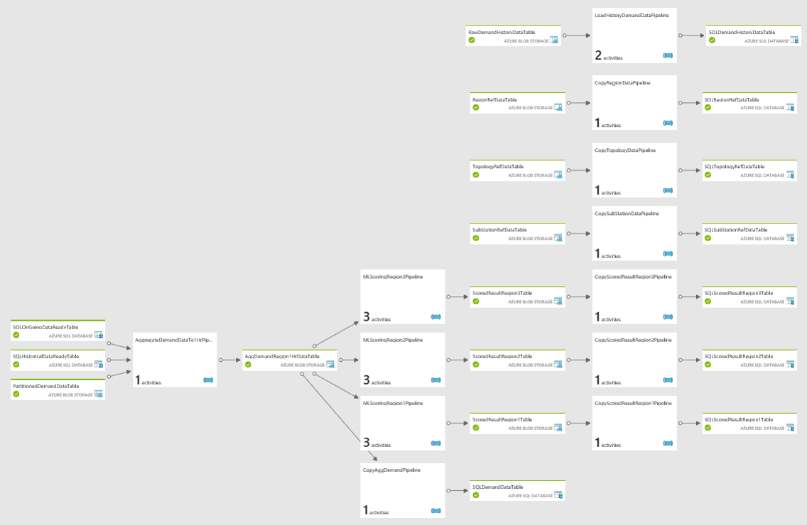
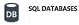
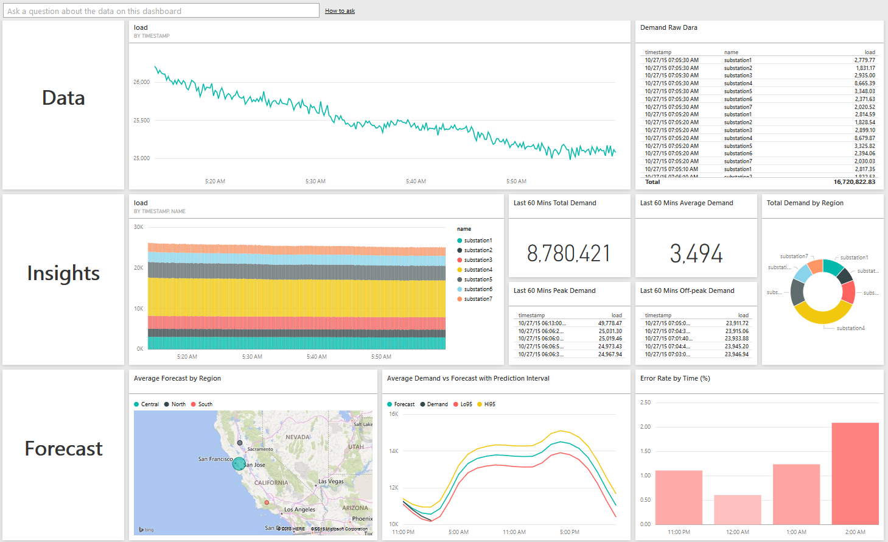
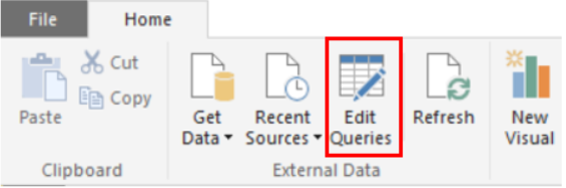
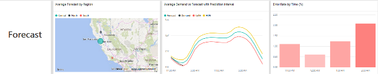
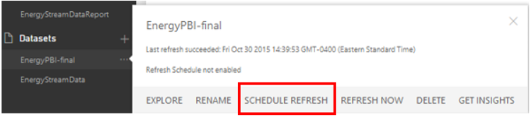

# Technical guide to the Cortana Intelligence Solution Template for demand forecast in energy
## **Overview**
Solution Templates are designed to accelerate the process of building an E2E demo on top of Cortana Intelligence Suite. A deployed template provisions your subscription with necessary Cortana Intelligence component and build the relationships between. It also seeds the data pipeline with sample data getting generated from a data simulation application. Download the data simulator from the link provided and install it on your local machine, refer to the readme.txt file for instruction on using the simulator. Data generated from the simulator hydrates the data pipeline and start generating machine learning prediction, which can then be visualized on the Power BI dashboard.

The solution template can be found [here](https://gallery.cortanaintelligence.com/SolutionTemplate/Demand-Forecasting-for-Energy-1)

The deployment process guides you through several steps to set up your solution credentials. Make sure you record these credentials such as solution name, username, and password you provide during the deployment.

The goal of this document is to explain the reference architecture and different components provisioned in your subscription as part of this Solution Template. The document also talks about how to replace the sample data, with real data of your own to be able to see insights/predictions from you won data. Additionally, the document talks about the parts of the Solution Template that would need to be modified if you want to customize the solution with your own data. Instructions on how to build the Power BI dashboard for this Solution Template are provided at the end.

## **Details**

### Architecture Explained
When the solution is deployed, various Azure services within Cortana
Analytics Suite are activated (that is, Event Hub, Stream Analytics,
HDInsight, Data Factory, Machine Learning, *etc.*). The architecture
diagram shows, at a high level, how the Demand Forecasting for Energy Solution Template is constructed from end-to-end. You can investigate these services by clicking on them on the solution template diagram created with the deployment of the solution. The following sections describe each piece.

## **Data Source and Ingestion**
### Synthetic Data Source
For this template, the data source used is generated from a desktop
application that you download and run locally after successful
deployment. You find the instructions to download and install this application in the properties bar when you select the first node called Energy Forecasting Data Simulator on the solution template diagram. This application feeds the [Azure Event Hub](#azure-event-hub) service
with data points, or events that are used in the rest of the solution flow.

The event generation application populates the Azure Event Hub only
while it's executing on your computer.

### Azure Event Hub
The [Azure Event
Hub](https://azure.microsoft.com/services/event-hubs/) service is
the recipient of the input provided by the Synthetic Data Source
described.

## **Data Preparation and Analysis**
### Azure Stream Analytics
The [Azure Stream
Analytics](https://azure.microsoft.com/services/stream-analytics/)
service is used to provide near real-time analytics on the input stream
from the [Azure Event Hub](#azure-event-hub) service and publish results
onto a [Power BI](https://powerbi.microsoft.com) dashboard as well as
archiving all raw incoming events to the [Azure
Storage](https://azure.microsoft.com/services/storage/) service
for later processing by the [Azure Data
Factory](https://azure.microsoft.com/documentation/services/data-factory/)
service.

### HDInsight Custom Aggregation
The Azure HDInsight service is used to run
[Hive](http://blogs.msdn.com/b/bigdatasupport/archive/2013/11/11/get-started-with-hive-on-hdinsight.aspx)
scripts (orchestrated by Azure Data Factory) to provide aggregations on
the raw events that were archived using the Azure Stream Analytics
service.

### Azure Machine Learning
The [Azure Machine
Learning](https://azure.microsoft.com/services/machine-learning/)
service is used (orchestrated by Azure Data Factory) to make forecast on future power consumption of a particular region given the inputs received.

## **Data Publishing**
### Azure SQL Database Service
The [Azure SQL
Database](https://azure.microsoft.com/services/sql-database/)
service is used to store (managed by Azure Data Factory) the predictions
received by the Azure Machine Learning service that is consumed in
the [Power BI](https://powerbi.microsoft.com) dashboard.

## **Data Consumption**
### Power BI
The [Power BI](https://powerbi.microsoft.com) service is used to show a dashboard that contains aggregations provided by the [Azure
Stream Analytics](https://azure.microsoft.com/services/stream-analytics/) service as well as demand forecast results stored in [Azure SQL Database](https://azure.microsoft.com/services/sql-database/) that
were produced using the [Azure Machine
Learning](https://azure.microsoft.com/services/machine-learning/)
service. For Instructions on how to build the Power BI dashboard for this
Solution Template, refer to the following section.

## **How to bring in your own data**
This section describes how to bring your own data to Azure, and what
areas would require changes for the data you bring into this
architecture.

It's unlikely that any dataset you bring would match the dataset used for this solution template. Understanding your data and the
requirements are crucial in how you modify this template to work
with your own data. If are new to Azure Machine
Learning service, you can get an introduction to it by using the example
in [How to create your first
experiment](machine-learning/studio/create-experiment.md).

The following sections discuss the sections of the template that
requires modifications when a new dataset is introduced.

### Azure Event Hub
The [Azure Event Hub](https://azure.microsoft.com/services/event-hubs/) service is generic, such that data can be posted to the hub in either CSV or JSON format. No special processing occurs in the Azure Event Hub, but it is important you understand the data that is fed into it.

This document does not describe how to ingest your data, but one can easily send events or data to an Azure Event Hub, using the [Event Hub
API](event-hubs/event-hubs-programming-guide.md).

### Azure Stream Analytics
The [Azure Stream Analytics](https://azure.microsoft.com/services/stream-analytics/) service is used to provide near real-time analytics by reading from data streams and outputting data to any number of sources.

For the Demand Forecasting for Energy Solution Template, the Azure Stream Analytics query consists of two subqueries, each consuming event from the Azure Event Hub service as inputs and having outputs to two distinct locations. These outputs consist of one Power BI dataset and one Azure Storage location.

The [Azure Stream Analytics](https://azure.microsoft.com/services/stream-analytics/) query can be found by:

* Logging in to the [Azure portal](https://portal.azure.com/)
* Locating the stream analytics jobs  that were
  generated when the solution was deployed. One is for pushing data to blob storage (for example, mytest1streaming432822asablob) and the other one is for pushing data to Power BI (for example, mytest1streaming432822asapbi).
* Selecting

  * ***INPUTS*** to view the query input
  * ***QUERY*** to view the query itself
  * ***OUTPUTS*** to view the different outputs

Information about Azure Stream Analytics query construction can be found
in the [Stream Analytics Query
Reference](https://msdn.microsoft.com/library/azure/dn834998.aspx)
on MSDN.

In this solution, the Azure Stream Analytics job that outputs dataset with near real-time analytics information about the incoming data stream to a Power BI dashboard is provided as part of this solution template. Because there's implicit knowledge about the incoming data format, these queries would need to be altered based on your data format.

The other Azure Stream Analytics job outputs all [Event
Hub](https://azure.microsoft.com/services/event-hubs/) events to
[Azure Storage](https://azure.microsoft.com/services/storage/) and hence requires no alteration regardless of your data format as the full event information is streamed to storage.

### Azure Data Factory
The [Azure Data
Factory](https://azure.microsoft.com/documentation/services/data-factory/)
service orchestrates the movement and processing of data. In the Demand Forecasting for Energy Solution Template the data factory is made up of 12
[pipelines](data-factory/concepts-pipelines-activities.md)
that move and process the data using various technologies.

  You can access your data factory by opening the Data Factory node at the bottom of the solution template diagram created with the deployment of the solution. You see the data factory in the Azure portal. If you see errors under your datasets, you can ignore those as they are due to data factory being deployed before the data generator was started. Those errors do not prevent your data factory from functioning.

This section discusses the necessary [pipelines](data-factory/concepts-pipelines-activities.md) and [activities](data-factory/concepts-pipelines-activities.md) contained in the [Azure Data
Factory](https://azure.microsoft.com/documentation/services/data-factory/). Following picture is the diagram view of the solution:

Five of the pipelines of this factory contain
[Hive](http://blogs.msdn.com/b/bigdatasupport/archive/2013/11/11/get-started-with-hive-on-hdinsight.aspx)
scripts that are used to partition and aggregate the data. When noted, the scripts are located in the [Azure
Storage](https://azure.microsoft.com/services/storage/) account
created during setup. Their location is:
demandforecasting\\\\script\\\\hive\\\\ (or https://[Your solution name].blob.core.windows.net/demandforecasting).

Similar to the [Azure Stream Analytics](#azure-stream-analytics-1)
queries, the
[Hive](http://blogs.msdn.com/b/bigdatasupport/archive/2013/11/11/get-started-with-hive-on-hdinsight.aspx)
scripts have implicit knowledge about the incoming data format, these
queries would need to be altered based on your data format and [feature
engineering](machine-learning/team-data-science-process/create-features.md)
requirements.

#### *AggregateDemandDataTo1HrPipeline*
This
[pipeline](data-factory/concepts-pipelines-activities.md) contains a single activity - an
[HDInsightHive](data-factory/transform-data-using-hadoop-hive.md)
activity using a
[HDInsightLinkedService](https://msdn.microsoft.com/library/azure/dn893526.aspx)
that runs a
[Hive](http://blogs.msdn.com/b/bigdatasupport/archive/2013/11/11/get-started-with-hive-on-hdinsight.aspx)
script to aggregate streamed in demand data every 10 seconds in substation level to hourly region level and put in [Azure Storage](https://azure.microsoft.com/services/storage/) through the Azure Stream Analytics job.

The
[Hive](http://blogs.msdn.com/b/bigdatasupport/archive/2013/11/11/get-started-with-hive-on-hdinsight.aspx)
script for this partitioning task is ***AggregateDemandRegion1Hr.hql***

#### *LoadHistoryDemandDataPipeline*
This [pipeline](data-factory/concepts-pipelines-activities.md) contains two activities:

* [HDInsightHive](data-factory/transform-data-using-hadoop-hive.md) activity using a [HDInsightLinkedService](https://msdn.microsoft.com/library/azure/dn893526.aspx) that runs a  Hive script to aggregate the hourly history demand data in substation level to hourly region level and put in Azure Storage during the Azure Stream Analytics job
* [Copy](https://msdn.microsoft.com/library/azure/dn835035.aspx) activity that moves the aggregated data from Azure Storage blob to the Azure SQL Database that was provisioned as part of the solution template installation.

The [Hive](http://blogs.msdn.com/b/bigdatasupport/archive/2013/11/11/get-started-with-hive-on-hdinsight.aspx) script for this task is ***AggregateDemandHistoryRegion.hql***.

#### *MLScoringRegionXPipeline*
These [pipelines](data-factory/concepts-pipelines-activities.md) contain several activities and whose end result is the scored predictions from the Azure Machine Learning experiment associated with this solution template. They are almost identical except each of them only handles the different region, which is being done by different RegionID passed in the ADF pipeline and the hive script for each region.  
The activities contained in this pipeline are:

* [HDInsightHive](data-factory/transform-data-using-hadoop-hive.md) activity using a [HDInsightLinkedService](https://msdn.microsoft.com/library/azure/dn893526.aspx) that runs a  Hive script to perform aggregations and feature engineering necessary for the Azure Machine Learning experiment. The Hive scripts for this task are respective ***PrepareMLInputRegionX.hql***.
* [Copy](https://msdn.microsoft.com/library/azure/dn835035.aspx) activity that moves the results from the [HDInsightHive](data-factory/transform-data-using-hadoop-hive.md) activity to a single Azure Storage blob that can be access by the  [AzureMLBatchScoring](https://msdn.microsoft.com/library/azure/dn894009.aspx) activity.
* [AzureMLBatchScoring](https://msdn.microsoft.com/library/azure/dn894009.aspx) activity that calls the Azure Machine Learning experiment, which results in the results being put in a single Azure Storage blob.

#### *CopyScoredResultRegionXPipeline*
This [pipeline](data-factory/concepts-pipelines-activities.md) contains a single activity - a [Copy](https://msdn.microsoft.com/library/azure/dn835035.aspx) activity that moves the results of the Azure Machine Learning experiment from the respective ***MLScoringRegionXPipeline*** to the Azure SQL Database that was provisioned as part of the solution template installation.

#### *CopyAggDemandPipeline*
This [pipeline](data-factory/concepts-pipelines-activities.md) contains a single activity - a [Copy](https://msdn.microsoft.com/library/azure/dn835035.aspx) activity that moves the aggregated ongoing demand data from ***LoadHistoryDemandDataPipeline*** to the Azure SQL Database that was provisioned as part of the solution template installation.

#### *CopyRegionDataPipeline, CopySubstationDataPipeline, CopyTopologyDataPipeline*
This [pipeline](data-factory/concepts-pipelines-activities.md) contains a single activity - a [Copy](https://msdn.microsoft.com/library/azure/dn835035.aspx) activity that moves the reference data of Region/Substation/Topologygeo that are uploaded to Azure Storage blob as part of the solution template installation to the Azure SQL Database that was provisioned as part of the solution template installation.

### Azure Machine Learning
The [Azure Machine
Learning](https://azure.microsoft.com/services/machine-learning/) experiment used for this solution template provides the prediction of demand of region. The experiment is specific to the data set consumed and therefore requires modification or replacement specific to the data that is brought in.

## **Monitor Progress**
Once the Data Generator is launched, the pipeline begins to get hydrated and the different components of your solution start kicking into action following the commands issued by the Data Factory. There are two ways you can monitor the pipeline.

1. Check the data from Azure Blob Storage.

    One of the Stream Analytics jobs writes the raw incoming data to blob storage. If you click on **Azure Blob Storage** component of your solution from the screen you successfully deployed the solution and then click **Open** in the right panel, it takes you to the [Azure portal](https://portal.azure.com). Once there, click on **Blobs**. In the next panel, you see a list of Containers. Click on **"energysadata"**. In the next panel, you see the **"demandongoing"** folder. Inside the rawdata folder, you see folders with names such as date=2016-01-28 etc. If you see these folders, it indicates that the raw data is successfully being generated on your computer and stored in blob storage. You should see files that should have finite sizes in MB in those folders.
2. Check the data from Azure SQL Database.

    The last step of the pipeline is to write data (for example, predictions from machine learning) into SQL Database. You might have to wait a maximum of two hours for the data to appear in SQL Database. One way to monitor how much data is available in your SQL Database is through [Azure portal](https://portal.azure.com/). On the left panel, locate SQL DATABASES and click it. Then locate your database (i.e. demo123456db) and click on it. On the next page under **"Connect to your database"** section, click **"Run Transact-SQL queries against your SQL database"**.

    Here, you can click on New Query and query for the number of rows (for example, "select count(*) from DemandRealHourly)" As your database grows, the number of rows in the table should increase.)
3. Check the data from Power BI dashboard.

    You can set up Power BI hot path dashboard to monitor the raw incoming data. Please follow the instruction in the "Power BI Dashboard" section.

## **Power BI Dashboard**
### Overview
This section describes how to set up Power BI dashboard to visualize
your real-time data from Azure stream analytics (hot path), as well as
forecast results from Azure machine learning (cold path).

### Setup Hot Path Dashboard
The following steps guide you how to visualize real-time data
output from Stream Analytics jobs that were generated at the time of
solution deployment. A [Power BI online](http://www.powerbi.com/)
account is required to perform the following steps. If you don't have an
account, you can [create one](https://powerbi.microsoft.com/pricing).

1. Add Power BI output in Azure Stream Analytics (ASA).

   * You need to follow the instructions in
     [Azure Stream Analytics & Power BI: A real-time analytics dashboard for real-time visibility of streaming data](stream-analytics/stream-analytics-power-bi-dashboard.md)
     to set up the output of your Azure Stream Analytics job as your Power BI dashboard.
   * Locate the stream analytics job in your [Azure portal](https://portal.azure.com). The name of the job should be: YourSolutionName+"streamingjob"+random number+"asapbi" (i.e. demostreamingjob123456asapbi).
   * Add a PowerBI output for the ASA job. Set the **Output Alias** as **‘PBIoutput’**. Set your **Dataset Name** and **Table Name** as **‘EnergyStreamData’**. Once
     you have added the output, click **"Start"** at the bottom of the page to start the Stream
     Analytics job. You should get a confirmation message (for example,
     "Starting stream analytics job myteststreamingjob12345asablob succeeded").
2. Log in to [Power BI online](http://www.powerbi.com)

   * On the left panel, Datasets section in My Workspace, you should be able to see a new dataset showing on the left panel of Power BI. This is the streaming data you pushed from Azure Stream Analytics in the previous step.
   * Make sure the ***Visualizations*** pane is open and is shown on the
     right side of the screen.
3. Create the "Demand by Timestamp" tile:

   * Click dataset **‘EnergyStreamData’** on the left panel Datasets section.
   * Click **"Line Chart"** icon .
   * Click ‘EnergyStreamData’ in **Fields** panel.
   * Click **“Timestamp”** and make sure it shows under "Axis". Click **“Load”** and make sure it shows under "Values".
   * Click **SAVE** on the top and name the report as “EnergyStreamDataReport”. The report named “EnergyStreamDataReport” is shown in Reports section in the Navigator pane on left.
   * Click **“Pin Visual”** icon on top right corner of this line chart, a "Pin to Dashboard" window may show up for you to choose a dashboard. Select "EnergyStreamDataReport", then click "Pin".
   * Hover the mouse over this tile on the dashboard, click "edit" icon on top right corner to change its title as "Demand by Timestamp"
4. Create other dashboard tiles based on appropriate datasets. The final dashboard view:
     

### Setup Cold Path Dashboard
In cold path data pipeline, the essential goal is to get the demand forecast of each region. Power BI connects to an Azure SQL database as its data source, where the prediction results are stored.

> [!NOTE]
> 1) It takes few hours to collect enough forecast results for the dashboard. We recommend you start this process 2-3 hours after you lunch the data generator. 2) In this step, the prerequisite is to download and install the free software [Power BI desktop](https://powerbi.microsoft.com/desktop).
>
>

1. Get the database credentials.

   You need **database server name, database name, user name and
   password** before moving to next steps. Here are the steps to guide
   you how to find them.

   * Once **"Azure SQL Database"** on your solution template diagram turns green, click it and then click **"Open"**. You are guided to Azure portal and your database information page is opened as well.
   * On the page, you can find a "Database" section. It lists out the database you have created. The name of your database should be **"Your Solution Name + Random Number + 'db'"** (for example, "mytest12345db").
   * Click your database, in the new pop out panel, you can find your database server name on the top. Your database server name should be `"Your Solution Name + Random Number + 'database.windows.net,1433'"` (for example, "mytest12345.database.windows.net,1433").
   * Your database **username** and **password** are the same as
     the username and password previously recorded during deployment of the solution.
2. Update the data source of the cold path Power BI file

   * Make sure you have installed the latest version of [Power BI desktop](https://powerbi.microsoft.com/desktop).
   * In the **"DemandForecastingDataGeneratorv1.0"** folder you downloaded, double-click the **‘Power BI Template\DemandForecastPowerBI.pbix’** file. The initial visualizations are based on dummy data. **Note:** If you see an error message, make sure you have installed the latest version of Power BI Desktop.

     Once you open it, on the top of the file, click **‘Edit Queries’**. In the pop out window, double-click **‘Source’** on the right panel.
     
   * In the pop out window, replace **"Server"** and **"Database"** with
     your own server and database names, and then click **"OK"**. For server
     name, make sure you specify the port 1433
     (**YourSolutionName.database.windows.net, 1433**). Ignore the warning
     messages that appear on the screen.
   * In the next pop out window, you'll see two options on the left pane
     (**Windows** and **Database**). Click **"Database"**, fill in your
     **"Username"** and **"Password"** (this is the username and password
     you entered when you first deployed the solution and created an
     Azure SQL database). In ***Select which level to apply these
     settings to***, check database level option. Then click
     **"Connect"**.
   * Once you're guided back to the previous page, close the window. A message pops out - click **Apply**. Lastly, click the **Save** button to save
     the changes. Your Power BI file has now established connection to the server. If your visualizations are empty, make sure you clear the selections on the visualizations to visualize all the data by clicking the eraser icon on the upper right corner of the legends. Use the refresh button to reflect new data on the visualizations. Initially, you only see the seed data on your visualizations as the data factory is scheduled to refresh every 3 hours. After 3 hours, you see new predictions reflected in your visualizations when you refresh the data.
3. (Optional) Publish the cold path dashboard to [Power BI
    online](http://www.powerbi.com/). Note that this step needs a Power BI account (or Office 365 account).

   * Click **"Publish"** and few seconds later a window appears
     displaying "Publishing to Power BI Success!" with a green
     check mark. Click the following link "Open
     demoprediction.pbix in Power BI". To find detailed instructions, see [Publish from Power BI Desktop](https://support.powerbi.com/knowledgebase/articles/461278-publish-from-power-bi-desktop).
   * To create a new dashboard: click the **+** sign next to the
     **Dashboards** section on the left pane. Enter the name "Demand Forecasting Demo" for this new dashboard.
   * Once you open the report, click  to pin all the
     visualizations to your dashboard. To find detailed instructions, see [Pin a tile to a Power BI dashboard from a report](https://support.powerbi.com/knowledgebase/articles/430323-pin-a-tile-to-a-power-bi-dashboard-from-a-report).
     Go to the dashboard page and
     adjust the size and location of your visualizations and edit their titles. To find detailed instructions on how to edit your tiles, see [Edit a tile -- resize, move, rename, pin, delete, add hyperlink](https://powerbi.microsoft.com/documentation/powerbi-service-edit-a-tile-in-a-dashboard/#rename). Here is an example dashboard with some cold path visualizations pinned to it.

     
4. (Optional) Schedule refresh of the data source.

   * To schedule refresh of the data, hover your mouse over the **EnergyBPI-Final** dataset, click  and then choose **Schedule Refresh**.
     **Note:** If you see a warning massage, click **Edit Credentials** and make sure your database credentials are the same as those described in step 1.

     
   * Expand the **Schedule Refresh** section. Turn on "keep your
     data up-to-date".
   * Schedule the refresh based on your needs. To find more information, see
     [Data refresh in Power BI](https://powerbi.microsoft.com/documentation/powerbi-refresh-data/).

## **How to delete your solution**
Ensure that you stop the data generator when not actively using the solution as running the data generator incurs higher costs. Delete the solution if you are not using it. Deleting your solution deletes all the components provisioned in your subscription when you deployed the solution. To delete the solution click on your solution name in the left panel of the solution template and click on delete.

## **Cost Estimation Tools**
The following two tools are available to help you better understand the
total costs involved in running the Demand Forecasting for Energy
Solution Template in your subscription:

* [Microsoft Azure Cost Estimator
  Tool (online)](https://azure.microsoft.com/pricing/calculator/)
* [Microsoft Azure Cost Estimator
  Tool (desktop)](http://www.microsoft.com/download/details.aspx?id=43376)

## **Acknowledgements**
This article is authored by data scientist Yijing Chen and software engineer Qiu Min at Microsoft.
