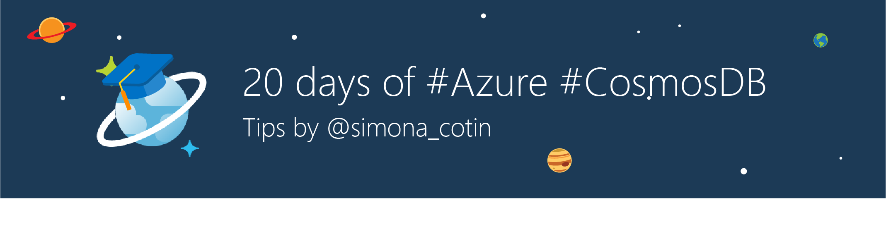

# 20 days of Azure Cosmos DB tips

If you've seen the 20 days of Azure Cosmos DB tips by Simona Cotin on [twitter](https://twitter.com/simona_cotin) and [LinkedIn](https://www.linkedin.com/in/simona-cotin-2ba8747/detail/recent-activity/shares/), you may wish they were all available in one place. Well, here they are!

Visit this page daily for a new tip from September 5th - September 29th!

## Tip 1: What is Cosmos?

What is #cosmosdb? The best NoSQL db that you’re not using! [https://aka.ms/ubw007](https://aka.ms/ubw007)

> [!VIDEO https://www.youtube.com/embed/cGxO995iakM] 

   

## Tip 2: Seeing is believing

Seeing is believing. Use the #cosmosDB visual interface in the Azure portal to inspect and query your DB  [https://aka.ms/jprf75](https://aka.ms/jprf75)

> [!VIDEO https://www.youtube.com/embed/4aWL5p_SJDE]

   

## Tip 3: Replicate data globally

Tip 3: Need your app to be blazing fast anywhere in the world? Replicating your data with #cosmosDB is dead easy! [https://aka.ms/nimw2g](https://aka.ms/nimw2g)  

> [!VIDEO https://www.youtube.com/embed/i22R7I_Rgdg]

   

## Tip 4: Gremlin graph support

Tip 4: Are gremlins your jam? #cosmosdb loves Gremlin too! View, query and edit your graph DB using the Azure portal [https://aka.ms/tfmi37](https://aka.ms/tfmi37)  

> [!VIDEO https://www.youtube.com/embed/oPUTZbiXffk]

   

## Tip 5: Try Azure Cosmos DB free

Tip 5: Want to try Azure #CosmosDB for free? No signup or credit card required, just go to [https://aka.ms/d81vxr](https://aka.ms/d81vxr) and start coding!  

> [!VIDEO https://www.youtube.com/embed/Vf8iZCmoG2E]

   

## Next steps

Learn more about Azure Cosmos DB by reading [Welcome to Azure Cosmos DB](introduction.md) and [A technical overview of Azure Cosmos DB](https://azure.microsoft.com/blog/a-technical-overview-of-azure-cosmos-db/).

