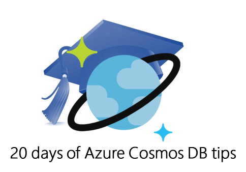

# 20 days of Azure Cosmos DB tips

If you've seen the 20 days of Azure Cosmos DB tips on [twitter](https://twitter.com/AzureCosmosDB) and [LinkedIn](https://www.linkedin.com/feed/update/urn:li:activity:6309260110623580160), you may wish they were all available in one place. Well, here they are!

Visit this page daily for a new tip from September 5th - September 25th!

## Tip #1

What #cosmosdb can do today 🚀 - multi-model, low latency, elastic scaleout , precise consistency - all for your globally distributed app [https://aka.ms/ubw007](https://aka.ms/ubw007)

[   

