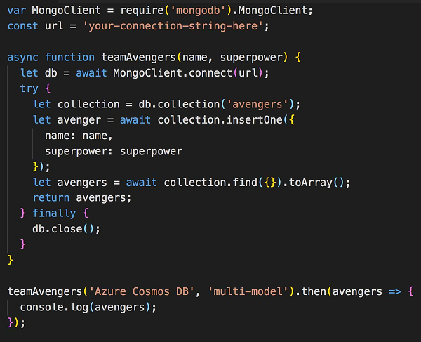

# 20 days of Azure Cosmos DB tips

If you've seen the 20 days of Azure Cosmos DB tips by Simona Cotin on [twitter](https://twitter.com/simona_cotin) and [LinkedIn](https://www.linkedin.com/in/simona-cotin-2ba8747/detail/recent-activity/shares/), you may wish they were all available in one place. Well, here they are!

Visit this page daily for a new tip from September 5th - September 29th!

## Tip 1: What is Cosmos?

What is #cosmosdb? The best NoSQL db that you’re not using! [https://aka.ms/ubw007](https://aka.ms/ubw007)

> [!VIDEO https://www.youtube.com/embed/cGxO995iakM] 

   

## Tip 2: Seeing is believing

Seeing is believing. Use the #cosmosDB visual interface in the Azure portal to inspect and query your DB  [https://aka.ms/jprf75](https://aka.ms/jprf75)

> [!VIDEO https://www.youtube.com/embed/4aWL5p_SJDE]

   

## Tip 3: Replicate data globally

Tip 3: Need your app to be blazing fast anywhere in the world? Replicating your data with #cosmosDB is dead easy! [https://aka.ms/nimw2g](https://aka.ms/nimw2g)  

> [!VIDEO https://www.youtube.com/embed/i22R7I_Rgdg]

   

## Tip 4: Gremlin graph support

Tip 4: Are gremlins your jam? #cosmosdb loves Gremlin too! View, query and edit your graph DB using the Azure portal [https://aka.ms/tfmi37](https://aka.ms/tfmi37)  

> [!VIDEO https://www.youtube.com/embed/oPUTZbiXffk]

   

## Tip 5: Try Azure Cosmos DB free

Tip 5: Want to try Azure #CosmosDB for free? No signup or credit card required, just go to [https://aka.ms/d81vxr](https://aka.ms/d81vxr) and start coding!  

> [!VIDEO https://www.youtube.com/embed/Vf8iZCmoG2E]

   

## Tip 6: Migrate your MEAN app

Tip 6: Is MEAN your thing? Learn how to easily migrate your app to Azure #cosmosDB! https://aka.ms/gfh6i5 Full video:  https://aka.ms/aoojih  

> [!VIDEO https://www.youtube.com/embed/vlAUxc3d2ak]

   

## Tip 8: Build a Node.js app by using SQL API

Tip 8: Build a @nodejs app by using SQL API and Azure #CosmosDB. Learn more on docs page [https://aka.ms/Bd77a8](https://aka.ms/Bd77a8)  

> [!VIDEO https://www.youtube.com/embed/_gd9ZY-rHtM]

   

## Tip 9: Query using MongoDB in Node.js

Tip 9: Query Azure #CosmosDB using the MongoDB API in Node.js. Learn more on docs page [https://aka.ms/Dert0r](https://aka.ms/Dert0r)  

   

## Tip 10: Copy MongoDB data using Studio 3T

Tip 10: Learn how to copy your MongoDB data to Azure Cosmos DB using Studio 3T (MongoChef). Docs at [https://aka.ms/apzhww](https://aka.ms/apzhww)

> [!VIDEO https://www.youtube.com/embed/Qa4YpShYEcI]

   

## Tip 11: Use React, Node.js, and Azure #CosmosDB

Tip 11: Build a hero tracking app using React, Node.js and Azure Cosmos DB.

Article: [Create a MongoDB app with React and Azure Cosmos DB](https://docs.microsoft.com/en-us/azure/cosmos-db/tutorial-develop-mongodb-react?WT.mc_id=sicotint)

   

## Tip 12: Go serverless

Tip 12: Go serverless with Azure #CosmosDB and @AzureFunctions! Full docs at [https://aka.ms/Pmic1j](https://aka.ms/Pmic1j)

> [!VIDEO https://www.youtube.com/embed/U--3mfisNCs]

   

## Tip 13: MEAN app from scratch

Tip 13: From zero to hero with @John_Papa and Azure Cosmos DB. Learn how to build  a MEAN app from scratch

Article: [Create a MongoDB app with Angular and Azure Cosmos DB](https://docs.microsoft.com/en-us/azure/cosmos-db/tutorial-develop-mongodb-nodejs?WT.mc_id=sicotint&utm_content=buffer2495b&utm_medium=social&utm_source=twitter.com&utm_campaign=buffer)

   

## Tip 14: Use cases

Tip 14: Curious about common Azure #CosmosDB use cases? Have a look at [https://aka.ms/Ihpf00](https://aka.ms/Ihpf00) to learn about IoT, gaming and social apps

Article: [Common Azure Cosmos DB use cases](https://aka.ms/Ihpf00)

   

## Tip 15: VS Code integration

Tip 15: Create new Azure #CosmosDB account without ever leaving @code. Install extension from [https://aka.ms/Wy547u](https://aka.ms/Wy547u) 

> [!VIDEO https://www.youtube.com/embed/w8HyW8AHHZQ]

   

## Tip 16: Functions and Twilio demo

Tip 16: Awesome demo! Integrate Azure #cosmosDB, functions and @twilio to send an SMS on any DB change. See docs at [https://aka.ms/Kjkc2d](https://aka.ms/Kjkc2d) 

> [!VIDEO https://www.youtube.com/embed/3Q7WffTeaKY]

   

## Tip 17: Using Mongoose discriminators

Tip 17: Optimize cost by using Mongoose discriminators to store multiple entities in a single #CosmosDB collection [https://aka.ms/M488jm](https://aka.ms/M488jm)

Blog:  [Using Mongoose Discriminators to Store Multiple Entities in a Single Cosmos DB Collection by Anthony Chu](https://aka.ms/M488jm)

   

## Tip 18: Request units

Tip 18: Learn what Request Units (RU) are and how to configure them in Azure #CosmosDB. More on docs at [https://aka.ms/Kt2nbn](https://aka.ms/Kt2nbn) 

Article: [Request Units in Azure Cosmos DB](https://aka.ms/Kt2nbn)

   

## Tip 19: Partition! Partition! Partition! 

Tip 19: Partition! Partition! Partition! The why and how in Azure #CosmosDB. Docs at [https://aka.ms/Ts5pon](https://aka.ms/Ts5pon)  

> [!VIDEO https://www.youtube.com/embed/I_tVk3hKvSI]

   

## Tip 20: Cheatsheet

Tip 20: Everyone loves a good old cheatsheet. Azure #CosmosDB has one too. Check it out at [https://aka.ms/Nt01nl](https://aka.ms/Nt01nl)

Cheatsheet: [Azure Cosmos DB: DocumentDB API SQL query cheat sheet PDF](https://aka.ms/Nt01nl)

   

## Next steps

Learn more about Azure Cosmos DB by reading [Welcome to Azure Cosmos DB](introduction.md) and [A technical overview of Azure Cosmos DB](https://azure.microsoft.com/blog/a-technical-overview-of-azure-cosmos-db/).

