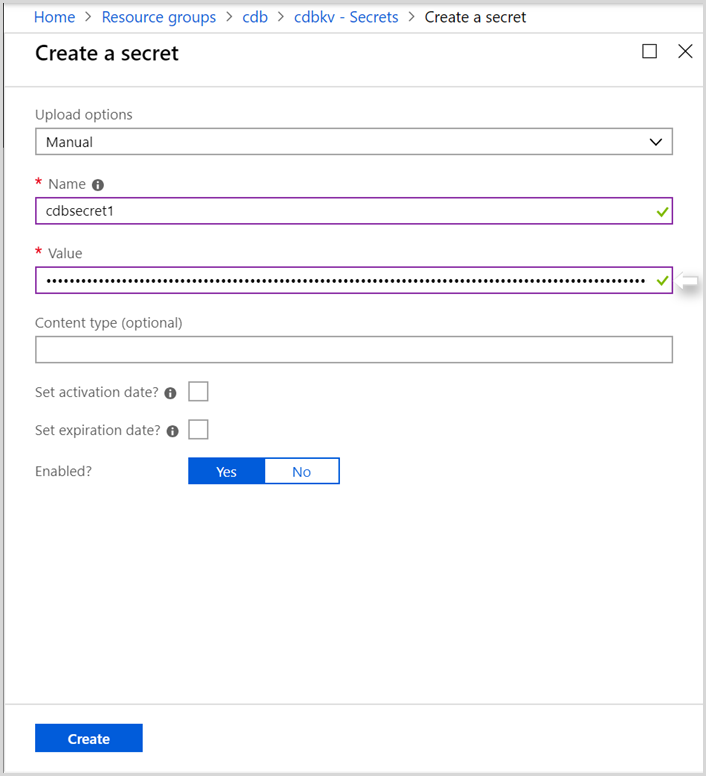
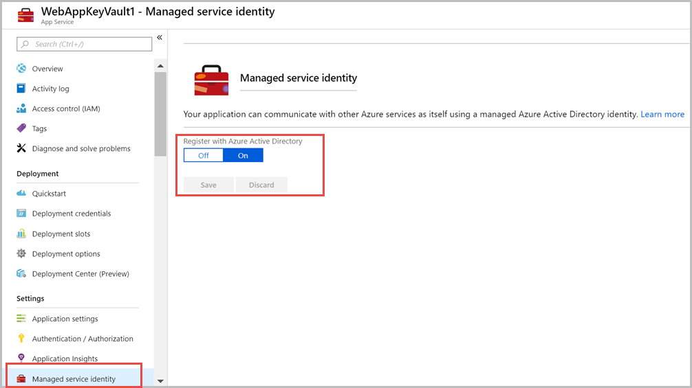
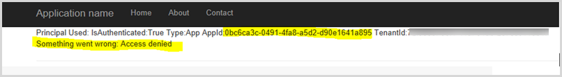
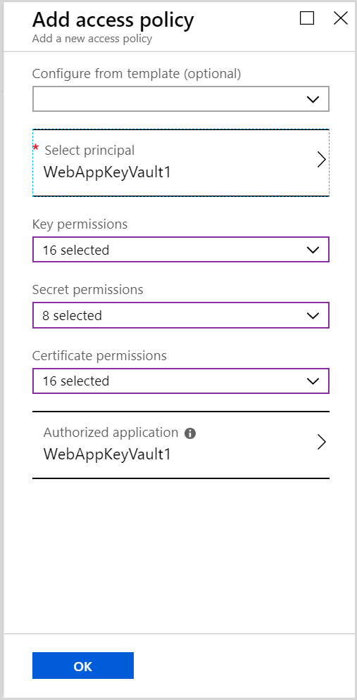
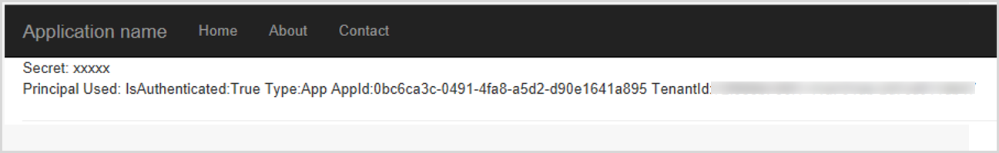

# Secure Azure Cosmos keys using Azure Key Vault 

>[!IMPORTANT]
> The recommended solution to access Azure Cosmos DB keys is to use a [system-assigned managed identity](managed-identity-based-authentication.md). If your service cannot take advantage of managed identities then use the [cert based solution](certificate-based-authentication.md). If both the managed identity solution and cert based solution do not meet your needs, please use the key vault solution below.

When using Azure Cosmos DB for your applications, you can access the database, collections, documents by using the endpoint and the key within the app's configuration file.  However, it's not safe to put keys and URL directly in the application code because they are available in clear text format to all the users. You want to make sure that the endpoint and keys are available but through a secured mechanism. This is where Azure Key Vault can help you to securely store and manage application secrets.

The following steps are required to store and read Azure Cosmos DB access keys from Key Vault:

* Create a Key Vault  
* Add Azure Cosmos DB access keys to the Key Vault  
* Create an Azure web application  
* Register the application & grant permissions to read the Key Vault  

## Create a Key Vault

1. Sign in to [Azure portal](https://portal.azure.com/).  
2. Select **Create a resource > Security > Key Vault**.  
3. On the **Create key vault** section provide the following information:  
   * **Name:** Provide a unique name for your Key Vault.  
   * **Subscription:** Choose the subscription that you will use.  
   * Under **Resource Group** choose **Create new** and enter a resource group name.  
   * In the Location pull-down menu, choose a location.  
   * Leave other options to their defaults.  
4. After providing the information above, select **Create**.  

## Add Azure Cosmos DB access keys to the Key Vault.
1. Navigate to the Key Vault you created in the previous step, open the **Secrets** tab.  
2. Select **+Generate/Import**, 

   * Select **Manual** for **Upload options**.
   * Provide a **Name** for your secret
   * Provide the connection string of your Cosmos DB account into the **Value** field. And then select **Create**.

   

4. After the secret is created, open it and copy the **Secret Identifier that is in the following format. You will use this identifier in the next section. 

   `https://<Key_Vault_Name>.vault.azure.net/secrets/<Secret _Name>/<ID>`

## Create an Azure web application

1. Create an Azure web application or you can download the app from the [GitHub repository](https://github.com/Azure/azure-cosmosdb-dotnet/tree/master/Demo/keyvaultdemo). It is a simple MVC application.  

2. Unzip the downloaded application and open the **HomeController.cs** file. Update the secret ID in the following line:

   `var secret = await keyVaultClient.GetSecretAsync("<Your Key Vault’s secret identifier>")`

3. **Save** the file, **Build** the solution.  
4. Next deploy the application to Azure. Right click on project and choose **publish**. Create a new app service profile (you can name the app WebAppKeyVault1) and select **Publish**.   

5. Once the application is deployed. From the Azure portal, navigate to web app that you deployed, and turn on the **Managed service identity** of this application.  

   

If you will run the application now, you will see the following error, as you have not given any permission to this application in Key Vault.

## Register the application & grant permissions to read the Key Vault

In this section, you register the application with Azure Active Directory and give permissions for the application to read the Key Vault. 

1. Navigate to the Azure portal, open the **Key Vault** you created in the previous section.  

2. Open **Access policies**, select **+Add New** find the web app you deployed, select permissions and select **OK**.  

   

Now, if you run the application, you can read the secret from Key Vault.

 
Similarly, you can add a user to access the key Vault. You need to add yourself to the Key Vault by selecting **Access Policies** and then grant all the permissions you need to run the application from Visual studio. When this application is running from your desktop, it takes your identity.

## Next steps

* To configure a firewall for Azure Cosmos DB see [firewall support](firewall-support.md) article.
* To configure virtual network service endpoint, see [secure access by using VNet service endpoint](vnet-service-endpoint.md) article.
