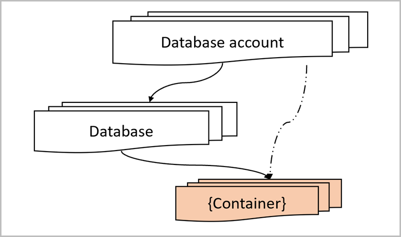

# Work with Azure Cosmos account

Azure Cosmos DB is a fully managed platform-as-a-service (PaaS). To begin using Azure Cosmos DB, you should initially create an Azure Cosmos account in your Azure subscription. Your Azure Cosmos account contains a unique DNS name and you can manage an account by using Azure portal, Azure CLI or by using different language-specific SDKs. For more information, see [how to manage your Azure Cosmos account](how-to-manage-database-account.md).

The Azure Cosmos account is the fundamental unit of global distribution and high availability. For globally distributing your data and throughput across multiple Azure regions, you can add and remove Azure regions to your Azure Cosmos account at any time. You can configure your Azure Cosmos account to have either a single or multiple write regions. For more information, see [how to add and remove Azure regions to your Azure Cosmos account](how-to-manage-database-account.md). You can configure the [default consistency](consistency-levels.md) level on Azure Cosmos account. Azure Cosmos DB provides comprehensive SLAs encompassing throughput, latency at the 99th percentile, consistency, and high availability. For more information, see [Azure Cosmos DB SLAs](https://azure.microsoft.com/support/legal/sla/cosmos-db/v1_2/).

To securely manage access to all the data within your Azure Cosmos account, you can use the [master keys](secure-access-to-data.md) associated with your account. To further secure access to your data, you can configure a [VNET service endpoint](vnet-service-endpoint.md) and [IP-firewall](firewall-support.md) on your Azure Cosmos account. 

## Elements in an Azure Cosmos account

Azure Cosmos DB container is the fundamental unit of scalability. You can virtually have an unlimited provisioned throughput (RU/s) and storage on a container. Azure Cosmos DB transparently partitions your container using the logical partition key that you specify in order to elastically scale your provisioned throughput and storage. For more information, see [working with Azure Cosmos containers and items](databases-containers-items.md).

Currently, you can create a maximum of 100 Azure Cosmos accounts under an Azure subscription. A single Azure Cosmos account can virtually manage unlimited amount of data and provisioned throughput. To manage your data and provisioned throughput, you can create one or more Azure Cosmos databases under your account and within that database, you can create one or more containers. The following image shows the hierarchy of elements in an Azure Cosmos account:

## Next steps

Learn how to manage your Azure Cosmos account and other concepts:

* [How-to manage your Azure Cosmos account](how-to-manage-database-account.md)
* [Global distribution](distribute-data-globally.md)
* [Consistency levels](consistency-levels.md)
* [Working with Azure Cosmos containers and items](databases-containers-items.md)
* [VNET service endpoint for your Azure Cosmos account](vnet-service-endpoint.md)
* [IP-firewall for your Azure Cosmos account](firewall-support.md)
* [How-to add and remove Azure regions to your Azure Cosmos account](how-to-manage-database-account.md)
* [Azure Cosmos DB SLAs](https://azure.microsoft.com/support/legal/sla/cosmos-db/v1_2/)
