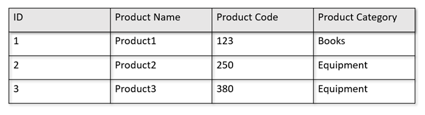
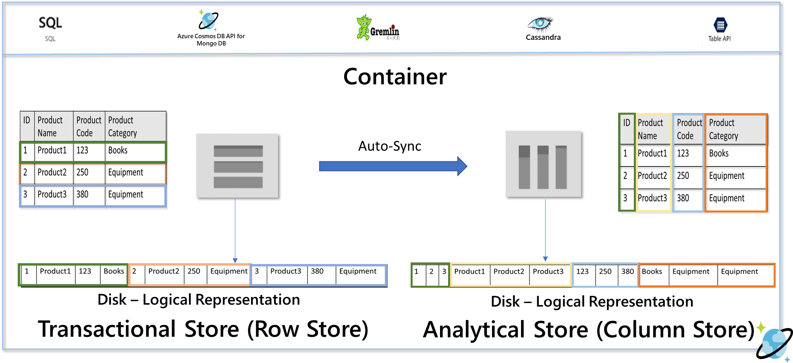

# What is Azure Cosmos DB Analytical Store (Preview)?

> [!IMPORTANT]
> Azure Cosmos DB analytical store is currently in preview. This preview version is provided without a service level agreement, and it's not recommended for production workloads. For more information, see [Supplemental terms of use for Microsoft Azure previews](https://azure.microsoft.com/support/legal/preview-supplemental-terms/).

Azure Cosmos DB analytical store is a fully isolated column store for large-scale analytics against operational data in your Azure Cosmos DB, without impacting the performance of your transactional workloads.

## Challenges with large-scale analytics on operational data

The multi-model operational data in an Azure Cosmos container is internally stored in an indexed row-based transactional store. Row store format is designed to allow fast transactional reads and writes with the order-of-milliseconds response times, and point-decision queries. If your dataset grows large and if you want to run complex analytical queries on this data (for example, aggregate operations), large scans on such data set can be expensive in terms of provisioned throughput. High consumption of provisioned throughput in turn, impacts the performance of transactional workloads that are used by your real-time applications and services.

Traditionally, to analyze large amounts of data, operational data is extracted from Azure Cosmos DB's transactional store and stored in a separate data layer. For example, the data is stored in a data warehouse or data lake in a suitable format. This data is later used for large-scale analytics and analyzed using  compute engine such as the Apache Spark clusters. This separation of analytical storage and compute layers from operational data results in additional latency. Because the ETL(Extract, Transform, Load) pipelines are run less frequently to minimize the potential impact on your transactional workloads.

The ETL pipelines also become complex when handling updates to the operational data when compared to handling only newly ingested operational data. The downstream analytical systems should be further designed to handle the historical versions of the operational data.

## Column-based analytical store

Azure Cosmos DB analytical store addresses the complexity and latency challenges that occur with the  traditional ETL pipelines. Azure Cosmos DB analytical store can automatically sync your operational data into a separate column store. The column store format is suitable for large-scale analytical queries such as aggregate operations. These queries are executed in an optimized manner which, results in improving the latency.

By using Azure Synapse Link, you can now build no-ETL HTAP solutions by directly linking to Azure Cosmos DB analytical store from Synapse Analytics. It enables you to run near real-time large-scale analytics on your operational data.

When you enable analytical store on an Azure Cosmos container, a new column-store is internally created based on the operational data in your container. This column store is persisted on a disk that is separate from the row-based transactional store for that container. The inserts, updates, and deletes to your operational data are automatically synced to analytical store. You don't need the change feed or ETL to sync the data.

### Column store for analytical workloads on operational data

Analytical workloads typically involve aggregations and sequential scans of selected fields in the data. By storing the data in a column-major order, the analytical store allows a group of values for each field to be serialized together. This way it reduced the IOPS required to scan or compute statistics over specific fields. It dramatically improves the query response times for scans over large data sets.

For example, if your operational tables are in the following format:

The row store persists the above data in a serialized format, per row, on the disk. This format allows for faster transactional reads, writes, and point-decision queries, such as, "Return information about Product1". However, as the dataset grows large and if you want to run complex analytical queries on the data it can be expensive. For example, if you want to get "the sales  trends for a product under the category named ‘Equipment' across different business units and months", you need to run a complex query. Large scans on this dataset can get expensive in terms of provisioned throughput and can also impact the performance of the transactional workloads powering your real-time applications and services.

Analytical store, which is a column store, is better suited for such queries because it serializes similar fields of data together and reduced the disk IOPs.

The following image shows transactional row store Vs analytical column store in Azure Cosmos DB:

## Decoupled performance for analytical workloads

Because the analytical store is separate from the transactional store, there is no impact on the performance of your transactional workloads due to analytical queries.  Analytical store does not need separate request units (RUs) to be allocated.

## Autosync

Auto-Sync refers to the fully managed capability of Azure Cosmos DB where the inserts, updates, deletes to operational data are automatically synced from transactional store to analytical store in near real time within 2 minutes.

The autosync capability along with analytical store provides the following key benefits:

## Scalability & elasticity

By using horizontal partitioning, Azure Cosmos DB transactional store can elastically scale  the storage and throughput without any downtime. Horizontal partitioning in the transactional store provides scalability & elasticity in autosync to ensure data is synced to the analytical store in near real time. The data sync happens regardless of the transactional traffic throughput, whether it is 1000 operations/sec or 1 million operations/sec, and  it doesn't impact the provisioned throughput in the transactional store. Due to autosync, there will not be any hot partitions even during the peak transactional workload traffic.

## Automatically handling schema updates

Azure Cosmos DB transactional store is schema-agnostic, and it allows you to iterate on your transactional applications without having to deal with schema or index management. In contrast to this, Azure Cosmos DB analytical store is schematized to optimize for analytical query performance. With autosync capability, Azure Cosmos DB manages the schema inferencing over the latest updates from the transactional store.  It also manages the schema representation in the analytical store out-of-the-box which, includes handling nested data types.

In there is a schema evolution, where new properties are added over time, the analytical store automatically presents a unionized schema across all historical schemas in the transactional store.

If all the operational data in Azure Cosmos DB follows a well-defined schema for analytics, then the schema is automatically inferred and represented correctly in the analytical store. If the well-defined schema for analytics is violated by certain items, they will not be included in the analytical store. If you have scenarios blocked due to  well-defined schema for analytics definition, email the [Azure Cosmos DB team](mailto:cosmosdbsynapselink@microsoft.com).

A well-defined schema for analytics is defined with the following considerations:

* A property always has the same type across multiple items

  * For example, {"a":123} {"a": "str"} does not have a well-defined schema because "a" is sometimes a string and sometimes a number. This condition does not apply for null properties. For example, {"a":123} {"a":null} is still well-defined.

* Array types must contain a single repeated type

  * For example, {"a": ["str",12]} is not a well-defined schema because the array contains a mix of integer and string types

* There is a maximum of 200 properties at any nesting level of a schema and a maximum nesting depth of 5

  * An item with 201 properties at the top level doesn't have a well-defined schema.

  * An item with more than five levels in the schema also doesn't has a well-defined schema. For example, {"level1": {"level2":{"level3":{"level4":{"level5":{"too many":12}}}}}}

* Property names are unique when compared in a case insensitive manner

  * For example, the following items do not have a well-defined schema
{"Name": "fred"} {"name": "john"} – "Name" and "name" are the same when compared in a case insensitive manner

## Cost-effective archival of historical data

Data tiering refers to the separation of data between storage infrastructures optimized for different scenarios. Thereby improving the overall performance and cost-effectiveness of the end-to-end data stack. With analytical store, Azure Cosmos DB now supports automatic tiering of data from the transactional store to analytical store with different data layouts. With analytical store optimized in terms of storage cost compared to the transactional store, allows you to retain much longer horizons of operational data for historical analysis.

After the analytical store is enabled, based on the data retention needs of the transactional workloads, you can configure the ‘Transactional Store Time to Live (Transactional TTL)' property to have records automatically deleted from the transactional store after a certain time period. Similarly, the  ‘Analytical Store Time To Live (Analytical TTL)' allows you to manage the lifecycle of data retained in the analytical store independent from the transactional store. By enabling analytical store and configuring TTL properties, you can seamlessly tier and define the data retention period for the two stores.

## Global Distribution

If you have a globally distributed Azure Cosmos account, after you enable analytical store for a container, it will be available in all regions of that account.  Any changes to operational data are globally replicated in all regions. You can run analytical queries effectively against the nearest regional copy of your data in Azure Cosmos DB.

## Security

Authentication with the analytical store is the same as the transactional store for a given database. You can use master or read-only keys for authentication. You can leverage linked service in Synapse Studio to prevent pasting the Azure Cosmos DB keys in the Spark notebooks. Access to this Linked Service is available to anyone who has access into the workspace.

## Support for multiple Synapse Analytics runtimes

The analytical store is optimized to provide scalability, elasticity, and performance for analytical workloads without any dependency on the compute run-times. The storage technology is self-managed to optimize your analytics workloads without manual efforts.

By decoupling the analytical storage system from the analytical compute system, data in Azure Cosmos DB analytical store can be queried simultaneously from the different analytics runtimes supported by Azure Synapse Analytics. As of today, Synapse Analytics supports Apache Spark and SQL serverless with Azure Cosmos DB analytical store.

> [!NOTE]
> You can only read from analytical store using Synapse Analytics run time. You can write the data back to your transactional store as a serving layer.

## Pricing

> [!NOTE]
> Azure Cosmos DB analytical store is available in public preview free of any charges for analytical store until August 30, 2020.

Analytical store follows a consumption-based pricing model where you are charged for:

* Storage: the volume of the data retained in the analytical store every month including historical versions of the operational data.

* Analytical write operations: the fully managed synchronization of operational data updates to the analytical store from the transactional store (autosync)

* Analytical read operations: the read operations performed against the analytical store from Synapse Analytics Spark and SQL Serverless runtimes.

Analytical store pricing is separate from the transaction store pricing model. There is no concept of provisioned RUs in the analytical store. See [Azure Cosmos DB pricing page](), for full details on the pricing model for analytical store.

In order to get a high-level cost estimate to enable analytical store on an Azure Cosmos  container, you can use the [Azure Cosmos DB Capacity planner](https://cosmos.azure.com/capacitycalculator/) and get an estimate of your analytical storage and write operations costs. Analytical read operations costs depends on the analytics workload characteristics but as a high-level estimate, scan of 1 TB of data in analytical store typically results in 130,000 analytical read operations, and hence $0.065.

## Analytical Time-to-Live (TTL)

While transactional TTL can be set at the container or item level, analytical TTL can only be set at the container level currently. After you set the analytical TTL at the container level, Azure Cosmos DB automatically removes these items after the specified period. Analytical TTL is set in seconds and is interpreted as a delta from the time since a version of the record was last modified in the transactional store.

Analytical Time to Live on a container  is set using the `AnalyticalStoreTimeToLiveInSeconds` property:

* If the value is set to "0", missing (or set to null), the analytical store is disabled and no data is replicated from transactional store to analytical store.

* If present and the value is set to "-1", it is equal to infinity, and items don't expire by default.

* If present and the value is set to some positive number "n" – items will expire "n" seconds after their last modified time.

After the analytical store is enabled with an analytical TTL value, it can be updated to a different valid value later. The following table outlines the scenario and dependency on transactional TTL for possible analytical TTL values:

|Analytical TTL value  |Scenario  |Dependency on transactional TTL (if any)  |
|---------|---------|---------|
|-1     |  Analytical store retains all historical versions of records. Analytical store mirrors transactional store. There is no retention of additional data compared to transactional store.      |  N/A       |
|Integer > 0 |  Analytical store actively expires historical versions of records after specified time period (in seconds)       |  Transactional TTL must be > 0 and analytical TTL must be >= transactional TTL (to maintain the invariant that analytical store is a superset of data in transactional store)       |
|0, null or missing    |   Analytical store not enabled      |  	N/A    |

To learn more, see [how to configure Analytical TTL on a container]().

## Next steps

To learn more, see the following docs:

* [Azure Synapse Link](synapse-link.md) for Azure Cosmos DB

* [Frequently asked questions](synapse-link-frequently-asked-questions.md) about Synapse Link for Azure Cosmos DB

* [Apache Spark in Azure Synapse Analytics](../synapse-analytics/spark/apache-spark-concepts.md) 

* [SQL serverless/on-demand in Azure Synapse Analytics](../synapse-analytics/sql/on-demand-workspace-overview)