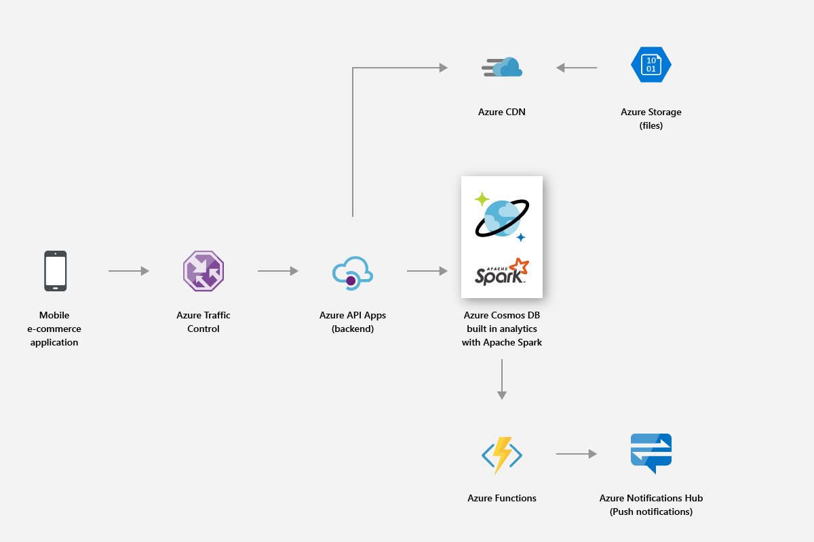
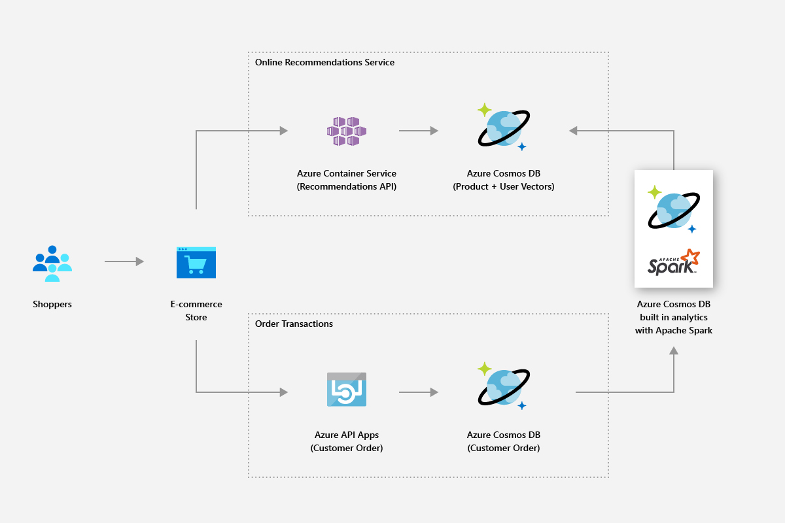
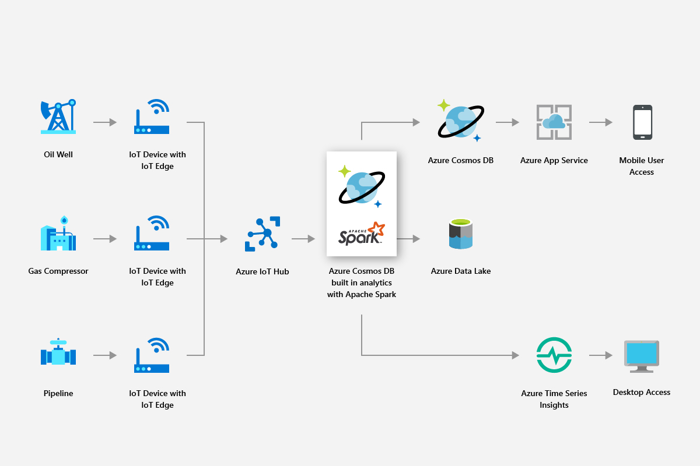
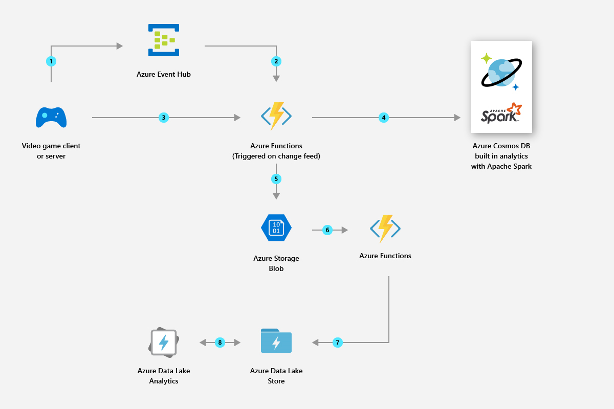

# Solutions using globally distributed analytics in Azure Cosmos DB

This article describes the solutions that can be built using the globally distributed analytics in Azure Cosmos DB.

## Retail and consumer goods

You can use Spark support in Azure Cosmos DB to deliver real-time recommendations and offers. You can help customers discover the items they will need with real-time personalization and product recommendations.

* You can use the built-in Machine Learning support provided by the Apache Spark runtime to generate real-time recommendations across the product catalogs.

* You can mine click stream data, purchase data, and customer data to provide targeted recommendations that drive lifetime value.

* Using the Azure Cosmos DB's global distribution feature, high volumes of product data that is spread across regions can be analyzed in milliseconds.

* You can quickly get insights for the geographically distributed users and data. You can improve the promotion conversion rate by serving the right ad to the right user at the right time.

* You can leverage the inbuilt Spark streaming capability to enrich live data by combining it with static customer data. This way you can deliver more personalized and targeted ads in real time and in context with what customers are doing.

The following image shows how Azure Cosmos DB Spark support is used to optimize pricing and promotions:

The following image shows how Azure Cosmos DB Spark support is used in real-time recommendation engine:

## Manufacturing and IoT

Azure Cosmos DB’s in-built analytics platform allows you to enable real-time analysis of IoT data from millions of devices at global scale. You can make modern innovations like predicting weather patterns, predictive analysis, and energy optimizations.

* By using Azure Cosmos DB, you can mine data such as real-time asset metrics and weather factors, then apply smart grid analytics to optimize performance of connected devices in the field. Smart grid analytics is the key to control operating costs, to improve grid reliability, and deliver personalized energy services to consumers.

The following image shows how Azure Cosmos DB’s Spark support is used to read metrics from IoT devices and apply smart grid analytics:

## Predictive maintenance

* Maintaining assets such as compressors that are used in small drilling rigs to deep-water platforms is a complex endeavor. These assets are located across the globe and generate petabytes of data. By using Azure Cosmos DB, you can build an end-to-end predictive data pipeline that uses Spark streaming to process large amounts of sensor telemetry, store asset parts, and sensor mappings data.

* You can build and deploy machine learning models to predict asset failures before they happen and issue maintenance work orders before the failure occurs.

The following image shows how Azure Cosmos DB’s Spark support is used to build a predictive maintenance system:

The following image shows how Azure Cosmos DB’s Spark support is used to build a real-time vehicle diagnostic system:

## Gaming

* With built-in Spark support, Azure Cosmos DB enables you to easily build, scale, and deploy advanced analytics and machine learning models in minutes to build the best gaming experience possible.

* You can analyze player, purchase, and behavioral data to create relevant personalized offers to attain high conversion rates.

* Using Spark machine learning, you can analyze and gain insights on game telemetry data. You can diagnose and prevent slow load times and in-game issues.

The following image shows how Azure Cosmos DB’s Spark support is used in gaming analytics:

## Next steps

* To learn about the benefits of Azure Cosmos DB, see the [overview](introduction.md) article.
* [Get started with the Azure Cosmos DB API for MongoDB](mongodb-introduction.md)
* [Get started with the Azure Cosmos DB Cassandra API](cassandra-introduction.md)
* [Get started with the Azure Cosmos DB Gremlin API](graph-introduction.md)
* [Get started with the Azure Cosmos DB Table API](table-introduction.md)
