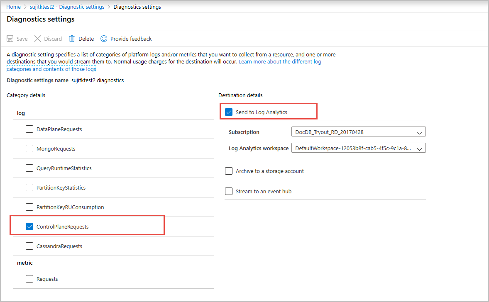
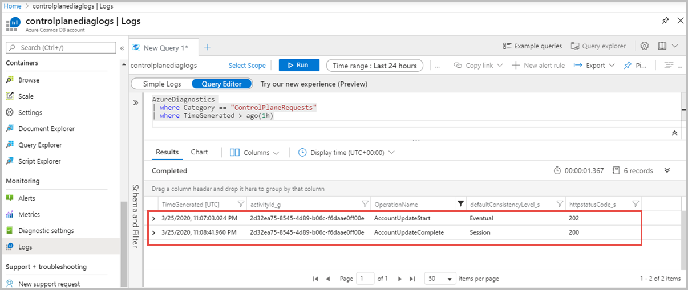
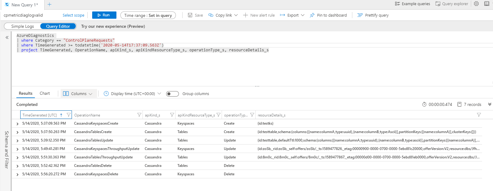
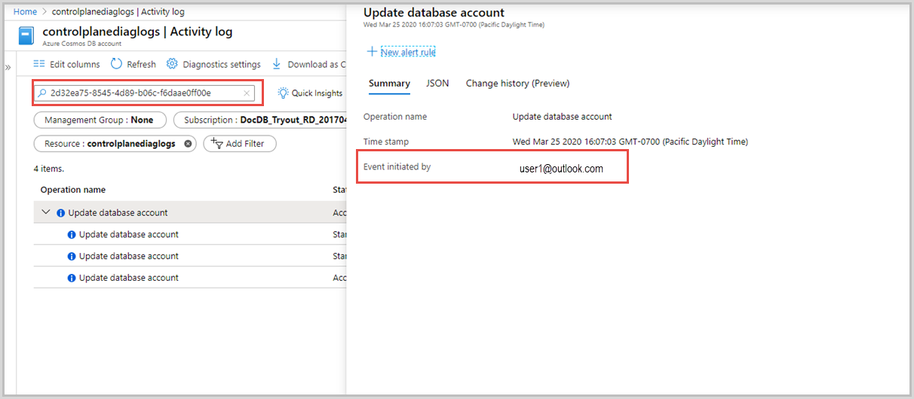

# How to audit Azure Cosmos DB control plane operations

Control Plane in Azure Cosmos DB is a RESTful service that enables you to perform a diverse set of operations on the Azure Cosmos account. It exposes a public resource model (for example: database, account) and various operations to the end users to perform actions on the resource model. The control plane operations include changes to the Azure Cosmos account or container. For example, operations such as create an Azure Cosmos account, add a region, update throughput, region failover, add a VNet etc. are some of the control plane operations. This article explains how to audit the control plane operations in Azure Cosmos DB. You can run the control plane operations on Azure Cosmos accounts by using Azure CLI, PowerShell or Azure portal, whereas for containers, use Azure CLI or PowerShell.

The following are some example scenarios where auditing control plane operations is helpful:

* You want to get an alert when the firewall rules for your Azure Cosmos account are modified. The alert is required to find unauthorized modifications to rules that govern the network security of your Azure Cosmos account and take quick action.

* You want to get an alert if a new region is added or removed from your Azure Cosmos account. Adding or removing regions has implications on billing and data sovereignty requirements. This alert will help you detect an accidental addition or removal of region on your account.

* You want to get more details from the diagnostic logs on what has changed. For example, a VNet was changed.

## Disable key based metadata write access

Before you audit the control plane operations in Azure Cosmos DB, disable the key-based metadata write access on your account. When key based metadata write access is disabled, clients connecting to the Azure Cosmos account through account keys are prevented from accessing the account. You can disable write access by setting the `disableKeyBasedMetadataWriteAccess` property to true. After you set this property, changes to any resource can happen from a user with the proper Role-based access control(RBAC) role and credentials. To learn more on how to set this property, see the [Preventing changes from SDKs](role-based-access-control.md#preventing-changes-from-cosmos-sdk) article. 

After the `disableKeyBasedMetadataWriteAccess` is turned on, if the SDK based clients run create or update operations, an error *"Operation 'POST' on resource 'ContainerNameorDatabaseName' is not allowed through Azure Cosmos DB endpoint* is returned. You have to turn on access to such operations for your account, or perform the create/update operations through Azure Resource Manager, Azure CLI or Azure Powershell. To switch back, set the disableKeyBasedMetadataWriteAccess to **false** by using Azure CLI as described in the [Preventing changes from Cosmos SDK](role-based-access-control.md#preventing-changes-from-cosmos-sdk) article. Make sure to change the value of `disableKeyBasedMetadataWriteAccess` to false instead of true.

Consider the following points when turning off the metadata write access:

* Evaluate and ensure that your applications do not make metadata calls that change the above resources (For example, create collection, update throughput, …) by using the SDK or account keys.

* Currently, the Azure portal uses account keys for metadata operations and hence these operations will be blocked. Alternatively, use the Azure CLI, SDKs, or Resource Manager template deployments to perform such operations.

## Enable diagnostic logs for control plane operations

You can enable diagnostic logs for control plane operations by using the Azure portal. After enabling, the diagnostic logs will record the operation as a pair of start and complete events with relevant details. For example, the *RegionFailoverStart* and *RegionFailoverComplete* will complete the region failover event.

Use the following steps to enable logging on control plane operations:

1. Sign into [Azure portal](https://portal.azure.com) and navigate to your Azure Cosmos account.

1. Open the **Diagnostic settings** pane, provide a **Name** for the logs to create.

1. Select **ControlPlaneRequests** for log type and select the **Send to Log Analytics** option.

You can also store the logs in a storage account or stream to an event hub. This article shows how to send logs to log analytics and then query them. After you enable, it takes a few minutes for the diagnostic logs to take effect. All the control plane operations performed after that point can be tracked. The following screenshot shows how to enable control plane logs:



## View the control plane operations

After you turn on logging, use the following steps to track down operations for a specific account:

1. Sign into [Azure portal](https://portal.azure.com).

1. Open the **Monitor** tab from the left-hand navigation and then select the **Logs** pane. It opens a UI where you can easily run queries with that specific account in scope. Run the following query to view control plane logs:

   ```kusto
   AzureDiagnostics
   | where ResourceProvider=="MICROSOFT.DOCUMENTDB" and Category=="ControlPlaneRequests"
   | where TimeGenerated >= ago(1h)
   ```

The following screenshots capture logs when a consistency level is changed for an Azure Cosmos account:



The following screenshots capture logs when throughput of a Cassandra table is updated:



## Identify the identity associated to a specific operation

If you want to debug further, you can identify a specific operation in the **Activity log** by using the Activity ID or by the timestamp of the operation. Timestamp is used for some Resource Manager clients where the activity ID is not explicitly passed. The Activity log gives details about the identity with which the operation was initiated. The following screenshot shows how to use the activity ID and find the operations associated with it in the Activity log:



## Control plane operations for Azure Cosmos account

The following are the control plane operations available at the account level. Most of the operations are tracked at account level. These operations are available as metrics in Azure monitor:

* Region added
* Region removed
* Account deleted
* Region failed over
* Account created
* Virtual network deleted
* Account network settings updated
* Account replication settings updated
* Account keys updated
* Account backup settings updated
* Account diagnostic settings updated

## Control plane operations for database or containers

The following are the control plane operations available at the database and container level. These operations are available as metrics in Azure monitor:

* SQL Database Updated
* SQL Container Updated
* SQL Database Throughput Updated
* SQL Container Throughput Updated
* SQL Database Deleted
* SQL Container Deleted
* Cassandra Keyspace Updated
* Cassandra Table Updated
* Cassandra Keyspace Throughput Updated
* Cassandra Table Throughput Updated
* Cassandra Keyspace Deleted
* Cassandra Table Deleted
* Gremlin Database Updated
* Gremlin Graph Updated
* Gremlin Database Throughput Updated
* Gremlin Graph Throughput Updated
* Gremlin Database Deleted
* Gremlin Graph Deleted
* Mongo Database Updated
* Mongo Collection Updated
* Mongo Database Throughput Updated
* Mongo Collection Throughput Updated
* Mongo Database Deleted
* Mongo Collection Deleted
* AzureTable Table Updated
* AzureTable Table Throughput Updated
* AzureTable Table Deleted

## Diagnostic log operations

The following are the operation names in diagnostic logs for different operations:

* RegionAddStart, RegionAddComplete
* RegionRemoveStart, RegionRemoveComplete
* AccountDeleteStart, AccountDeleteComplete
* RegionFailoverStart, RegionFailoverComplete
* AccountCreateStart, AccountCreateComplete
* AccountUpdateStart, AccountUpdateComplete
* VirtualNetworkDeleteStart, VirtualNetworkDeleteComplete
* DiagnosticLogUpdateStart, DiagnosticLogUpdateComplete

For API-specific operations, the operation is named with the following format:

* ApiKind + ApiKindResourceType + OperationType + Start/Complete
* ApiKind + ApiKindResourceType + "Throughput" + operationType + Start/Complete

**Example** 

* CassandraKeyspacesUpdateStart, CassandraKeyspacesUpdateComplete
* CassandraKeyspacesThroughputUpdateStart, CassandraKeyspacesThroughputUpdateComplete
* SqlContainersUpdateStart, SqlContainersUpdateComplete

The *ResourceDetails* property contains the entire resource body as a request payload and it contains all the properties requested to update

## Diagnostic log queries for control plane operations

The following are some examples to get diagnostic logs for control plane operations:

```kusto
AzureDiagnostics 
| where Category =="ControlPlaneRequests"
| where  OperationName startswith "SqlContainersUpdateStart"
```

```kusto
AzureDiagnostics 
| where Category =="ControlPlaneRequests"
| where  OperationName startswith "SqlContainersThroughputUpdateStart"
```

## Next steps

* [Explore Azure Monitor for Azure Cosmos DB](../azure-monitor/insights/cosmosdb-insights-overview.md?toc=/azure/cosmos-db/toc.json&bc=/azure/cosmos-db/breadcrumb/toc.json)
* [Monitor and debug with metrics in Azure Cosmos DB](use-metrics.md)
