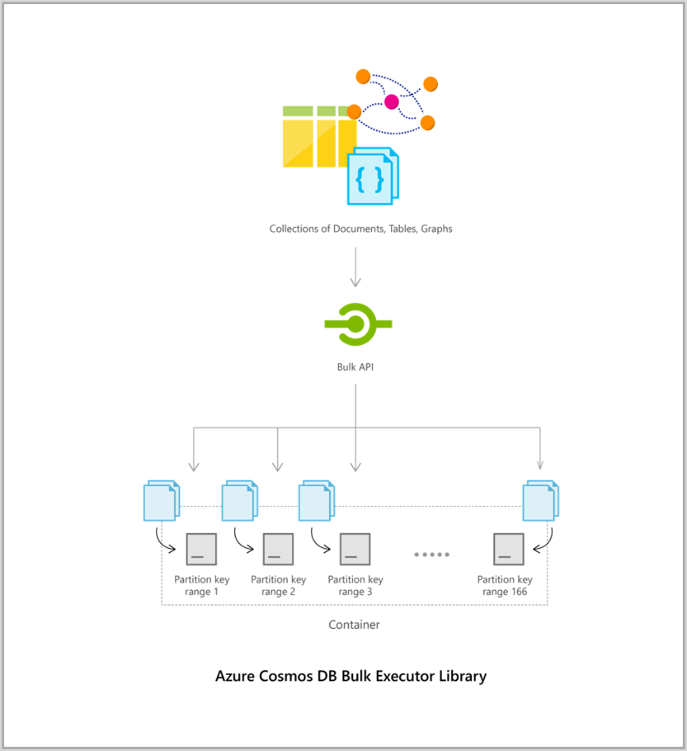

# Azure Cosmos DB bulk executor library overview
 
Azure Cosmos DB is a fast, flexible, and globally distributed database service that is designed to elastically scale out to support: 

* Large read and write throughput (millions of operations per second).  
* Storing high volumes of (hundreds of terabytes, or even more) transactional and operational data with predictable millisecond latency.  

The bulk executor library helps you leverage this massive throughput and storage. The bulk executor library allows you to perform bulk operations in Azure Cosmos DB through bulk import and bulk update APIs. You can read more about the features of bulk executor library in the following sections. 

> [!NOTE] 
> Currently, bulk executor library supports import and update operations and this library is supported by Azure Cosmos DB SQL API accounts only. See [.NET](sql-api-sdk-bulk-executor-dot-net.md) and [Java](sql-api-sdk-bulk-executor-java.md) release notes for any updates to the library.
 
## Key features of the bulk executor library  
 
* It significantly reduces the client-side compute resources needed to saturate the throughput allocated to a container. A single threaded application that writes data using the bulk import API achieves 10 times greater write throughput when compared to a multi-threaded application that writes data in parallel while saturating the client machine's CPU.  

* It abstracts away the tedious tasks of writing application logic to handle rate limiting of request, request timeouts, and other transient exceptions by efficiently handling them within the library.  

* It provides a simplified mechanism for applications performing bulk operations to scale out. A single bulk executor instance running on an Azure VM can consume greater than 500K RU/s and you can achieve a higher throughput rate by adding additional instances on individual client VMs.  
 
* It can bulk import more than a terabyte of data within an hour by using a scale-out architecture.  

* It can bulk update existing data in Azure Cosmos DB containers as patches. 
 
## How does the Bulk Executor operate? 

When a bulk operation to import or update documents is triggered with a batch of entities, they are initially shuffled into buckets corresponding to their Azure Cosmos DB partition key range. Within each bucket that corresponds to a partition key range, they are broken down into mini-batches and each mini-batch act as a payload that is committed on the server-side. The bulk executor library has built in optimizations for concurrent execution of these mini-batches both within and across partition key ranges. Following image illustrates how bulk executor batches data into different partition keys:  

The Bulk Executor library makes sure to maximally utilize the throughput allocated to a collection. It uses an [AIMD-style congestion control mechanism](https://tools.ietf.org/html/rfc5681) for each Azure Cosmos DB partition key range to efficiently handle rate limiting and timeouts. 

## Next Steps 
  
* Learn more by trying out the sample applications consuming the Bulk Executor library in [.NET](bulk-executor-dot-net.md) and [Java](bulk-executor-java.md).  
* Check out the bulk executor SDK information and release notes in [.NET](sql-api-sdk-bulk-executor-dot-net.md) and [Java](sql-api-sdk-bulk-executor-java.md).
* The Bulk Executor library is integrated into the Cosmos DB Spark connector, to learn more, see [Azure Cosmos DB Spark connector](spark-connector.md) article.  
* The bulk executor library is also integrated into a new version of [Azure Cosmos DB connector](https://aka.ms/bulkexecutor-adf-v2) for Azure Data Factory to copy data.
