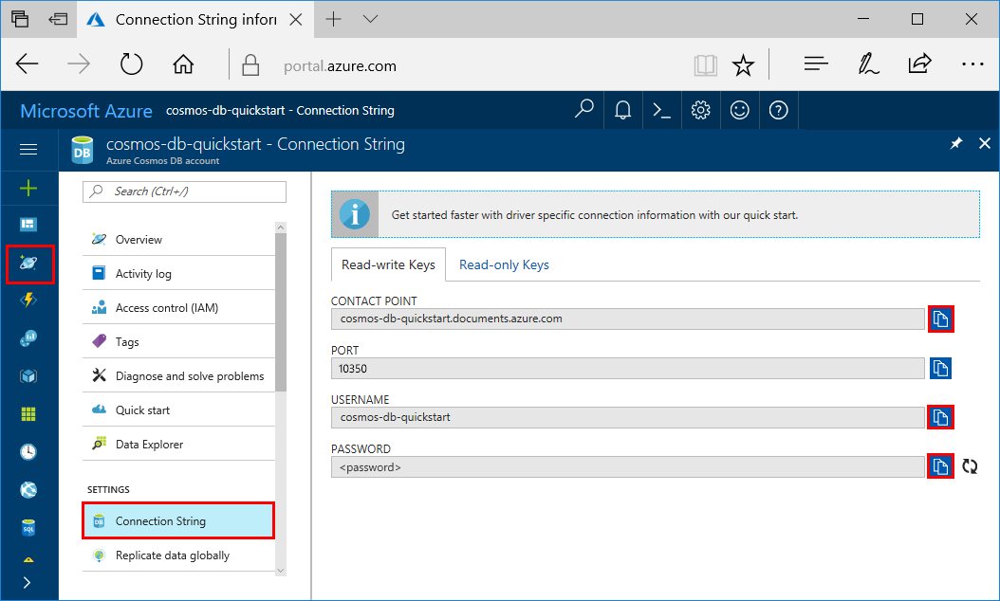

# Migrate your data to Azure Cosmos DB Cassandra API account

This tutorial provides instructions on importing Cassandra data into Azure Cosmos DB by using the Cassandra Query Language (CQL) COPY command. 

This tutorial covers the following tasks:

> [!div class="checklist"]
> * Retrieving your connection string
> * Importing data by using the cqlsh COPY command
> * Importing using the Spark connector 

# Prerequisites

* Install [Apache Cassandra](http://cassandra.apache.org/download/) and specifically ensure *cqlsh* is present.  

* Increase throughput: The duration of your data migration depends on the amount of throughput you provisioned for your Tables. Be sure to increase the throughput for larger data migrations. After you've completed the migration, decrease the throughput to save costs. For more information about increasing throughput in the [Azure portal](https://portal.azure.com), see [Set throughput for Azure Cosmos DB containers](set-throughput.md).  

* Enable SSL: Azure Cosmos DB has strict security requirements and standards. Be sure to enable SSL when you interact with your account. When you use CQL with SSH, you have an option to provide SSL information. 

## Get your connection string

1. In the [Azure portal](https://portal.azure.com), on the far left, click **Azure Cosmos DB**.

2. In the **Subscriptions** pane, select your account name.

3. Click **Connection String**. The right pane contains all the information that you need to successfully connect to your account.

    

## Migrate data by using cqlsh COPY

To import Cassandra data into Azure Cosmos DB for use with the Cassandra API, use the following guidance:

1. Log in to cqhsh using the connection information from the portal.
2. Use the [CQL COPY command](http://cassandra.apache.org/doc/latest/tools/cqlsh.html#cqlsh) to copy local data to the Apache Cassandra API endpoint. Ensure the source and target are in same datacenter to minimize latency issues.

### Steps to move data with cqlsh

1. Pre-create and scale your table:
    * By default, Azure Cosmos DB provisions a new Cassandra API table with 1,000 request units per second (RU/s) (CQL-based creation is provisioned with 400 RU/s). Before you start the migration by using cqlsh, pre-create all your tables from the [Azure portal](https://portal.azure.com) or from cqlsh. 

    * From the [Azure portal](https://portal.azure.com), increase the throughput of your tables from the default throughput (400 or 1000 RU/s) to 10,000 RU/s for the duration of migration. With the higher throughput, you can avoid rate limiting and migrate in less time. With hourly billing in Azure Cosmos DB, you can reduce the throughput immediately after the migration to save costs.

2. Determine the RU charge for an operation. You can do this using the Azure Cosmos DB Cassandra API SDK of your choice. This example shows the .NET version of getting RU charges. 

    ```csharp
    var tableInsertStatement = table.Insert(sampleEntity);
    var insertResult = await tableInsertStatement.ExecuteAsync();

    foreach (string key in insertResult.Info.IncomingPayload)
            {
                byte[] valueInBytes = customPayload[key];
                string value = Encoding.UTF8.GetString(valueInBytes);
                Console.WriteLine($"CustomPayload:  {key}: {value}");
            }
 
    ``` 

3. Determine the latency from your machine to the Azure Cosmos DB service. If you are within an Azure Data center, the latency should be a low single digit millisecond number. If you are outside the Azure Datacenter, then you can use psping or azurespeed.com to get the approximate latency from your location.   

4. Calculate the proper values for parameters (NUMPROCESS, INGESTRATE, MAXBATCHSIZE, or MINBATCHSIZE) that provide good performance. 

5. Run the final migration command. Running this command assumes you have started cqlsh using the connection string information.

   ```bash
   COPY exampleks.tablename FROM filefolderx/*.csv 
   ```

## Migrate data by using Spark

For data residing in an existing cluster in Azure virtual machines, importing data using Spark is also feasible option. This requires Spark to be set up as intermediary for one time or regular ingestion. 

## Next steps

In this tutorial, you've learned how to complete the following tasks:

> [!div class="checklist"]
> * Retrieve your connection string
> * Import data by using cql copy command
> * Import using the Spark connector 

You can now proceed to the Concepts section for more information about Azure Cosmos DB. 

> [!div class="nextstepaction"]
>[Tunable data consistency levels in Azure Cosmos DB](../cosmos-db/consistency-levels.md)
