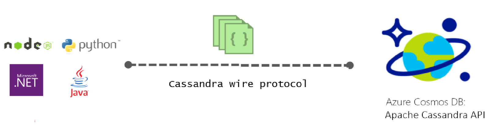

# Introduction to Apache Cassandra API for Azure Cosmos DB

Azure Cosmos DB provides the Cassandra API (preview) for applications that are written for Apache Cassandra that need premium capabilities like:

* [Scalable storage size and throughput](partition-data.md).
* [Turn-key global distribution](distribute-data-globally.md)
* Single-digit millisecond latencies at the 99th percentile.
* [Five well-defined consistency levels](consistency-levels.md)
* [Automatic indexing of data](http://www.vldb.org/pvldb/vol8/p1668-shukla.pdf) without requiring you to deal with schema and index management. 
* Guaranteed high availability, all backed by [industry-leading SLAs](https://azure.microsoft.com/support/legal/sla/cosmos-db/)

## What is the Azure Cosmos DB Apache Cassandra API?

Azure Cosmos DB can be used as the data store for apps written for [Apache Cassandra](https://cassandra.apache.org/), by using the Apache Cassandra API. This means that by using existing [Apache licensed drivers compliant with CQLv4](https://cassandra.apache.org/doc/latest/getting_started/drivers.html?highlight=driver), your application written for Cassandra can now communicate with the Azure Cosmos DB Cassandra API. In many cases, you can switch from using Cassandra to using Azure Cosmos DB and the Apache Cassandra API, by simply changing a connection string. Using this functionality, you can easily build and run Cassandra API database applications in the Azure cloud with Azure Cosmos DB's global distribution and [comprehensive industry-leading SLAs](https://azure.microsoft.com/support/legal/sla/cosmos-db), while continuing to use familiar skills and tools for Cassandra API.

Apache Cassandra applications can migrate to Azure Cosmos DB by using the Azure Cassandra API with trivial or no code changes, you simply update your connection string, and go! The Cassandra API enables you to interact with data stored in Azure Cosmos DB using the Cassandra Query Language based tools (like CQLSH) and Cassandra client drivers you’re already familiar with.

## What is the benefit of using Apache Cassandra API for Azure Cosmos DB?

**No operations management**: As a true fully managed service, Azure Cosmos DB ensures that Cassandra API administrators do not have to worry about managing and monitoring a myriad settings across OS, JVM, and yaml files and their interplay. Azure Cosmos DB provides monitoring of throughput, latency, storage and availability, and configurable alerts. And Azure Cosmos DB is available in 30+ [Azure Regions](https://azure.microsoft.com/regions/services/).

**Performance management**: Azure Cosmos DB provides SLAs backed low latency reads and writes for the 99th percentile. Users do not need to worry about lot of operational overhead to provide good read and write SLAs. These typically include scheduling compaction, managing tombstones, bloom filters setting, and replica lags. Azure Cosmos DB takes away the worry of managing these issues and lets you focus on the application deliverables.

**Automatic indexing**: By default, Azure Cosmos DB automatically indexes all the properties within documents in your Cassandra API database and does not expect or require any schema or creation of secondary indices. 

**Ability to use existing code and tools**: Azure Cosmos DB provides wire protocol level compatibility with existing SDKs and tools. This compatibility ensures you can use your existing codebase with Cassandra API of Azure Cosmos DB with trivial changes.

**Throughput and storage elasticity**: The Azure Cosmos DB platform provides elasticity of guaranteed throughput across regions via simple portal, PowerShell, or CLI operations. Administrators need not worry about adding or removing replicas for scaling up or down. Azure Cosmos DB supports Cassandra API tables that can scale to virtually unlimited storage sizes with provisioned throughput. You can elastically scale Azure Cosmos DB with predictable performance seamlessly as your application grows. 

**Global distribution and availability**: Azure Cosmos DB provides the ability to distribute data throughout Azure regions to provide end users with a low latency experience while ensuring availability. Azure Cosmos DB provides 99.99% availability within a region and 99.999% availability across the regions with no operations overhead. Azure Cosmos DB provides transparent regional failover with multi-homing APIs, and the ability to elastically scale throughput and storage across the globe. Learn more in [Distribute data globally](distribute-data-globally.md).

**Choice of consistency**: Azure Cosmos DB provides the choice of five well-defined consistency levels to achieve optimal trade-off between consistency and performance. These consistency levels are strong, bounded-staleness, session, consistent prefix, and eventual. These granular, well-defined consistency levels allow you to make sound trade-offs between consistency, availability, and latency. Learn more in [Using consistency levels to maximize availability and performance](consistency-levels.md). 

**Enterprise grade**: Secure and compliant by default – Azure cosmos DB provides [compliance certifications](https://www.microsoft.com/trustcenter) to ensure users can use the platform without worrying about compliance issues. Azure Cosmos DB also provides encryption at rest and in motion, IP firewall, and audit logs for control plane and data plane activities. Azure Cosmos DB also supports two types of policies for geo-fencing: system defined and customer defined. System defined policies automatically ensure that the data never leaves regions such as Azure in China or Azure Germany, government clouds, and DoD regions. Customer defined geo-fencing policies are enforced when the customer configures regions on their Azure Cosmos DB database accounts using either the Azure portal or CLI. You can associate or disassociate any number of Azure regions with your Azure Cosmos DB database account. Azure Cosmos s sure that the all your data in a given database account, is transparently replicated to all the regions you have configured and never leaves them.

## How to get started
Follow the Cassandra API quickstarts to create an Azure Cosmos DB Cassandra API account and create a Cassandra app:

* [Quickstart: Build a Cassandra web app with Node.js and Azure Cosmos DB](create-cassandra-nodejs.md)
* [Quickstart: Build a Cassandra web app with Java and Azure Cosmos DB](create-cassandra-java.md)
* [Quickstart: Build a Cassandra web app with .NET and Azure Cosmos DB](create-cassandra-dotnet.md)
* [Quickstart: Build a Cassandra web app with Python and Azure Cosmos DB](create-cassandra-python.md)

## Sign up now 

If you already have an Azure subscription, you can sign up for the Cassandra API (preview) in the [Azure portal](https://aka.ms/cosmosdb-cassandra-signup). If you’re new to Azure, signing up for a [free trial](https://azure.microsoft.com/free) where you get 12 months of free access to Azure Cosmos DB.

## Next steps

Information about the Azure Cosmos DB Cassandra API is integrated into the overall Azure Cosmos DB documentation, but here are a few pointers to get you started:

* Follow the [Quickstarts](create-cassandra-nodejs.md) to create an account and a new app by using a Git sample
* Follow the [Tutorial](tutorial-develop-cassandra-java.md) to create a new app programmatically.
* Follow the [Import Cassandra data tutorial](cassandra-import.md) to import your existing data into Azure Cosmos DB.
* Read the [FAQ](faq.md#cassandra).
