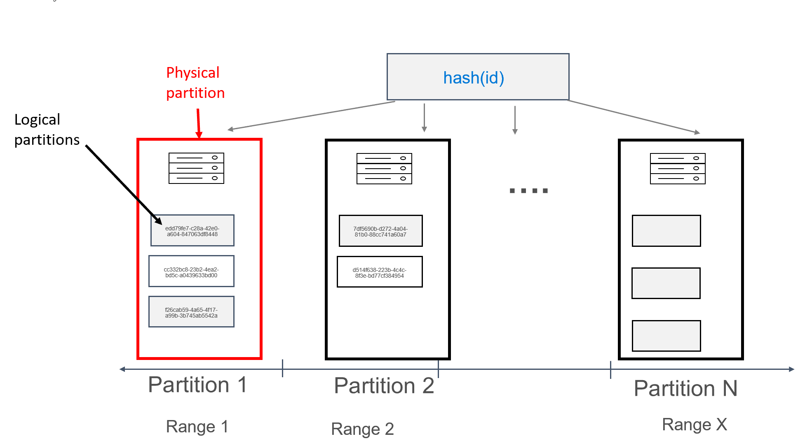
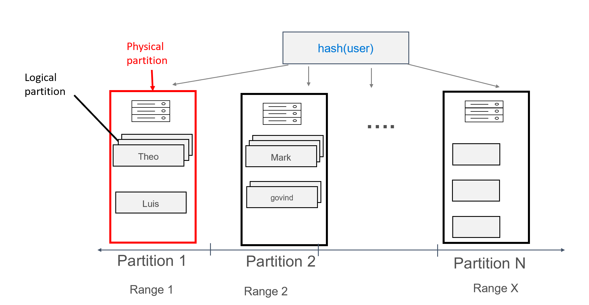

# Partitioning in Azure Cosmos DB Cassandra API

This article describes how partitioning works in Azure Cosmos DB Cassandra API. Cassandra API uses partitioning to scale individual tables in a keyspace to meet the performance needs of your application. In partitioning, the records in a table are divided into distinct subsets called logical partitions. Logical partitions are formed based on the value of a partition key that is associated with each record in a table. All records in a logical partition have the same partition key value. 

From the developer perspective, partitioning behaves in exactly the same way for Azure Cosmos DB Cassandra API as it does in native [Apache Cassandra](https://cassandra.apache.org/). There are some minor differences behind the scenes. Apache Cassandra has a concept of tokens, which are hashes of logical partition keys. The tokens are based on a murmur3 64 byte hash, with values ranging from -2^63 to -2^63 - 1. This range is commonly referred to as the "token ring" in Apache Cassandra. 

The token ring is distributed into token ranges, and these ranges are divided amongst the nodes present in a native Apache Cassandra cluster. Partitioning for Azure Cosmos DB is implemented in a similar way, except it uses a different hash algorithm, and has a larger token ring. You can learn how Partitioning and horizontal scaling works behind the scenes in Azure Cosmos DB [here](partition-data.md).


## Primary Key

All tables in Cassandra API must have a primary key defined. Suppose we want to create a user table, which stores messages for different users:

```bash
CREATE TABLE uprofile.user ( 
   id UUID PRIMARY KEY, 
   message text);
```

The primary key functions as the identifier for the record in the table, but is also the value used as the partition key in Azure Cosmos DB. If primary key is defined in the manner above, there will only be a single record in each logical partition. Although this will result in a perfect distribution when writing the data to the database, it has limitations for reads. Unless the primary key is supplied by the application in the query, all physical partitions will be scanned. 




## Compound primary key

Apache Cassandra also has a concept of compound keys, which is the combination of a primary key and a "clustering key". We might want to improve on the above design by making it possible to get all the messages for a given user, for example:

```bash
CREATE TABLE uprofile.user (
   user text,  
   id int, 
   message text, 
   PRIMARY KEY (user, id));
```

A compound primary key consists of more than one column; the first column is the partition key, and any additional columns are the clustering keys. In the above, the column "id" serves as a single clustering key, but you can define as many clustering keys as you wish. The clustering key(s) values must be unique in order to result in  different records being added to the logical partition, for example:

```bash
insert into uprofile.user (user, id, message) values ('theo', 1, 'hello');
insert into uprofile.user (user, id, message) values ('theo', 2, 'hello again');
```

With data modeled in this way, we can issue a query that is efficiently routed by the partition key (in this case, "user"). Multiple records will be assigned to each logical partition, grouped by user:




## Composite partition key

Composite partition keys work in essentially the same way as compound keys, except that you are able to specify separate columns as a composite partition key, for example:

```bash
CREATE TABLE uprofile.user ( 
   firstname text, 
   lastname text,
   id int,  
   message text, 
   PRIMARY KEY ((firstname, lastname), id) );
```
In this example, the unique combination of firstname and lastname would form the partition key. 


## Next steps

* Learn about [partitioning and horizontal scaling in Azure Cosmos DB](partition-data.md).
* Learn about [provisioned throughput in Azure Cosmos DB](request-units.md).
* Learn about [global distribution in Azure Cosmos DB](distribute-data-globally.md).
