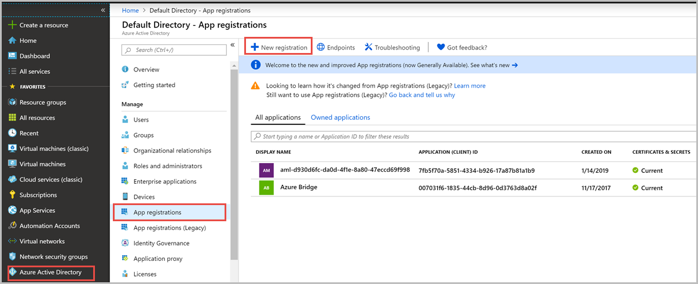
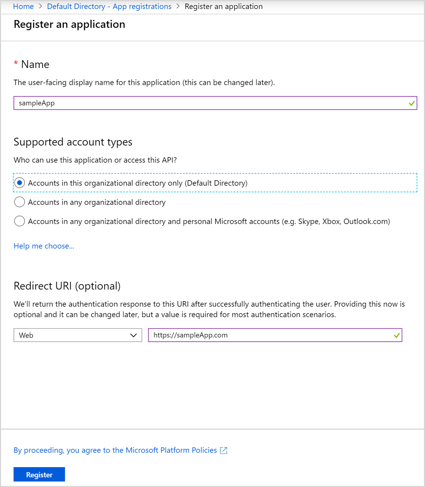
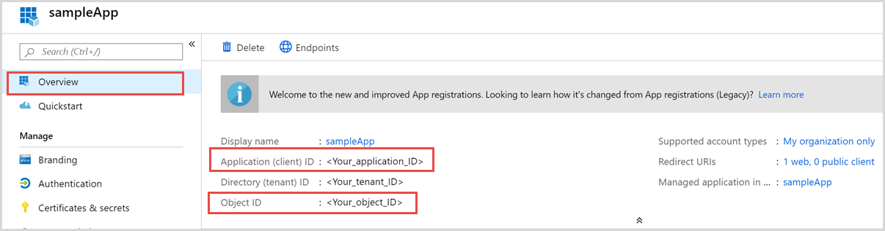
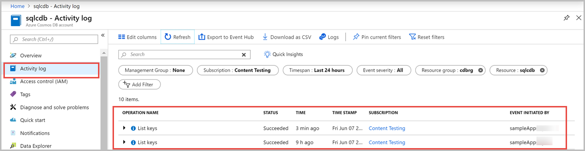

# Certificate-based authentication for an Azure AD identity to access keys from an Azure Cosmos DB account

Certificate-based authentication enables your client application to be authenticated by using Azure Active Directory (Azure AD) with a client certificate. You can perform certificate-based authentication on a machine where you need an identity, such as an on-premise machine or virtual machine in Azure. Your application can then read Azure Cosmos DB keys without having the keys directly in the application. This article describes how to create a sample Azure AD application, configure it for certificate-based authentication, sign into Azure using the new application identity, and then it retrieves the keys from your Azure Cosmos account. This article uses Azure PowerShell to set up the identities and provides a C# sample app that authenticates and accesses keys from your Azure Cosmos account.  

## Prerequisites

* Install the [latest version](/powershell/azure/install-az-ps) of Azure PowerShell.

* If you don't have an [Azure subscription](https://docs.microsoft.com/azure/guides/developer/azure-developer-guide#understanding-accounts-subscriptions-and-billing), create a [free account](https://azure.microsoft.com/free/?ref=microsoft.com&utm_source=microsoft.com&utm_medium=docs&utm_campaign=visualstudio) before you begin.

## Register an app in Azure AD

In this step, you will register a sample web application in your Azure AD account. This application is later used to read the keys from your Azure Cosmos DB account. Use the following steps to register an application: 

1. Sign into the [Azure portal](https://portal.azure.com/).

1. Open the Azure **Active Directory** pane, go to App registrations pane, and select **New registration**. 

   

1. Fill the **Register an application** form with the following details:  

   * **Name** – Provide a name for your application, it can be any name such as "sampleApp".
   * **Supported account types** – Choose **Accounts in this organizational directory only (Default Directory)** to allow resources in your current directory to access this application. 
   * **Redirect URL** – Choose application of type **Web** and provide a URL where your application is hosted, it can be any URL. For this example, you can provide a test URL such as `https://sampleApp.com` it’s okay even if the app doesn’t exist.

   

1. Select **Register** after you fill the form.

1. After the app is registered, make a note of the **Application(client) ID** and **Object ID**, you will use these details in the next steps. 

   

## Install the AzureAD module

In this step, you will install the Azure AD PowerShell module. This module is required to get the ID of the application you registered in the previous step and associate a self-signed certificate to that application. 

1. Open Windows PowerShell ISE with administrator rights. If you haven’t already done, install the AZ PowerShell module and connect to your subscription. If you have multiple subscriptions, you can set the context of current subscription as shown in the following commands:

   ```powershell

   Install-Module -Name Az -AllowClobber
   Connect-AzAccount

   Get-AzSubscription
   $context = Get-AzSubscription -SubscriptionId <Your_Subscription_ID>
   Set-AzContext $context 
   ```

1. Install and import the [AzureAD](/powershell/module/azuread/?view=azureadps-2.0) module

   ```powershell
   Install-Module AzureAD
   Import-Module AzureAD 
   ```

## Sign into your Azure AD

Sign into your Azure AD where you have registered the application. Use the Connect-AzureAD command to sign into your account, enter your Azure account credentials in the pop-up window. 

```powershell
Connect-AzureAD 
```

## Create a self-signed certificate

Open another instance of Windows PowerShell ISE, and run the following commands to create a self-signed certificate and read the key associated with the certificate:

```powershell
$cert = New-SelfSignedCertificate -CertStoreLocation "Cert:\CurrentUser\My" -Subject "CN=sampleAppCert" -KeySpec KeyExchange
$keyValue = [System.Convert]::ToBase64String($cert.GetRawCertData()) 
```

## Create the certificate-based credential 

Next run the following commands to get the object ID of your application and create the certificate-based credential. In this example, we set the certificate to expire after a year, you can set it to any required end date.

```powershell
$application = Get-AzureADApplication -ObjectId <Object_ID_of_Your_Application>

New-AzureADApplicationKeyCredential -ObjectId $application.ObjectId -CustomKeyIdentifier "Key1" -Type AsymmetricX509Cert -Usage Verify -Value $keyValue -EndDate "2020-01-01"
```

The above command results in the output similar to the screenshot below:


## Configure your Azure Cosmos account to use the new identity

1. Sign into the [Azure portal](https://portal.azure.com/).

1. Navigate to your Azure Cosmos account, open the **Access control (IAM)** blade.

1. Select **Add** and **Add role assignment**. Add the sampleApp you created in the previous step with **Contributor** role as shown in the following screenshot:

   

1. Select **Save** after you fill out the form


## Access the keys from PowerShell

In this step, you will sign into Azure by using the application and the certificate you created and access your Azure Cosmos account's keys. 

1. Initially clear the Azure account's credentials you have used to sign into your account. You can clear credentials by using the following command:

   ```powershell
   Disconnect-AzAccount -Username <Your_Azure_account_email_id> 
   ```

1. Next validate that you can sign into Azure portal by using the application’s credentials and access the Azure Cosmos DB keys:

   ```powershell
   Login-AzAccount -ApplicationId <Your_Application_ID> -CertificateThumbprint $cert.Thumbprint -ServicePrincipal -Tenant <Tenant_ID_of_your_application>

   Invoke-AzResourceAction -Action listKeys -ResourceType "Microsoft.DocumentDB/databaseAccounts" -ApiVersion "2015-04-08" -ResourceGroupName <Resource_Group_Name_of_your_Azure_Cosmos_account> -ResourceName <Your_Azure_Cosmos_Account_Name> 
   ```

The previous command will display the primary and secondary master keys of your Azure Cosmos account. You can view the Activity log of your Azure Cosmos account to validate that the get keys request succeeded and the event is initiated by the "sampleApp" application. 
 



## Access the keys from a C# application 

You can also validate this scenario by accessing keys from a C# application. The following C# console application, that can access Azure Cosmos DB keys by using the app registered in Active Directory. Make sure to update the tenantId, clientID, certName, resource group name, subscription ID, Azure Cosmos account name details before you run the code. 

```csharp
using System;
using Microsoft.IdentityModel.Clients.ActiveDirectory;
using System.Linq;
using System.Net.Http;
using System.Security.Cryptography.X509Certificates;
using System.Threading;
using System.Threading.Tasks;
 
namespace TodoListDaemonWithCert
{
    class Program
    {
        private static string aadInstance = "https://login.windows.net/";
        private static string tenantId = "<Your_Tenant_ID>";
        private static string clientId = "<Your_Client_ID>";
        private static string certName = "<Your_Certificate_Name>";
 
        private static int errorCode = 0;
        static int Main(string[] args)
        {
            MainAync().Wait();
            Console.ReadKey();
 
            return 0;
        } 
 
        static async Task MainAync()
        {
            string authContextURL = aadInstance + tenantId;
            AuthenticationContext authContext = new AuthenticationContext(authContextURL);
            X509Certificate2 cert = ReadCertificateFromStore(certName);
 
            ClientAssertionCertificate credential = new ClientAssertionCertificate(clientId, cert);
            AuthenticationResult result = await authContext.AcquireTokenAsync("https://management.azure.com/", credential);
            if (result == null)
            {
                throw new InvalidOperationException("Failed to obtain the JWT token");
            }
 
            string token = result.AccessToken;
            string subscriptionId = "<Your_Subscription_ID>";
            string rgName = "<ResourceGroup_of_your_Cosmos_account>";
            string accountName = "<Your_Cosmos_account_name>";
            string cosmosDBRestCall = $"https://management.azure.com/subscriptions/{subscriptionId}/resourceGroups/{rgName}/providers/Microsoft.DocumentDB/databaseAccounts/{accountName}/listKeys?api-version=2015-04-08";
 
            Uri restCall = new Uri(cosmosDBRestCall);
            HttpClient httpClient = new HttpClient();
            httpClient.DefaultRequestHeaders.Remove("Authorization");
            httpClient.DefaultRequestHeaders.Add("Authorization", "Bearer " + token);
            HttpResponseMessage response = await httpClient.PostAsync(restCall, null);
 
            Console.WriteLine("Got result {0} and keys {1}", response.StatusCode.ToString(), response.Content.ReadAsStringAsync().Result);
        }
 
 
        /// <summary>
        /// Reads the certificate
        /// </summary>
        private static X509Certificate2 ReadCertificateFromStore(string certName)
        {
            X509Certificate2 cert = null;
            X509Store store = new X509Store(StoreName.My, StoreLocation.CurrentUser);
            store.Open(OpenFlags.ReadOnly);
            X509Certificate2Collection certCollection = store.Certificates;
 
            // Find unexpired certificates.
            X509Certificate2Collection currentCerts = certCollection.Find(X509FindType.FindByTimeValid, DateTime.Now, false);
 
            // From the collection of unexpired certificates, find the ones with the correct name.
            X509Certificate2Collection signingCert = currentCerts.Find(X509FindType.FindBySubjectName, certName, false);
 
            // Return the first certificate in the collection, has the right name and is current.
            cert = signingCert.OfType<X509Certificate2>().OrderByDescending(c => c.NotBefore).FirstOrDefault();
            store.Close();
            return cert;
        }
 
 
        /// <summary>
        /// Get an access token from Azure AD using client credentials.
        /// If the attempt to get a token fails because the server is unavailable, retry twice after 3 seconds each
        /// </summary>
        private static async Task<AuthenticationResult> GetAccessToken(AuthenticationContext authContext, string resourceUri, ClientAssertionCertificate cert)
        {
            //
            // Get an access token from Azure AD using client credentials.
            // If the attempt to get a token fails because the server is unavailable, retry twice after 3 seconds each.
            //
            AuthenticationResult result = null;
            int retryCount = 0;
            bool retry = false;
 
            do
            {
                retry = false;
                errorCode = 0;
 
                try
                {
                    result = await authContext.AcquireTokenAsync(resourceUri, cert);
                }
                catch (AdalException ex)
                {
                    if (ex.ErrorCode == "temporarily_unavailable")
                    {
                        retry = true;
                        retryCount++;
                        Thread.Sleep(3000);
                    }
 
                    Console.WriteLine(
                        String.Format("An error occurred while acquiring a token\nTime: {0}\nError: {1}\nRetry: {2}\n",
                        DateTime.Now.ToString(),
                        ex.ToString(),
                        retry.ToString()));
 
                    errorCode = -1;
                }
 
            } while ((retry == true) && (retryCount < 3));
            return result;
        }
    }
}
```

This script outputs the primary and secondary master keys as shown in the following screenshot:


Similar to the previous section, you can view the Activity log of your Azure Cosmos account to validate that the get keys request event is initiated by the "sampleApp" application. 


## Next steps

* [Secure Azure Cosmos keys using Azure Key Vault](access-secrets-from-keyvault.md)

* [Security attributes for Azure Cosmos DB](cosmos-db-security-attributes.md)
