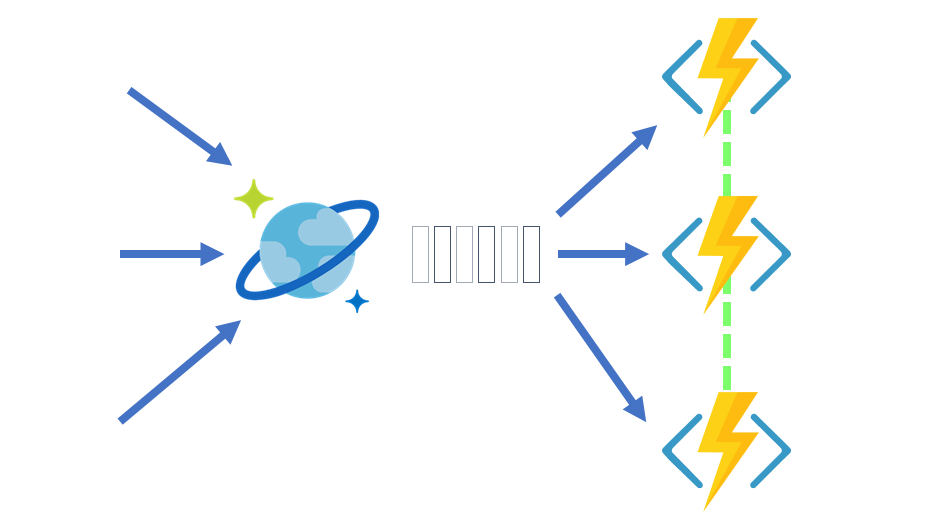

# Serverless event-based architectures with Azure Cosmos DB and Azure Functions

Azure Functions provides the simplest way to connect to the [change feed](change-feed.md). You can create small reactive Azure Functions that will be automatically triggered on each new event in your Azure Cosmos container's change feed.

With the [Azure Cosmos DB Trigger](../azure-functions/functions-bindings-cosmosdb-v2.md#trigger), you can leverage the [Change Feed Processor](./change-feed-processor.md)'s scaling and reliable event detection functionality without the need to maintain any [worker infrastructure](./change-feed-processor.md#implementing-the-change-feed-processor-library). Just focus on your Azure Function's logic without worrying about the rest of the event-sourcing pipeline. You can even mix the Trigger with any other [Azure Functions bindings](../azure-functions/functions-triggers-bindings.md#supported-bindings).

> [!NOTE]
> Currently, the Azure Cosmos DB trigger is supported for use with the Core (SQL) API only.

## Requirements

To implement a serverless event-based flow, you need:

* **The monitored container**: The monitored container is the Azure Cosmos container being monitored, and it stores the data from which the change feed is generated. Any inserts and changes (e.g., CRUD) to the monitored container are reflected in the change feed of the container.
* **The lease container**: The lease container maintains state across multiple and dynamic serverless Azure Function instances and enables dynamic scaling. This lease container can be manually or automatically created by the Azure Cosmos DB Trigger.To automatically create the lease container, set the *CreateLeaseCollectionIfNotExists* flag in the [configuration](../azure-functions/functions-bindings-cosmosdb-v2.md#trigger---configuration). Partitioned lease containers are required to have a `/id` partition key definition.

## Create your Azure Cosmos DB Trigger

Creating your Azure Function with an Azure Cosmos DB Trigger is now supported across all Azure Functions IDE and CLI integrations:

* [Visual Studio Extension](../azure-functions/functions-develop-vs.md) for Visual Studio users.
* [Visual Studio Core Extension](https://code.visualstudio.com/tutorials/functions-extension/create-function) for Visual Studio Code users.
* And finally [Core CLI tooling](../azure-functions/functions-run-local.md#create-func) for a cross-platform IDE agnostic experience.

## Run your Azure Cosmos DB Trigger locally

You can run your [Azure Function locally](../azure-functions/functions-develop-local.md) with the [Azure Cosmos DB Emulator](./local-emulator.md) to create and develop your serverless event-based flows without an Azure Subscription or incurring any costs.

If you want to test live scenarios in the cloud, you can [Try Cosmos DB for free](https://azure.microsoft.com/try/cosmosdb/) without any credit card or Azure subscription required.

## Next steps

You can now continue to learn more about change feed in the following articles:

* [Overview of change feed](change-feed.md)
* [Ways to read change feed](read-change-feed.md)
* [Using change feed processor library](change-feed-processor.md)
* [How to work with change feed processor library](change-feed-processor.md)
* [Serverless database computing using Azure Cosmos DB and Azure Functions](serverless-computing-database.md)
