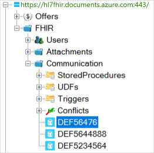
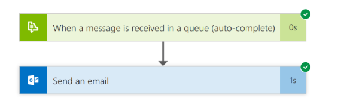
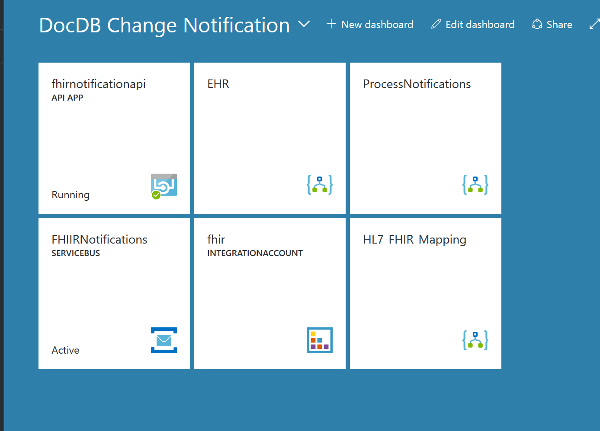

# Notifying patients of HL7 FHIR health care record changes using Logic Apps and Azure Cosmos DB

Azure MVP Howard Edidin was recently contacted by a healthcare organization that wanted to add new functionality to their patient portal. They needed to send notifications to patients when their health record was updated, and they needed patients to be able to subscribe to these updates. 

This article walks through the change feed notification solution created for this healthcare organization using Azure Cosmos DB, Logic Apps, and Service Bus. 

## Project requirements
- Providers send HL7 Consolidated-Clinical Document Architecture (C-CDA) documents in XML format. C-CDA documents encompass just about every type of clinical document, including clinical documents such as family histories and immunization records, as well as administrative, workflow, and financial documents. 
- C-CDA documents are converted to [HL7 FHIR Resources](https://hl7.org/fhir/2017Jan/resourcelist.html) in JSON format.
- Modified FHIR resource documents are sent by email in JSON format.

## Solution workflow 

At a high level, the project required the following workflow steps: 
1. Convert C-CDA documents to FHIR resources.
2. Perform recurring trigger polling for modified FHIR resources. 
2. Call a custom app, FhirNotificationApi, to connect to Azure Cosmos DB and query for new or modified documents.
3. Save the response to the Service Bus queue.
4. Poll for new messages in the Service Bus queue.
5. Send email notifications to patients.

## Solution architecture
This solution requires three Logic Apps to meet the above requirements and complete the solution workflow. The three logic apps are:
1. **HL7-FHIR-Mapping app**: Receives the HL7 C-CDA document, transforms it to the FHIR Resource, then saves it to Azure Cosmos DB.
2. **EHR app**: Queries the Azure Cosmos DB FHIR repository and saves the response to a Service Bus queue. This logic app uses an [API app](#api-app) to retrieve new and changed documents.
3. **Process notification app**: Sends an email notification with the FHIR resource documents in the body.


### Azure services used in the solution

#### Azure Cosmos DB SQL API
Azure Cosmos DB is the repository for the FHIR resources as shown in the following figure.



#### Logic Apps
Logic Apps handle the workflow process. The following screenshots show the Logic apps created for this solution. 


1. **HL7-FHIR-Mapping app**: Receive the HL7 C-CDA document and transform it to an FHIR resource using the Enterprise Integration Pack for Logic Apps. The Enterprise Integration Pack handles the mapping from the C-CDA to FHIR resources.

	


2. **EHR app**: Query the Azure Cosmos DB FHIR repository and save the response to a Service Bus queue. The code for the GetNewOrModifiedFHIRDocuments app is below.

    

3. **Process notification app**: Send an email notification with the FHIR resource documents in the body.

	

#### Service Bus
The following figure shows the patients queue. The Tag property value is used for
the email subject.


<a id="api-app"></a>

#### API app
An API app connects to Azure Cosmos DB and queries for new or modified FHIR 
documents By resource type. This app has one controller, **FhirNotificationApi** with a one
operation **GetNewOrModifiedFhirDocuments**, see [source for API app](#api-app-source).

We are using the [`CreateDocumentChangeFeedQuery`](https://msdn.microsoft.com/library/azure/microsoft.azure.documents.client.documentclient.createdocumentchangefeedquery.aspx) class from the Azure Cosmos DB SQL .NET API. For more information, see the [change feed article](change-feed.md). 

##### GetNewOrModifiedFhirDocuments operation

**Inputs**
- DatabaseId
- CollectionId
- HL7 FHIR Resource Type name
- Boolean: Start from Beginning
- Int: Number of documents returned

**Outputs**
- Success: Status Code: 200, Response: List of Documents (JSON Array)
- Failure: Status Code: 404, Response: "No Documents found for '*resource name'* Resource Type"

<a id="api-app-source"></a>

**Source for the API app**

```csharp

	using System.Collections.Generic;
	using System.Linq;
	using System.Net;
	using System.Net.Http;
	using System.Threading.Tasks;
	using System.Web.Http;
	using Microsoft.Azure.Documents;
	using Microsoft.Azure.Documents.Client;
	using Swashbuckle.Swagger.Annotations;
	using TRex.Metadata;
	
	namespace FhirNotificationApi.Controllers
	{
	    /// <summary>
	    ///     FHIR Resource Type Controller
	    /// </summary>
	    /// <seealso cref="System.Web.Http.ApiController" />
	    public class FhirResourceTypeController : ApiController
	    {
	        /// <summary>
	        ///     Gets the new or modified FHIR documents from Last Run Date 
	        ///		or create date of the collection
	        /// </summary>
	        /// <param name="databaseId"></param>
	        /// <param name="collectionId"></param>
	        /// <param name="resourceType"></param>
	        /// <param name="startfromBeginning"></param>
	        /// <param name="maximumItemCount">-1 returns all (default)</param>
	        /// <returns></returns>
	        [Metadata("Get New or Modified FHIR Documents",
	            "Query for new or modified FHIR Documents By Resource Type " +
	            "from Last Run Date or Beginning of Collection creation"
	        )]
	        [SwaggerResponse(HttpStatusCode.OK, type: typeof(Task<dynamic>))]
	        [SwaggerResponse(HttpStatusCode.NotFound, "No New or Modified Documents found")]
	        [SwaggerOperation("GetNewOrModifiedFHIRDocuments")]
	        public async Task<dynamic> GetNewOrModifiedFhirDocuments(
	            [Metadata("Database Id", "Database Id")] string databaseId,
	            [Metadata("Collection Id", "Collection Id")] string collectionId,
	            [Metadata("Resource Type", "FHIR resource type name")] string resourceType,
	            [Metadata("Start from Beginning ", "Change Feed Option")] bool startfromBeginning,
	            [Metadata("Maximum Item Count", "Number of documents returned. '-1 returns all' (default)")] int maximumItemCount = -1
	        )
	        {
	            var collectionLink = UriFactory.CreateDocumentCollectionUri(databaseId, collectionId);
	
	            var context = new DocumentDbContext();	
	
	            var docs = new List<dynamic>();
	
	            var partitionKeyRanges = new List<PartitionKeyRange>();
	            FeedResponse<PartitionKeyRange> pkRangesResponse;
	
	            do
	            {
	                pkRangesResponse = await context.Client.ReadPartitionKeyRangeFeedAsync(collectionLink);
	                partitionKeyRanges.AddRange(pkRangesResponse);
	            } while (pkRangesResponse.ResponseContinuation != null);
	
	            foreach (var pkRange in partitionKeyRanges)
	            {
	                var changeFeedOptions = new ChangeFeedOptions
	                {
	                    StartFromBeginning = startfromBeginning,
	                    RequestContinuation = null,
	                    MaxItemCount = maximumItemCount,
	                    PartitionKeyRangeId = pkRange.Id
	                };
	
	                using (var query = context.Client.CreateDocumentChangeFeedQuery(collectionLink, changeFeedOptions))
	                {
	                    do
	                    {
	                        if (query != null)
	                        {
	                            var results = await query.ExecuteNextAsync<dynamic>().ConfigureAwait(false);
	                            if (results.Count > 0)
	                                docs.AddRange(results.Where(doc => doc.resourceType == resourceType));
	                        }
	                        else
	                        {
	                            throw new HttpResponseException(new HttpResponseMessage(HttpStatusCode.NotFound));
	                        }
	                    } while (query.HasMoreResults);
	                }
	            }
	            if (docs.Count > 0)
	                return docs;
	            var msg = new StringContent("No documents found for " + resourceType + " Resource");
	            var response = new HttpResponseMessage
	            {
	                StatusCode = HttpStatusCode.NotFound,
	                Content = msg
	            };
	            return response;
	        }
	    }
	}
	
```

### Testing the FhirNotificationApi 

The following image demonstrates how swagger was used to test the [FhirNotificationApi](#api-app-source).


### Azure portal dashboard

The following image shows all of the Azure services for this solution running in the Azure portal.




## Summary

- You have learned that Azure Cosmos DB has native support for notifications for new or modified documents and how easy it is to use. 
- By leveraging Logic Apps, you can create workflows without writing any code.
- Using Azure Service Bus Queues to handle the distribution for the HL7 FHIR documents.

## Next steps
For more information about Azure Cosmos DB, see the [Azure Cosmos DB home page](https://azure.microsoft.com/services/cosmos-db/). For more information about Logic Apps, see [Logic Apps](https://azure.microsoft.com/services/logic-apps/).


