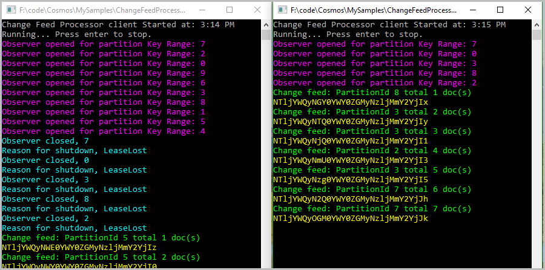
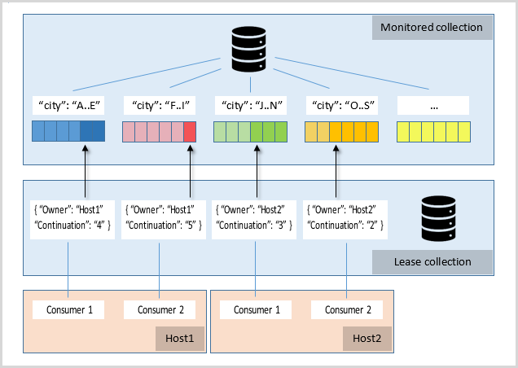

# Change feed processor in Azure Cosmos DB 

The [Azure Cosmos DB change feed processor library](sql-api-sdk-dotnet-changefeed.md) helps you distribute event processing across multiple consumers. This library simplifies reading changes across partitions and multiple threads working in parallel.

The main benefit of change feed processor library is that you don’t have to manage each partition and continuation token and you don’t have to poll each container manually.

The change feed processor library simplifies reading changes across partitions and multiple threads working in parallel. It automatically manages reading changes across partitions using a lease mechanism. As you can see in the following image, if you start two clients that are using the change feed processor library, they divide the work among themselves. As you continue to increase the number of clients, they keep dividing the work among themselves.

The left client was started first and it started monitoring all the partitions, then the second client was started, and then the first let go of some of the leases to second client. This is an efficient way to distribute work among different machines and clients.

If you have two server-less Azure functions monitoring the same container and using the same lease, the two functions may get different documents depending upon how the processor library decides to process the partitions.

## Implementing the change feed processor library

There are four main components of implementing the change feed processor library: 

1. **The monitored container:** The monitored container has the data from which the change feed is generated. Any inserts and changes to the monitored container are reflected in the change feed of the container.

1. **The lease container:** The lease container coordinates processing the change feed across multiple workers. A separate container is used to store the leases with one lease per partition. It is advantageous to store this lease container on a different account with the write region closer to where the change feed processor is running. A lease object contains the following attributes:

   * Owner: Specifies the host that owns the lease.

   * Continuation: Specifies the position (continuation token) in the change feed for a particular partition.

   * Timestamp: Last time lease was updated; the timestamp can be used to check whether the lease is considered expired.

1. **The processor host:** Each host determines how many partitions to process based on how many other instances of hosts have active leases.

   * When a host starts up, it acquires leases to balance the workload across all hosts. A host periodically renews leases, so leases remain active.

   * A host checkpoints the last continuation token to its lease for each read. To ensure concurrency safety, a host checks the ETag for each lease update. Other checkpoint strategies are also supported.

   * Upon shutdown, a host releases all leases but keeps the continuation information, so it can resume reading from the stored checkpoint later.

   Currently, the number of hosts cannot be greater than the number of partitions (leases).

1. **The consumers:** Consumers, or workers, are threads that perform the change feed processing initiated by each host. Each processor host can have multiple consumers. Each consumer reads the change feed from the partition it is assigned to and notifies its host of changes and expired leases.

To further understand how these four elements of change feed processor work together, let's look at an example in the following diagram. The monitored collection stores documents and uses 'City' as the partition key. We see that the blue partition contains documents with the 'City' field from "A-E" and so on. There are two hosts, each with two consumers reading from the four partitions in parallel. The arrows show the consumers reading from a specific spot in the change feed. In the first partition, the darker blue represents unread changes while the light blue represents the already-read changes on the change feed. The hosts use the lease collection to store a "continuation" value to keep track of the current reading position for each consumer.

### Change feed and provisioned throughput

You are charged for RUs consumed, since data movement in and out of Cosmos containers always consumes RUs. You are charged for RUs consumed by the lease container.

## Additional resources

* [Azure Cosmos DB change feed processor library](sql-api-sdk-dotnet-changefeed.md)
* [NuGet package](https://www.nuget.org/packages/Microsoft.Azure.DocumentDB.ChangeFeedProcessor/)
* [Additional samples on GitHub](https://github.com/Azure/azure-documentdb-dotnet/tree/master/samples/ChangeFeedProcessor)

## Next steps

You can now proceed to learn more about change feed in the following articles:

* [Overview of change feed](change-feed.md)
* [Ways to read change feed](read-change-feed.md)
* [Using change feed with Azure Functions](change-feed-functions.md)
