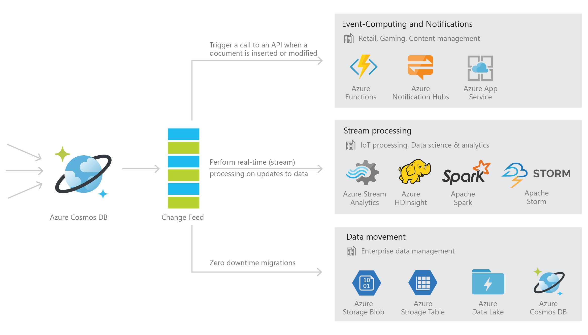
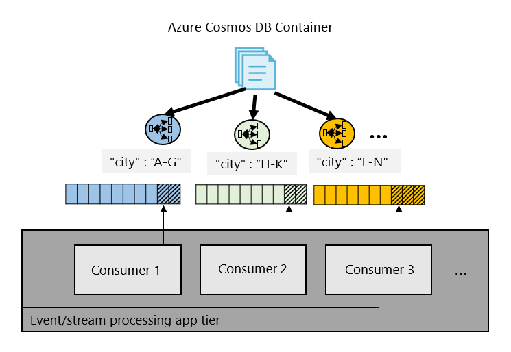
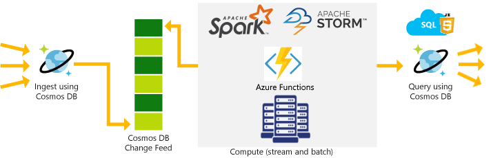
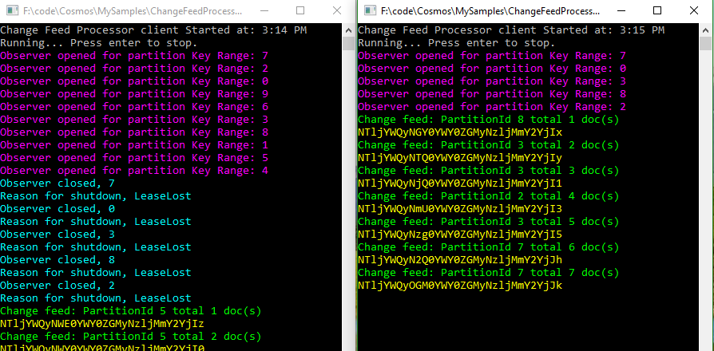
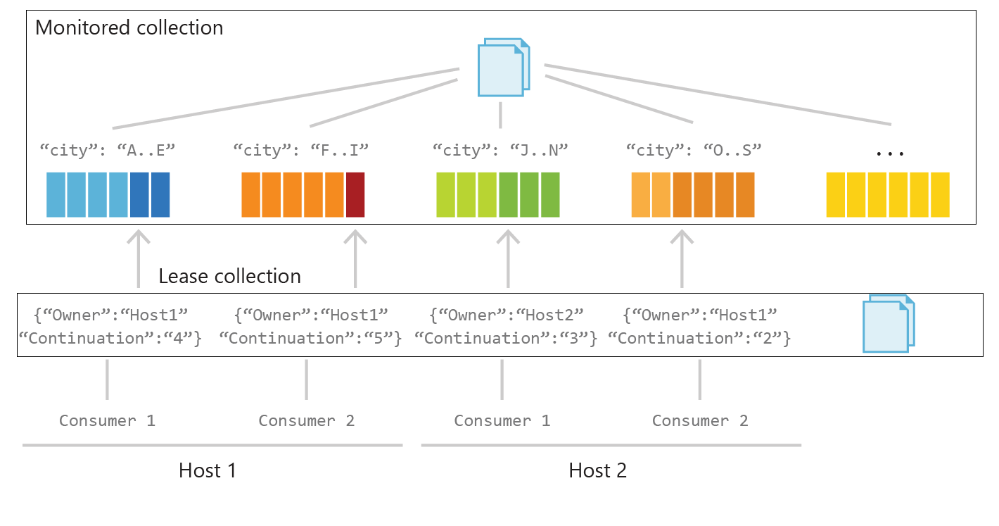

# Working with the change feed support in Azure Cosmos DB

[Azure Cosmos DB](../cosmos-db/introduction.md) is a fast and flexible globally replicated database, well-suited for IoT, gaming, retail, and operational logging applications. A common design pattern in these applications is to use changes to the data to kick off additional actions. These additional actions could be any of the following: 

* Triggering a notification or a call to an API when a document is inserted or modified.
* Stream processing for IoT or performing analytics.
* Additional data movement by synchronizing with a cache, search engine, or data warehouse, or archiving data to cold storage.

The **change feed support** in Azure Cosmos DB enables you to build efficient and scalable solutions for each of these patterns, as shown in the following image:



> [!NOTE]
> Change feed support is provided for all data models and containers in Azure Cosmos DB. However, the change feed is read using the SQL client and serializes items into JSON format. Because of the JSON formatting, MongoDB clients will experience a mismatch between BSON formatted documents and the JSON formatted change feed.

## How does change feed work?

Change feed support in Azure Cosmos DB works by listening to an Azure Cosmos DB collection for any changes. It then outputs the sorted list of documents that were changed in the order in which they were modified. The changes are persisted, can be processed asynchronously and incrementally, and the output can be distributed across one or more consumers for parallel processing. 

You can read the change feed in three different ways, as discussed later in this article:

*	[Using Azure Functions](#azure-functions)
*	[Using the Azure Cosmos DB SDK](#sql-sdk)
*	[Using the Azure Cosmos DB change feed processor library](#change-feed-processor)

The change feed is available for each partition key range within the document collection, and thus can be distributed across one or more consumers for parallel processing as shown in the following image.



Additional details:
* Change feed is enabled by default for all accounts.
* You can use your [provisioned throughput](request-units.md) in your write region or any [read region](distribute-data-globally.md) to read from the change feed, just like any other Azure Cosmos DB operation.
* The change feed includes inserts and update operations made to documents within the collection. You can capture deletes by setting a "soft-delete" flag within your documents in place of deletes. Alternatively, you can set a finite expiration period for your documents via the [TTL capability](time-to-live.md), for example, 24 hours and use the value of that property to capture deletes. With this solution, you have to process changes within a shorter time interval than the TTL expiration period.
* Each change to a document appears exactly once in the change feed, and clients manage their checkpointing logic. The change feed processor library provides automatic checkpointing and "at least once" semantics.
* Only the most recent change for a given document is included in the change log. Intermediate changes may not be available.
* The change feed is sorted by order of modification within each partition key value. There is no guaranteed order across partition-key values.
* Changes can be synchronized from any point-in-time, that is, there is no fixed data retention period for which changes are available.
* Changes are available in chunks of partition key ranges. This capability allows changes from large collections to be processed in parallel by multiple consumers/servers.
* Applications can request multiple change feeds simultaneously on the same collection.
* ChangeFeedOptions.StartTime can be used to provide an initial starting point, for example, to find the continuation token corresponding to given clock time. The ContinuationToken, if specified, wins over the StartTime and StartFromBeginning values. The precision of ChangeFeedOptions.StartTime is ~5 secs. 

## Use cases and scenarios

The change feed enables efficient processing of large datasets with a high volume of writes, and offers an alternative to querying an entire dataset to identify what has changed. 

For example, with a change feed, you can perform the following tasks efficiently:

* Update a cache, search index, or a data warehouse with data stored in Azure Cosmos DB.
* Implement application-level data tiering and archival, that is, store "hot data" in Azure Cosmos DB, and age out "cold data" to [Azure Blob Storage](../storage/common/storage-introduction.md) or [Azure Data Lake Store](../data-lake-store/data-lake-store-overview.md).
* Perform zero down-time migrations to another Azure Cosmos DB account with a different partitioning scheme.
* Implement [lambda pipelines on Azure](https://blogs.technet.microsoft.com/msuspartner/2016/01/27/azure-partner-community-big-data-advanced-analytics-and-lambda-architecture/) with Azure Cosmos DB. Azure Cosmos DB provides a scalable database solution that can handle both ingestion and query, and implement lambda architectures with low TCO. 
* Receive and store event data from devices, sensors, infrastructure, and applications, and process these events in real time with [Azure Stream Analytics](../stream-analytics/stream-analytics-documentdb-output.md), [Apache Storm](../hdinsight/storm/apache-storm-overview.md), or [Apache Spark](../hdinsight/spark/apache-spark-overview.md). 

The following image shows how lambda pipelines that both ingest and query using Azure Cosmos DB can use change feed support: 



Also, within your [serverless](http://azure.com/serverless) web and mobile apps, you can track events such as changes to your customer's profile, preferences, or location to trigger certain actions like sending push notifications to their devices using [Azure Functions](#azure-functions). If you're using Azure Cosmos DB to build a game, you can, for example, use change feed to implement real-time leaderboards based on scores from completed games.

<a id="azure-functions"></a>
## Using Azure Functions 

If you're using Azure Functions, the simplest way to connect to an Azure Cosmos DB change feed is to add an Azure Cosmos DB trigger to your Azure Functions app. When you create an Azure Cosmos DB trigger in an Azure Functions app, you select the Azure Cosmos DB collection to connect to, and the function is triggered whenever a change to the collection is made. 

Triggers can be created in the Azure Functions portal, in the Azure Cosmos DB portal, or programmatically. For more information, see [Azure Cosmos DB: Serverless database computing using Azure Functions](serverless-computing-database.md).

<a id="sql-sdk"></a>
## Using the SDK

The [SQL SDK](sql-api-sdk-dotnet.md) for Azure Cosmos DB gives you all the power to read and manage a change feed. But with great power comes lots of responsibilities, too. If you want to manage checkpoints, deal with document sequence numbers, and have granular control over partition keys, then using the SDK may be the right approach.

This section walks through how to use the SQL SDK to work with a change feed.

1. Start by reading the following resources from appconfig. Instructions on retrieving the endpoint and authorization key are available in [Update your connection string](create-sql-api-dotnet.md#update-your-connection-string).

    ``` csharp
    DocumentClient client;
    string DatabaseName = ConfigurationManager.AppSettings["database"];
    string CollectionName = ConfigurationManager.AppSettings["collection"];
    string endpointUrl = ConfigurationManager.AppSettings["endpoint"];
    string authorizationKey = ConfigurationManager.AppSettings["authKey"];
    ```

2. Create the client as follows:

    ```csharp
    using (client = new DocumentClient(new Uri(endpointUrl), authorizationKey,
    new ConnectionPolicy { ConnectionMode = ConnectionMode.Direct, ConnectionProtocol = Protocol.Tcp }))
    {
    }
    ```

3. Get the partition key ranges:

    ```csharp
    FeedResponse pkRangesResponse = await client.ReadPartitionKeyRangeFeedAsync(
        collectionUri,
        new FeedOptions
            {RequestContinuation = pkRangesResponseContinuation });
     
    partitionKeyRanges.AddRange(pkRangesResponse);
    pkRangesResponseContinuation = pkRangesResponse.ResponseContinuation;
    ```

4. Call ExecuteNextAsync for every partition key range:

    ```csharp
    foreach (PartitionKeyRange pkRange in partitionKeyRanges){
        string continuation = null;
        checkpoints.TryGetValue(pkRange.Id, out continuation);
        IDocumentQuery<Document> query = client.CreateDocumentChangeFeedQuery(
            collectionUri,
            new ChangeFeedOptions
            {
                PartitionKeyRangeId = pkRange.Id,
                StartFromBeginning = true,
                RequestContinuation = continuation,
                MaxItemCount = -1,
                // Set reading time: only show change feed results modified since StartTime
                StartTime = DateTime.Now - TimeSpan.FromSeconds(30)
            });
        while (query.HasMoreResults)
            {
                FeedResponse<dynamic> readChangesResponse = query.ExecuteNextAsync<dynamic>().Result;
    
                foreach (dynamic changedDocument in readChangesResponse)
                    {
                         Console.WriteLine("document: {0}", changedDocument);
                    }
                checkpoints[pkRange.Id] = readChangesResponse.ResponseContinuation;
            }
    }
    ```

> [!NOTE]
> Instead of `ChangeFeedOptions.PartitionKeyRangeId`, you can use `ChangeFeedOptions.PartitionKey` to specify a single partition key for which to get a change feed. For example, `PartitionKey = new PartitionKey("D8CFA2FD-486A-4F3E-8EA6-F3AA94E5BD44")`.
> 
>

If you have multiple readers, you can use **ChangeFeedOptions** to distribute read load to different threads or different clients.

And that's it, with these few lines of code you can start reading the change feed. You can get the complete code used in this article from the [GitHub repo](https://github.com/Azure/azure-documentdb-dotnet/tree/master/samples/code-samples/ChangeFeed).

In the code in step 4 above, the **ResponseContinuation** in the last line has the last logical sequence number (LSN) of the document, which you will use the next time you read new documents after this sequence number. By using the **StartTime** of the **ChangeFeedOption** you can widen your net to get the documents. So, if your **ResponseContinuation** is null, but your **StartTime** goes back in time then you will get all the documents that changed since the **StartTime**. But, if your **ResponseContinuation** has a value then system will get you all the documents since that LSN.

So, your checkpoint array is just keeping the LSN for each partition. But if you don’t want to deal with the partitions, checkpoints, LSN, start time, etc. the simpler option is to use the change feed processor library.

<a id="change-feed-processor"></a>
## Using the change feed processor library 

The [Azure Cosmos DB change feed processor library](https://docs.microsoft.com/azure/cosmos-db/sql-api-sdk-dotnet-changefeed) can help you easily distribute event processing across multiple consumers. This library simplifies reading changes across partitions and multiple threads working in parallel.

The main benefit of change feed processor library is that you don’t have to manage each partition and continuation token and you don’t have to poll each collection manually.

The change feed processor library simplifies reading changes across partitions and multiple threads working in parallel.  It automatically manages reading changes across partitions using a lease mechanism. As you can see in the following image, if you start two clients that are using the change feed processor library, they divide the work among themselves. As you continue to increase the clients, they keep dividing the work among themselves.



The left client was started first and it started monitoring all the partitions, then the second client was started, and then the first let go of some of the leases to second client. As you can see this is the nice way to distribute the work between different machines and clients.

Note that if you have two serverless Azure funtions monitoring the same collection and using the same lease then the two functions may get different documents depending upon how the processor library decides to processs the partitions.

<a id="understand-cf"></a>
### Understanding the change feed processor library

There are four main components of implementing the change feed processor library: the monitored collection, the lease collection, the processor host, and the consumers. 

> [!WARNING]
> Creating a collection has pricing implications, as you are reserving throughput for the application to communicate with Azure Cosmos DB. For more details, please visit the [pricing page](https://azure.microsoft.com/pricing/details/cosmos-db/)
> 
> 

**Monitored Collection:**
The monitored collection is the data from which the change feed is generated. Any inserts and changes to the monitored collection are reflected in the change feed of the collection. 

**Lease Collection:**
The lease collection coordinates processing the change feed across multiple workers. A separate collection is used to store the leases with one lease per partition. It is advantageous to store this lease collection on a different account with the write region closer to where the change feed processor is running. A lease object contains the following attributes: 
* Owner: Specifies the host that owns the lease
* Continuation: Specifies the position (continuation token) in the change feed for a particular partition
* Timestamp: Last time lease was updated; the timestamp can be used to check whether the lease is considered expired 

**Processor Host:**
Each host determines how many partitions to process based on how many other instances of hosts have active leases. 
1.	When a host starts up, it acquires leases to balance the workload across all hosts. A host periodically renews leases, so leases remain active. 
2.	A host checkpoints the last continuation token to its lease for each read. To ensure concurrency safety, a host checks the ETag for each lease update. Other checkpoint strategies are also supported.  
3.	Upon shutdown, a host releases all leases but keeps the continuation information, so it can resume reading from the stored checkpoint later. 

At this time the number of hosts cannot be greater than the number of partitions (leases).

**Consumers:**
Consumers, or workers, are threads that perform the change feed processing initiated by each host. Each processor host can have multiple consumers. Each consumer reads the change feed from the partition it is assigned to and notifies its host of changes and expired leases.

To further understand how these four elements of change feed processor work together, let's look at an example in the following diagram. The monitored collection stores documents and uses the "city" as the partition key. We see that the blue partition contains documents with the "city" field from "A-E" and so on. There are two hosts, each with two consumers reading from the four partitions in parallel. The arrows show the consumers reading from a specific spot in the change feed. In the first partition, the darker blue represents unread changes while the light blue represents the already read changes on the change feed. The hosts use the lease collection to store a "continuation" value to keep track of the current reading position for each consumer. 



### Working with the change feed processor library

Before installing change feed processor NuGet package, first install: 

* Microsoft.Azure.DocumentDB, latest version.
* Newtonsoft.Json, latest version

Then install the [Microsoft.Azure.DocumentDB.ChangeFeedProcessor Nuget package](https://www.nuget.org/packages/Microsoft.Azure.DocumentDB.ChangeFeedProcessor/) and include it as a reference.

To implement the change feed processor library you have to do following:

1. Implement a **DocumentFeedObserver** object, which implements **IChangeFeedObserver**.
    ```csharp
    using System;
    using System.Collections.Generic;
    using System.Threading;
    using System.Threading.Tasks;
    using Microsoft.Azure.Documents;
    using Microsoft.Azure.Documents.ChangeFeedProcessor.FeedProcessing;
    using Microsoft.Azure.Documents.Client;

    /// <summary>
    /// This class implements the IChangeFeedObserver interface and is used to observe 
    /// changes on change feed. ChangeFeedEventHost will create as many instances of 
    /// this class as needed. 
    /// </summary>
    public class DocumentFeedObserver : IChangeFeedObserver
    {
    private static int totalDocs = 0;

        /// <summary>
        /// Initializes a new instance of the <see cref="DocumentFeedObserver" /> class.
        /// Saves input DocumentClient and DocumentCollectionInfo parameters to class fields
        /// </summary>
        /// <param name="client"> Client connected to destination collection </param>
        /// <param name="destCollInfo"> Destination collection information </param>
        public DocumentFeedObserver()
        {
            
        }

        /// <summary>
        /// Called when change feed observer is opened; 
        /// this function prints out observer partition key id. 
        /// </summary>
        /// <param name="context">The context specifying partition for this observer, etc.</param>
        /// <returns>A Task to allow asynchronous execution</returns>
        public Task OpenAsync(IChangeFeedObserverContext context)
        {
            Console.ForegroundColor = ConsoleColor.Magenta;
            Console.WriteLine("Observer opened for partition Key Range: {0}", context.PartitionKeyRangeId);
            return Task.CompletedTask;
        }

        /// <summary>
        /// Called when change feed observer is closed; 
        /// this function prints out observer partition key id and reason for shut down. 
        /// </summary>
        /// <param name="context">The context specifying partition for this observer, etc.</param>
        /// <param name="reason">Specifies the reason the observer is closed.</param>
        /// <returns>A Task to allow asynchronous execution</returns>
        public Task CloseAsync(IChangeFeedObserverContext context, ChangeFeedObserverCloseReason reason)
        {
            Console.ForegroundColor = ConsoleColor.Cyan;
            Console.WriteLine("Observer closed, {0}", context.PartitionKeyRangeId);
            Console.WriteLine("Reason for shutdown, {0}", reason);
            return Task.CompletedTask;
        }

        public Task ProcessChangesAsync(IChangeFeedObserverContext context, IReadOnlyList<Document> docs, CancellationToken cancellationToken)
        {
            Console.ForegroundColor = ConsoleColor.Green;
            Console.WriteLine("Change feed: PartitionId {0} total {1} doc(s)", context.PartitionKeyRangeId, Interlocked.Add(ref totalDocs, docs.Count));
            foreach (Document doc in docs)
            {
                Console.ForegroundColor = ConsoleColor.Yellow;
                Console.WriteLine(doc.Id.ToString());
            }

            return Task.CompletedTask;
        }
    }
    ```

2. Implement a **DocumentFeedObserverFactory**, which implements a **IChangeFeedObserverFactory**.
    ```csharp
     using Microsoft.Azure.Documents.ChangeFeedProcessor.FeedProcessing;

    /// <summary>
    /// Factory class to create instance of document feed observer. 
    /// </summary>
    public class DocumentFeedObserverFactory : IChangeFeedObserverFactory
    {
        /// <summary>
        /// Initializes a new instance of the <see cref="DocumentFeedObserverFactory" /> class.
        /// Saves input DocumentClient and DocumentCollectionInfo parameters to class fields
        /// </summary>
        public DocumentFeedObserverFactory()
        {
        }

        /// <summary>
        /// Creates document observer instance with client and destination collection information
        /// </summary>
        /// <returns>DocumentFeedObserver with client and destination collection information</returns>
        public IChangeFeedObserver CreateObserver()
        {
            DocumentFeedObserver newObserver = new DocumentFeedObserver();
            return newObserver as IChangeFeedObserver;
        }
    }
    ```

3. Define *CancellationTokenSource* and *ChangeFeedProcessorBuilder*

    ```csharp
    private readonly CancellationTokenSource cancellationTokenSource = new CancellationTokenSource();
    private readonly ChangeFeedProcessorBuilder builder = new ChangeFeedProcessorBuilder();
    ```

5. build the **ChangeFeedProcessorBuilder** after defining the relevant objects 

    ```csharp
            string hostName = Guid.NewGuid().ToString();
      
            // monitored collection info 
            DocumentCollectionInfo documentCollectionInfo = new DocumentCollectionInfo
            {
                Uri = new Uri(this.monitoredUri),
                MasterKey = this.monitoredSecretKey,
                DatabaseName = this.monitoredDbName,
                CollectionName = this.monitoredCollectionName
            };
            
            DocumentCollectionInfo leaseCollectionInfo = new DocumentCollectionInfo
                {
                    Uri = new Uri(this.leaseUri),
                    MasterKey = this.leaseSecretKey,
                    DatabaseName = this.leaseDbName,
                    CollectionName = this.leaseCollectionName
                };
            DocumentFeedObserverFactory docObserverFactory = new DocumentFeedObserverFactory();
       
            ChangeFeedProcessorOptions feedProcessorOptions = new ChangeFeedProcessorOptions();

            // ie. customizing lease renewal interval to 15 seconds
            // can customize LeaseRenewInterval, LeaseAcquireInterval, LeaseExpirationInterval, FeedPollDelay 
            feedProcessorOptions.LeaseRenewInterval = TimeSpan.FromSeconds(15);
            feedProcessorOptions.StartFromBeginning = true;

            this.builder
                .WithHostName(hostName)
                .WithFeedCollection(documentCollectionInfo)
                .WithLeaseCollection(leaseCollectionInfo)
                .WithProcessorOptions (feedProcessorOptions)
                .WithObserverFactory(new DocumentFeedObserverFactory());               
                //.WithObserver<DocumentFeedObserver>();  If no factory then just pass an observer

            var result =  await this.builder.BuildAsync();
            await result.StartAsync();
            Console.Read();
            await result.StopAsync();    
    ```

That’s it. After these few steps documents will start showing up into the **DocumentFeedObserver.ProcessChangesAsync** method.

Above code is for illustration purpose to show different kind of objects and their interaction. You have to define proper variables and initiate them with correct values. You can get the complete code used in this article from the [GitHub repo](https://github.com/Azure/azure-documentdb-dotnet/tree/master/samples/code-samples/ChangeFeedProcessorV2).

> [!NOTE]
> You should never have a master key in your code or in config file as shown in above code. Please see [how to use Key-Vault to retrive the keys](https://sarosh.wordpress.com/2017/11/23/cosmos-db-and-key-vault/).


## FAQ

### What are the different ways you can read Change Feed? and when to use each method?

There are three options for you to read change feed:

* **[Using Azure Cosmos DB SQL API .NET SDK](#sql-sdk)**
   
   By using this method, you get low level of control on change feed. You can manage the checkpoint, you can access a particular partition key etc. If you have multiple readers, you can use [ChangeFeedOptions](https://docs.microsoft.com/dotnet/api/microsoft.azure.documents.client.changefeedoptions?view=azure-dotnet) to distribute read load to different threads or different clients. .

* **[Using the Azure Cosmos DB change feed processor library](#change-feed-processor)**

   If you want to outsource lot of complexity of change feed then you can use change feed processor library. This library hides lot of complexity, but still gives you complete control on change feed. This library follows an [observer pattern](https://en.wikipedia.org/wiki/Observer_pattern), your processing function is called by the SDK. 

   If you have a high throughput change feed, you can instantiate multiple clients to read the change feed. Because you are using "change feed processor library", it will automatically divide the load among different clients. You do not have to do anything. All the complexity is handled by SDK. However, if you want to have your own load balancer, then you can implement IParitionLoadBalancingStrategy for custom partition strategy. Implement IPartitionProcessor – for custom processing changes on a partition. However, with SDK, you can process a partition range but if you want to process a particular partition key then you have to use SDK for SQL API.

* **[Using Azure Functions](#azure-functions)** 
   
   The last option Azure Function is the simplest option. We recommend using this option. When you create an Azure Cosmos DB trigger in an Azure Functions app, you select the Azure Cosmos DB collection to connect to and the function is triggered whenever a change to the collection is made. watch a [screen cast](https://www.youtube.com/watch?v=Mnq0O91i-0s&t=14s) of using Azure function and change feed

   Triggers can be created in the Azure Functions portal, in the Azure Cosmos DB portal, or programmatically. Visual Studio and VS Code has great support to write Azure Function. You can write and debug the code on your desktop, and then deploy the function with one click. For more information, see [Azure Cosmos DB: Serverless database computing using Azure Functions](serverless-computing-database.md) article.

### What is the sort order of documents in change feed?

Change feed documents comes in order of their modification time. This sort order is guaranteed only per partition.

### For a multi-region account, what happens to the change feed when the write-region fails-over? Does the change feed also failover? Would the change feed still appear contiguous or would the fail-over cause change feed to reset?

Yes, change feed will work across the manual failover operation and it will be contiguous.

### How long change feed persist the changed data if I set the TTL (Time to Live) property for the document to -1?

Change feed will persist forever. If data is not deleted, it will remain in change feed.

### How can I configure Azure functions to read from a particular region, as change feed is available in all the read regions by default?

Currently it’s not possible to configure Azure Functions to read from a particular region. There is a GitHub issue in the Azure Functions repo to set the preferred regions of any Azure Cosmos DB binding and trigger.

Azure Functions uses the default connection policy. You can configure connection mode in Azure Functions and by default, it reads from the write region, so it is best to co-locate Azure Functions on the same region.

### What is the default size of batches in Azure Functions?

100 documents at every invocation of Azure Functions. However, this number is configurable within the function.json file. Here is complete [list of configuration options](../azure-functions/functions-run-local.md). If you are developing locally, update the application settings within the [local.settings.json](../azure-functions/functions-run-local.md) file.

### I am monitoring a collection and reading its change feed, however I see I am not getting all the inserted document, some documents are missing. What is going on here?

Please make sure that there is no other function reading the same collection with the same lease collection. It happened to me, and later I realized the missing documents are processed by my other Azure functions, which is also using the same lease.

Therefore, if you are creating multiple Azure Functions to read the same change feed then they must use different lease collection or use the "leasePrefix" configuration to share the same collection. However, when you use change feed processor library you can start multiple instances of your function and SDK will divide the documents between different instances automatically for you.

### My document is updated every second, and I am not getting all the changes in Azure Functions listening to change feed.

Azure Functions polls change feed for every 5 seconds, so any changes made between 5 seconds are lost. Azure Cosmos DB stores just one version for every 5 seconds so you will get the 5th change on the document. However, if you want to go below 5 second, and want to poll change Feed every second, You can configure the polling time "feedPollTime", see [Azure Cosmos DB bindings](../azure-functions/functions-bindings-cosmosdb.md#trigger---configuration). It is defined in milliseconds with a default of 5000. Below 1 second is possible but not advisable, as you will start burning more CPU.

### I inserted a document in the Mongo API collection, but when I get the document in change feed, it shows a different id value. What is wrong here?

Your collection is Mongo API collection. Remember, change feed is read using the SQL client and serializes items into JSON format. Because of the JSON formatting, MongoDB clients will experience a mismatch between BSON formatted documents and the JSON formatted change feed. You are seeing is the representation of a BSON document in JSON. If you use binary attributes in a Mongo accounts, they are converted to JSON.

### Is there a way to control change feed for updates only and not inserts?

Not today, but this functionality is on roadmap. Today, you can add a soft marker on the document for updates.

### Is there a way to get deletes in change feed?

Currently change feed doesn’t log deletes. Change feed is continuously improving, and this functionality is on roadmap. Today, you can add a soft marker on the document for delete. Add an attribute on the document called "deleted" and set it to "true" and set a TTL on the document so that it can be automatically deleted.

### Can I read change feed for historic documents(for example, documents that were added 5 years back) ?

Yes, if the document is not deleted you can read the change feed as far as the origin of your collection.

### Can I read change feed using JavaScript?

Yes, Node.js SDK initial support for change feed is recently added. It can be used as shown in the following example, please update documentdb module to current version before you run the code:

```js

var DocumentDBClient = require('documentdb').DocumentClient;
const host = "https://your_host:443/";
const masterKey = "your_master_key==";
const databaseId = "db";
const collectionId = "c1";
const dbLink = 'dbs/' + databaseId;
const collLink = dbLink + '/colls/' + collectionId;
var client = new DocumentDBClient(host, { masterKey: masterKey });
let options = {
    a_im: "Incremental feed",
    accessCondition: {
        type: "IfNoneMatch",        // Use: - empty condition (or remove accessCondition entirely) to start from beginning.
        //      - '*' to start from current.
        //      - specific etag value to start from specific continuation.
        condition: ""
    }
};
 
var query = client.readDocuments(collLink, options);
query.executeNext((err, results, headers) =&gt; {
    // Now we have headers.etag, which can be used in next readDocuments in accessCondition option.
    console.log(results);
    console.log(headers.etag);
    console.log(results.length);
    options.accessCondition = { type: "IfNoneMatch", condition: headers.etag };
    var query = client.readDocuments(collLink, options);
    query.executeNext((err, results, headers) =&gt; {
        console.log("next one:", results[0]);
    });
});<span id="mce_SELREST_start" style="overflow:hidden;line-height:0;"></span>

```

### Can I read change feed using Java?

Java library to read change feed is available in [Github repository](https://github.com/Azure/azure-documentdb-changefeedprocessor-java). However, currently Java library is few versions behind .NET library. Soon both the libraries will be in sync.

### Can I use _etag, _lsn or _ts for internal bookkeeping, which I get in response?

_etag format is internal and you should not depend on it (do not parse it) because it can change anytime.
_ts is modification or creation time stamp. You can use _ts for chronological comparison.
_lsn is a batch id that is added only for change feed, it represents the transaction id from the store.. Many documents may have same _lsn.
One more thing to note, ETag on FeedResponse is different than the _etag you see on the document. _etag is an internal identifier and used to concurrency, it tells about the version of the document and ETag is used for sequencing the feed.

### Does reading change feed add any additional cost ?

You are charged for the RU’s consumed i.e. data movement in and out of Azure Cosmos DB collections always consume RU. Users will be charged for RU consumed by the lease collection.

### Can multiple Azure Functions read one collection’s change feed?

Yes. Multiple Azure Functions can read the same collection’s change feed. However, the Azure Functions need to have a separate leaseCollectionPrefix defined.

### Should the lease collection be partitioned?

No, lease collection can be Fixed. Partitioned lease collection is not needed and it’s not currently supported.

### Can I read change feed from Spark?

Yes, you can. Please see [Azure Cosmos DB Spark Connector](spark-connector.md). Here is a [screen cast](https://www.youtube.com/watch?v=P9Qz4pwKm_0&t=1519s) showing how you can process change feed as a structured stream.

### If I am processing change feed by using Azure Functions, say a batch of 10 documents, and I get an error at 7th Document. In that case the last three documents are not processed how can I start processing from the failed document(i.e 7th document) in my next feed?

To handle the error, the recommended pattern is to wrap your code with try-catch block. Catch the error and put that document on a queue (dead-letter)and then define logic to deal with the documents that produced the error. With this method if you have a 200-document batch, and just one document failed, you do not have to throw away the whole batch.

In case of error you should not rewind the check point back to beginning else you will can keep getting those documents from change feed. Remember, change feed keeps the last final snap shot of the documents, because of this you may lose the previous snapshot on the document. change feed keeps only one last version of the document, and in between other processes can come and change the document.

As you keep fixing your code, you will soon find no documents on dead-letter queue.
Azure Functions is automatically called by change feed system and check point etc is maintained internally by Azure Function. If you want to roll back the check point and control every aspect of it, you should consider using change feed Processor SDK.


## Next steps

For more information about using Azure Cosmos DB with Azure Functions see [Azure Cosmos DB: Serverless database computing using Azure Functions](serverless-computing-database.md).

For more information on using the change feed processor library, use the following resources:

* [Information page](sql-api-sdk-dotnet-changefeed.md) 
* [Nuget package](https://www.nuget.org/packages/Microsoft.Azure.DocumentDB.ChangeFeedProcessor/)
* [Sample code showing steps 1-6 above](https://github.com/Azure/azure-documentdb-dotnet/tree/master/samples/code-samples/ChangeFeedProcessor)
* [Additional samples on GitHub](https://github.com/Azure/azure-documentdb-dotnet/tree/master/samples/ChangeFeedProcessor)

For more information on using the change feed via the SDK, use the following resources:

* [SDK information page](sql-api-sdk-dotnet.md)
