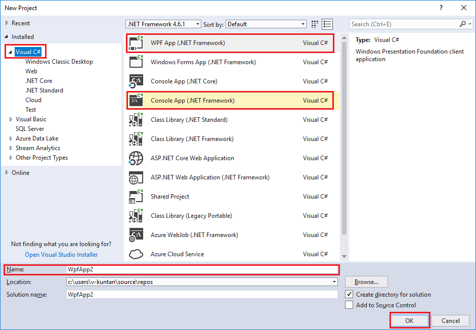
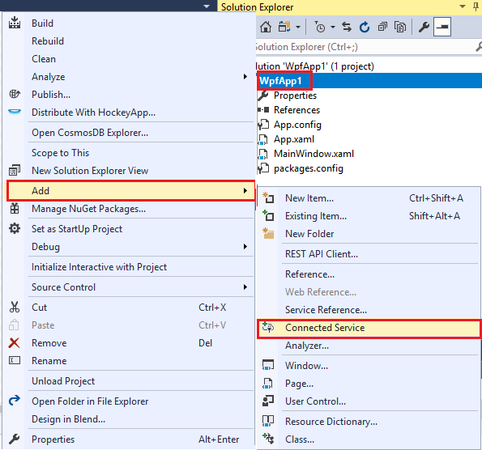
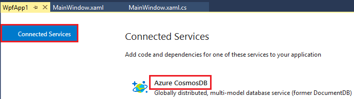
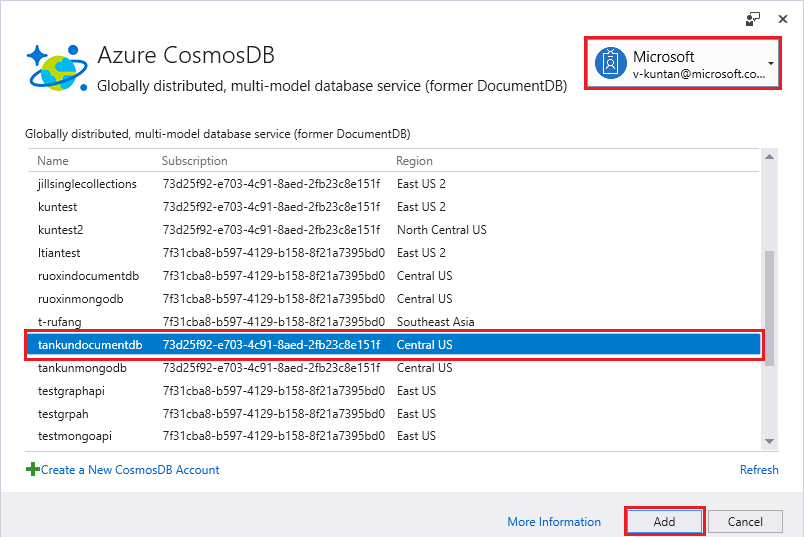
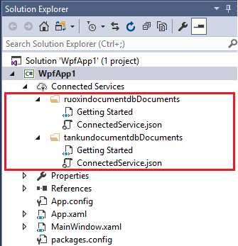
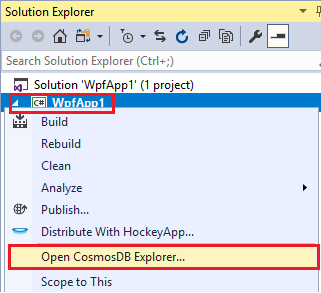
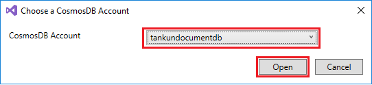
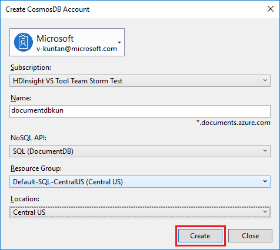

# Azure Cosmos DB: Visual Studio Connected Service for CosmosDB

Azure Cosmos DB is Microsoft’s globally distributed multi-model database service. You can quickly create and query document, key/value, and graph databases, at the core of Azure Cosmos DB through Visual Studio Connected Service. 

You can also use Data Explorer to create stored procedures, UDFs, and triggers to perform server-side business logic as well as scale throughput. Data Explorer exposes all of the built-in programmatic data access available in the APIs, but provides easy access to your data.

## Prerequisites

Please make sure you have the following:

* An active Azure account. If you don't have one, you can sign up for a [free account](https://azure.microsoft.com/free/). 
    * Alternatively, you can use the [Azure Cosmos DB Emulator](local-emulator.md)  if you'd like to use a local environment that emulates the Azure DocumentDB service for development purposes.
* [Visual Studio](http://www.visualstudio.com/).

## Create an Azure Cosmos DB account

Let's start by [creating an Azure Cosmos DB account](create-documentdb-dotnet.md) in the Azure portal or in our connected service tool.

> [!TIP]
> * Already have an Azure Cosmos DB account? If so, skip ahead to [Set up your Visual Studio solution](#SetupVS)
> * If you are using the Azure Cosmos DB Emulator, please follow the steps at [Azure Cosmos DB Emulator](local-emulator.md) to setup the emulator and skip ahead to [Set up your Visual Studio Solution](#SetupVS). 
>
>

## Set up your Visual Studio solution
1. Open **Visual Studio** on your computer.
2. On the **File** menu, select **New**, and then choose **Project**.
3. In the **New Project** dialog, select **Visual C#** / **Console App (.NET Framework)** or **WPF App (.NET Framework)** , name your project, and then click **OK**.
    

## Add Connected service and add account
1. Right click on Project node, select **Add** / **Connected Service** or click **Project** menu, select **Add Connected Service**.

    
2. In the connected service page, click **Connected Services** / **Azure CosmosDB** to open **Azure CosmosDB** page.

    
3. click down arrow to sign in for the first time or add an Account. After sign in, All CosmosDB accounts will be shown in the blank area. Choose one CosmosDB account to add to your project.
    
4. After added a CosmosDB account, a CosmosDB account connected service folder was added to the project. You can add more than one CosmosDB account through repeating step 1 to step 3.
    

## Open CosmosDB Explorer
1. Right click on Project node, select **Open CosmosDB Explorer...**.
    
2. In the **Choose a CosmosDB Account** page, click dropdownlist to select one CosmosDB account.
    
3. Click **Open**, then data explorer window will be shown.

## Create a New CosmosDB Account
1. In the connected service page, in the left bottom pane, click **Create a New CosmosDB Account** to open **Create CosmosDB Account** page.
    
2. On the **Create CosmosDB Account** blade, specify the configuration that you want for this Azure CosmosDB account.

* Complete the fields on the **Create CosmosDB Account** blade, using the information in the following screenshot as a guide. When you set up your account, choose unique values that do not match those in the screenshot. 

     
        
3. Click **Create** to create the account.

## Using Data Explorer

After open Data Explorer, we can Create and Delete database, Create and Delete Colletion, Create and Delete documents, Filter Document, Create and Delete Stored Procedure, Create and Delete Triggers, Create and Delete User Defined Function to perform server-side business logic. The usage of Data Explorer please refer to [CosmosDB docs on Microsoft website](https://docs.microsoft.com/en-us/azure/cosmos-db/).

