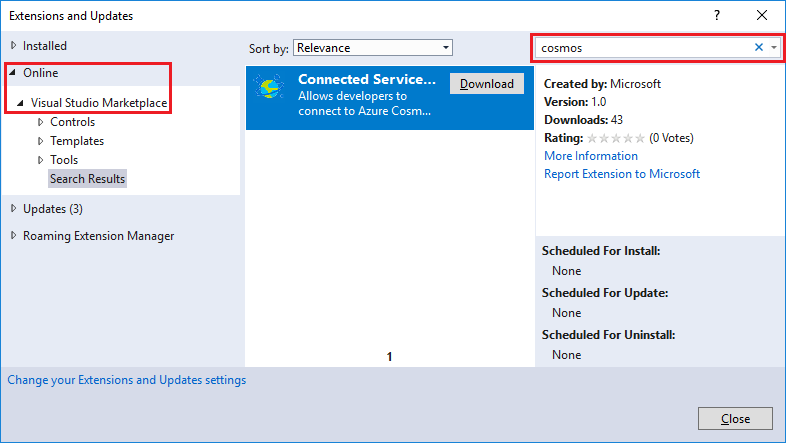
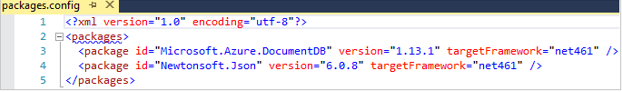
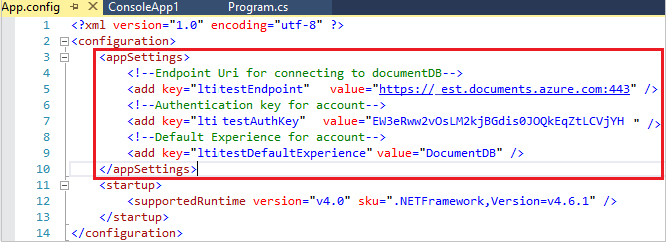
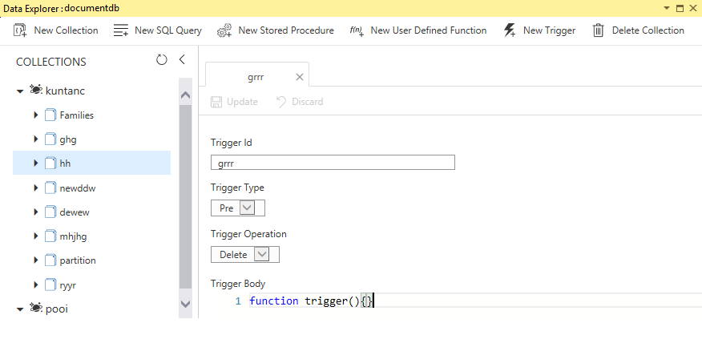

# Azure Cosmos DB: Visual Studio Connected Service

Visual Studio Connected Services enables developers to easily connect their Azure Cosmos DB account and manage their resources.

You can also use Data Explorer in Connected Service to create stored procedures, UDFs, and triggers to perform server-side business logic. Data Explorer exposes all the built-in programmatic data access available in the APIs, but provides easy access to your data.

## Prerequisites

Make sure you have the following items:

* An active Azure account. If you don't have one, you can sign up for a [free account](https://azure.microsoft.com/free/). 
    * If you want to use a local environment for development purposes, you can use the [Azure Cosmos DB Emulator](local-emulator.md). The environment emulates the Azure Cosmos DB service.
* Assume you already have an Azure Cosmos DB account. If not, follow the steps at [creating an Azure Cosmos DB account](create-documentdb-dotnet.md) to create one in Azure portal or [Create an Azure Cosmos DB account in Connected Service tool](#Create-an-Azure-Cosmo-DB-account-in-Connected-Service-tool). If so, skip ahead to [Set up your Visual Studio solution](#SetupVS)
* [Visual Studio](http://www.visualstudio.com/).
* Install the latest Azure Cosmos DB Connected Service bits. You can download Azure Cosmos DB connected service from Visual Studio marketplace according to below screen shot. Or you can install it from [Visual Studio Marketplace](https://go.microsoft.com/fwlink/?linkid=858709). Open **Visual Studio** in your computer. On the **Tools** menu, select **Extensions and update...**, and then choose **Online** / **Visual Studio Marketplace**. Enter **cosmosdb** to search the bits.

  
## Set up your Visual Studio solution
1. Open **Visual Studio** in your computer.
2. On the **File** menu, select **New**, and then choose **Project**.
3. In the **New Project** dialog, select **Visual C#** / **Console App (.NET Framework)** or **WPF App (.NET Framework)**, name your project, and then click **OK**.

    
## Add Connected Service and add account
1. Right click on the Project node, then select **Add** / **Connected Service**. Or click on the **Project** menu, and then select **Add Connected Service**.

    
2. In the connected service page, click **Connected Services** / **Azure Cosmos DB** to open the **Azure Cosmos DB** page.

    
3. Click the down arrow to sign in for the first time or add an account. After sign-in, all Azure Cosmos DB accounts are shown in the blank area. Choose one Azure Cosmos DB account to add to your project.

    
4. After you've added an Azure Cosmos DB account, an Azure Cosmos DB account connected service folder was added to the project. You can add more than one Azure Cosmos DB account through repeating step 1 to step 3.

    

5. When you have added an Azure Cosmos DB connected service, we would modify your project to enable access to Azure Cosmos DB database mainly in below two ways.

* Some nuget packages that are required by Azure Cosmos DB client are installed. You can see them from your packages configuration file. 

       
    
* Cosmos DB connection uri and key are added to project configuration file, in this case, App.config. 

     

## Open Azure Cosmos DB Explorer
1. Right click on Project node, select **Open Cosmos DB Explorer...**.

    
2. In the **Choose a Cosmos DB Account** page, click dropdown list to select one Azure Cosmos DB account.

    
3. Click **Open**, then data explorer window is shown.

## Create an Azure Cosmos DB account in Connected Service tool
1. In the connected service page, in the left bottom pane, click **Create a New Cosmos DB Account** to open **Create Cosmos DB Account** page.

    
2. On the **Create Cosmos DB Account** page, specify the configuration that you want for this Azure Cosmos DB account.

* Complete the fields on the **Create Cosmos DB Account** page, using information in the following screenshot as reference. 
 
           
3. Click **Create** to create the account.

## Use Data Explorer

After opening Data Explorer, we can Create and Delete database, Create, and Delete Collection. And Create and Delete documents, Filter Document, Create, and Delete Stored Procedure. We can also Create and Delete Triggers, Create, and Delete User-Defined Function to perform server-side business logic. For how to use Data Explorer, refers to [Azure Cosmos DB docs on Microsoft website](https://docs.microsoft.com/en-us/azure/cosmos-db/).

## Demo

Use Azure Cosmos DB Connected Service in Visual Studio(video): [Use Azure Cosmos DB Connected Service in Visual Studio](https://go.microsoft.com/fwlink/?linkid=858711)

## Next Steps
In this document, you've learned following items:

> [!div class="checklist"]
> * Create an Azure Cosmos DB account
> * Add Connected Service and add account
> * Open Azure Cosmos DB Explorer
> * Use Data Explorer

* Develop with the DocumentDB API in .NET [Develop with the DocumentDB API in .NET](tutorial-develop-documentdb-dotnet.md).
* DocumentDB API getting started tutorial [Azure Cosmos DB: DocumentDB API getting started tutorial](documentdb-get-started.md).
* Want to perform scale and performance testing with Azure Cosmos DB? See [Performance and Scale Testing with Azure Cosmos DB](performance-testing.md).
* Learn how to [Monitor an Azure Cosmos DB account](monitor-accounts.md).
* To learn more about Azure Cosmos DB, see [Welcome to Azure Cosmos DB](introduction.md).

