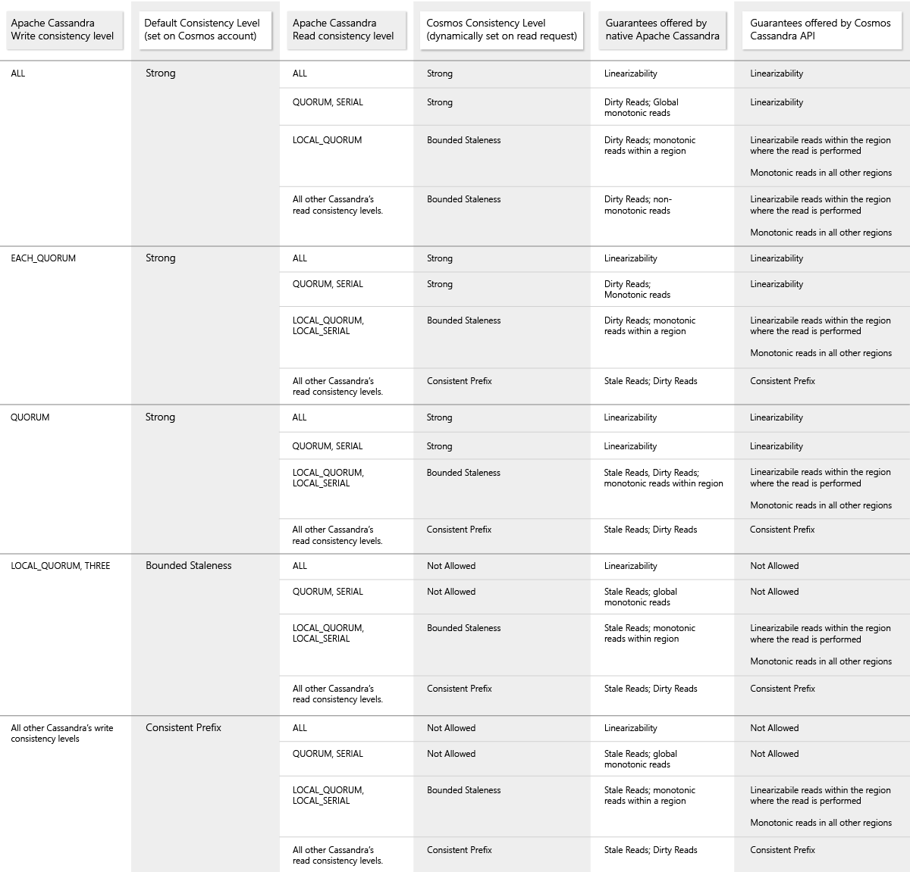
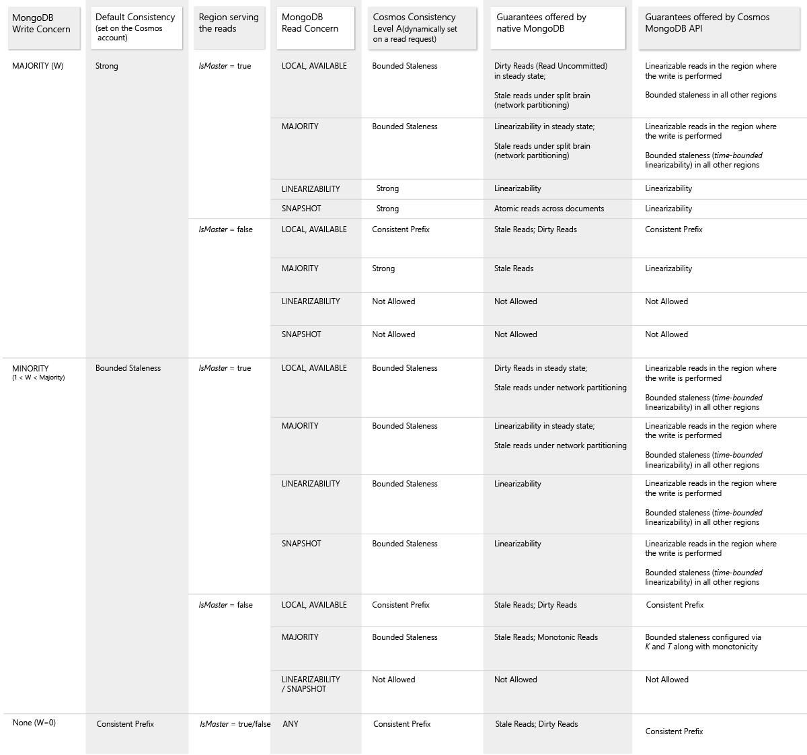

# Consistency levels and Azure Cosmos DB APIs

Azure Cosmos DB provides native support for wire protocol-compatible APIs for popular databases. These include MongoDB, Apache Cassandra, Gremlin, and Azure Table storage. These databases do not offer precisely defined consistency models or SLA-backed guarantees for the consistency levels. They typically provide only a subset of the five consistency models offered by Azure Cosmos DB. 

When using SQL API, Gremlin API, and Table API, the default consistency level configured on the Azure Cosmos account is used. 

When using Cassandra API or Azure Cosmos DB’s API for MongoDB, applications get a full set of consistency levels offered by Apache Cassandra and MongoDB, respectively, with even stronger consistency and durability guarantees. This document shows the corresponding Azure Cosmos DB consistency levels for Apache Cassandra and MongoDB consistency levels.

## Mapping between Apache Cassandra and Azure Cosmos DB consistency levels

Unlike AzureCosmos DB, Apache Cassandra does not natively provide precisely defined consistency guarantees.  Instead, Apache Cassandra provides a write consistency level and a read consistency level, to enable the high availability, consistency, and latency tradeoffs. When using Azure Cosmos DB’s Cassandra API: 

* The write consistency level of Apache Cassandra is mapped to the default consistency level configured on your Azure Cosmos account. 

* Azure Cosmos DB will dynamically map the read consistency level specified by the Cassandra client driver to one of the Azure Cosmos DB consistency levels configured dynamically on a read request. 

The following table illustrates how the native Cassandra consistency levels are mapped to the Azure Cosmos DB’s consistency levels when using Cassandra API:  

## Mapping between MongoDB and Azure Cosmos DB consistency levels

Unlike Azure Cosmos DB, the native MongoDB does not provide precisely defined consistency guarantees. Instead, native MongoDB allows users to configure the following consistency guarantees: a write concern, a read concern, and the isMaster directive - to direct the read operations to either primary or secondary replicas to achieve the desired consistency level. 

When using Azure Cosmos DB’s API for MongoDB, the MongoDB driver treats your write region as the primary replica and all other regions are read replica. You can choose which region associated with your Azure Cosmos account as a primary replica. 

While using Azure Cosmos DB’s API for MongoDB:

* The write concern is mapped to the default consistency level configured on your Azure Cosmos account.
 
* Azure Cosmos DB will dynamically map the read concern specified by the MongoDB client driver to one of the Azure Cosmos DB consistency levels that is configured dynamically on a read request. 

* You can annotate a specific region associated with your Azure Cosmos account as "Master" by making the region as the first writable region. 

The following table illustrates how the native MongoDB write/read concerns are mapped to the Azure Cosmos consistency levels when using Azure Cosmos DB’s API for MongoDB:

## Next steps

Read more about consistency levels and compatibility between Azure Cosmos DB APIs with the open-source APIs. See the following articles:

* [Availability and performance tradeoffs for various consistency levels](consistency-levels-tradeoffs.md)
* [MongoDB features supported by the Azure Cosmos DB's API for MongoDB](mongodb-feature-support.md)
* [Apache Cassandra features supported by the Azure Cosmos DB Cassandra API](cassandra-support.md)