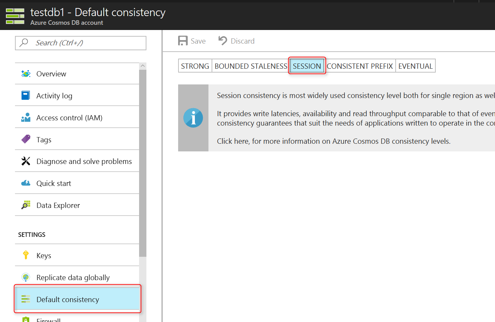

# Tunable data consistency levels in Azure Cosmos DB
Azure Cosmos DB is designed from the ground up with global distribution in mind for every data model. It is designed to offer predictable low latency guarantees and multiple well-defined relaxed consistency models. Currently, Azure Cosmos DB provides five consistency levels: strong, bounded-staleness, session, consistent prefix, and eventual. Bounded-staleness, session, consistent prefix, and eventual are referred to as "relaxed consistency models" as they provide less consistency than strong, which is the most highly consistent model available. 

Besides the **strong** and **eventual consistency** models commonly offered by distributed databases, Azure Cosmos DB offers three more carefully codified and operationalized consistency models: **bounded staleness**, **session**, and **consistent prefix**. The usefulness of each of these consistency levels has been validated against real world use cases. Collectively these five consistency levels enable you to make well-reasoned trade-offs between consistency, availability, and latency. 

In the following video, Azure Cosmos DB Program Manager Andrew Liu demonstrates the turnkey global distribution features.

>[!VIDEO https://www.youtube.com/embed/-4FsGysVD14]

## Distributed databases and consistency
Commercial distributed databases fall into two categories: databases that do not offer well-defined provable consistency choices at all, and databases that offer two extreme programmability choices (strong vs. eventual consistency). 

The former burdens application developers with minutia of their replication protocols and expects them to make difficult tradeoffs between consistency, availability, latency, and throughput. The latter puts a pressure to choose one of the two extremes. Despite the abundance of research and proposals for more than 50 consistency models, the distributed database community has not been able to commercialize consistency levels beyond strong and eventual consistency. Cosmos DB allows developers to choose between five well-defined consistency models along the consistency spectrum – strong, bounded staleness, [session](http://dl.acm.org/citation.cfm?id=383631), consistent prefix, and eventual. 

The following table illustrates the specific guarantees each consistency level provides.
 
**Consistency Levels and guarantees**

| Consistency Level	| Guarantees |
| --- | --- |
| Strong | Linearizability. Reads are guaranteed to return the most recent version of an item.|
| Bounded Staleness	| Consistent Prefix. Reads lag behind writes by at most k prefixes or t interval |
| Session	| Consistent Prefix. Monotonic reads, monotonic writes, read-your-writes, write-follows-reads |
| Consistent Prefix	| Updates returned are some prefix of all the updates, with no gaps |
| Eventual	| Out of order reads |

You can configure the default consistency level on your Cosmos DB account (and later override the consistency on a specific read request). Internally, the default consistency level applies to data within the partition sets, which may span regions. About 73% of Azure Cosmos DB tenants use session consistency and 20% prefer bounded staleness. Approximately 3% of Azure Cosmos DB customers experiment with various consistency levels initially before settling on a specific consistency choice for their application. Only 2% of Azure Cosmos DB tenants override consistency levels on a per request basis. 

In Cosmos DB, reads served at session, consistent prefix and eventual consistency are twice as cheap as reads with strong or bounded staleness consistency. Cosmos DB has industry leading comprehensive SLAs including consistency guarantees along with availability, throughput, and latency. Azure Cosmos DB employs a [linearizability checker](http://dl.acm.org/citation.cfm?id=1806634), which continuously operates over the service telemetry and openly reports any consistency violations to you. For bounded staleness, Azure Cosmos DB monitors and reports any violations to k and t bounds. For all five relaxed consistency levels, Azure Cosmos DB also reports the [probabilistically bounded staleness metric](http://dl.acm.org/citation.cfm?id=2212359) directly to you.  

## Service level agreements

Azure Cosmos DB offers comprehensive 99.99% [SLAs](https://azure.microsoft.com/support/legal/sla/cosmos-db/) which guarantee throughput, consistency, availability, and latency for Azure Cosmos DB database accounts scoped to a single Azure region configured with any of the five consistency levels, or database accounts spanning multiple Azure regions, configured with any of the four relaxed consistency levels. Furthermore, independent of the choice of a consistency level, Azure Cosmos DB offers a 99.999% SLA for read availability for database accounts spanning two or more Azure regions.

## Scope of consistency
The granularity of consistency is scoped to a single user request. A write request may correspond to an insert, replace, upsert, or delete transaction. As with writes, a read/query transaction is also scoped to a single user request. The user may be required to paginate over a large result-set, spanning multiple partitions, but each read transaction is scoped to a single page and served from within a single partition.

## Consistency levels
You can configure a default consistency level on your database account that applies to all containers (and databases) under your Cosmos DB account. By default, all reads and queries issued against the user-defined resources use the default consistency level specified on the database account. You can relax the consistency level of a specific read/query request using in each of the supported APIs. There are five types of consistency levels supported by the Azure Cosmos DB replication protocol that provide a clear trade-off between specific consistency guarantees and performance, as described in this section.

**Strong**: 

* Strong consistency offers a [linearizability](https://aphyr.com/posts/313-strong-consistency-models) guarantee with the reads guaranteed to return the most recent version of an item. 
* Strong consistency guarantees that a write is only visible after it is committed durably by the majority quorum of replicas. A write is either synchronously committed durably by both the primary and the quorum of secondaries, or it is aborted. A read is always acknowledged by the majority read quorum, a client can never see an uncommitted or partial write and is always guaranteed to read the latest acknowledged write. 
* Azure Cosmos DB accounts that are configured to use strong consistency cannot associate more than one Azure region with their Azure Cosmos DB account.  
* The cost of a read operation (in terms of [request units](request-units.md) consumed) with strong consistency is higher than session and eventual, but the same as bounded staleness.

**Bounded staleness**: 

* Bounded staleness consistency guarantees that the reads may lag behind writes by at most *K* versions or prefixes of an item or *t* time-interval. 
* Therefore, when choosing bounded staleness, the "staleness" can be configured in two ways: number of versions *K* of the item by which the reads lag behind the writes, and the time interval *t* 
* Bounded staleness offers total global order except within the "staleness window." The monotonic read guarantees exist within a region both inside and outside the "staleness window." 
* Bounded staleness provides a stronger consistency guarantee than session, consistent-prefix, or eventual consistency. For globally distributed applications, we recommend you use bounded staleness for scenarios where you would like to have strong consistency but also want 99.99% availability and low latency.   
* Azure Cosmos DB accounts that are configured with bounded staleness consistency can associate any number of Azure regions with their Azure Cosmos DB account. 
* The cost of a read operation (in terms of RUs consumed) with bounded staleness is higher than session and eventual consistency, but the same as strong consistency.

**Session**: 

* Unlike the global consistency models offered by strong and bounded staleness consistency levels, session consistency is scoped to a client session. 
* Session consistency is ideal for all scenarios where a device or user session is involved since it guarantees monotonic reads, monotonic writes, and read your own writes (RYW) guarantees. 
* Session consistency provides predictable consistency for a session, and maximum read throughput while offering the lowest latency writes and reads. 
* Azure Cosmos DB accounts that are configured with session consistency can associate any number of Azure regions with their Azure Cosmos DB account. 
* The cost of a read operation (in terms of RUs consumed) with session consistency level is less than strong and bounded staleness, but more than eventual consistency.

**Consistent Prefix**: 

* Consistent prefix guarantees that in absence of any further writes, the replicas within the group eventually converge. 
* Consistent prefix guarantees that reads never see out of order writes. If writes were performed in the order `A, B, C`, then a client sees either `A`, `A,B`, or `A,B,C`, but never out of order like `A,C` or `B,A,C`.
* Azure Cosmos DB accounts that are configured with consistent prefix consistency can associate any number of Azure regions with their Azure Cosmos DB account. 

**Eventual**: 

* Eventual consistency guarantees that in absence of any further writes, the replicas within the group eventually converge. 
* Eventual consistency is the weakest form of consistency where a client may get the values that are older than the ones it had seen before.
* Eventual consistency provides the weakest read consistency but offers the lowest latency for both reads and writes.
* Azure Cosmos DB accounts that are configured with eventual consistency can associate any number of Azure regions with their Azure Cosmos DB account. 
* The cost of a read operation (in terms of RUs consumed) with the eventual consistency level is the lowest of all the Azure Cosmos DB consistency levels.

## Configuring the default consistency level
1. In the [Azure portal](https://portal.azure.com/), in the Jumpbar, click **Azure Cosmos DB**.
2. In the **Azure Cosmos DB** page, select the database account to modify.
3. In the account page, click **Default consistency**.
4. In the **Default Consistency** page, select the new consistency level and click **Save**.
   
    

## Consistency levels for queries
By default, for user-defined resources, the consistency level for queries is the same as the consistency level for reads. By default, the index is updated synchronously on each insert, replace, or delete of an item to the Cosmos DB container. This enables the queries to honor the same consistency level as that of point reads. While Azure Cosmos DB is write optimized and supports sustained volumes of writes, synchronous index maintenance and serving consistent queries, you can configure certain containers to update their index lazily. Lazy indexing further boosts the write performance and is ideal for bulk ingestion scenarios when a workload is primarily read-heavy.  

| Indexing Mode | Reads | Queries |
| --- | --- | --- |
| Consistent (default) |Select from strong, bounded staleness, session, consistent prefix, or eventual |Select from strong, bounded staleness, session, or eventual |
| Lazy |Select from strong, bounded staleness, session, consistent prefix, or eventual |Eventual |
| None |Select from strong, bounded staleness, session, consistent prefix, or eventual |Not applicable |

As with read requests, you can lower the consistency level of a specific query request in each API.

## Consistency levels for the MongoDB API

Azure Cosmos DB currently implements MongoDB version 3.4, which has two consistency settings, strong and eventual. Because Azure Cosmos DB is multi-api, the consistency settings are applicable at the account level and enforcement of the consistency is controlled by each API.  Until MongoDB 3.6, there was no concept of a session consistency, so if you set a MongoDB API account to use session consistency, the consistency is downgraded to eventual when using MongoDB APIs. If you need a read-your-own-write guarantee for a MongoDB API account, the default consistency level for the account should be set to strong or bounded staleness.

## Next steps
If you'd like to do more reading about consistency levels and tradeoffs, we recommend the following resources:

* [Replicated Data Consistency explained through baseball (video) by Doug Terry](https://www.youtube.com/watch?v=gluIh8zd26I)
* [Replicated Data Consistency explained through baseball (whitepaper) by Doug Terry](http://research.microsoft.com/pubs/157411/ConsistencyAndBaseballReport.pdf)
* [Session Guarantees for Weakly Consistent Replicated Data](http://dl.acm.org/citation.cfm?id=383631)
* [Consistency Tradeoffs in Modern Distributed Database Systems Design: CAP is only part of the story](https://www.computer.org/web/csdl/index/-/csdl/mags/co/2012/02/mco2012020037-abs.html)
* [Probabilistic Bounded Staleness (PBS) for Practical Partial Quorums](http://vldb.org/pvldb/vol5/p776_peterbailis_vldb2012.pdf)
* [Eventual Consistent - Revisited](http://allthingsdistributed.com/2008/12/eventually_consistent.html)
* [The Load, Capacity, and Availability of Quorum Systems, SIAM Journal on Computing](http://epubs.siam.org/doi/abs/10.1137/S0097539795281232)
* [Line-up: a complete and automatic linearizability checker, Proceedings of the 2010 ACM SIGPLAN conference on Programming language design and implementation](http://dl.acm.org/citation.cfm?id=1806634)
* [Probabilistically bounded staleness for practical partial quorums](http://dl.acm.org/citation.cfm?id=2212359)
