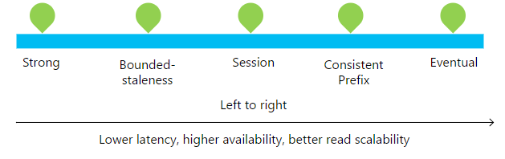
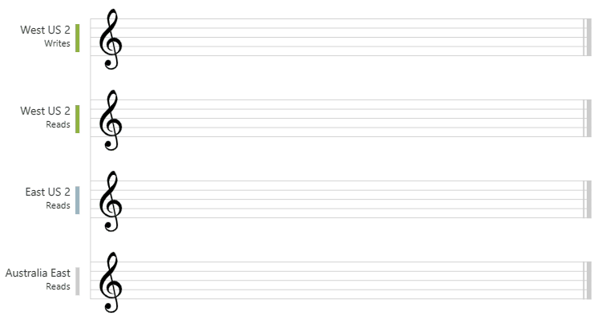
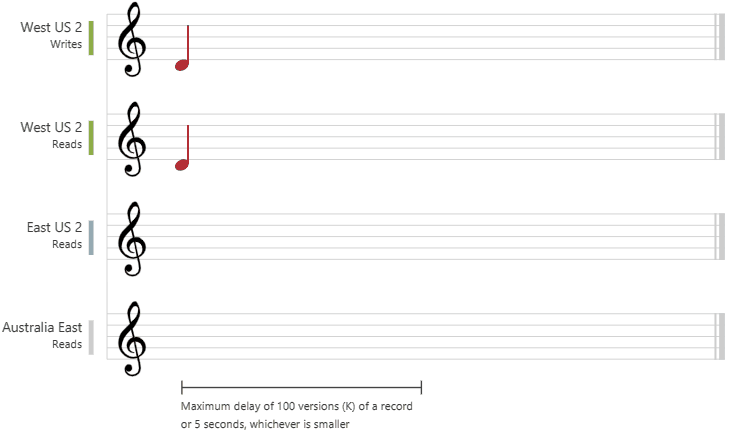

# Consistency levels in Azure Cosmos DB

Distributed databases that rely on replication for high availability, low latency, or both, make the fundamental tradeoff between the read consistency vs. availability, latency, and throughput. Most commercially available distributed databases ask developers to choose between the two extreme consistency models: *strong* consistency and *eventual* consistency. The linearizability of the strong consistency model is the gold standard of data programmability. But it adds a price of higher write latency (in steady state) and reduced availability (during failures). On the other hand, eventual consistency offers higher availability and better performance, but makes it hard to program applications.

Azure Cosmos DB approaches data consistency as a spectrum of choices instead of two extremes. Developers can use these options to make precise choices and granular tradeoffs with respect to high availability and performance.

With Azure Cosmos DB, developers can choose from five well-defined consistency levels on the consistency spectrum. These levels include *strong*, *bounded staleness*, *session*, *consistent prefix*, and *eventual* consistency. The levels are well-defined and intuitive and can be used for specific real-world scenarios. Each level provides [availability and performance tradeoffs](consistency-levels-tradeoffs.md) and are backed by SLAs. The following image shows the different consistency levels as a spectrum.

The consistency levels are region-agnostic and are guaranteed for all operations regardless of the region from which the reads and writes are served, the number of regions associated with your Azure Cosmos account, or whether your account is configured with a single or multiple write regions.

## Scope of the read consistency

Read consistency applies to a single read operation scoped within a logical partition. The read operation can be issued by a remote client or a stored procedure.

## Configure the default consistency level

You can configure the default consistency level on your Azure Cosmos account at any time. The default consistency level configured on your account applies to all Azure Cosmos databases and containers under that account. All reads and queries issued against a container or a database use the specified consistency level by default. To learn more, see how to [configure the default consistency level](how-to-manage-consistency.md#configure-the-default-consistency-level).

## Guarantees associated with consistency levels

The comprehensive SLAs provided by Azure Cosmos DB guarantee that 100 percent of read requests meet the consistency guarantee for any consistency level you choose. A read request meets the consistency SLA if all the consistency guarantees associated with the consistency level are satisfied. The precise definitions of the five consistency levels in Azure Cosmos DB using the TLA+ specification language are provided in the [azure-cosmos-tla](https://github.com/Azure/azure-cosmos-tla) GitHub repo.

The semantics of the five consistency levels are described here:

- **Strong**: Strong consistency offers a linearizability guarantee. Linearizability refers to serving requests concurrently. The reads are guaranteed to return the most recent committed version of an item. A client never sees an uncommitted or partial write. Users are always guaranteed to read the latest committed write.

  The following graphic illustrates the strong consistency with musical notes. After the data is written to the "West US 2" region, when you read the data from other regions, you get the most recent value:

  

- **Bounded staleness**: The reads are guaranteed to honor the consistent-prefix guarantee. The reads might lag behind writes by at most *"K"* versions (that is, "updates") of an item or by *"T"* time interval. In other words, when you choose bounded staleness, the "staleness" can be configured in two ways:

- The number of versions (*K*) of the item
- The time interval (*T*) by which the reads might lag behind the writes

Bounded staleness offers total global order outside of the "staleness window." When a client performs read operations within a region that accepts writes, the guarantees provided by bounded staleness consistency are identical to those guarantees by the strong consistency.

Inside the staleness window, Bounded Staleness provides the following consistency guarantees:

- Consistency for clients in the same region for a single-master account = Strong
- Consistency for clients in different regions for a single-master account = Consistent Prefix
- Consistency for clients writing to a single region for a multi-master account = Consistent Prefix
- Consistency for clients writing to different regions for a multi-master account = Eventual

  Bounded staleness is frequently chosen by globally distributed applications that expect low write latencies but require total global order guarantee. Bounded staleness is great for applications featuring group collaboration and sharing, stock ticker, publish-subscribe/queueing etc. The following graphic illustrates the bounded staleness consistency with musical notes. After the data is written to the "West US 2" region, the "East US 2" and "Australia East" regions read the written value based on the configured maximum lag time or the maximum operations:

  

- **Session**:  Within a single client session reads are guaranteed to honor the consistent-prefix, monotonic reads, monotonic writes, read-your-writes, and write-follows-reads guarantees. This assumes a single "writer" session or sharing the session token for multiple writers.

Clients outside of the session performing writes will see the following guarantees:

- Consistency for clients in same region for a single-master account = Consistent Prefix
- Consistency for clients in different regions for a single-master account = Consistent Prefix
- Consistency for clients writing to a single region for a multi-master account = Consistent Prefix
- Consistency for clients writing to multiple regions for a multi-master account = Eventual

  Session consistency is the most widely used consistency level for both single region as well as globally distributed applications. It provides write latencies, availability, and read throughput comparable to that of eventual consistency but also provides the consistency guarantees that suit the needs of applications written to operate in the context of a user. The following graphic illustrates the session consistency with musical notes. The "West US 2 writer" and the "West US 2 reader" are using the same session (Session A) so they both read the same data at the same time. Whereas the "Australia East" region is using "Session B" so, it receives data later but in the same order as the writes.

  

- **Consistent prefix**: Updates that are returned contain some prefix of all the updates, with no gaps. Consistent prefix consistency level guarantees that reads never see out-of-order writes.

If writes were performed in the order `A, B, C`, then a client sees either `A`, `A,B`, or `A,B,C`, but never out-of-order permutations like `A,C` or `B,A,C`. Consistent Prefix provides write latencies, availability, and read throughput comparable to that of eventual consistency, but also provides the order guarantees that suit the needs of scenarios where order is important. 

Below are the consistency guarantees for Consistent Prefix:

- Consistency for clients in same region for a single-master account = Consistent Prefix
- Consistency for clients in different regions for a single-master account = Consistent Prefix
- Consistency for clients writing to a single region for a multi-master account = Consistent Prefix
- Consistency for clients writing to multiple regions for a multi-master account = Eventual

The following graphic illustrates the consistency prefix consistency with musical notes. In all the regions, the reads never see out of order writes:

  

- **Eventual**: There's no ordering guarantee for reads. In the absence of any further writes, the replicas eventually converge.  
Eventual consistency is the weakest form of consistency because a client may read the values that are older than the ones it had read before. Eventual consistency is ideal where the application does not require any ordering guarantees. Examples include count of Retweets, Likes, or non-threaded comments. The following graphic illustrates the eventual consistency with musical notes.

  

## Additional reading

To learn more about consistency concepts, read the following articles:

- [High-level TLA+ specifications for the five consistency levels offered by Azure Cosmos DB](https://github.com/Azure/azure-cosmos-tla)
- [Replicated Data Consistency Explained Through Baseball (video) by Doug Terry](https://www.youtube.com/watch?v=gluIh8zd26I)
- [Replicated Data Consistency Explained Through Baseball (whitepaper) by Doug Terry](https://www.microsoft.com/research/publication/replicated-data-consistency-explained-through-baseball/)
- [Session guarantees for weakly consistent replicated data](https://dl.acm.org/citation.cfm?id=383631)
- [Consistency Tradeoffs in Modern Distributed Database Systems Design: CAP is Only Part of the Story](https://www.computer.org/csdl/magazine/co/2012/02/mco2012020037/13rRUxjyX7k)
- [Probabilistic Bounded Staleness (PBS) for Practical Partial Quorums](https://vldb.org/pvldb/vol5/p776_peterbailis_vldb2012.pdf)
- [Eventually Consistent - Revisited](https://www.allthingsdistributed.com/2008/12/eventually_consistent.html)

## Next steps

To learn more about consistency levels in Azure Cosmos DB, read the following articles:

- [Choose the right consistency level for your application](consistency-levels-choosing.md)
- [Consistency levels across Azure Cosmos DB APIs](consistency-levels-across-apis.md)
- [Availability and performance tradeoffs for various consistency levels](consistency-levels-tradeoffs.md)
- [Configure the default consistency level](how-to-manage-consistency.md#configure-the-default-consistency-level)
- [Override the default consistency level](how-to-manage-consistency.md#override-the-default-consistency-level)
