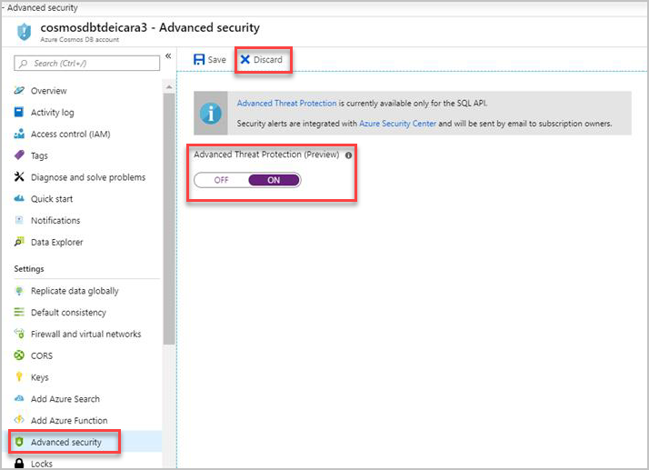
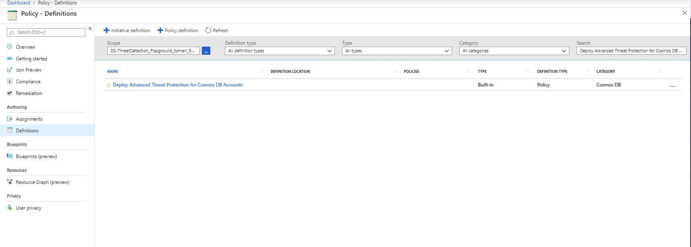
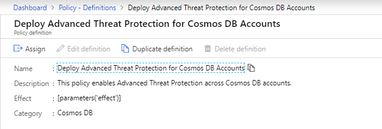
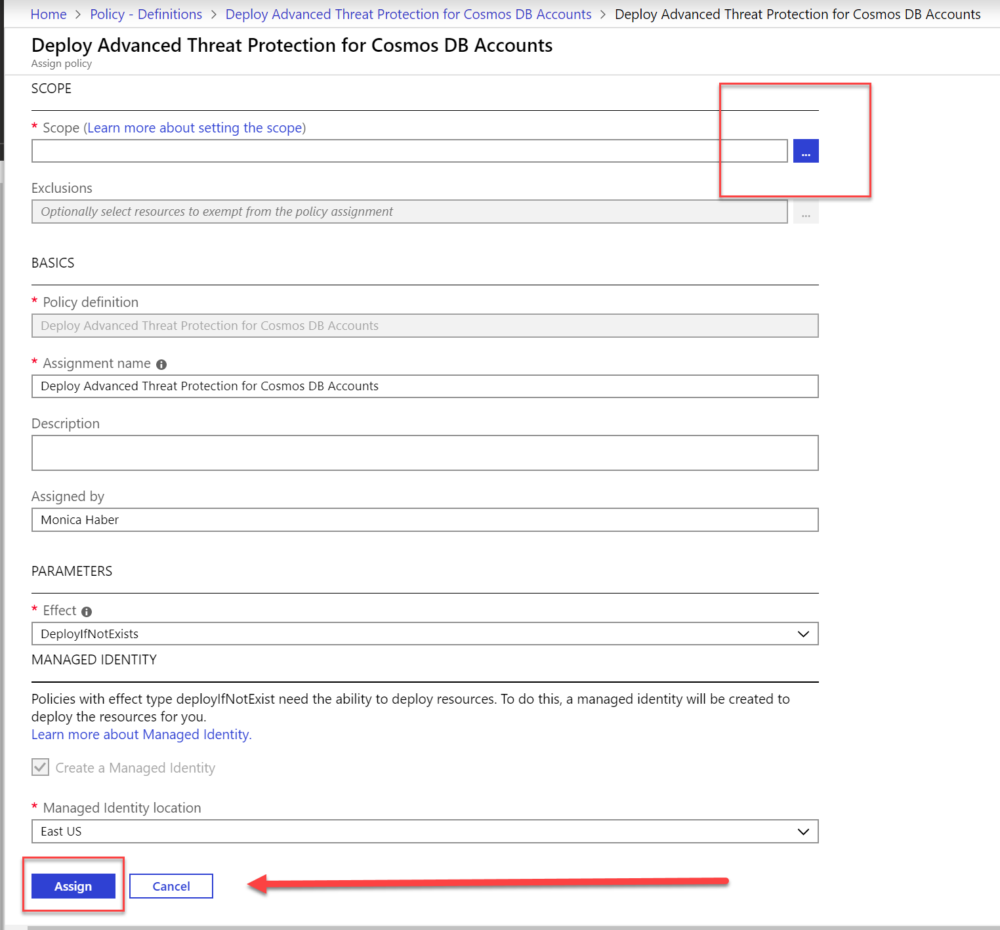
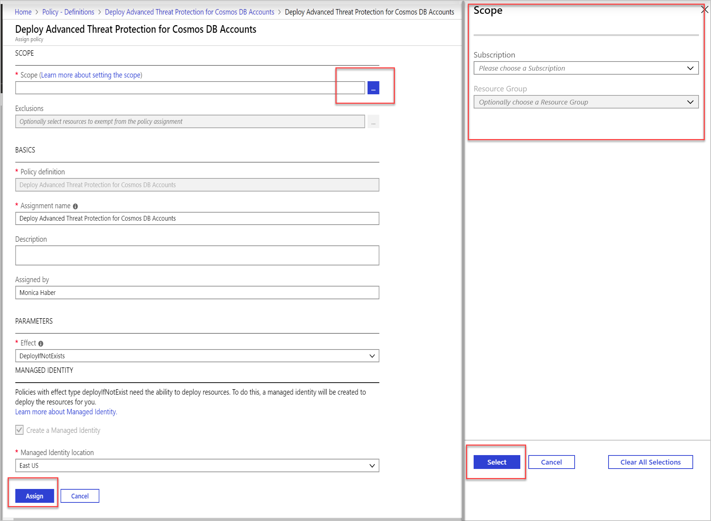

# Advanced Threat Protection for Azure Cosmos DB (Preview)

Advanced Threat Protection for Azure Cosmos DB provides an additional layer of security intelligence that detects unusual and potentially harmful attempts to access or exploit Azure Cosmos DB accounts. This layer of protection allows you to address threats, even without being a security expert, and integrate them with central security monitoring systems.

Security alerts are triggered when anomalies in activity occur. These security alerts are integrated with  [Azure Security Center](https://azure.microsoft.com/services/security-center/), and are also sent via email to subscription administrators, with details of the suspicious activity and recommendations on how to investigate and remediate the threats.

> [!NOTE]
>
> * Advanced Threat Protection for Azure Cosmos DB is currently available only for the SQL API.
> * Advanced Threat Protection for Azure Cosmos DB is currently not available in Azure government and sovereign cloud regions.

For a full investigation experience of the security alerts, we recommended enabling [diagnostic logging in Azure Cosmos DB](https://docs.microsoft.com/azure/cosmos-db/logging), which logs operations on the database itself, including CRUD operations on all documents, containers, and databases.

## Threat types

Advanced Threat Protection for Azure Cosmos DB detects anomalous activities indicating unusual and potentially harmful attempts to access or exploit databases. It can currently trigger the following alerts:

- **Access from unusual locations**: This alert is triggered when there is a change in the access pattern to an Azure Cosmos account, where someone has connected to the Azure Cosmos DB endpoint from an unusual geographical location. In some cases, the alert detects a legitimate action, meaning a new application or developer’s maintenance operation. In other cases, the alert detects a malicious action from a former employee, external attacker, etc.

- **Unusual data extraction**: This alert is triggered when a client is extracting an unusual amount of data from an Azure Cosmos DB account. This can be the symptom of some data exfiltration performed to transfer all the data stored in the account to an external data store.

## Configure Advanced Threat Protection

You can configure advanced threat protection in any of several ways, described in the following sections.

### [Portal](#tab/azure-portal)

1. Launch the Azure portal at  [https://portal.azure.com](https://portal.azure.com/).

2. From the Azure Cosmos DB account, from the **Settings** menu, select **Advanced security**.

    

3. In the **Advanced security** configuration blade:

    * Click the **Advanced Threat Protection** option to set it to **ON**.
    * Click **Save** to save the new or updated Advanced Threat Protection policy.   

### [REST API](#tab/rest-api)

Use Rest API commands to create, update, or get the Advanced Threat Protection setting for a specific Azure Cosmos DB account.

* [Advanced Threat Protection - Create](https://go.microsoft.com/fwlink/?linkid=2099745)
* [Advanced Threat Protection - Get](https://go.microsoft.com/fwlink/?linkid=2099643)

### [PowerShell](#tab/azure-powershell)

Use the following PowerShell cmdlets:

* [Enable Advanced Threat Protection](https://go.microsoft.com/fwlink/?linkid=2099607&clcid=0x409)
* [Get Advanced Threat Protection](https://go.microsoft.com/fwlink/?linkid=2099608&clcid=0x409)
* [Disable Advanced Threat Protection](https://go.microsoft.com/fwlink/?linkid=2099709&clcid=0x409)

### [ARM template](#tab/arm-template)

Use an Azure Resource Manager (ARM) template to set up Cosmos DB with Advanced Threat Protection enabled.
For more information, see
[Create a CosmosDB Account with Advanced Threat Protection](https://azure.microsoft.com/resources/templates/201-cosmosdb-advanced-threat-protection-create-account/).

### [Azure Policy](#tab/azure-policy)

Use an Azure Policy to enable Advanced Threat Protection for Cosmos DB.

1. Launch the Azure **Policy - Definitions** page, and search for the **Deploy Advanced Threat Protection for Cosmos DB** policy.

     

1. Click on the **Deploy Advanced Threat Protection for CosmosDB** policy, and then click **Assign**.

    

1. From the **Scope** field, click the three dots, select an Azure subscription or resource group, and then click **Select**.

    

1. Enter the other parameters, and click **Assign**.

## Manage ATP security alerts

When Azure Cosmos DB activity anomalies occur, a security alert is triggered with information about the suspicious security event. 

 From Azure Security Center, you can review and manage your current [security alerts](../security-center/security-center-alerts-overview.md).  Click on a specific alert in [Security Center](https://ms.portal.azure.com/#blade/Microsoft_Azure_Security/SecurityMenuBlade/0) to view possible causes and recommended actions to investigate and mitigate the potential threat. The following image shows an example of alert details provided in Security Center.

 

An email notification is also sent with the alert details and recommended actions. The following image shows an example of an alert email.

 

## Cosmos DB ATP alerts

 To see a list of the alerts generated when monitoring Azure Cosmos DB accounts, see the [Cosmos DB alerts](https://docs.microsoft.com/azure/security-center/alerts-reference#alerts-azurecosmos) section in the Azure Security Center documentation.

## Next steps

* Learn more about [Diagnostic logging in Azure Cosmos DB](cosmosdb-monitor-resource-logs.md)
* Learn more about [Azure Security Center](https://docs.microsoft.com/azure/security-center/security-center-intro)
