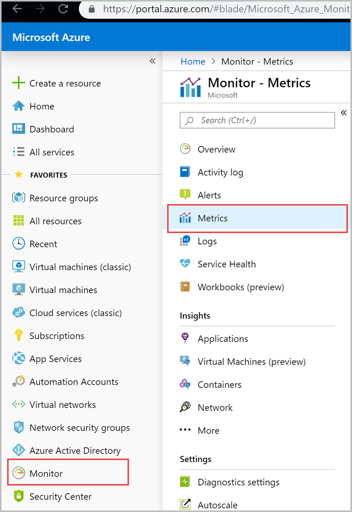

# Monitor and debug Azure Cosmos DB metrics from Azure Monitor

You can view Azure Cosmos DB metrics from Azure Monitor API. Azure Monitor provides several ways to interact with metrics, including the Azure portal, accessing them through the REST API, or querying them using PowerShell or CLI. Azure Cosmos DB metrics are low-latency numerical values, collected at one-minute frequency by default, you can also aggregate these metrics. These metrics are capable of supporting real-time scenarios.  

This article describes different Azure Cosmos DB metrics you can view from Azure Monitor using Azure portal. If you are interested in common use cases and how Azure Cosmos DB metrics re used to analyze and debug these issues see [Monitor and debug with metrics in Azure Cosmos DB](use-metrics.md) article. You will use one of your existing Azure Cosmos accounts and view the different metrics at the database, container, region, request, or operation levels. So, make sure you have an Azure Cosmos account with sample data and perform CRUD operations on that data.

## View metrics from Azure portal

1. Sign in to the [Azure portal](https://portal.azure.com/).

1. Select **Monitor** from the left-hand navigation bar, and select **Metrics**.

   

1. From the **Metrics** pane > **Select a resource** > choose the required **subscription**, and **resource group**. For the **Resource type**, select **Azure Cosmos DB accounts**, choose one of your existing Azure Cosmos accounts, and select **Apply**. 

   

1. Next you can select a metric from the list of available metrics. You can select metrics specific to request units, storage, latency, availability, Cassandra, and others. To learn in detail about all the available metrics in this list, see the [Metrics by category](#metrics-by-category) section of this article. In this example, let’s select **Request units** and **Avg** as the aggregation value. 

   In addition to these details, you can also select the **Time range** and **Time granularity** of the metrics. At max, you can view metrics for the past 30 days.  After you apply the filter, a chart is displayed based on your filter. You can see the average number of request units consumed per minute for the selected period.  

   

## Add filters to metrics

You can also filter metrics and the chart displayed by a specific **CollectionName**, **DatabaseName**, **OperationType**, **Region**, and **StatusCode**. To filter the metrics, select **Add filter** and choose the required property such as **OperationType** and select a value such as **Query**. The graph then displays the request units consumed for the query operation for the selected period. The operations executed via Stored procedure are not logged so they are not available under the OperationType metric.

You can group metrics by using the **Apply splitting** option. For example, you can group the request units per operation type and view the graph for all the operations at once as shown in the following image: 

## Metrics by category

### Request metrics
			
|Metric (Metric Display Name)|Unit (Aggregation Type) |Description|Dimensions| Time granularities| Legacy metric mapping | Usage |
|---|---|---|---| ---| ---| ---|
| TotalRequests (Total Requests) | Count (Count) | Number of requests made| DatabaseName, CollectionName, Region, StatusCode| All | TotalRequests, Http 2xx, Http 3xx, Http 400, Http 401, Internal Server error, Service Unavailable, Throttled Requests, Average Requests per Second | Used to monitor requests per status code, collection at a minute granularity. To get average requests per second, use Count aggregation at minute and divide by 60. |
| MetadataRequests (Metadata Requests) |Count (Count) | Count of metadata requests. Azure Cosmos DB maintains system metadata collection for each account, that allows you to enumerate collections, databases, etc., and their configurations, free of charge. | DatabaseName, CollectionName, Region, StatusCode| All| |Used to monitor throttles due to metadata requests.|
| MongoRequests (Mongo Requests) | Count (Count) | Number of Mongo Requests Made | DatabaseName, CollectionName, Region, CommandName, ErrorCode| All |Mongo Query Request Rate, Mongo Update Request Rate, Mongo Delete Request Rate, Mongo Insert Request Rate, Mongo Count Request Rate| Used to monitor Mongo request errors, usages per command type. |

### Request Unit metrics

|Metric (Metric Display Name)|Unit (Aggregation Type)|Description|Dimensions| Time granularities| Legacy metric mapping | Usage |
|---|---|---|---| ---| ---| ---|
| MongoRequestCharge (Mongo Request Charge) | Count (Total) |Mongo Request Units Consumed| DatabaseName, CollectionName, Region, CommandName, ErrorCode| All |Mongo Query Request Charge, Mongo Update Request Charge, Mongo Delete Request Charge, Mongo Insert Request Charge, Mongo Count Request Charge| Used to monitor Mongo resource RUs in a minute.|
| TotalRequestUnits (Total Request Units)| Count (Total) | Request Units consumed| DatabaseName, CollectionName, Region, StatusCode |All| TotalRequestUnits| Used to monitor Total RU usage at a minute granularity. To get average RU consumed per second, use Total aggregation at minute and divide by 60.|
| ProvisionedThroughput (Provisioned Throughput)| Count (Maximum) |Provisioned throughput at collection granularity| DatabaseName, CollectionName| 5M| | Used to monitor provisioned throughput per collection.|

### Storage metrics

|Metric (Metric Display Name)|Unit (Aggregation Type)|Description|Dimensions| Time granularities| Legacy metric mapping | Usage |
|---|---|---|---| ---| ---| ---|
| AvailableStorage (Available Storage) |Bytes (Total) | Total available storage reported at 5-minutes granularity per region| DatabaseName, CollectionName, Region| 5M| Available Storage| Used to monitor available storage capacity (applicable only for fixed storage collections) Minimum granularity should be 5 minutes.| 
| DataUsage (Data Usage) |Bytes (Total) |Total data usage reported at 5-minutes granularity per region| DatabaseName, CollectionName, Region| 5M |Data size | Used to monitor total data usage at collection and region, minimum granularity should be 5 minutes.|
| IndexUsage (Index Usage) | Bytes (Total) |Total Index usage reported at 5-minutes granularity per region| DatabaseName, CollectionName, Region| 5M| Index Size| Used to monitor total data usage at collection and region, minimum granularity should be 5 minutes. |
| DocumentQuota (Document Quota) | Bytes (Total) | Total storage quota reported at 5-minutes granularity per region.| DatabaseName, CollectionName, Region| 5M |Storage Capacity| Used to monitor total quota at collection and region, minimum granularity should be 5 minutes.|
| DocumentCount (Document Count) | Count (Total) |Total document count reported at 5-minutes granularity per region| DatabaseName, CollectionName, Region| 5M |Document Count|Used to monitor document count at collection and region, minimum granularity should be 5 minutes.|

### Latency metrics

|Metric (Metric Display Name)|Unit (Aggregation Type)|Description|Dimensions| Time granularities| Usage |
|---|---|---|---| ---| ---|
| ReplicationLatency (Replication Latency)| MilliSeconds (Minimum, Maximum, Average) | P99 Replication Latency across source and target regions for geo-enabled account| SourceRegion, TargetRegion| All | Used to monitor P99 replication latency between any two regions for a geo-replicated account. |

### Availability metrics

|Metric (Metric Display Name) |Unit (Aggregation Type)|Description| Time granularities| Legacy metric mapping | Usage |
|---|---|---|---| ---| ---|
| ServiceAvailability (Service Availability)| Percent (Minimum, Maximum) | Account requests availability at one hour granularity| 1H | Service Availability | Represents the percent of total passed requests. A request is considered to be failed due to system error if the status code is 410, 500 or 503 Used to monitor availability of the account at hour granularity. |

### Cassandra API metrics

|Metric (Metric Display Name)|Unit (Aggregation Type)|Description|Dimensions| Time granularities| Usage |
|---|---|---|---| ---| ---|
| CassandraRequests (Cassandra Requests) | Count (Count) | Number of Cassandra API requests made| DatabaseName, CollectionName, ErrorCode, Region, OperationType, ResourceType| All| Used to monitor Cassandra requests at a minute granularity. To get average requests per second, use Count aggregation at minute and divide by 60.|
| CassandraRequestCharges (Cassandra Request Charges) | Count (Sum, Min, Max, Avg) | Request Units consumed by Cassandra API requests| DatabaseName, CollectionName, Region, OperationType, ResourceType| All| Used to monitor RUs used per minute by a Cassandra API account.|
| CassandraConnectionClosures (Cassandra Connection Closures) |Count (Count) |Number of Cassandra Connections closed| ClosureReason, Region| All | Used to monitor the connectivity between clients and the Azure Cosmos DB Cassandra API.|

## Next steps

* [View and monitor metrics from Azure Cosmos DB account metrics pane](use-metrics.md)

* [Diagnostic logging in Azure Cosmos DB](logging.md)
