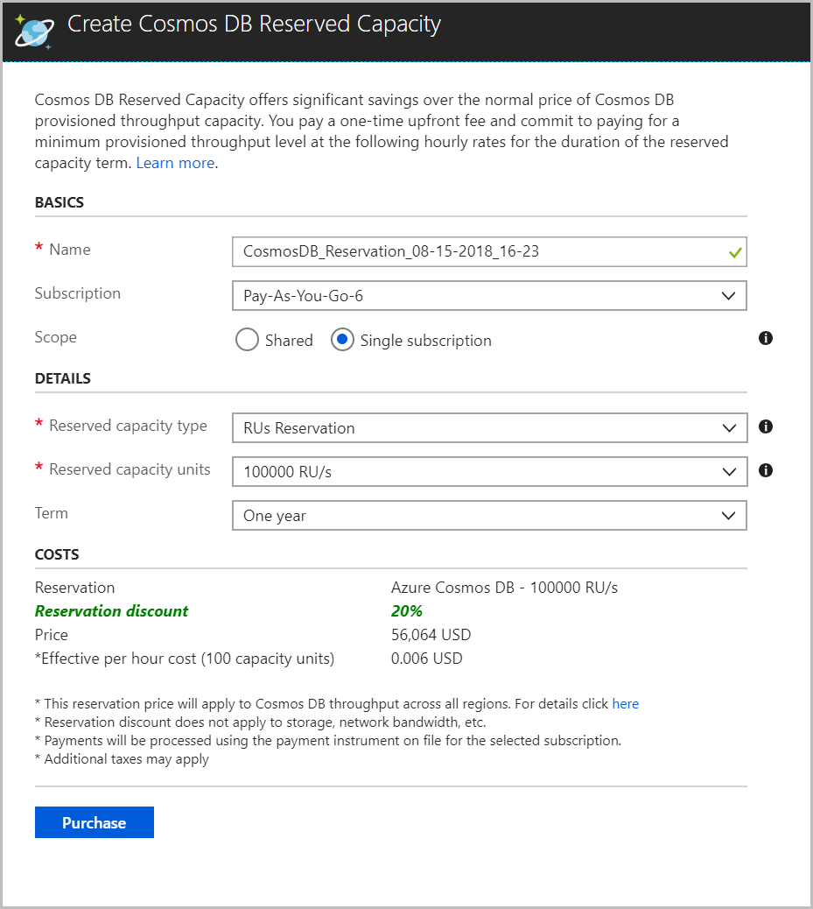
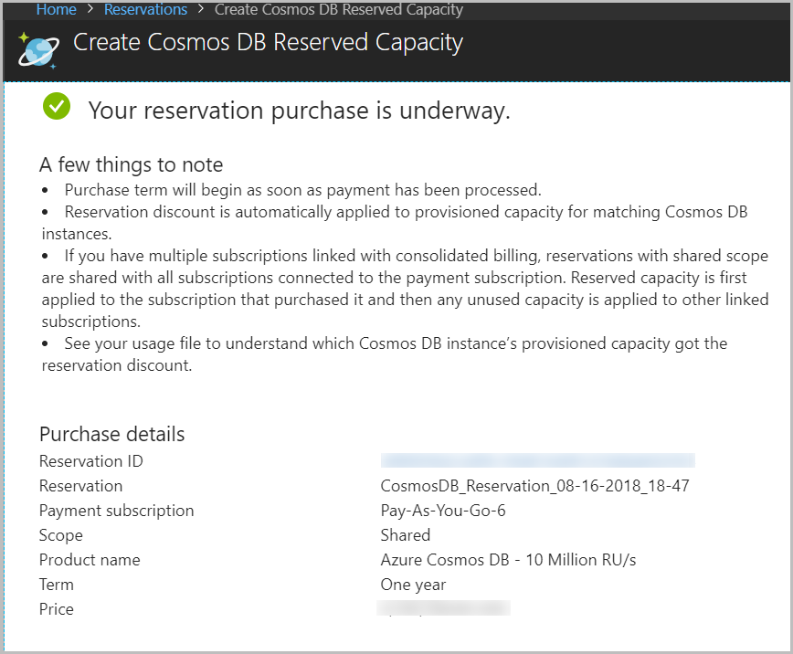

# Prepay for Azure Cosmos DB resources with reserved capacity

Azure Cosmos DB reserved capacity helps you save money by pre-paying for Azure Cosmos DB resources for either one year or three years. With Azure Cosmos DB reserved capacity, you can get a discount on the throughput provisioned for Cosmos DB resources. Examples of resources are databases and containers (tables, collections, and graphs).

Azure Cosmos DB reserved capacity can significantly reduce your Cosmos DB costs&mdash;up to 65 percent on regular prices with a one-year or three-year upfront commitment. Reserved capacity provides a billing discount and doesn't affect the runtime state of your Azure Cosmos DB resources.

Azure Cosmos DB reserved capacity covers throughput provisioned for your resources. It doesn't cover the storage and networking charges. As soon as you buy a reservation, the throughput charges that match the reservation attributes are no longer charged at the pay-as-you go rates. For more information on reservations, see the [Azure reservations](../billing/billing-save-compute-costs-reservations.md) article. 

You can buy Azure Cosmos DB reserved capacity from the [Azure portal](https://portal.azure.com). To buy reserved capacity:

* You must be in the Owner role for at least one Enterprise or Pay-As-You-Go subscription.  
* For Enterprise subscriptions, Azure reservation purchases must be enabled in the [EA portal](https://ea.azure.com/).  
* For the Cloud Solution Provider (CSP) program, only admin agents or sales agents can buy Azure Cosmos DB reserved capacity.

## Determine the required throughput before purchase

The size of the reservation should be based on the total amount of throughput that the existing or soon-to-be-deployed Azure Cosmos DB resources will use. You can determine the required throughput in the following ways:

* Get the historical data for the total provisioned throughput across your Azure Cosmos DB accounts, databases, and collections across all regions. For example, you can evaluate the daily average provisioned throughput by downloading your daily usage statement from `https://account.azure.com`.

* If you're an Enterprise Agreement (EA) customer, you can download your usage file to get the Azure Cosmos DB throughput details. Refer to the **Service Type** value in the **Additional info** section of the usage file.

* You can sum up the average throughput for all the workloads on your Azure Cosmos DB accounts that you expect to run for the next one or three years. You can then use that quantity for the reservation.

## Buy Azure Cosmos DB reserved capacity

1. Sign in to the [Azure portal](https://portal.azure.com).  

2. Select **All services** > **Reservations** > **Add**.  

3. From the **Select Product Type** pane, choose **Azure Cosmos DB** > **Select** to buy a new reservation.  

4. Fill in the required fields as described in the following table:

    

   |Field  |Description  |
   |---------|---------|
   |Name   |    Name of the reservation. This field is automatically populated with `CosmosDB_Reservation_<timeStamp>`. You can provide a different name while creating the reservation. Or you can rename it after the reservation is created.      |
   |Subscription  |   Subscription that's used to pay for the Azure Cosmos DB reserved capacity. The payment method on the selected subscription is used in charging the upfront costs. The subscription type must be one of the following:     [Enterprise Agreement](https://azure.microsoft.com/pricing/enterprise-agreement/) (offer number: MS-AZR-0017P): For an Enterprise subscription, the charges are deducted from the enrollment's monetary commitment balance or charged as overage.    [Pay-As-You-Go](https://azure.microsoft.com/offers/ms-azr-0003p/) (offer number: MS-AZR-0003P): For a Pay-As-You-Go subscription, the charges are billed to the credit card or invoice payment method on the subscription.    |
   |Scope   |  	Option that controls how many subscriptions can use the billing benefit associated with the reservation. It also controls how the reservation is applied to specific subscriptions.       If you select **Single subscription**, the reservation discount is applied to Azure Cosmos DB instances in the selected subscription.     If you select **Shared**, the reservation discount is applied to Azure Cosmos DB instances that run in any subscription within your billing context. The billing context is based on how you signed up for Azure. For enterprise customers, the shared scope is the enrollment and includes all subscriptions (except dev/test subscriptions) within the enrollment. For Pay-As-You-Go customers, the shared scope is all Pay-As-You-Go subscriptions created by the account administrator.     You can change the reservation scope after you buy the reserved capacity.  |
   |Reserved capacity type   |  Throughput provisioned as request units.|
   |Reserved capacity units  |  	Amount of throughput that you want to reserve. You can calculate this value by determining the throughput needed for all your Cosmos DB resources (for example, databases or containers) per region. You then multiply it by the number of regions that you'll associate with your Cosmos DB database.     For example: If you have five regions with 1 million RU/sec in every region, select 5 million RU/sec for the reservation capacity purchase.    |
   |Term  |   One year or three years.   |

5. Review the discount and the price of the reservation in the **Costs** section. This reservation price applies to Azure Cosmos DB resources with throughput provisioned across all regions.  

6. Select **Purchase**. You see the following page when the purchase is successful: 

    

After you buy a reservation, it's applied immediately to any existing Azure Cosmos DB resources that match the terms of the reservation. If you don’t have any existing Azure Cosmos DB resources, the reservation will apply when you deploy a new Cosmos DB instance that matches the terms of the reservation. In both cases, the period of the reservation starts immediately after a successful purchase. 

When your reservation expires, your Azure Cosmos DB instances continue to run and are billed at the regular pay-as-you-go rates.

## Next steps

The reservation discount is applied automatically to the Azure Cosmos DB resources that match the reservation scope and attributes. You can update the scope of the reservation through the Azure portal, PowerShell, Azure CLI, or the API.

*  To learn how reserved capacity discounts are applied to Azure Cosmos DB, see [Understand the Azure reservation discount](../billing/billing-understand-cosmosdb-reservation-charges.md).

* To learn more about Azure reservations, see the following articles:

   * [What are Azure reservations?](../billing/billing-save-compute-costs-reservations.md)  
   * [Manage Azure reservations](../billing/billing-manage-reserved-vm-instance.md)  
   * [Understand reservation usage for your Enterprise enrollment](../billing/billing-understand-reserved-instance-usage-ea.md)  
   * [Understand reservation usage for your Pay-As-You-Go subscription](../billing/billing-understand-reserved-instance-usage.md)
   * [Azure reservations in the Partner Center CSP program](https://docs.microsoft.com/partner-center/azure-reservations)

## Need help? Contact support

If you still have further questions, [contact support](https://portal.azure.com/?#blade/Microsoft_Azure_Support/HelpAndSupportBlade) to get your issue resolved quickly.

