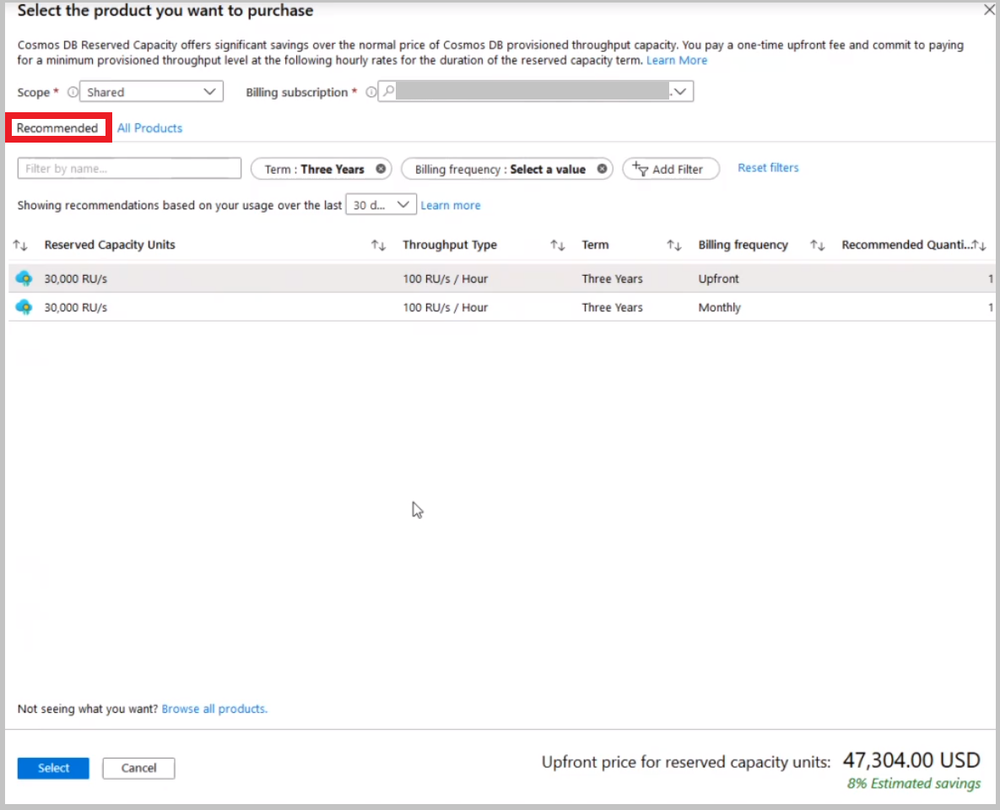
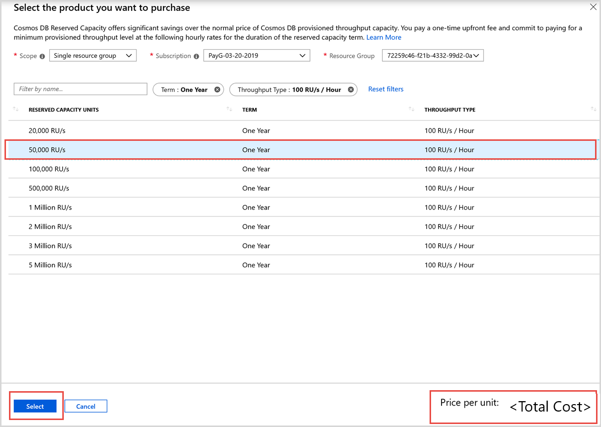
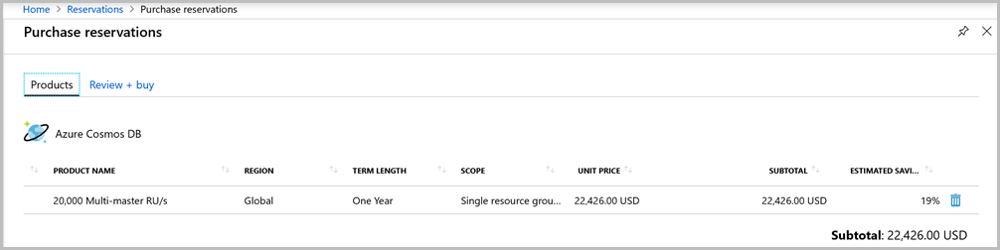

# Optimize cost with reserved capacity in Azure Cosmos DB

Azure Cosmos DB reserved capacity helps you save money by committing to a reservation for Azure Cosmos DB resources for either one year or three years. With Azure Cosmos DB reserved capacity, you can get a discount on the throughput provisioned for Cosmos DB resources. Examples of resources are databases and containers (tables, collections, and graphs).

Azure Cosmos DB reserved capacity can significantly reduce your Cosmos DB costs&mdash;up to 65 percent on regular prices with a one-year or three-year upfront commitment. Reserved capacity provides a billing discount and doesn't affect the runtime state of your Azure Cosmos DB resources.

Azure Cosmos DB reserved capacity covers throughput provisioned for your resources. It doesn't cover the storage and networking charges. As soon as you buy a reservation, the throughput charges that match the reservation attributes are no longer charged at the pay-as-you go rates. For more information on reservations, see the [Azure reservations](../cost-management-billing/reservations/save-compute-costs-reservations.md) article.

You can buy Azure Cosmos DB reserved capacity from the [Azure portal](https://portal.azure.com). Pay for the reservation [up front or with monthly payments](../cost-management-billing/reservations/monthly-payments-reservations.md). To buy reserved capacity:

* You must be in the Owner role for at least one Enterprise or individual  subscription with pay-as-you-go rates.  
* For Enterprise subscriptions, **Add Reserved Instances** must be enabled in the [EA portal](https://ea.azure.com). Or, if that setting is disabled, you must be an EA Admin on the subscription.
* For the Cloud Solution Provider (CSP) program, only admin agents or sales agents can buy Azure Cosmos DB reserved capacity.

## Determine the required throughput before purchase

The size of the reserved capacity purchase should be based on the total amount of throughput that the existing or soon-to-be-deployed Azure Cosmos DB resources will use on an hourly basis. For example: Purchase 30,000 RU/s reserved capacity if that's your consistent hourly usage pattern. In this example, any provisioned throughput above 30,000 RU/s will be billed using your Pay-as-you-go rate. If provisioned throughput is below 30,000 RU/s in an hour, then the extra reserved capacity for that hour will be wasted.

We calculate purchase recommendations based on your hourly usage pattern. Usage over last 7, 30 and 60 days is analyzed, and reserved capacity purchase that maximizes your savings is recommended. You can view recommended reservation sizes in the Azure portal using the following steps:

1. Sign in to the [Azure portal](https://portal.azure.com).  

2. Select **All services** > **Reservations** > **Add**.

3. From the **Purchase reservations** pane, choose **Azure Cosmos DB**.

4. Select the **Recommended** tab to view recommended reservations:

You can filter recommendations by the following attributes:

- **Term** (1 year or 3 years)
- **Billing frequency** (Monthly or Upfront)
- **Throughput Type** (RU's vs Multi-master RU's)

Additionally, you can scope recommendations to be within a single resource group, single subscription, or your entire Azure enrollment. 

Here's an example recommendation:

This recommendation to purchase a 30,000 RU/s reservation indicates that, among 3 year reservations, a 30,000 RU/s reservation size will maximize savings. In this case, the recommendation is calculated based on the past 30 days of Azure Cosmos DB usage. If this customer expects that the past 30 days of Azure Cosmos DB usage is representative of future use, they would maximize savings by purchasing a 30,000 RU/s reservation.

## Buy Azure Cosmos DB reserved capacity

1. Sign in to the [Azure portal](https://portal.azure.com).  

2. Select **All services** > **Reservations** > **Add**.  

3. From the **Purchase reservations** pane, choose **Azure Cosmos DB** to buy a new reservation.  

4. Fill in the required fields as described in the following table:

   

   |Field  |Description  |
   |---------|---------|
   |Scope   |  	Option that controls how many subscriptions can use the billing benefit associated with the reservation. It also controls how the reservation is applied to specific subscriptions.     If you select **Shared**, the reservation discount is applied to Azure Cosmos DB instances that run in any subscription within your billing context. The billing context is based on how you signed up for Azure. For enterprise customers, the shared scope is the enrollment and includes all subscriptions within the enrollment. For pay-as-you-go customers, the shared scope is all individual subscriptions with pay-as-you-go rates created by the account administrator.      If you select **Single subscription**, the reservation discount is applied to Azure Cosmos DB instances in the selected subscription.    If you select **Single resource group**, the reservation discount is applied to Azure Cosmos DB instances in the selected subscription and the selected resource group within that subscription.    You can change the reservation scope after you buy the reserved capacity.  |
   |Subscription  |   Subscription that's used to pay for the Azure Cosmos DB reserved capacity. The payment method on the selected subscription is used in charging the costs. The subscription must be one of the following types:     Enterprise Agreement (offer numbers: MS-AZR-0017P or MS-AZR-0148P): For an Enterprise subscription, the charges are deducted from the enrollment's monetary commitment balance or charged as overage.    Individual subscription with pay-as-you-go rates (offer numbers: MS-AZR-0003P or MS-AZR-0023P): For an individual subscription with pay-as-you-go rates, the charges are billed to the credit card or invoice payment method on the subscription.    |
   | Resource Group | Resource group to which the reserved capacity discount is applied. |
   |Term  |   One year or three years.   |
   |Throughput Type   |  Throughput is provisioned as request units. You can buy a reservation for the provisioned throughput for both setups - single region writes as well as multiple region writes. The throughput type has two values to choose from: 100 RU/s per hour and 100 Multi-master RU/s per hour.|
   | Reserved Capacity Units| The amount of throughput that you want to reserve. You can calculate this value by determining the throughput needed for all your Cosmos DB resources (for example, databases or containers) per region. You then multiply it by the number of regions that you'll associate with your Cosmos database. For example: If you have five regions with 1 million RU/sec in every region, select 5 million RU/sec for the reservation capacity purchase. |

5. After you fill the form, the price required to purchase the reserved capacity is calculated. The output also shows the percentage of discount you get with the chosen options. Next click **Select**

6. In the **Purchase reservations** pane, review the discount and the price of the reservation. This reservation price applies to Azure Cosmos DB resources with throughput provisioned across all regions.  

   

7. Select **Review + buy** and then **buy now**. You see the following page when the purchase is successful:

After you buy a reservation, it's applied immediately to any existing Azure Cosmos DB resources that match the terms of the reservation. If you don’t have any existing Azure Cosmos DB resources, the reservation will apply when you deploy a new Cosmos DB instance that matches the terms of the reservation. In both cases, the period of the reservation starts immediately after a successful purchase.

When your reservation expires, your Azure Cosmos DB instances continue to run and are billed at the regular pay-as-you-go rates.

## Cancel, exchange, or refund reservations

You can cancel, exchange, or refund reservations with certain limitations. For more information, see [Self-service exchanges and refunds for Azure Reservations](../cost-management-billing/reservations/exchange-and-refund-azure-reservations.md).

## Next steps

The reservation discount is applied automatically to the Azure Cosmos DB resources that match the reservation scope and attributes. You can update the scope of the reservation through the Azure portal, PowerShell, Azure CLI, or the API.

*  To learn how reserved capacity discounts are applied to Azure Cosmos DB, see [Understand the Azure reservation discount](../cost-management-billing/reservations/understand-cosmosdb-reservation-charges.md).

* To learn more about Azure reservations, see the following articles:

   * [What are Azure reservations?](../cost-management-billing/reservations/save-compute-costs-reservations.md)  
   * [Manage Azure reservations](../cost-management-billing/reservations/manage-reserved-vm-instance.md)  
   * [Understand reservation usage for your Enterprise enrollment](../cost-management-billing/reservations/understand-reserved-instance-usage-ea.md)  
   * [Understand reservation usage for your Pay-As-You-Go subscription](../cost-management-billing/reservations/understand-reserved-instance-usage.md)
   * [Azure reservations in the Partner Center CSP program](https://docs.microsoft.com/partner-center/azure-reservations)

## Need help? Contact us.

If you have questions or need help, [create a support request](https://portal.azure.com/#blade/Microsoft_Azure_Support/HelpAndSupportBlade/newsupportrequest).
