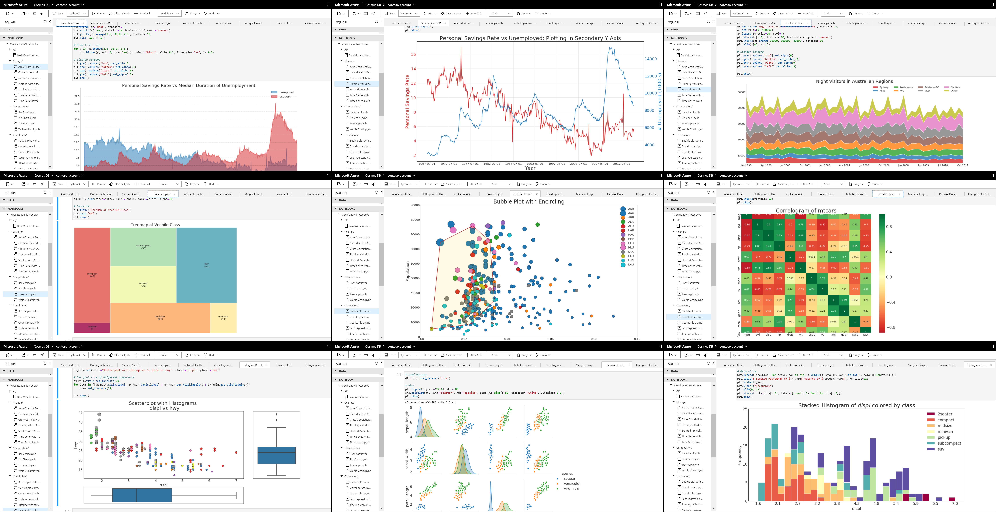
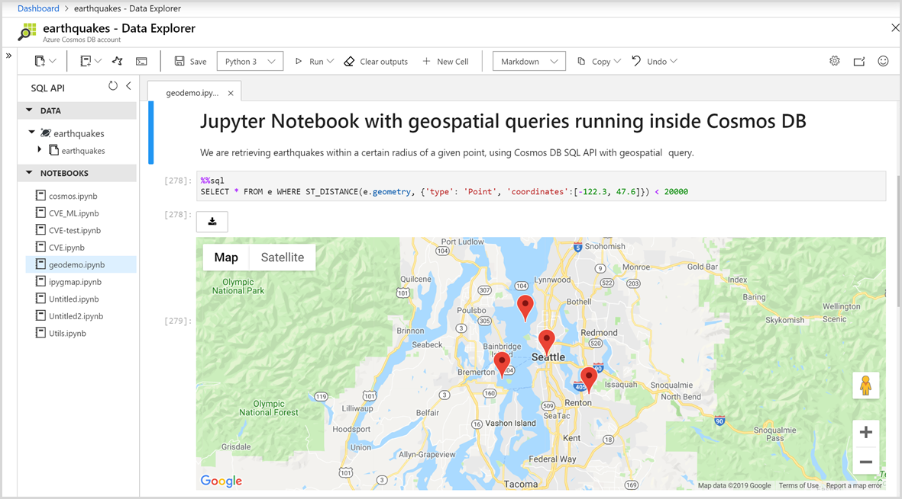

# Built-in Jupyter notebooks support in Azure Cosmos DB (preview)

Jupyter notebook is an open-source web application that allows you to create and share documents that contain live code, equations, visualizations, and narrative text. 

Azure Cosmos DB built-in Jupyter notebooks are directly integrated into the Azure portal and your Azure Cosmos DB accounts, making them convenient and easy to use. Developers, data scientists, engineers, and analysts can use the familiar Jupyter notebooks experience to do data exploration, data cleaning, data transformations, numerical simulations, statistical modeling, data visualization, and machine learning.

Azure Cosmos DB supports both C# and Python notebooks for all APIs, including Core (SQL), Cassandra, Gremlin, Table, and API for MongoDB. Inside the notebook, you can take advantage of built-in commands and features that make it easy to create Azure Cosmos DB resources, upload data, and query and visualize your data in Azure Cosmos DB. 

## Benefits of Jupyter notebooks

Jupyter notebooks were originally developed for data science applications written in Python and R. However, they can be used in various ways for different kinds of projects, including:

**Data visualization:** Jupyter notebooks allow you to visualize data in the form of a shared notebook that renders a data set as a graphic. You can create visualizations, make interactive changes to the shared code and data set, and share the results.

**Code sharing:** Services like GitHub provide ways to share code, but they're largely non-interactive. With a Jupyter notebook, you can view code, execute it, and display the results directly in the Azure portal.

**Live interactions with code:** Code in a Jupyter notebook is dynamic; you can edit it and run the updates incrementally in real time. You can also embed user controls (for example, sliders or text input fields) that are used as input sources for code, demos, or Proof of Concepts (POCs).

**Documentation of code samples and outcomes of data exploration:** If you have a piece of code and you want to explain line-by-line how it works, you can embed it in a Jupyter Notebook. You can add interactivity along with the documentation at the same time.

**Built-in commands for Azure Cosmos DB:** Azure Cosmos DB's built-in magic commands make it easy to interact with your account. You can use commands like %%upload and %%sql to upload data into a container and query it using [SQL API syntax](sql-query-getting-started.md). You don't need to write additional custom code.

**All in one place environment:** Jupyter notebooks combine code, rich text, images, videos, animations, mathematical equations, plots, maps, interactive figures, widgets, and graphical user interfaces into a single document.

## Components of a Jupyter notebook

Jupyter notebooks can include several types of components, each organized into discrete blocks or cells:

**Text and HTML:** Plain text, or text annotated in the markdown syntax to generate HTML, can be inserted into the document at any point. CSS styling can also be included inline or added to the template used to generate the notebook.

**Code and output:** Jupyter notebooks support Python and C# code. The results of the executed code appear immediately after the code blocks, and the code blocks can be executed multiple times in any order you like.

**Visualizations:** You can generate graphics and charts from the code by using modules like Matplotlib, Plotly, Bokeh, and others. Similar to the output, these visualizations appear inline next to the code that generates them. Similar to the output, these visualizations appear inline next to the code that generates them.

**Multimedia:** Because Jupyter notebooks are built on web technology, they can display all the types of multimedia supported by a web page. You can include them in a notebook as HTML elements, or you can generate them programmatically by using the `IPython.display` module.

**Data:** You can import the data from Azure Cosmos containers or the results of queries into a Jupyter notebook programmatically. Use built-in magic commands to upload or query data in Azure Cosmos DB. 

## Next steps

To get started with built-in Jupyter notebooks in Azure Cosmos DB, see the following articles:

* [Enable notebooks in an Azure Cosmos account](enable-notebooks.md)
* [Use Python notebook features and commands](use-python-notebook-features-and-commands.md)
* [Use C# notebook features and commands](use-csharp-notebook-features-and-commands.md)