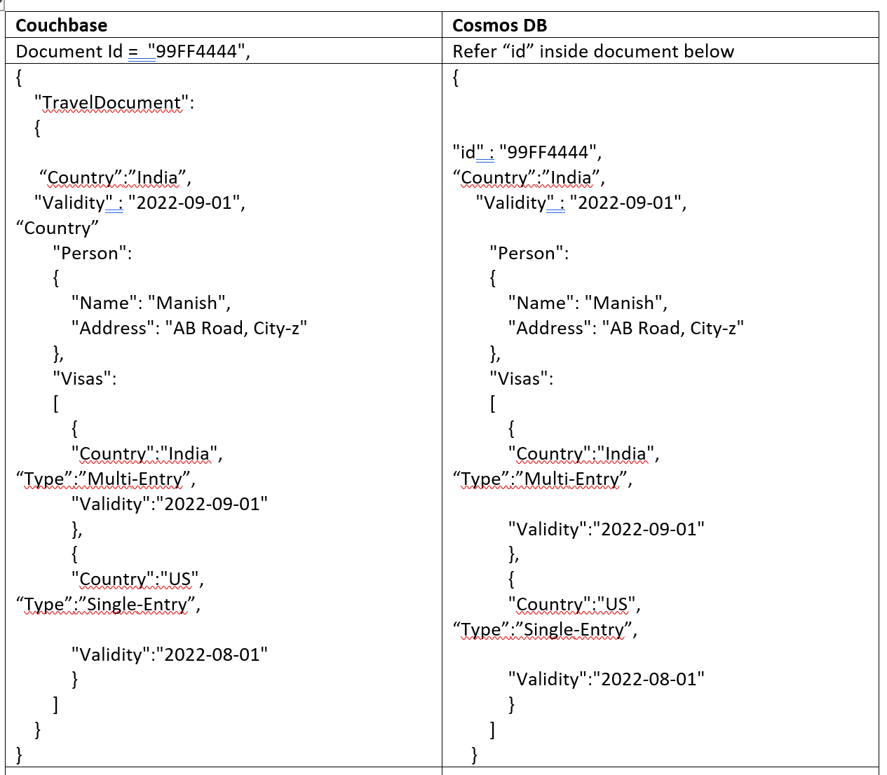

---
title: 'Migrate from CouchBase to Azure Cosmos DB SQL API'
description: Step-by-Step guidance for migrating from CouchBase to Azure Cosmos DB SQL API
ms.service: cosmos-db
ms.topic: conceptual
ms.date: 01/16/2020
ms.author: manishmsfte
author: manishmsfte
---
# Migrate from CouchBase to Azure Cosmos DB SQL API

This article provides instructions to migrate JAVA applications that are connecting to Couchbase and would like to migrate to SQL API account in Azure Cosmos DB.
## Introduction to Azure Cosmos DB
Azure Cosmos DB is massively scalable, globally distributed, fully managed database, which is built to provide guaranteed low latency access. To learn more about Azure Cosmos DB, see the [overview] (./introduction.md) article.

## Difference in nomenclature
The following are the key features that work differently in Azure Cosmos DB when compared to Couchbase:

|   Couchbase     |   Azure Cosmos DB   |
| ---------------|-------------------|
|Couchbase server| Account       |
|Bucket           | Database      |
|Bucket	          | Container/Collection |
|JSON Document	  | Item / Document |

## Key differences
1. Azure Cosmos DB will have “id” field inside the document as compared to Couchbase having it as part of bucket. Please note that the “id” field will be unique across the partition.
2. Azure Cosmos DB scales by using the partitioning/sharding technique, which means it will split the data into multiple shards/partitions. These partitions/shards are created based on the partition key property you provide. You can select the partition key to optimize read as well write operations or read/write optimized too. To learn more, see the [partitioning](./partition-data.md).
3. In Azure Cosmos DB, it is not required for the top-level hierarchy to denote the collection because the collection name already exists. This feature makes the JSON structure much simpler. LThe following is an example that shows differences in the data model between Couchbase and Azure Cosmos DB:




## SDK for Java Support
Azure Cosmos DB has following SDKs to support different Java frameworks:
1. Async SDK
2. Spring Boot SDK

Following is the guidance when to use which SDK. Let us consider an example where we have three types of workloads:

## Couchbase as document repository & sorubg data based custom queries
If the workload that you are migrating is based on Spring Boot Based SDK, then you can use the following steps:
**Step-1:** Add parent in the POM.xml:
```java
<parent>
   <groupId>org.springframework.boot</groupId>
   <artifactId>spring-boot-starter-parent</artifactId>
   <version>2.1.5.RELEASE</version>
   <relativePath/>
</parent>
```
**Step-1a:** Add properties in the POM:
```java
<azure.version>2.1.6</azure.version>
	Step-1b: Add Dependency in the POM:
<dependency>
    <groupId>com.microsoft.azure</groupId>
    <artifactId>azure-cosmosdb-spring-boot-starter</artifactId>
    <version>2.1.6</version>
</dependency>
```
**Step-2:** Add application.properties under resources and specify the following. Make sure to replace URL, key and database parameters:
```java
azure.cosmosdb.uri=your-cosmosDb-uri
    azure.cosmosdb.key=your-cosmosDb-key
    azure.cosmosdb.database=your-cosmosDb-dbName
```
**Step-3:** Define name of collection at the model, you can also specify further annotations for example, id, partitionkey to denote it explicitly:
```java
@Document(collection = "mycollection")
    public class User {
        @id
        private String id;
        private String firstName;
        @PartitionKey
        private String lastName;
    }
```
The following are the code snippets for CRUD operations:
### Insert / Update operation
Where _repo is the object of Repository & doc is the POJO class’s object, you can just use.save to insert or upsert (if document with specified id found). Consider the following code snippet:
```_repo.save(doc);```
### Delete Operation
Consider the following code snippet, where doc object will have Id & partition key mandatory to locate and delete the object:
```_repo.delete(doc);```
#### Read Operation
You can read the document with or without specifying the partition key. If you don’t specify the partition key then it is treated as a cross-partition query. Consider the following code samples, first one will perform operation using id and partition key field. Second example uses a regular field & without specifying the partition key field.
1.	```_repo.findByIdAndName(objDoc.getId(),objDoc.getName());```
2.	```_repo.findAllByStatus(objDoc.getStatus());```

That’s it, you can now playaround with Azure Cosmos DB.
Complete code sample is available in the [CouchbaseToCosmosDB-SpringCosmos](https://github.com/Azure-Samples/couchbaseTocosmosdb/tree/master/SpringCosmos) GitHub repo.

## Couchbase as a Document repository & using N1QL queries

N1QL queries is the way to define queries in the Couchbase.
|N1QL Query	Azure CosmosDB Query|
|-------------------|-------------------|
|SELECT META(`TravelDocument`).id AS id, `TravelDocument`.* FROM `TravelDocument` WHERE `_type` = "com.xx.xx.xx.xxx.xxx.xxxx " and country = 'India’ and ANY m in Visas SATISFIES m.type == 'Multi-Entry' and m.Country IN ['India', Bhutan’] ORDER BY ` Validity` DESC LIMIT 25 OFFSET 0	| SELECT c.id,c FROM c JOIN m in  c.country=’India’ WHERE c._type = " com.xx.xx.xx.xxx.xxx.xxxx" and c.country = 'India' and m.type = 'Multi-Entry' and m.Country IN ('India', 'Bhutan') ORDER BY c.Validity DESC OFFSET 0 LIMIT 25 |

You can notice the following changes in your N1QL queries:
1. You don’t need to use the META keyword or refer to first-level document. Instead you can create your own reference to the container. In this example, we have considered it as c (it can be anything whichever make sense to you). This reference is used as a prexi for all the first level fields, for example, c.id, c.country etc.
2. Instead of "ANY" now you can do a join on sub document and refer it with a dedicated alias such as "m". Note that once you have created alias for a subdocument you need to use alias, for example m.Country.
3. The sequence of OFFSET will be different in Azure Cosmos DB query, first you need to specify OFFSET then LIMIT. 
It is recommended not to use Spring Data SDK if you are using maximum custom defined queries as it will have unnecessary overhead at the client side while passing the query to Cosmos DB. Instead we have a direct ASYNC JAVA SDK, which can be utilized much efficiently in this case.

### Read operation
Use the Async Java SDK with the following steps:
**Step-1:** Configure the following dependency onto the POM file:
```java
<!-- https://mvnrepository.com/artifact/com.microsoft.azure/azure-cosmosdb -->
<dependency>
    <groupId>com.microsoft.azure</groupId>
    <artifactId>azure-cosmos</artifactId>
    <version>3.0.0</version>
</dependency>
```
**Step-2:** Create connection a object for Azure Cosmos DB by using the `ConnectionBuilder` method as shown in the following example. Make sure you put this declaration into the bean such that the following code should get executed only once):
```java
ConnectionPolicy cp=new ConnectionPolicy();
cp.connectionMode(ConnectionMode.DIRECT);

if(client==null)
	client= CosmosClient.builder()
			.endpoint(Host)//(Host, MasterKey, dbName, collName).Builder()
		    .connectionPolicy(cp)
		    .key(MasterKey)
		    .consistencyLevel(ConsistencyLevel.EVENTUAL)
		    .build();	

container = client.getDatabase(_dbName).getContainer(_collName);
```
**Step-3:** To execute the query, you need to run the following code snippet:
```java
Flux<FeedResponse<CosmosItemProperties>> objFlux= container.queryItems(query, fo);
```
Now, with the help of above method you can pass multiple queries and execute without any hassle. In case you have requirement to execute one large query, which can be split into multiple queries then try the following code snippet instead of the above one:
```java
for(SqlQuerySpec query:queries)
{
	objFlux= container.queryItems(query, fo);
	objFlux .publishOn(Schedulers.elastic())
					.subscribe(feedResponse->
						{
							if(feedResponse.results().size()>0)
							{
								_docs.addAll(feedResponse.results());
							}
							
						},
						Throwable::printStackTrace,latch::countDown);
		lstFlux.add(objFlux);
		}
						
		Flux.merge(lstFlux);
		latch.await();
}
```
With the previous code, you can run queries in parallel and increase the distributed executions to optimize. Further you can run the insert and update operations too:
### Insert operation
To insert the document, run the following code:
```java	
Mono<CosmosItemResponse> objMono= container.createItem(doc,ro);
```
Then subscribe to Mono as:
```java
CountDownLatch latch=new CountDownLatch(1);
objMono .subscribeOn(Schedulers.elastic())
        .subscribe(resourceResponse->
        {
	        if(resourceResponse.statusCode()!=successStatus)
		        {
			        throw new RuntimeException(resourceResponse.toString());
		        }
	        },
        Throwable::printStackTrace,latch::countDown);
latch.await();
				
```
### Upsert operation
Upsert operation requires you to specify the document which needs to be updated. To fetch the complete document you can use snippet mentioned under heading read operation then modify the required field(s). The below code snippet will upsert the document:
```java
Mono<CosmosItemResponse> obs= container.upsertItem(doc, ro);
```
Then subscribe to mono, refer mono subscription snippet in insert operation.

### Delete operation
Following snippet will do delete operation:
```java		
CosmosItem objItem= container.getItem(doc.Id, doc.Tenant);
Mono<CosmosItemResponse> objMono = objItem.delete(ro);
```
Then subscribe to mono, refer mono subscription snippet in insert operation.

Complete code sample is available in the [CouchbaseToCosmosDB-AsyncInSpring](https://github.com/Azure-Samples/couchbaseTocosmosdb/tree/master/AsyncInSpring) GitHub repo.

## Couchbase as a key/value pair
This is a simple type of workload in which you can perform lookups instead of queries. Use the following steps for key/value pairs:
**Step-1:** Consider having “/id” as primary key, which will makes sure you can perform lookup operation directly in the specific partition. Create collection and specify “/id” as partition key.

**Step-2:** Switch off the indexing completely. Because you will execute lookup operations, there is no point of carrying indexing overhead. To turn off indexing, sign into Azure Portal, goto Azure Cosmos DB Account. Open the **Data Explorer**, select your **Database** and the **Container**. Open the **Scale & Settings** tab and select the  **Indexing Policy**. Currently indexing policy looks like the following:
```
{
    "indexingMode": "consistent",
    "includedPaths": 
    [
        {
            "path": "/*",
            "indexes": 
            [
                {
                    "kind": "Range",
                    "dataType": "Number"
                },
                {
                    "kind": "Range",
                    "dataType": "String"
                },
                {
                    "kind": "Spatial",
                    "dataType": "Point"
                }
           ]
       }
    ],
    "excludedPaths": 
    [
        {
            "path": "/path/to/single/excluded/property/?"
        },
        {
            "path": "/path/to/root/of/multiple/excluded/properties/*"
        }
    ]
}
````

Replace the above indexing policy with the following policy:
```
{
    "indexingMode": "none"
}
```
**Step-3:** Use the following code snippet to create the connection object:
Connection Object (to be placed in @Bean or make it static):
```java
ConnectionPolicy cp=new ConnectionPolicy();
cp.connectionMode(ConnectionMode.DIRECT);

if(client==null)
	client= CosmosClient.builder()
			.endpoint(Host)//(Host, MasterKey, dbName, collName).Builder()
		    .connectionPolicy(cp)
		    .key(MasterKey)
		    .consistencyLevel(ConsistencyLevel.EVENTUAL)
		    .build();	

container = client.getDatabase(_dbName).getContainer(_collName);
````
Now you can execute the CRUD operations as follows:
#### Read operation
To read the item, use the following snippet:
```java        
CosmosItemRequestOptions ro=new CosmosItemRequestOptions();
ro.partitionKey(new PartitionKey(documentId));
CountDownLatch latch=new CountDownLatch(1);
		
var objCosmosItem= container.getItem(documentId, documentId);
Mono<CosmosItemResponse> objMono = objCosmosItem.read(ro);
objMono .subscribeOn(Schedulers.elastic())
        .subscribe(resourceResponse->
        {
	        if(resourceResponse.item()!=null)
	        {
		        doc= resourceResponse.properties().toObject(UserModel.class);
	        }
        },
        Throwable::printStackTrace,latch::countDown);
latch.await();
````

### Insert operation
To insert an item, you can perform the following code:
```java	
Mono<CosmosItemResponse> objMono= container.createItem(doc,ro);
```

Then subscribe to mono as:
```java
CountDownLatch latch=new CountDownLatch(1);
objMono.subscribeOn(Schedulers.elastic())
		.subscribe(resourceResponse->
		{
			if(resourceResponse.statusCode()!=successStatus)
				{
					throw new RuntimeException(resourceResponse.toString());
				}
			},
		Throwable::printStackTrace,latch::countDown);
latch.await();
```
### Upsert operation
To update the value of an item, refer the code snippet below:
```java
Mono<CosmosItemResponse> obs= container.upsertItem(doc, ro);
````
Then subscribe to mono, refer mono subscription snippet in insert operation.
### Delete operation
Following snippet to execute delete operation:
```java		
CosmosItem objItem= container.getItem(id, id);
Mono<CosmosItemResponse> objMono = objItem.delete(ro);
```
Then subscribe to mono, refer mono subscription snippet in insert operation.
Complete code sample is available in the [CouchbaseToCosmosDB-AsyncKeyValue](https://github.com/Azure-Samples/couchbaseTocosmosdb/tree/master/AsyncKeyValue) GitHub repo.
## Data Migration:
There are two ways to migrate data. 
1. Use Azure Data Factory: This is the most recommended method to migrate the data. Configure the source as Couchbase and sink as Azure Cosmos DB SQL API, see the Azure [Cosmos DB Data Factory connector](../data-factory/connector-azure-cosmos-db.md) article for detailed steps.
2. Use the Azure Cosmos DB data import tool: This option is recommended to migrate using VMs with less amount of data. For detailed steps, see the [Data importer](./import-data.md) article.

## Next Steps
1. To do performance testing, see [Performance and scale testing with Azure Cosmos DB] (./performance-testing.md) article.
2. To optimize the code, see [Performance tips for Azure Cosmos DB] (./performance-tips-async-java.md) article.
3. Explore Java Async SDK V3, [SDK reference] (https://github.com/Azure/azure-cosmosdb-java/tree/v3) github repo.	
