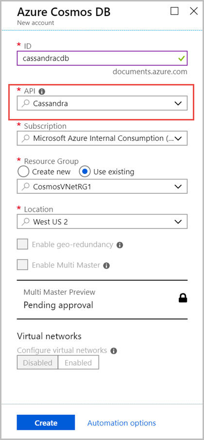

# Tutorial: Create a Cassandra API account in Azure Cosmos DB by using a Java application to store key/value data

As a developer, you might have applications that use key/value pairs. You can use a Cassandra API account in Azure Cosmos DB to store the key/value data. This tutorial describes how to use a Java application to create a Cassandra API account in Azure Cosmos DB, add a database (also called a keyspace), and add a table. The Java application uses the [Java driver](https://github.com/datastax/java-driver) to create a user database that contains details such as user ID, user name, and user city.  

This tutorial covers the following tasks:

> [!div class="checklist"]
> * Create a Cassandra database account
> * Get the account connection string
> * Create a Maven project and dependencies
> * Add a database and a table
> * Run the app

## Prerequisites 

* If you don't have an Azure subscription, create a [free account](https://azure.microsoft.com/free/?ref=microsoft.com&utm_source=microsoft.com&utm_medium=docs&utm_campaign=visualstudio) before you begin. 

* Get the latest version of [Java Development Kit (JDK)](https://aka.ms/azure-jdks). 

* [Download](https://maven.apache.org/download.cgi) and [install](https://maven.apache.org/install.html) the [Maven](https://maven.apache.org/) binary archive. 
  - On Ubuntu, you can run `apt-get install maven` to install Maven. 

## Create a database account 

1. Sign in to the [Azure portal](https://portal.azure.com/). 

2. Select **Create a resource** > **Databases** > **Azure Cosmos DB**. 

3. In the **New account** pane, enter the settings for the new Azure Cosmos account. 

   |Setting   |Suggested value  |Description  |
   |---------|---------|---------|
   |ID   |   Enter a unique name    | Enter a unique name to identify this Azure Cosmos account. <br/><br/>Because cassandra.cosmosdb.azure.com is appended to the ID that you provide to create your contact point, use a unique but identifiable ID.         |
   |API    |  Cassandra   |  The API determines the type of account to create. <br/> Select **Cassandra**, because in this article you will create a wide-column database that can be queried by using Cassandra Query Language (CQL) syntax.  |
   |Subscription    |  Your subscription        |  Select Azure subscription that you want to use for this Azure Cosmos account.        |
   |Resource Group   | Enter a name    |  Select **Create New**, and then enter a new resource-group name for your account. For simplicity, you can use the same name as your ID.    |
   |Location    |  Select the region closest to your users    |  Select the geographic location in which to host your Azure Cosmos account. Use the location that's closest to your users, to give them the fastest access to the data.    |

   

4. Select **Create**. <br/>The account creation takes a few minutes. After the resource is created, you can see the **Deployment succeeded** notification on the right side of the portal.

## Get the connection details of your account  

Get the connection string information from the Azure portal, and copy it into the Java configuration file. The connection string enables your app to communicate with your hosted database. 

1. From the [Azure portal](https://portal.azure.com/), go to your Azure Cosmos account. 

2. Open the **Connection String** pane.  

3. Copy the **CONTACT POINT**, **PORT**, **USERNAME**, and **PRIMARY PASSWORD** values to use in the next steps.

## Create the project and the dependencies 

The Java sample project that you use in this article is hosted in GitHub. You can run the steps in this doc or download the sample from the [azure-cosmos-db-cassandra-java-getting-started](https://github.com/Azure-Samples/azure-cosmos-db-cassandra-java-getting-started) repository. 

After you download the files, update the connection string information within the `java-examples\src\main\resources\config.properties` file and run it.  

```java
cassandra_host=<FILLME_with_CONTACT POINT> 
cassandra_port = 10350 
cassandra_username=<FILLME_with_USERNAME> 
cassandra_password=<FILLME_with_PRIMARY PASSWORD> 
```

Use the following steps to build the sample from scratch: 

1. From the terminal or command prompt, create a new Maven project called Cassandra-demo. 

   ```bash
   mvn archetype:generate -DgroupId=com.azure.cosmosdb.cassandra -DartifactId=cassandra-demo -DarchetypeArtifactId=maven-archetype-quickstart -DinteractiveMode=false 
   ```
 
2. Locate the `cassandra-demo` folder. Using a text editor, open the `pom.xml` file that was generated. 

   Add the Cassandra dependencies and build plugins required by your project, as shown in the [pom.xml](https://github.com/Azure-Samples/azure-cosmos-db-cassandra-java-getting-started/blob/master/java-examples/pom.xml) file.  

3. Under the `cassandra-demo\src\main` folder, create a new folder named `resources`.  Under the resources folder, add the config.properties and log4j.properties files:

   - The [config.properties](https://github.com/Azure-Samples/azure-cosmos-db-cassandra-java-getting-started/blob/master/java-examples/src/main/resources/config.properties) file stores the connection endpoint and key values of the Cassandra API account. 
   
   - The [log4j.properties](https://github.com/Azure-Samples/azure-cosmos-db-cassandra-java-getting-started/blob/master/java-examples/src/main/resources/log4j.properties) file defines the level of logging required for interacting with the Cassandra API.  

4. Browse to the `src/main/java/com/azure/cosmosdb/cassandra/` folder. Within the cassandra folder, create another folder named `utils`. The new folder stores the utility classes required to connect to the Cassandra API account. 

   Add the [CassandraUtils](https://github.com/Azure-Samples/azure-cosmos-db-cassandra-java-getting-started/blob/master/java-examples/src/main/java/com/azure/cosmosdb/cassandra/util/CassandraUtils.java) class to create the cluster and to open and close Cassandra sessions. The cluster connects to the Cassandra API account in Azure Cosmos DB and returns a session to access. Use the [Configurations](https://github.com/Azure-Samples/azure-cosmos-db-cassandra-java-getting-started/blob/master/java-examples/src/main/java/com/azure/cosmosdb/cassandra/util/Configurations.java) class to read connection string information from the config.properties file. 

5. The Java sample creates a database with user information such as user name, user ID, and user city. You need to define get and set methods to access user details in the main function.
 
   Create a [User.java](https://github.com/Azure-Samples/azure-cosmos-db-cassandra-java-getting-started/blob/master/java-examples/src/main/java/com/azure/cosmosdb/cassandra/User.java) class under the `src/main/java/com/azure/cosmosdb/cassandra/` folder with get and set methods. 

## Add a database and a table  

This section describes how to add a database (keyspace) and a table, by using CQL.

1. Under the `src\main\java\com\azure\cosmosdb\cassandra` folder, create a new folder named `repository`. 

2. Create the `UserRepository` Java class and add the following code to it: 

   ```java
   package com.azure.cosmosdb.cassandra.repository; 
   import java.util.List; 
   import com.datastax.driver.core.BoundStatement; 
   import com.datastax.driver.core.PreparedStatement; 
   import com.datastax.driver.core.Row; 
   import com.datastax.driver.core.Session; 
   import org.slf4j.Logger; 
   import org.slf4j.LoggerFactory; 
   
   /** 
    * Create a Cassandra session 
    */ 
   public class UserRepository { 
   
       private static final Logger LOGGER = LoggerFactory.getLogger(UserRepository.class); 
       private Session session; 
       public UserRepository(Session session) { 
           this.session = session; 
       } 
   
       /** 
       * Create keyspace uprofile in cassandra DB 
        */ 
   
       public void createKeyspace() { 
            final String query = "CREATE KEYSPACE IF NOT EXISTS uprofile WITH REPLICATION = { 'class' : 'NetworkTopologyStrategy', 'datacenter1' : 1 }"; 
           session.execute(query); 
           LOGGER.info("Created keyspace 'uprofile'"); 
       } 
   
       /** 
        * Create user table in cassandra DB 
        */ 
   
       public void createTable() { 
           final String query = "CREATE TABLE IF NOT EXISTS uprofile.user (user_id int PRIMARY KEY, user_name text, user_bcity text)"; 
           session.execute(query); 
           LOGGER.info("Created table 'user'"); 
       } 
   } 
   ```

3. Locate the `src\main\java\com\azure\cosmosdb\cassandra` folder, and create a new subfolder named `examples`.

4. Create the `UserProfile` Java class. This class contains the main method that calls the createKeyspace and createTable methods you defined earlier: 

   ```java
   package com.azure.cosmosdb.cassandra.examples; 
   import java.io.IOException; 
   import com.azure.cosmosdb.cassandra.repository.UserRepository; 
   import com.azure.cosmosdb.cassandra.util.CassandraUtils; 
   import com.datastax.driver.core.PreparedStatement; 
   import com.datastax.driver.core.Session; 
   import org.slf4j.Logger; 
   import org.slf4j.LoggerFactory; 
   
   /** 
    * Example class which will demonstrate following operations on Cassandra Database on CosmosDB 
    * - Create Keyspace 
    * - Create Table 
    * - Insert Rows 
    * - Select all data from a table 
    * - Select a row from a table 
    */ 
   
   public class UserProfile { 
   
       private static final Logger LOGGER = LoggerFactory.getLogger(UserProfile.class); 
       public static void main(String[] s) throws Exception { 
           CassandraUtils utils = new CassandraUtils(); 
           Session cassandraSession = utils.getSession(); 
   
           try { 
               UserRepository repository = new UserRepository(cassandraSession); 
               //Create keyspace in cassandra database 
               repository.createKeyspace(); 
               //Create table in cassandra database 
               repository.createTable(); 
   
           } finally { 
               utils.close(); 
               LOGGER.info("Please delete your table after verifying the presence of the data in portal or from CQL"); 
           } 
       } 
   } 
   ```
 
## Run the app 

1. Open a command prompt or terminal window. Paste the following code block. 

   This code changes the directory (cd) to the folder path where you created the project. Then, it runs the `mvn clean install` command to generate the `cosmosdb-cassandra-examples.jar` file within the target folder. Finally, it runs the Java application.

   ```bash
   cd cassandra-demo

   mvn clean install 

   java -cp target/cosmosdb-cassandra-examples.jar com.azure.cosmosdb.cassandra.examples.UserProfile 
   ```

   The terminal window displays notifications that the keyspace and table are created. 
   
2. Now, in the Azure portal, open **Data Explorer** to confirm that the keyspace and table were created.

## Next steps

In this tutorial, you've learned how to create a Cassandra API account in Azure Cosmos DB, a database, and a table by using a Java application. You can now proceed to the next article:

> [!div class="nextstepaction"]
> [load sample data to the Cassandra API table](cassandra-api-load-data.md).
