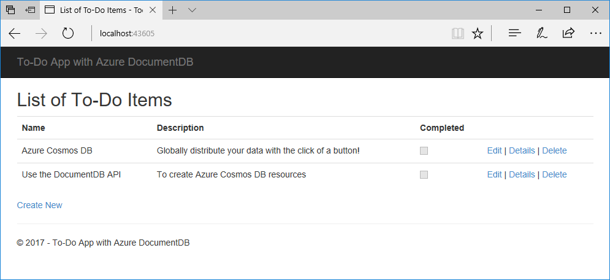

# Azure Cosmos DB: Build a Cassandra web app with .NET and the Azure portal

Azure Cosmos DB is Microsoft's globally distributed multi-model database service. You can quickly create and query document, table, key/value, and graph databases, all of which benefit from the global distribution and horizontal scale capabilities at the core of Azure Cosmos DB. 

This quick start demonstrates how to create an Azure Cosmos DB account, key/value database, and table using the Azure portal. You'll then build and deploy a profile web app built on the [Cassandra API](cassandra-introduction.md) using .NET by cloning a sample from GitHub.  

## Prerequisites

If you don't already have Visual Studio 2017 installed, you can download and use the **free** [Visual Studio 2017 Community Edition](https://www.visualstudio.com/downloads/). Make sure that you enable **Azure development** during the Visual Studio setup.

[!INCLUDE [quickstarts-free-trial-note](../../includes/quickstarts-free-trial-note.md)] 
[!INCLUDE [cosmos-db-emulator-docdb-api](../../includes/cosmos-db-emulator-docdb-api.md)]  

<a id="create-account"></a>
## Create a database account

[!INCLUDE [cosmos-db-create-dbaccount](../../includes/cosmos-db-create-dbaccount.md)]

<a id="create-collection"></a>
## Add a collection

[!INCLUDE [cosmos-db-create-collection](../../includes/cosmos-db-create-collection.md)]

<a id="add-sample-data"></a>
## Add sample data

You can now add data to your new collection using Data Explorer.

1. In Data Explorer, the new database appears in the Collections pane. Expand the **Tasks** database, expand the **Items** collection, click **Documents**, and then click **New Documents**. 

   
  
2. Now add a document to the collection with the following structure.

     ```json
     {
         "id": "1",
         "category": "personal",
         "name": "groceries",
         "description": "Pick up apples and strawberries.",
         "isComplete": false
     }
     ```

3. Once you've added the json to the **Documents** tab, click **Save**.

    

4.  Create and save one more document where you insert a unique value for the `id` property, and change the other properties as you see fit. Your new documents can have any structure you want as Azure Cosmos DB doesn't impose any schema on your data.

     You can now use queries in Data Explorer to retrieve your data. By default, Data Explorer uses `SELECT * FROM c` to retrieve all documents in the collection, but you can change that to a different [SQL query](documentdb-sql-query.md), such as `SELECT * FROM c ORDER BY c._ts DESC`, to return all the documents in descending order based on their timestamp.
 
     You can also use Data Explorer to create stored procedures, UDFs, and triggers to perform server-side business logic as well as scale throughput. Data Explorer exposes all of the built-in programmatic data access available in the APIs, but provides easy access to your data in the Azure portal.

## Clone the sample application

Now let's switch to working with code. Let's clone a DocumentDB API app from GitHub, set the connection string, and run it. You'll see how easy it is to work with data programmatically. 

1. Open a git terminal window, such as git bash, and `CD` to a working directory.  

2. Run the following command to clone the sample repository. 

    ```bash
    git clone https://github.com/Azure-Samples/documentdb-dotnet-todo-app.git
    ```

3. Then open the todo solution file in Visual Studio. 

## Review the code

Let's make a quick review of what's happening in the app. Open the TODO file and you'll find that these lines of code create the Azure Cosmos DB resources. 

* The DocumentClient is initialized on line 73.

    ```csharp
    client = new DocumentClient(new Uri(ConfigurationManager.AppSettings["endpoint"]), ConfigurationManager.AppSettings["authKey"]);`
    ```

* A new database is created on line 88.

    ```csharp
    await client.CreateDatabaseAsync(new Database { Id = DatabaseId });
    ```

* A new collection is created on line 107.

    ```csharp
    await client.CreateDocumentCollectionAsync(
        UriFactory.CreateDatabaseUri(DatabaseId),
        new DocumentCollection { Id = CollectionId },
        new RequestOptions { OfferThroughput = 1000 });
    ```

## Update your connection string

Now go back to the Azure portal to get your connection string information and copy it into the app.

1. In the [Azure portal](http://portal.azure.com/), in your Azure Cosmos DB account, in the left navigation click **Keys**, and then click **Read-write Keys**. You'll use the copy buttons on the right side of the screen to copy the URI and Primary Key into the web.config file in the next step.

    

2. In Visual Studio 2017, open the web.config file. 

3. Copy your URI value from the portal (using the copy button) and make it the value of the endpoint key in web.config. 

    `<add key="endpoint" value="FILLME" />`

4. Then copy your PRIMARY KEY value from the portal and make it the value of the authKey in web.config. You've now updated your app with all the info it needs to communicate with Azure Cosmos DB. 

    `<add key="authKey" value="FILLME" />`
    
## Run the web app
1. In Visual Studio, right-click on the project in **Solution Explorer** and then click **Manage NuGet Packages**. 

2. In the NuGet **Browse** box, type *DocumentDB*.

3. From the results, install the **Microsoft.Azure.DocumentDB** library. This installs the Microsoft.Azure.DocumentDB package as well as all dependencies.

4. Click CTRL + F5 to run the application. Your app displays in your browser. 

5. Click **Create New** in the browser and create a few new tasks in your to-do app.

   

You can now go back to Data Explorer and see query, modify, and work with this new data. 

## Review SLAs in the Azure portal

[!INCLUDE [cosmosdb-tutorial-review-slas](../../includes/cosmos-db-tutorial-review-slas.md)]

## Clean up resources

If you're not going to continue to use this app, delete all resources created by this quickstart in the Azure portal with the following steps:

1. From the left-hand menu in the Azure portal, click **Resource groups** and then click the name of the resource you created. 
2. On your resource group page, click **Delete**, type the name of the resource to delete in the text box, and then click **Delete**.

## Next steps

In this quickstart, you've learned how to create an Azure Cosmos DB account, create a collection using the Data Explorer, and run a web app. You can now import additional data to your Cosmos DB account. 

> [!div class="nextstepaction"]
> [Import Cassandra data into Azure Cosmos DB](cassandra-import-data.md)