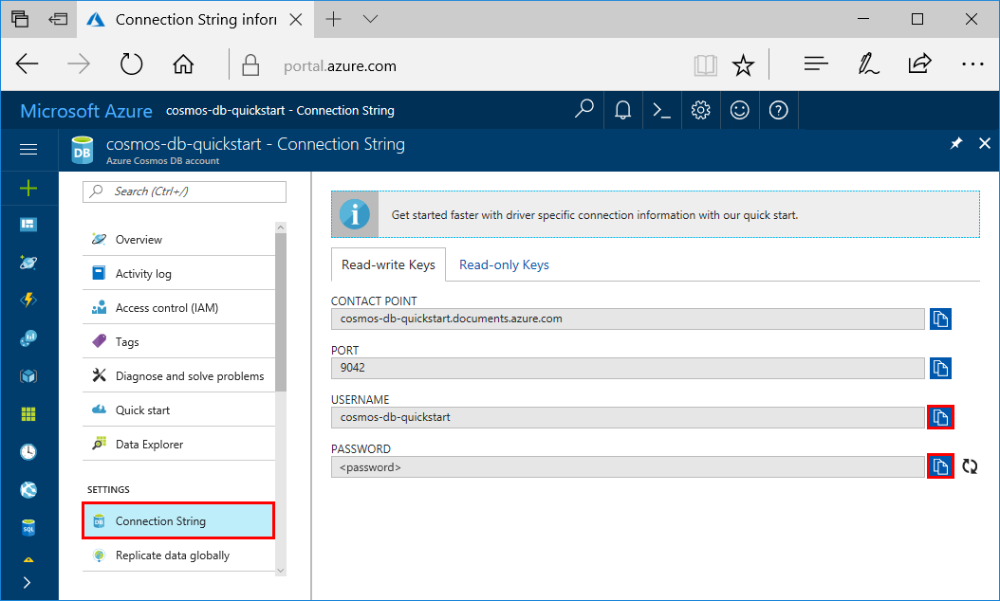

# Azure Cosmos DB: Build a Cassandra API app with Java and the Azure portal

Azure Cosmos DB is Microsoft's globally distributed multi-model database service. You can quickly create and query document, table, key-value, and graph databases, all of which benefit from the global distribution and horizontal scale capabilities at the core of Azure Cosmos DB. 

This quick start demonstrates how to create an Azure Cosmos DB account for the [Cassandra API](cassandra-introduction.md) by using the Azure portal. You'll then build a profile console app, as shown in the following image, with sample data cloning a Java sample from GitHub.  

  

## Prerequisites

[!INCLUDE [quickstarts-free-trial-note](../../includes/quickstarts-free-trial-note.md)] 

In addition: 

* [Java Development Kit (JDK) 1.7+](http://www.oracle.com/technetwork/java/javase/downloads/jdk8-downloads-2133151.html)
    * On Ubuntu, run `apt-get install default-jdk` to install the JDK.
    * Be sure to set the JAVA_HOME environment variable to point to the folder where the JDK is installed.
* [Download](http://maven.apache.org/download.cgi) and [install](http://maven.apache.org/install.html) a [Maven](http://maven.apache.org/) binary archive
    * On Ubuntu, you can run `apt-get install maven` to install Maven.
* [Git](https://www.git-scm.com/)
    * On Ubuntu, you can run `sudo apt-get install git` to install Git.

## Create a database account

Before you can create a document database, you need to create a Cassandra account with Azure Cosmos DB.

[!INCLUDE [cosmos-db-create-dbaccount-cassandra](../../includes/cosmos-db-create-dbaccount-cassandra.md)]

## Clone the sample application

Now let's switch to working with code. Let's clone a DocumentDB API app from GitHub, set the connection string, and run it. You'll see how easy it is to work with data programmatically. 

1. Open a git terminal window, such as git bash, and use the `cd` command to change to a folder to install the sample app. 

    ```bash
    cd "C:\git-samples"
    ```

2. Run the following command to clone the sample repository. This command creates a copy of the sample app on your computer.

    ```bash
    git clone git clone https://github.com/Azure-Samples/azure-cosmos-db-cassandra-java-getting-started.git
    ```

## Review the code

This step is optional. If you're interested in learning how the database resources are created in the code, you can review the following snippets. The snippets are all taken from the `Program.java` file installed in the C:\git-samples\azure-cosmos-db-documentdb-java-getting-started\src\GetStarted folder. Otherwise, you can skip ahead to [Update your connection string](#update-your-connection-string). 

TODO insert code

## Update your connection string

Now go back to the Azure portal to get your connection string information and copy it into the app. This enables your app to communicate with your hosted database.

1. In the [Azure portal](http://portal.azure.com/), click **Connection String**. 

    Use the copy buttons on the right side of the screen to copy the USERNAME value.

    

2. Open the `config.properties` file from C:\git-samples\azure-cosmosdb-cassandra-java-getting-started\java-examples\src\main\resources folder. 

3. Paste the USERNAME value from the portal over `localhost` on line 3.

    Line 3 of config.properties should now look similar to 

    `cassabdra_username=cosmos-db-quickstart`

4. Go back to portal and copy the PASSWORD value as shown in the screenshot. Paste the PASSWORD value from the portal over the current password on line 4.

    Line 4 of config.properties should now look similar to 

    `cassandra_password=2Ggkr662ifxz2Mg...==`

5. Save the config.properties file.

## Run the app

1. In the git terminal window, `cd` to the azure-cosmosdb-cassandra-java-getting-started\java-examples folder.

    ```git
    cd "C:\git-samples\azure-cosmosdb-cassandra-java-getting-started\java-examples"
    ```

2. In the git terminal window, type `mvn package` to install the required Java packages.

3. In the git terminal window, run `mvn exec:java -D exec.mainClass=GetStarted.Program` to start the Java application.

    The terminal window displays a notification that the FamilyDB database was created. Press a key to create the collection, then switch to the Data Explorer and you'll see that it now contains a FamilyDB database.
    
    Continue to press keys to create the documents and then perform a query.
    
    At the end of the program, all the resources from this app are deleted from your account so that you don't incur any charges. 

    


## Review SLAs in the Azure portal

[!INCLUDE [cosmosdb-tutorial-review-slas](../../includes/cosmos-db-tutorial-review-slas.md)]

## Clean up resources

[!INCLUDE [cosmosdb-delete-resource-group](../../includes/cosmos-db-delete-resource-group.md)]

## Next steps

In this quickstart, you've learned how to create an Azure Cosmos DB account, Cassandra database, and collection using the Data Explorer, and run an app to do the same thing programmatically. You can now import additional data into your Azure Cosmos DB collection. 

> [!div class="nextstepaction"]
> [Import Cassandra data into Azure Cosmos DB](cassandra-import-data.md)
