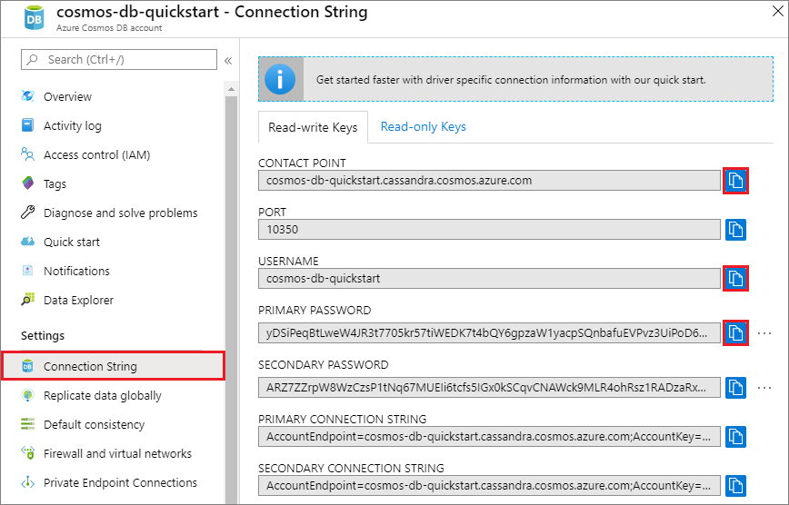
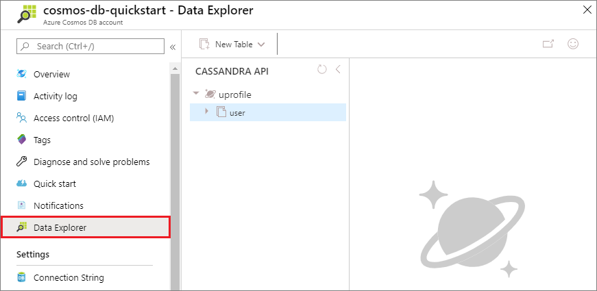

# Quickstart: Build a Java app to manage Azure Cosmos DB Cassandra API data (v3 Driver)

> [!div class="op_single_selector"]
> * [.NET](create-cassandra-dotnet.md)
> * [.NET Core](create-cassandra-dotnet-core.md)
> * [Java v3](create-cassandra-java.md)
> * [Java v4](create-cassandra-java-v4.md)
> * [Node.js](create-cassandra-nodejs.md)
> * [Python](create-cassandra-python.md)
>  

In this quickstart, you create an Azure Cosmos DB Cassandra API account, and use a Cassandra Java app cloned from GitHub to create a Cassandra database and container using the [v3.x Apache Cassandra drivers](https://github.com/datastax/java-driver/tree/3.x) for Java. Azure Cosmos DB is a multi-model database service that lets you quickly create and query document, table, key-value, and graph databases with global distribution and horizontal scale capabilities.

## Prerequisites

- An Azure account with an active subscription. [Create one for free](https://azure.microsoft.com/free/?ref=microsoft.com&utm_source=microsoft.com&utm_medium=docs&utm_campaign=visualstudio). Or [try Azure Cosmos DB for free](https://azure.microsoft.com/try/cosmosdb/) without an Azure subscription.
- [Java Development Kit (JDK) 8](https://www.azul.com/downloads/azure-only/zulu/?&version=java-8-lts&architecture=x86-64-bit&package=jdk). Point your `JAVA_HOME` environment variable to the folder where the JDK is installed.
- A [Maven binary archive](https://maven.apache.org/download.cgi). On Ubuntu, run `apt-get install maven` to install Maven.
- [Git](https://www.git-scm.com/downloads). On Ubuntu, run `sudo apt-get install git` to install Git.

## Create a database account

Before you can create a document database, you need to create a Cassandra account with Azure Cosmos DB.

[!INCLUDE [cosmos-db-create-dbaccount-cassandra](../../includes/cosmos-db-create-dbaccount-cassandra.md)]

## Clone the sample application

Now let's switch to working with code. Let's clone a Cassandra app from GitHub, set the connection string, and run it. You'll see how easy it is to work with data programmatically. 

1. Open a command prompt. Create a new folder named `git-samples`. Then, close the command prompt.

    ```bash
    md "C:\git-samples"
    ```

2. Open a git terminal window, such as git bash, and use the `cd` command to change to the new folder to install the sample app.

    ```bash
    cd "C:\git-samples"
    ```

3. Run the following command to clone the sample repository. This command creates a copy of the sample app on your computer.

    ```bash
    git clone https://github.com/Azure-Samples/azure-cosmos-db-cassandra-java-getting-started.git
    ```

## Review the code

This step is optional. If you're interested to learn how the code creates the database resources, you can review the following snippets. Otherwise, you can skip ahead to [Update your connection string](#update-your-connection-string). These snippets are all taken from the *src/main/java/com/azure/cosmosdb/cassandra/util/CassandraUtils.java* file.  

* The Cassandra host, port, user name, password, and TLS/SSL options are set. The connection string information comes from the connection string page in the Azure portal.

   ```java
   cluster = Cluster.builder().addContactPoint(cassandraHost).withPort(cassandraPort).withCredentials(cassandraUsername, cassandraPassword).withSSL(sslOptions).build();
   ```

* The `cluster` connects to the Azure Cosmos DB Cassandra API and returns a session to access.

    ```java
    return cluster.connect();
    ```

The following snippets are from the *src/main/java/com/azure/cosmosdb/cassandra/repository/UserRepository.java* file.

* Create a new keyspace.

    ```java
    public void createKeyspace() {
        final String query = "CREATE KEYSPACE IF NOT EXISTS uprofile WITH replication = {'class': 'SimpleStrategy', 'replication_factor': '3' } ";
        session.execute(query);
        LOGGER.info("Created keyspace 'uprofile'");
    }
    ```

* Create a new table.

   ```java
   public void createTable() {
        final String query = "CREATE TABLE IF NOT EXISTS uprofile.user (user_id int PRIMARY KEY, user_name text, user_bcity text)";
        session.execute(query);
        LOGGER.info("Created table 'user'");
   }
   ```

* Insert user entities using a prepared statement object.

    ```java
    public PreparedStatement prepareInsertStatement() {
        final String insertStatement = "INSERT INTO  uprofile.user (user_id, user_name , user_bcity) VALUES (?,?,?)";
        return session.prepare(insertStatement);
    }

	public void insertUser(PreparedStatement statement, int id, String name, String city) {
        BoundStatement boundStatement = new BoundStatement(statement);
        session.execute(boundStatement.bind(id, name, city));
    }
    ```

* Query to get all user information.

    ```java
   public void selectAllUsers() {
        final String query = "SELECT * FROM uprofile.user";
        List<Row> rows = session.execute(query).all();

        for (Row row : rows) {
            LOGGER.info("Obtained row: {} | {} | {} ", row.getInt("user_id"), row.getString("user_name"), row.getString("user_bcity"));
        }
    }
    ```

* Query to get a single user's information.

    ```java
    public void selectUser(int id) {
        final String query = "SELECT * FROM uprofile.user where user_id = 3";
        Row row = session.execute(query).one();

        LOGGER.info("Obtained row: {} | {} | {} ", row.getInt("user_id"), row.getString("user_name"), row.getString("user_bcity"));
    }
    ```

## Update your connection string

Now go back to the Azure portal to get your connection string information and copy it into the app. The connection string details enable your app to communicate with your hosted database.

1. In your Azure Cosmos DB account in the [Azure portal](https://portal.azure.com/), select **Connection String**. 

    

2. Use the  button on the right side of the screen to copy the CONTACT POINT value.

3. Open the *config.properties* file from the *C:\git-samples\azure-cosmosdb-cassandra-java-getting-started\java-examples\src\main\resources* folder. 

3. Paste the CONTACT POINT value from the portal over `<Cassandra endpoint host>` on line 2.

    Line 2 of *config.properties* should now look similar to 

    `cassandra_host=cosmos-db-quickstart.cassandra.cosmosdb.azure.com`

3. Go back to the portal and copy the USERNAME value. Past the USERNAME value from the portal over `<cassandra endpoint username>` on line 4.

    Line 4 of *config.properties* should now look similar to 

    `cassandra_username=cosmos-db-quickstart`

4. Go back to the portal and copy the PASSWORD value. Paste the PASSWORD value from the portal over `<cassandra endpoint password>` on line 5.

    Line 5 of *config.properties* should now look similar to 

    `cassandra_password=2Ggkr662ifxz2Mg...==`

5. On line 6, if you want to use a specific TLS/SSL certificate, then replace `<SSL key store file location>` with the location of the TLS/SSL certificate. If a value is not provided, the JDK certificate installed at <JAVA_HOME>/jre/lib/security/cacerts is used. 

6. If you changed line 6 to use a specific TLS/SSL certificate, update line 7 to use the password for that certificate. 

7. Save the *config.properties* file.

## Run the Java app

1. In the git terminal window, `cd` to the `azure-cosmosdb-cassandra-java-getting-started` folder.

    ```git
    cd "C:\git-samples\azure-cosmosdb-cassandra-java-getting-started"
    ```

2. In the git terminal window, use the following command to generate the `cosmosdb-cassandra-examples.jar` file.

    ```git
    mvn clean install
    ```

3. In the git terminal window, run the following command to start the Java application.

    ```git
    java -cp target/cosmosdb-cassandra-examples.jar com.azure.cosmosdb.cassandra.examples.UserProfile
    ```

    The terminal window displays notifications that the keyspace and table are created. It then selects and returns all users in the table and displays the output, and then selects a row by ID and displays the value.  

    Press Ctrl+C to stop execution of the program and close the console window.

4. In the Azure portal, open **Data Explorer** to query, modify, and work with this new data. 

    

## Review SLAs in the Azure portal

[!INCLUDE [cosmosdb-tutorial-review-slas](../../includes/cosmos-db-tutorial-review-slas.md)]

## Clean up resources

[!INCLUDE [cosmosdb-delete-resource-group](../../includes/cosmos-db-delete-resource-group.md)]

## Next steps

In this quickstart, you learned how to create an Azure Cosmos DB account with Cassandra API, and run a Cassandra Java app that creates a Cassandra database and container. You can now import additional data into your Azure Cosmos DB account. 

> [!div class="nextstepaction"]
> [Import Cassandra data into Azure Cosmos DB](cassandra-import-data.md)
