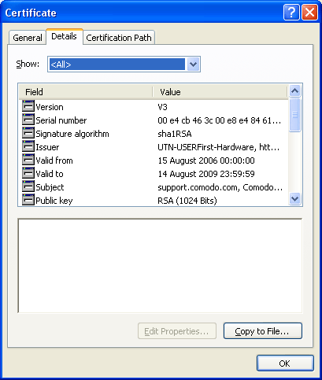
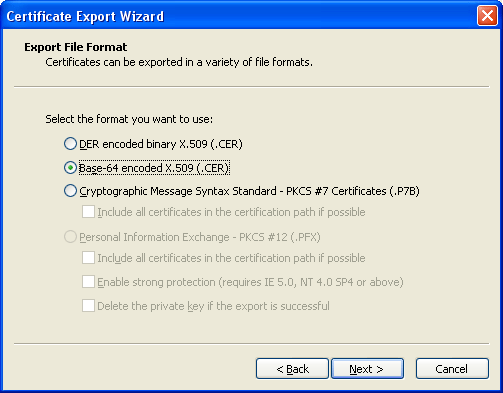
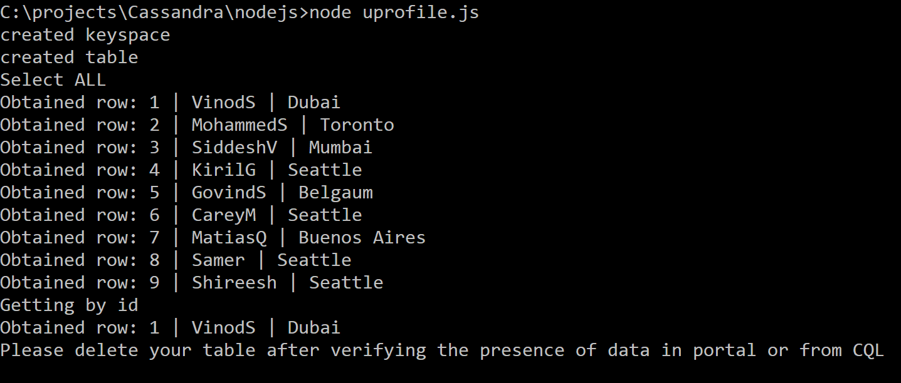

# Quickstart: Build a Cassandra app with Node.js SDK and Azure Cosmos DB

> [!div class="op_single_selector"]
> * [.NET](create-cassandra-dotnet.md)
> * [.NET Core](create-cassandra-dotnet-core.md)
> * [Java v3](create-cassandra-java.md)
> * [Java v4](create-cassandra-java-v4.md)
> * [Node.js](create-cassandra-nodejs.md)
> * [Python](create-cassandra-python.md)
>  

In this quickstart, you create an Azure Cosmos DB Cassandra API account, and use a Cassandra Node.js app cloned from GitHub to create a Cassandra database and container. Azure Cosmos DB is a multi-model database service that lets you quickly create and query document, table, key-value, and graph databases with global distribution and horizontal scale capabilities.

## Prerequisites

[!INCLUDE [quickstarts-free-trial-note](../../includes/quickstarts-free-trial-note.md)] Alternatively, you can [Try Azure Cosmos DB for free](https://azure.microsoft.com/try/cosmosdb/) without an Azure subscription, free of charge and commitments.

In addition, you need:
* [Node.js](https://nodejs.org/dist/v0.10.29/x64/node-v0.10.29-x64.msi) version v0.10.29 or higher
* [Git](https://git-scm.com/)

## Create a database account

Before you can create a document database, you need to create a Cassandra account with Azure Cosmos DB.

[!INCLUDE [cosmos-db-create-dbaccount-cassandra](../../includes/cosmos-db-create-dbaccount-cassandra.md)]

## Clone the sample application

Now let's clone a Cassandra API app from GitHub, set the connection string, and run it. You see how easy it is to work with data programmatically. 

1. Open a command prompt. Create a new folder named `git-samples`. Then, close the command prompt.

    ```bash
    md "C:\git-samples"
    ```

2. Open a git terminal window, such as git bash. Use the `cd` command to change to the new folder to install the sample app.

    ```bash
    cd "C:\git-samples"
    ```

3. Run the following command to clone the sample repository. This command creates a copy of the sample app on your computer.

    ```bash
    git clone https://github.com/Azure-Samples/azure-cosmos-db-cassandra-nodejs-getting-started.git
    ```

## Review the code

This step is optional. If you're interested to learn how the code creates the database resources, you can review the following snippets. The snippets are all taken from the `uprofile.js` file in the `C:\git-samples\azure-cosmos-db-cassandra-nodejs-getting-started` folder. Otherwise, you can skip ahead to [Update your connection string](#update-your-connection-string). 

* The username and password values were set using the connection string page in the Azure portal. The `path\to\cert` provides a path to an X509 certificate. 

   ```javascript
   var ssl_option = {
        cert : fs.readFileSync("path\to\cert"),
        rejectUnauthorized : true,
        secureProtocol: 'TLSv1_2_method'
        };
   const authProviderLocalCassandra = new cassandra.auth.PlainTextAuthProvider(config.username, config.password);
   ```

* The `client` is initialized with contactPoint information. The contactPoint is retrieved from the Azure portal.

    ```javascript
    const client = new cassandra.Client({contactPoints: [config.contactPoint], authProvider: authProviderLocalCassandra, sslOptions:ssl_option});
    ```

* The `client` connects to the Azure Cosmos DB Cassandra API.

    ```javascript
    client.connect(next);
    ```

* A new keyspace is created.

    ```javascript
    function createKeyspace(next) {
    	var query = "CREATE KEYSPACE IF NOT EXISTS uprofile WITH replication = {\'class\': \'NetworkTopologyStrategy\', \'datacenter1\' : \'1\' }";
    	client.execute(query, next);
    	console.log("created keyspace");    
  }
    ```

* A new table is created.

   ```javascript
   function createTable(next) {
   	var query = "CREATE TABLE IF NOT EXISTS uprofile.user (user_id int PRIMARY KEY, user_name text, user_bcity text)";
    	client.execute(query, next);
    	console.log("created table");
   },
   ```

* Key/value entities are inserted.

    ```javascript
        function insert(next) {
            console.log("\insert");
            const arr = ['INSERT INTO  uprofile.user (user_id, user_name , user_bcity) VALUES (1, \'AdrianaS\', \'Seattle\')',
                        'INSERT INTO  uprofile.user (user_id, user_name , user_bcity) VALUES (2, \'JiriK\', \'Toronto\')',
                        'INSERT INTO  uprofile.user (user_id, user_name , user_bcity) VALUES (3, \'IvanH\', \'Mumbai\')',
                        'INSERT INTO  uprofile.user (user_id, user_name , user_bcity) VALUES (4, \'IvanH\', \'Seattle\')',
                        'INSERT INTO  uprofile.user (user_id, user_name , user_bcity) VALUES (5, \'IvanaV\', \'Belgaum\')',
                        'INSERT INTO  uprofile.user (user_id, user_name , user_bcity) VALUES (6, \'LiliyaB\', \'Seattle\')',
                        'INSERT INTO  uprofile.user (user_id, user_name , user_bcity) VALUES (7, \'JindrichH\', \'Buenos Aires\')',
                        'INSERT INTO  uprofile.user (user_id, user_name , user_bcity) VALUES (8, \'AdrianaS\', \'Seattle\')',
                        'INSERT INTO  uprofile.user (user_id, user_name , user_bcity) VALUES (9, \'JozefM\', \'Seattle\')'];
            arr.forEach(element => {
            client.execute(element);
            });
            next();
        },
    ```

* Query to get all key values.

    ```javascript
        function selectAll(next) {
            console.log("\Select ALL");
            var query = 'SELECT * FROM uprofile.user';
            client.execute(query, function (err, result) {
            if (err) return next(err);
            result.rows.forEach(function(row) {
                console.log('Obtained row: %d | %s | %s ',row.user_id, row.user_name, row.user_bcity);
            }, this);
            next();
            });
        },
    ```  
    
* Query to get a key-value.

    ```javascript
        function selectById(next) {
            console.log("\Getting by id");
            var query = 'SELECT * FROM uprofile.user where user_id=1';
            client.execute(query, function (err, result) {
            if (err) return next(err);
            result.rows.forEach(function(row) {
                console.log('Obtained row: %d | %s | %s ',row.user_id, row.user_name, row.user_bcity);
            }, this);
            next();
            });
        }
    ```  

## Update your connection string

Now go back to the Azure portal to get your connection string information and copy it into the app. The connection string enables your app to communicate with your hosted database.

1. In your Azure Cosmos DB account in the [Azure portal](https://portal.azure.com/), select **Connection String**. 

    Use the  button on the right side of the screen to copy the top value, the CONTACT POINT.

    

2. Open the `config.js` file. 

3. Paste the CONTACT POINT value from the portal over `<FillMEIN>` on line 4.

    Line 4 should now look similar to 

    `config.contactPoint = "cosmos-db-quickstarts.cassandra.cosmosdb.azure.com:10350"`

4. Copy the USERNAME value from the portal and paste it over `<FillMEIN>` on line 2.

    Line 2 should now look similar to 

    `config.username = 'cosmos-db-quickstart';`
    
5. Copy the PASSWORD value from the portal and paste it over `<FillMEIN>` on line 3.

    Line 3 should now look similar to

    `config.password = '2Ggkr662ifxz2Mg==';`

6. Save the `config.js` file.
    
## Use the X509 certificate

1. Download the Baltimore CyberTrust Root certificate locally from [https://cacert.omniroot.com/bc2025.crt](https://cacert.omniroot.com/bc2025.crt). Rename the file using the file extension `.cer`.

   The certificate has serial number `02:00:00:b9` and SHA1 fingerprint `d4🇩🇪20:d0:5e:66:fc:53:fe:1a:50:88:2c:78:db:28:52:ca:e4:74`.

2. Open `uprofile.js` and change the `path\to\cert` to point to your new certificate.

3. Save `uprofile.js`.

> [!NOTE]
> If you experience a certificate related error in the later steps and are running on a Windows machine, ensure that you have followed the process for properly converting a .crt file into the Microsoft .cer format below.
> 
> Double-click on the .crt file to open it into the certificate display. 
>
> 
>
> Press Next on the Certificate Wizard. Select Base-64 encoded X.509 (.CER), then Next.
>
> 
>
> Select Browse (to locate a destination) and type in a filename.
> Select Next then Finished.
>
> You should now have a properly formatted .cer file. Ensure that the path in `uprofile.js` points to this file.

## Run the Node.js app

1. In the git terminal window, ensure you are in the sample directory you cloned earlier:

    ```bash
    cd azure-cosmos-db-cassandra-nodejs-getting-started
    ```

2. Run `npm install` to install the required npm modules.

3. Run `node uprofile.js` to start your node application.

4. Verify the results as expected from the command line.

    

    Press CTRL+C to stop execution of the program and close the console window. 

5. In the Azure portal, open **Data Explorer** to query, modify, and work with this new data. 

     

## Review SLAs in the Azure portal

[!INCLUDE [cosmosdb-tutorial-review-slas](../../includes/cosmos-db-tutorial-review-slas.md)]

## Clean up resources

[!INCLUDE [cosmosdb-delete-resource-group](../../includes/cosmos-db-delete-resource-group.md)]

## Next steps

In this quickstart, you learned how to create an Azure Cosmos DB account with Cassandra API, and run a Cassandra Node.js app that creates a Cassandra database and container. You can now import additional data into your Azure Cosmos DB account. 

> [!div class="nextstepaction"]
> [Import Cassandra data into Azure Cosmos DB](cassandra-import-data.md)