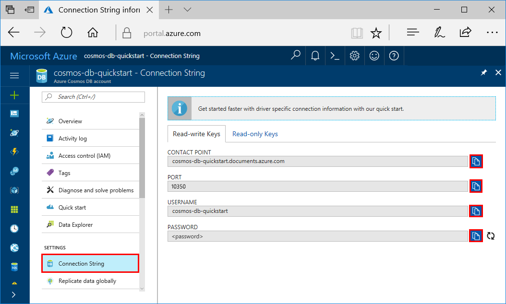
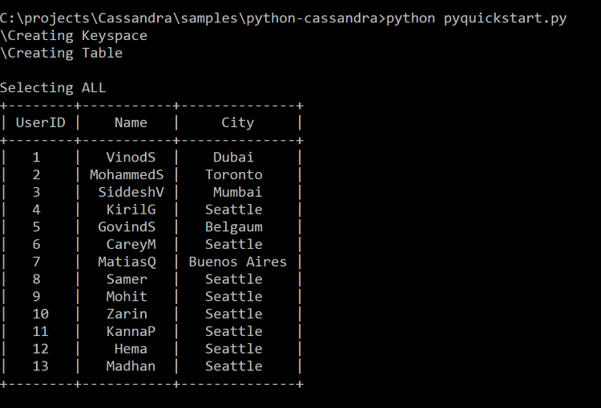

# Quickstart: Build a Cassandra app with Python and Azure Cosmos DB

> [!div class="op_single_selector"]
> * [.NET](create-cassandra-dotnet.md)
> * [Java](create-cassandra-java.md)
> * [Node.js](create-cassandra-nodejs.md)
> * [Python](create-cassandra-python.md)
>  

This quickstart shows how to use Python and the Azure Cosmos DB [Cassandra API](cassandra-introduction.md) to build a profile app by cloning an example from GitHub. This quickstart also shows you how to use the web-based Azure portal to create an Azure Cosmos DB account.

Azure Cosmos DB is Microsoft's globally distributed multi-model database service. You can quickly create and query document, table, key-value, and graph databases, all of which benefit from the global distribution and horizontal scale capabilities at the core of Azure Cosmos DB.

## Prerequisites

[!INCLUDE [quickstarts-free-trial-note](../../includes/quickstarts-free-trial-note.md)] Alternatively, you can [Try Azure Cosmos DB for free](https://azure.microsoft.com/try/cosmosdb/) without an Azure subscription, free of charge and commitments.

In addition, you need:
* [Python](https://www.python.org/downloads/) version v2.7.14
* [Git](http://git-scm.com/)
* [Python Driver for Apache Cassandra](https://github.com/datastax/python-driver)

## Create a database account

Before you can create a document database, you need to create a Cassandra account with Azure Cosmos DB.

[!INCLUDE [cosmos-db-create-dbaccount-cassandra](../../includes/cosmos-db-create-dbaccount-cassandra.md)]

## Clone the sample application

Now let's clone a Cassandra API app from github, set the connection string, and run it. You see how easy it is to work with data programmatically. 

1. Open a command prompt. Create a new folder named `git-samples`. Then, close the command prompt.

    ```bash
    md "C:\git-samples"
    ```

2. Open a git terminal window, such as git bash, and use the `cd` command to change to the new folder to install the sample app.

    ```bash
    cd "C:\git-samples"
    ```

3. Run the following command to clone the sample repository. This command creates a copy of the sample app on your computer.

    ```bash
    git clone https://github.com/Azure-Samples/azure-cosmos-db-cassandra-python-getting-started.git
    ```

## Review the code

This step is optional. If you're interested to learn how the code creates the database resources, you can review the following snippets. The snippets are all taken from the pyquickstart.py file. Otherwise, you can skip ahead to [Update your connection string](#update-your-connection-string). 

* The username and password values were set using the connection string page in the Azure portal. The `path\to\cert` provides a path to an X509 certificate. 

   ```python
	ssl_opts = {
		    'ca_certs': 'path\to\cert',
		    'ssl_version': ssl.PROTOCOL_TLSv1_2
		    }
    auth_provider = PlainTextAuthProvider( username=cfg.config['username'], password=cfg.config['password'])
    cluster = Cluster([cfg.config['contactPoint']], port = cfg.config['port'], auth_provider=auth_provider, ssl_options=ssl_opts)
	session = cluster.connect()
   
   ```

* The `cluster` is initialized with contactPoint information. The contactPoint is retrieved from the Azure portal.

    ```python
   cluster = Cluster([cfg.config['contactPoint']], port = cfg.config['port'], auth_provider=auth_provider)
    ```

* The `cluster` connects to the Azure Cosmos DB Cassandra API.

    ```python
    session = cluster.connect()
    ```

* A new keyspace is created.

    ```python
   session.execute('CREATE KEYSPACE IF NOT EXISTS uprofile WITH replication = {\'class\': \'NetworkTopologyStrategy\', \'datacenter1\' : \'1\' }')
    ```

* A new table is created.

   ```
   session.execute('CREATE TABLE IF NOT EXISTS uprofile.user (user_id int PRIMARY KEY, user_name text, user_bcity text)');
   ```

* Key/value entities are inserted.

    ```Python
    insert_data = session.prepare("INSERT INTO  uprofile.user  (user_id, user_name , user_bcity) VALUES (?,?,?)")
    session.execute(insert_data, [1,'Lybkov','Seattle'])
    session.execute(insert_data, [2,'Doniv','Dubai'])
    session.execute(insert_data, [3,'Keviv','Chennai'])
    session.execute(insert_data, [4,'Ehtevs','Pune'])
    session.execute(insert_data, [5,'Dnivog','Belgaum'])
    ....
    
    ```

* Query to get all key values.

    ```Python
    rows = session.execute('SELECT * FROM uprofile.user')
    ```  
    
* Query to get a key-value.

    ```Python
    
    rows = session.execute('SELECT * FROM uprofile.user where user_id=1')
    ```  

## Update your connection string

Now go back to the Azure portal to get your connection string information and copy it into the app. The connection string enables your app to communicate with your hosted database.

1. In the [Azure portal](http://portal.azure.com/), select **Connection String**. 

    Use the  button on the right side of the screen to copy the top value, the CONTACT POINT.

    

2. Open the `config.py` file. 

3. Paste the CONTACT POINT value from the portal over `<FILLME>` on line 10.

    Line 10 should now look similar to 

    `'contactPoint': 'cosmos-db-quickstarts.cassandra.cosmosdb.azure.com:10350'`

4. Copy the USERNAME value from the portal and paste it over `<FILLME>` on line 6.

    Line 6 should now look similar to 

    `'username': 'cosmos-db-quickstart',`
    
5. Copy the PASSWORD value from the portal and paste it over `<FILLME>` on line 8.

    Line 8 should now look similar to

    `'password' = '2Ggkr662ifxz2Mg==`';`

6. Save the config.py file.
    
## Use the X509 certificate

1. Download the Baltimore CyberTrust Root certificate locally from [https://cacert.omniroot.com/bc2025.crt](https://cacert.omniroot.com/bc2025.crt). Rename the file using the file extension `.cer`.

   The certificate has serial number `02:00:00:b9` and SHA1 fingerprint `d4🇩🇪20:d0:5e:66:fc:53:fe:1a:50:88:2c:78:db:28:52:ca:e4:74`.

2. Open `pyquickstart.py` and change the `path\to\cert` to point to your new certificate.

3. Save `pyquickstart.py`.

## Run the Python app

1. Use the cd command in the git terminal to change into the `azure-cosmos-db-cassandra-python-getting-started` folder. 

2. Run the following commands to install the required modules:

    ```python
    python -m pip install cassandra-driver
    python -m pip install prettytable
    python -m pip install requests
    python -m pip install pyopenssl
    ```

2. Run the following command to start your node application:

    ```
    python pyquickstart.py
    ```

3. Verify the results as expected from the command line.

    Press CTRL + C to stop execution of the program and close the console window. 

    
    
4. In the Azure portal, open **Data Explorer** to query, modify, and work with this new data. 

    

## Review SLAs in the Azure portal

[!INCLUDE [cosmosdb-tutorial-review-slas](../../includes/cosmos-db-tutorial-review-slas.md)]

## Clean up resources

[!INCLUDE [cosmosdb-delete-resource-group](../../includes/cosmos-db-delete-resource-group.md)]

## Next steps

In this quickstart, you've learned how to create an Azure Cosmos DB account, create a container using the Data Explorer, and run an app. You can now import additional data to your Cosmos DB account. 

> [!div class="nextstepaction"]
> [Import Cassandra data into Azure Cosmos DB](cassandra-import-data.md)

