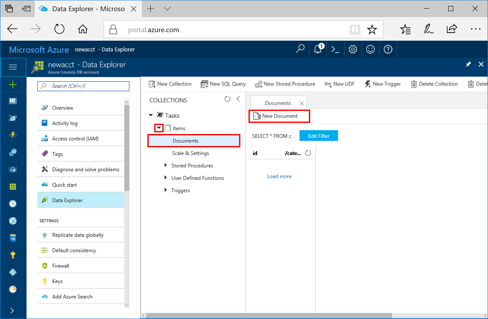
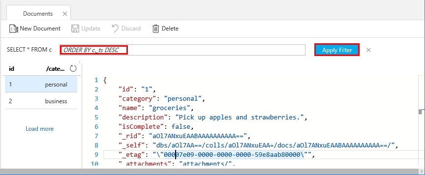

# Azure Cosmos DB: Create a document database using Java and the Azure portal

Azure Cosmos DB is Microsoft’s globally distributed multi-model database service. Using Azure Cosmos DB, you can quickly create and query managed document, table, and graph databases.

This quickstart creates a document database using the Azure portal tools for Azure Cosmos DB. This quickstart also shows you how to quickly create a Java console app using the [DocumentDB Java API](documentdb-sdk-java.md). The instructions in this quickstart can be followed on any operating system that is capable of running Java. By completing this quickstart you'll be familiar with creating and modifying document database resources in either the UI or programmatically, whichever is your preference.

## Prerequisites

[!INCLUDE [quickstarts-free-trial-note](../../includes/quickstarts-free-trial-note.md)] 
[!INCLUDE [cosmos-db-emulator-docdb-api](../../includes/cosmos-db-emulator-docdb-api.md)]

In addition: 

* [Java Development Kit (JDK) 1.7+](http://www.oracle.com/technetwork/java/javase/downloads/jdk8-downloads-2133151.html)
    * On Ubuntu, run `apt-get install default-jdk` to install the JDK.
    * Be sure to set the JAVA_HOME environment variable to point to the folder where the JDK is installed.
* [Download](http://maven.apache.org/download.cgi) and [install](http://maven.apache.org/install.html) a [Maven](http://maven.apache.org/) binary archive
    * On Ubuntu, you can run `apt-get install maven` to install Maven.
* [Git](https://www.git-scm.com/)
    * On Ubuntu, you can run `sudo apt-get install git` to install Git.

## Create a database account

Before you can create a document database, you need to create a SQL (DocumentDB) database account with Azure Cosmos DB.

[!INCLUDE [cosmos-db-create-dbaccount](../../includes/cosmos-db-create-dbaccount.md)]

## Add a collection

[!INCLUDE [cosmos-db-create-collection](../../includes/cosmos-db-create-collection.md)]

<a id="add-sample-data"></a>
## Add sample data

You can now add data to your new collection using Data Explorer.

1. Expand the **Items** collection, click **Documents** > **New Document**.

   
  
2. Now add a document to the collection with the following structure and click **Save**.

     ```json
     {
         "id": "1",
         "category": "personal",
         "name": "groceries",
         "description": "Pick up apples and strawberries.",
         "isComplete": false
     }
     ```

    

3.  Create and save one more document where you change `id` to 2, and change the other properties as you see fit. Your new documents can have any structure you want as Azure Cosmos DB doesn't impose any schema on your data.

## Query your data

You can now use queries in Data Explorer to retrieve and filter your data.

1. See that by default, the query is set to `SELECT * FROM c`. This default query retrieves and displays all documents in the collection. 

    

2. Change the query by clicking the **Edit Filter** button, adding `ORDER BY c._ts DESC` to the query predicate box, and then clicking **Apply Filter**.

    

This modified query lists the documents in descending order based on their time stamp, so now your second document is listed first. If you're familiar with SQL syntax, you can enter any of the supported [SQL queries](documentdb-sql-query.md) in this box. 

That completes our work in Data Explorer. Before we move on to working with code, note that you can also use Data Explorer to create stored procedures, UDFs, and triggers to perform server-side business logic as well as scale throughput. Data Explorer exposes all of the built-in programmatic data access available in the APIs, but provides easy access to your data in the Azure portal.

## Clone the sample application

Now let's switch to working with code. Let's clone a DocumentDB API app from GitHub, set the connection string, and run it. You'll see how easy it is to work with data programmatically. 

1. Open a command prompt, create a new folder named git-samples, then close the command prompt.

    ```bash
    md "C:\git-samples"
    ```


2. Open a git terminal window, such as git bash, and use the `cd` command to change to the new folder to install the sample app. 

    ```bash
    cd "C:\git-samples"
    ```

3. Run the following command to clone the sample repository. This command creates a copy of the sample app on your computer.

    ```bash
    git clone https://github.com/Azure-Samples/azure-cosmos-db-documentdb-java-getting-started.git
    ```

## Review the code

This step is optional. If you're interested in learning how the database resources are created in the code, you can review the following snippets. The snippets are all taken from the `Program.java` file installed in the C:\git-samples\azure-cosmos-db-documentdb-java-getting-started\src\GetStarted folder. Otherwise, you can skip ahead to [Update your connection string](#update-your-connection-string). 

* `DocumentClient` initialization. The [DocumentClient](https://docs.microsoft.com/java/api/com.microsoft.azure.documentdb._document_client) provides client-side logical representation for the Azure Cosmos DB database service. This client is used to configure and execute requests against the service.

    ```java
    this.client = new DocumentClient("https://FILLME.documents.azure.com",
            "FILLME", 
            new ConnectionPolicy(),
            ConsistencyLevel.Session);
    ```

* [Database](https://docs.microsoft.com/java/api/com.microsoft.azure.documentdb._database) creation.

    ```java
    Database database = new Database();
    database.setId(databaseName);
    
    this.client.createDatabase(database, null);
    ```

* [DocumentCollection](https://docs.microsoft.com/java/api/com.microsoft.azure.documentdb._document_collection) creation.

    ```java
    DocumentCollection collectionInfo = new DocumentCollection();
    collectionInfo.setId(collectionName);

    ...

    this.client.createCollection(databaseLink, collectionInfo, requestOptions);
    ```

* Document creation by using the [createDocument](https://docs.microsoft.com/java/api/com.microsoft.azure.documentdb._document_client.createdocument) method.

    ```java
    // Any Java object within your code can be serialized into JSON and written to Azure Cosmos DB
    Family andersenFamily = new Family();
    andersenFamily.setId("Andersen.1");
    andersenFamily.setLastName("Andersen");
    // More properties

    String collectionLink = String.format("/dbs/%s/colls/%s", databaseName, collectionName);
    this.client.createDocument(collectionLink, family, new RequestOptions(), true);
    ```

* SQL queries over JSON are performed using the [queryDocuments](https://docs.microsoft.com/java/api/com.microsoft.azure.documentdb._document_client.querydocuments) method.

    ```java
    FeedOptions queryOptions = new FeedOptions();
    queryOptions.setPageSize(-1);
    queryOptions.setEnableCrossPartitionQuery(true);

    String collectionLink = String.format("/dbs/%s/colls/%s", databaseName, collectionName);
    FeedResponse<Document> queryResults = this.client.queryDocuments(
        collectionLink,
        "SELECT * FROM Family WHERE Family.lastName = 'Andersen'", queryOptions);

    System.out.println("Running SQL query...");
    for (Document family : queryResults.getQueryIterable()) {
        System.out.println(String.format("\tRead %s", family));
    }
    ```    

## Update your connection string

Now go back to the Azure portal to get your connection string information and copy it into the app. This enables your app to communicate with your hosted database.

1. In the [Azure portal](http://portal.azure.com/), click **Keys**. 

    Use the copy buttons on the right side of the screen to copy the top value, the URI.

    

2. Open the `Program.java` file from C:\git-samples\azure-cosmos-db-documentdb-java-getting-started\src\GetStarted folder. 

3. Paste the URI value from the portal over `https://FILLME.documents.azure.com` on line 45.

4. Go back to portal and copy the PRIMARY KEY value as shown in the screenshot. Paste the PRIMARY KEY value from the portal over `FILLME` on line 46.

    The getStartedDemo method should now look similar to this: 
    
    ```java
    private void getStartedDemo() throws DocumentClientException, IOException {
        this.client = new DocumentClient("https://youraccountname.documents.azure.com:443/",
                "your-primary-key...RJhQrqQ5QQ==", 
                new ConnectionPolicy(),
                ConsistencyLevel.Session);
    ```

5. Save the Program.java file.

## Run the app

1. In the git terminal window, `cd` to the azure-cosmos-db-documentdb-java-getting-started folder.

    ```git
    cd "C:\git-samples\azure-cosmos-db-documentdb-java-getting-started"
    ```

2. In the git terminal window, use the following command to install the required Java packages.

    ```
    mvn package
    ```

3. In the git terminal window, use the following command to start the Java application.

    ```
    mvn exec:java -D exec.mainClass=GetStarted.Program
    ```

    The terminal window displays a notification that the FamilyDB database was created. 
    
4. Press a key to create the collection. 

5. Switch back to the Data Explorer and you'll see that it now contains a FamilyDB database.
    
6. Continue to press keys in the console window to have the code create documents and perform a query.
    
    At the end of the program, all the resources from this app are deleted from your account so that you don't incur any charges. 

    


## Review SLAs in the Azure portal

[!INCLUDE [cosmosdb-tutorial-review-slas](../../includes/cosmos-db-tutorial-review-slas.md)]

## Clean up resources

[!INCLUDE [cosmosdb-delete-resource-group](../../includes/cosmos-db-delete-resource-group.md)]

## Next steps

In this quickstart, you've learned how to create an Azure Cosmos DB account, document database, and collection using the Data Explorer, and run an app to do the same thing programmatically. You can now import additional data into your Azure Cosmos DB collection. 

> [!div class="nextstepaction"]
> [Import data into Azure Cosmos DB](import-data.md)


