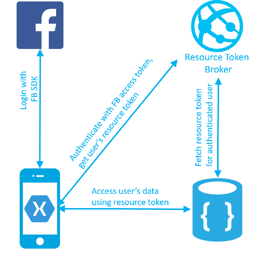
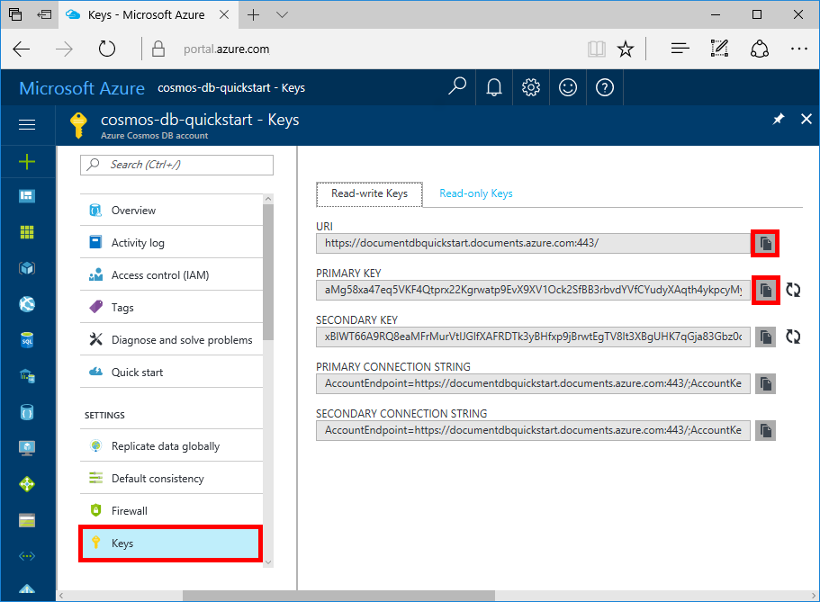

# Azure Cosmos DB: Build a web app with .NET, Xamarin, and Facebook authentication

Azure Cosmos DB is Microsoft’s globally distributed multi-model database service. You can quickly create and query document, key/value, and graph databases, all of which benefit from the global distribution and horizontal scale capabilities at the core of Azure Cosmos DB. 

This quick start demonstrates how to create an Azure Cosmos DB account, document database, and collection using the Azure portal. You'll then build and deploy a todo list web app built on the [DocumentDB .NET API](documentdb-sdk-dotnet.md), [Xamarin](https://www.xamarin.com/), and the Azure Cosmos DB authorization engine. The todo list web app implements a per-user data pattern that enables users to login using Facebook Auth and manage their own to do items.

## Prerequisites

If you don’t already have Visual Studio 2017 installed, you can download and use the **free** [Visual Studio 2017 Community Edition](https://www.visualstudio.com/downloads/). Make sure that you enable **Azure development** during the Visual Studio setup.

[!INCLUDE [quickstarts-free-trial-note](../../includes/quickstarts-free-trial-note.md)]

## Create a database account

[!INCLUDE [cosmos-db-create-dbaccount](../../includes/cosmos-db-create-dbaccount.md)]

## Add a collection

[!INCLUDE [cosmos-db-create-collection](../../includes/cosmos-db-create-collection.md)]

## Clone the sample application

Now let's clone a DocumentDB API app from github, set the connection string, and run it. You'll see how easy it is to work with data programmatically. 

1. Open a git terminal window, such as git bash, and `cd` to a working directory.  

2. Run the following command to clone the sample repository. 

    ```bash
    git clone https://github.com/Azure/azure-documentdb-dotnet.git
    ```

3. Then open the DocumentDBTodo.sln file from the samples/xamarin/UserItems/xamarin.forms folder in Visual Studio. 

## Review the code

The code in the Xamarin folder contains:

* Xamarin app. The app stores the user's todo items in a partitioned collection named UserItems.
* Resource token broker API. A simple ASP.NET Web API to broker Azure Cosmos DB resource tokens to the logged in users of the app. Resource tokens are short-lived access tokens that provide the app with the access to the logged in user's data.

The authentication and data flow is illustrated in the diagram below.

* The UserItems collection is created with the partition key '/userid'. Specifying a partition key for a collection allows Azure Cosmos DB to scale infinitely as the number of users and items grows.
* The Xamarin app allows users to login with Facebook credentials.
* The Xamarin app uses Facebook access token to authenticate with ResourceTokenBroker API
* The resource token broker API authenticates the request using App Service Auth feature, and requests an Azure Cosmos DB resource token with read/write access to all documents sharing the authenticated user's partition key.
* Resource token broker returns the resource token to the client app.
* The app accesses the user's todo items using the resource token.


    
## Update your connection string

Now go back to the Azure portal to get your connection string information and copy it into the app.

1. In the [Azure portal](http://portal.azure.com/), in your Azure Cosmos DB account, in the left navigation click **Keys**, and then click **Read-write Keys**. You'll use the copy buttons on the right side of the screen to copy the URI and Primary Key into the Web.config file in the next step.

    

2. In Visual Studio 2017, open the Web.config file in the azure-documentdb-dotnet/samples/xamarin/UserItems/ResourceTokenBroker/ResourceTokenBroker folder. 

3. Copy your URI value from the portal (using the copy button) and make it the value of the accountUrl in Web.config. 

    `<add key="accountUrl" value="{Azure Cosmos DB account URL}"/>`

4. Then copy your PRIMARY KEY value from the portal and make it the value of the accountKey in Web.congif. 

    `<add key="accountKey" value="{Azure Cosmos DB secret}"/>`

You've now updated your app with all the info it needs to communicate with Azure Cosmos DB. 

## Build and deploy the web app

1. In the Azure portal, create an App Service website to host the Resource token broker API.
2. In the Azure portal, open the App Settings blade of the Resource token broker API website. Fill in the following app settings:

    * accountUrl - The Azure Cosmos DB account URL from the Keys tab of your Azure Cosmos DB account.
    * accountKey - The Azure Cosmos DB account master key from the Keys tab of your Azure Cosmos DB account.
    * databaseId and collectionId of your created database and collection

3. Publish the ResourceTokenBroker solution to your created website.

4. Open the Xamarin project, and navigate to TodoItemManager.cs. Fill in the values for accountURL, collectionId, databaseId, as well as resourceTokenBrokerURL as the base https url for the resource token broker website.

5. Complete the [How to configure your App Service application to use Facebook login](../app-service-mobile/app-service-mobile-how-to-configure-facebook-authentication.md) tutorial to setup Facebook authentication and configure the ResourceTokenBroker website.

    Run the Xamarin app.

## Review SLAs in the Azure portal

[!INCLUDE [cosmosdb-tutorial-review-slas](../../includes/cosmos-db-tutorial-review-slas.md)]

## Clean up resources

If you're not going to continue to use this app, delete all resources created by this quickstart in the Azure portal with the following steps: 

1. From the left-hand menu in the Azure portal, click **Resource groups** and then click the name of the resource you just created. 
2. On your resource group page, click **Delete**, type the name of the resource to delete in the text box, and then click **Delete**.

## Next steps

In this quickstart, you've learned how to create an Azure Cosmos DB account, create a collection using the Data Explorer, and build and deploy a Xamarin app. You can now import additional data to your Cosmos DB account. 

> [!div class="nextstepaction"]
> [Import data into Azure Cosmos DB](import-data.md)
