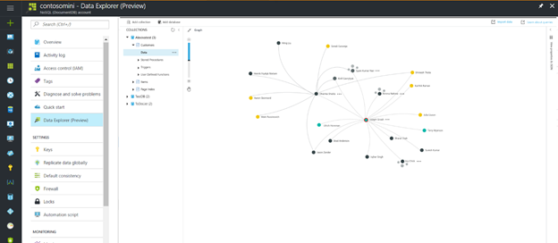

# Quickstart: Build a .NET Framework or Core application using the Azure Cosmos DB Gremlin API account

> [!div class="op_single_selector"]
> * [Gremlin console](create-graph-gremlin-console.md)
> * [.NET](create-graph-dotnet.md)
> * [Java](create-graph-java.md)
> * [Node.js](create-graph-nodejs.md)
> * [Python](create-graph-python.md)
> * [PHP](create-graph-php.md)
>  

Azure Cosmos DB is Microsoft's globally distributed multi-model database service. You can quickly create and query document, key/value, and graph databases, all of which benefit from the global distribution and horizontal scale capabilities at the core of Azure Cosmos DB. 

This quick start demonstrates how to create an Azure Cosmos DB [Gremlin API](graph-introduction.md) account, database, and graph (container) using the Azure portal. You then build and run a console app built using the open-source driver [Gremlin.Net](https://tinkerpop.apache.org/docs/3.2.7/reference/#gremlin-DotNet).  

## Prerequisites

If you don't already have Visual Studio 2019 installed, you can download and use the **free** [Visual Studio 2019 Community Edition](https://www.visualstudio.com/downloads/). Make sure that you enable **Azure development** during the Visual Studio setup.

[!INCLUDE [quickstarts-free-trial-note](../../includes/quickstarts-free-trial-note.md)]

## Create a database account

[!INCLUDE [cosmos-db-create-dbaccount-graph](../../includes/cosmos-db-create-dbaccount-graph.md)]

## Add a graph

[!INCLUDE [cosmos-db-create-graph](../../includes/cosmos-db-create-graph.md)]

## Clone the sample application

Now let's clone a Gremlin API app from GitHub, set the connection string, and run it. You'll see how easy it is to work with data programmatically. 

1. Open a command prompt, create a new folder named git-samples, then close the command prompt.

    ```bash
    md "C:\git-samples"
    ```

2. Open a git terminal window, such as git bash, and use the `cd` command to change to the new folder to install the sample app.

    ```bash
    cd "C:\git-samples"
    ```

3. Run the following command to clone the sample repository. This command creates a copy of the sample app on your computer.

    ```bash
    git clone https://github.com/Azure-Samples/azure-cosmos-db-graph-gremlindotnet-getting-started.git
    ```

4. Then open Visual Studio and open the solution file.

5. Restore the NuGet packages in the project. This should include the Gremlin.Net driver, as well as the Newtonsoft.Json package.


6. You can also install the Gremlin.Net driver manually using the Nuget package manager, or the [nuget command-line utility](https://docs.microsoft.com/nuget/install-nuget-client-tools): 

    ```bash
    nuget install Gremlin.Net
    ```

## Review the code

This step is optional. If you're interested in learning how the database resources are created in the code, you can review the following snippets. Otherwise, you can skip ahead to [Update your connection string](#update-your-connection-string). 

The following snippets are all taken from the Program.cs file.

* Set your connection parameters based on the account created above (Line 19): 

    ```csharp
    private static string hostname = "your-endpoint.gremlin.cosmosdb.azure.com";
    private static int port = 443;
    private static string authKey = "your-authentication-key";
    private static string database = "your-database";
    private static string collection = "your-graph-container";
    ```

* The Gremlin commands to be executed are listed in a Dictionary (Line 26):

    ```csharp
    private static Dictionary<string, string> gremlinQueries = new Dictionary<string, string>
    {
        { "Cleanup",        "g.V().drop()" },
        { "AddVertex 1",    "g.addV('person').property('id', 'thomas').property('firstName', 'Thomas').property('age', 44)" },
        { "AddVertex 2",    "g.addV('person').property('id', 'mary').property('firstName', 'Mary').property('lastName', 'Andersen').property('age', 39)" },
        { "AddVertex 3",    "g.addV('person').property('id', 'ben').property('firstName', 'Ben').property('lastName', 'Miller')" },
        { "AddVertex 4",    "g.addV('person').property('id', 'robin').property('firstName', 'Robin').property('lastName', 'Wakefield')" },
        { "AddEdge 1",      "g.V('thomas').addE('knows').to(g.V('mary'))" },
        { "AddEdge 2",      "g.V('thomas').addE('knows').to(g.V('ben'))" },
        { "AddEdge 3",      "g.V('ben').addE('knows').to(g.V('robin'))" },
        { "UpdateVertex",   "g.V('thomas').property('age', 44)" },
        { "CountVertices",  "g.V().count()" },
        { "Filter Range",   "g.V().hasLabel('person').has('age', gt(40))" },
        { "Project",        "g.V().hasLabel('person').values('firstName')" },
        { "Sort",           "g.V().hasLabel('person').order().by('firstName', decr)" },
        { "Traverse",       "g.V('thomas').out('knows').hasLabel('person')" },
        { "Traverse 2x",    "g.V('thomas').out('knows').hasLabel('person').out('knows').hasLabel('person')" },
        { "Loop",           "g.V('thomas').repeat(out()).until(has('id', 'robin')).path()" },
        { "DropEdge",       "g.V('thomas').outE('knows').where(inV().has('id', 'mary')).drop()" },
        { "CountEdges",     "g.E().count()" },
        { "DropVertex",     "g.V('thomas').drop()" },
    };
    ```


* Create a `GremlinServer` connection object using the parameters provided above (Line 52):

    ```csharp
    var gremlinServer = new GremlinServer(hostname, port, enableSsl: true, 
                                                    username: "/dbs/" + database + "/colls/" + collection, 
                                                    password: authKey);
    ```

* Create a new `GremlinClient` object (Line 56):

    ```csharp
    var gremlinClient = new GremlinClient(gremlinServer);
    ```

* Execute each Gremlin query using the `GremlinClient` object with an async task (Line 63). This will read the Gremlin queries from the dictionary defined above (Line 26):

    ```csharp
    var results = await gremlinClient.SubmitAsync<dynamic>(query.Value);
    ```

* Retrieve the result and read the values, which are formatted as a dictionary, using the `JsonSerializer` class from Newtonsoft.Json:

    ```csharp
    foreach (var result in results)
    {
        // The vertex results are formed as dictionaries with a nested dictionary for their properties
        string output = JsonConvert.SerializeObject(result);
        Console.WriteLine(String.Format("\tResult:\n\t{0}", output));
    }
    ```

## Update your connection string

Now go back to the Azure portal to get your connection string information and copy it into the app.

1. From the [Azure portal](https://portal.azure.com/), navigate to your graph database account. In the **Overview** tab, you can see two endpoints- 
 
   **.NET SDK URI** - This value is used when you connect to the graph account by using Microsoft.Azure.Graphs library. 

   **Gremlin Endpoint** - This value is used when you connect to the graph account by using Gremlin.Net library.

    

   To run this sample, copy the **Gremlin Endpoint** value, delete the port number at the end, that is the URI becomes `https://<your cosmos db account name>.gremlin.cosmosdb.azure.com`

2. In Program.cs paste the value over `your-endpoint` in the `hostname` variable in line 19. 

    `"private static string hostname = "<your cosmos db account name>.gremlin.cosmosdb.azure.com";`

    The endpoint value should now look like this:

    `"private static string hostname = "testgraphacct.gremlin.cosmosdb.azure.com";`

3. Next, navigate to the **Keys** tab and copy **PRIMARY KEY** value from the portal, and paste it in the `authkey` variable, replacing the `"your-authentication-key"` placeholder in line 21. 

    `private static string authKey = "your-authentication-key";`

4. Using the information of the database created above, paste the database name inside of the `database` variable in line 22. 

    `private static string database = "your-database";`

5. Similarly, using the information of the container created above, paste the collection (which is also the graph name) inside of the `collection` variable in line 23. 

    `private static string collection = "your-collection-or-graph";`

6. Save the Program.cs file. 

You've now updated your app with all the info it needs to communicate with Azure Cosmos DB. 

## Run the console app

Click CTRL + F5 to run the application. The application will print both the Gremlin query commands and results in the console.

   The console window displays the vertexes and edges being added to the graph. When the script completes, press ENTER to close the console window.

## Browse using the Data Explorer

You can now go back to Data Explorer in the Azure portal and browse and query your new graph data.

1. In Data Explorer, the new database appears in the Graphs pane. Expand the database and container nodes, and then click **Graph**.

2. Click the **Apply Filter** button to use the default query to view all the vertices in the graph. The data generated by the sample app is displayed in the Graphs pane.

    You can zoom in and out of the graph, you can expand the graph display space, add additional vertices, and move vertices on the display surface.

    

## Review SLAs in the Azure portal

[!INCLUDE [cosmosdb-tutorial-review-slas](../../includes/cosmos-db-tutorial-review-slas.md)]

## Clean up resources

[!INCLUDE [cosmosdb-delete-resource-group](../../includes/cosmos-db-delete-resource-group.md)]

## Next steps

In this quickstart, you've learned how to create an Azure Cosmos DB account, create a graph using the Data Explorer, and run an app. You can now build more complex queries and implement powerful graph traversal logic using Gremlin. 

> [!div class="nextstepaction"]
> [Query using Gremlin](tutorial-query-graph.md)

