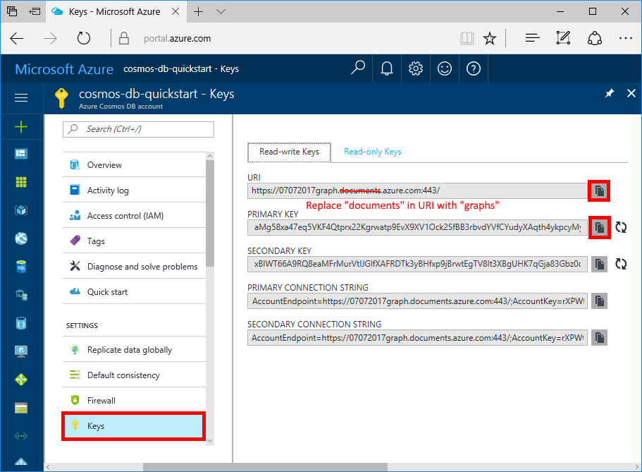

# Azure Cosmos DB: Build a .NET application using the Graph API

Azure Cosmos DB is Microsoft’s globally distributed multi-model database service. You can quickly create and query document, key/value, and graph databases, all of which benefit from the global distribution and horizontal scale capabilities at the core of Azure Cosmos DB. 

This quick start demonstrates how to create an Azure Cosmos DB account, database, and graph (container) using the Azure portal. You then build and run a console app built on the [Graph API](graph-sdk-dotnet.md) (preview).  

## Prerequisites

If you don’t already have Visual Studio 2017 installed, you can download and use the **free** [Visual Studio 2017 Community Edition](https://www.visualstudio.com/downloads/). Make sure that you enable **Azure development** during the Visual Studio setup.

[!INCLUDE [quickstarts-free-trial-note](../../includes/quickstarts-free-trial-note.md)]

## Create a database account

[!INCLUDE [cosmos-db-create-dbaccount-graph](../../includes/cosmos-db-create-dbaccount-graph.md)]

## Add a graph

[!INCLUDE [cosmos-db-create-graph](../../includes/cosmos-db-create-graph.md)]

## Clone the sample application

Now let's clone a Graph API app from github, set the connection string, and run it. You'll see how easy it is to work with data programmatically. 

1. Open a git terminal window, such as git bash, and `cd` to a working directory.  

2. Run the following command to clone the sample repository. 

    ```bash
    git clone https://github.com/Azure-Samples/azure-cosmos-db-graph-dotnet-getting-started.git
    ```

3. Then open the solution file in Visual Studio. 

## Review the code

Let's make a quick review of what's happening in the app. Open the Program.cs file and you'll find that these lines of code create the Azure Cosmos DB resources. 

* The DocumentClient is initialized. In the preview, we added a graph extension API on the Azure Cosmos DB client. We are working on a standalone graph client decoupled from the Azure Cosmos DB client and resources.

    ```csharp
    using (DocumentClient client = new DocumentClient(
        new Uri(endpoint),
        authKey,
        new ConnectionPolicy { ConnectionMode = ConnectionMode.Direct, ConnectionProtocol = Protocol.Tcp }))
    ```

* A new database is created.

    ```csharp
    Database database = await client.CreateDatabaseIfNotExistsAsync(new Database { Id = "graphdb" });
    ```

* A new graph is created.

    ```csharp
    DocumentCollection graph = await client.CreateDocumentCollectionIfNotExistsAsync(
        UriFactory.CreateDatabaseUri("graphdb"),
        new DocumentCollection { Id = "graph" },
        new RequestOptions { OfferThroughput = 1000 });
    ```
* A series of Gremlin steps are executed using the `CreateGremlinQuery` method.

    ```csharp
    // The CreateGremlinQuery method extensions allow you to execute Gremlin queries and iterate
    // results asychronously
    IDocumentQuery<dynamic> query = client.CreateGremlinQuery<dynamic>(graph, "g.V().count()");
    while (query.HasMoreResults)
    {
        foreach (dynamic result in await query.ExecuteNextAsync())
        {
            Console.WriteLine($"\t {JsonConvert.SerializeObject(result)}");
        }
    }

    ```

## Update your connection string

Now go back to the Azure portal to get your connection string information and copy it into the app.

1. In the [Azure portal](http://portal.azure.com/), in your Azure Cosmos DB account, in the left navigation click **Keys**, and then click **Read-write Keys**. You'll use the copy buttons on the right side of the screen to copy the URI and Primary Key into the `App.config` file in the next step.

    

2. In Visual Studio 2017, open the `App.config` file. 

3. Copy your URI value from the portal (using the copy button) and make it the value of the endpoint key in `App.config`. 

    `<add key="Endpoint" value="FILLME.documents.azure.com:443" />`

4. Then copy your PRIMARY KEY value from the portal and make it the value of the authKey in `App.config`. 

    `<add key="AuthKey" value="FILLME" />`

You've now updated your app with all the info it needs to communicate with Azure Cosmos DB. 

## Run the console app

1. In Visual Studio, right-click on the **GraphGetStarted** project in **Solution Explorer** and then click **Manage NuGet Packages**. 

2. In the NuGet **Browse** box, type *Microsoft.Azure.Graphs* and check the **Includes prerelease** box. 

3. From the results, install the **Microsoft.Azure.Graphs** library. This installs the Azure Cosmos DB graph extension library package and all dependencies.

4. Click CTRL + F5 to run the application.

   The console window displays the vertexes and edges being added to the graph. When the script completes, press ENTER twice to close the console window. 

## Browse using the Data Explorer

You can now go back to Data Explorer in the Azure portal and browse and query your new graph data.

* In Data Explorer, the new database appears in the Collections pane. Expand **graphdb**, **graphcoll**, and then click **Graph**.

    The data generated by the sample app is displayed in the Graphs pane.

## Review SLAs in the Azure portal

[!INCLUDE [cosmosdb-tutorial-review-slas](../../includes/cosmos-db-tutorial-review-slas.md)]

## Clean up resources

If you're not going to continue to use this app, delete all resources created by this quickstart in the Azure portal with the following steps: 

1. From the left-hand menu in the Azure portal, click **Resource groups** and then click the name of the resource you created. 
2. On your resource group page, click **Delete**, type the name of the resource to delete in the text box, and then click **Delete**.

## Next steps

In this quickstart, you've learned how to create an Azure Cosmos DB account, create a graph using the Data Explorer, and run an app. You can now build more complex queries and implement powerful graph traversal logic using Gremlin. 

> [!div class="nextstepaction"]
> [Query using Gremlin](tutorial-query-graph.md)

