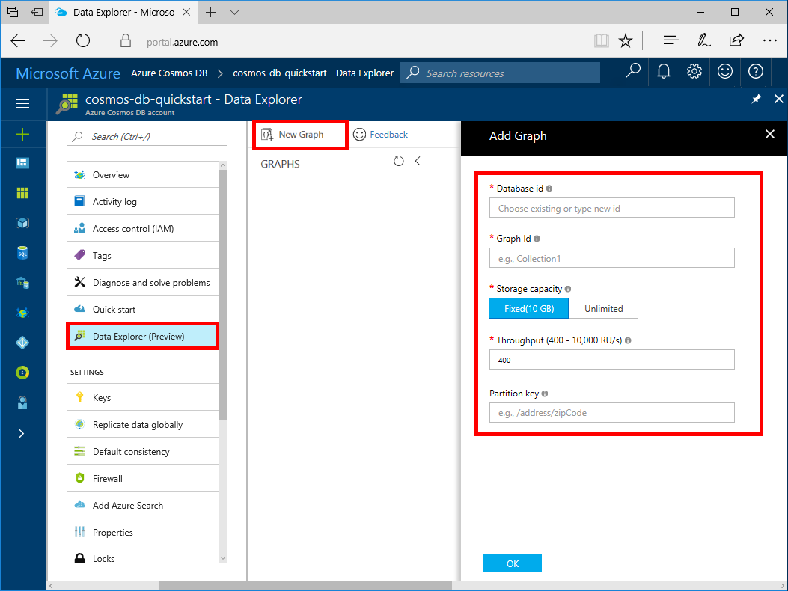

# Azure Cosmos DB: Create a graph database using Java and the Azure portal

Azure Cosmos DB is Microsoft’s globally distributed multi-model database service. You can quickly create and query document, key/value, and graph databases, all of which benefit from the global distribution and horizontal scale capabilities at the core of Azure Cosmos DB. 

This quickstart creates a graph database using the Azure portal tools for Azure Cosmos DB. This quickstart also shows you how to quickly create a Java console app using a graph database using the OSS [Gremlin Java](https://mvnrepository.com/artifact/org.apache.tinkerpop/gremlin-driver) driver. The instructions in this quickstart can be followed on any operating system that is capable of running Java. This quickstart familiarizes you with creating and modifying graph resources in either the UI or programmatically, whichever is your preference. 

## Prerequisites

* [Java Development Kit (JDK) 1.7+](http://www.oracle.com/technetwork/java/javase/downloads/jdk8-downloads-2133151.html)
    * On Ubuntu, run `apt-get install default-jdk` to install the JDK.
    * Be sure to set the JAVA_HOME environment variable to point to the folder where the JDK is installed.
* [Download](http://maven.apache.org/download.cgi) and [install](http://maven.apache.org/install.html) a [Maven](http://maven.apache.org/) binary archive
    * On Ubuntu, you can run `apt-get install maven` to install Maven.
* [Git](https://www.git-scm.com/)
    * On Ubuntu, you can run `sudo apt-get install git` to install Git.

[!INCLUDE [quickstarts-free-trial-note](../../includes/quickstarts-free-trial-note.md)]

## Create a database account

Before you can create a graph database, you need to create a Gremlin (Graph) database account with Azure Cosmos DB.

[!INCLUDE [cosmos-db-create-dbaccount-graph](../../includes/cosmos-db-create-dbaccount-graph.md)]

## Add a graph

You can now use the Data Explorer tool in the Azure portal to create a graph database. 

1. In the Azure portal, in the left navigation menu, click **Data Explorer (Preview)**. 
2. In the **Data Explorer (Preview)** blade, click **New Graph**, then fill in the page using the following information:

    

    Setting|Suggested value|Description
    ---|---|---
    Database ID|sample-database|The ID for your new database. Database names must be between 1 and 255 characters, and cannot contain `/ \ # ?` or a trailing space.
    Graph ID|sample-graph|The ID for your new graph. Graph names have the same character requirements as database ids.
    Storage Capacity| 10 GB|Leave the default value. This is the storage capacity of the database.
    Throughput|400 RUs|Leave the default value. You can scale up the throughput later if you want to reduce latency.
    Partition key|Leave blank|For the purpose of this quickstart, leave the partition key blank.

3. Once the form is filled out, click **OK**.

## Clone the sample application

Now let's clone a graph app from github, set the connection string, and run it. You see how easy it is to work with data programmatically. 

1. Open a git terminal window, such as git bash, and `cd` to a working directory.  

2. Run the following command to clone the sample repository. 

    ```bash
    git clone https://github.com/Azure-Samples/azure-cosmos-db-graph-java-getting-started.git
    ```

## Review the code

Let's make a quick review of what's happening in the app. Open the `Program.java` file from the \src\GetStarted folder and find these lines of code. 

* The Gremlin `Client` is initialized from the configuration in `src/remote.yaml`.

    ```java
    cluster = Cluster.build(new File("src/remote.yaml")).create();
    ...
    client = cluster.connect();
    ```

* A series of Gremlin steps are executed using the `client.submit` method.

    ```java
    ResultSet results = client.submit(gremlin);

    CompletableFuture<List<Result>> completableFutureResults = results.all();
    List<Result> resultList = completableFutureResults.get();

    for (Result result : resultList) {
        System.out.println(result.toString());
    }
    ```

## Update your connection string

1. Open the src/remote.yaml file. 

3. Fill in your *hosts*, *username*, and *password* values in the src/remote.yaml file. The rest of the settings do not need to be changed.

    Setting|Suggested value|Description
    ---|---|---
    Hosts|[***.graphs.azure.com]|See the screenshot following this table. This value is the Gremlin URI value on the Overview page of the Azure portal, in square brackets, with the trailing :443/ removed.<br><br>This value can also be retrieved from the Keys tab, using the URI value by removing https://, changing documents to graphs, and removing the trailing :443/.
    Username|/dbs/sample-database/colls/sample-graph|The resource of the form `/dbs/<db>/colls/<coll>` where `<db>` is your existing database name and `<coll>` is your existing collection name.
    Password|*Your primary master key*|See the second screenshot following this table. This value is your primary key, which you can retrieve from the Keys page of the Azure portal, in the Primary Key box. Copy the value using the copy button on the right side of the box.

    For the Hosts value, copy the **Gremlin URI** value from the **Overview** page. If it's empty, see the instructions in the Hosts row in the preceding table about creating the Gremlin URI from the Keys blade.


    For the Password value, copy the **Primary key** from the **Keys** blade:


## Run the console app

1. In the git terminal window, `cd` to the azure-cosmos-db-graph-java-getting-started folder.

2. In the git terminal window, type `mvn package` to install the required Java packages.

3. In the git terminal window, run `mvn exec:java -D exec.mainClass=GetStarted.Program` in the terminal window to start your Java application.

The terminal window displays the vertices being added to the graph. Once the program completes, switch back to the Azure portal in your internet browser. 

<a id="add-sample-data"></a>
## Review and add sample data

You can now go back to Data Explorer and see the vertices added to the graph, and add additional data points.

1. In Data Explorer, expand the **sample-database**/**sample-graph**, click **Graph**, and then click **Apply Filter**. 

   

2. In the **Results** list, notice the new users added to the graph. Select **ben** and notice that he's connected to robin. You can move the vertices around on the graph explorer, zoom in and out, and expand the size of the graph explorer surface. 

   

3. Let's add a few new users to the graph using the Data Explorer. Click the **New Vertex** button to add data to your graph.

   

4. Enter a label of *person* then enter the following keys and values to create the first vertex in the graph. Notice that you can create unique properties for each person in your graph. Only the id key is required.

    key|value|Notes
    ----|----|----
    id|ashley|The unique identifier for the vertex. If you don't specify an id, one is generated for you.
    gender|female| 
    tech | java | 

    > [!NOTE]
    > In this quickstart we create a non-partitioned collection. However, if you create a partitioned collection by specifying a partition key during the collection creation, then you need to include the partition key as a key in each new vertex. 

5. Click **OK**. You may need to expand your screen to see **OK** on the bottom of the screen.

6. Click **New Vertex** again and add an additional new user. Enter a label of *person* then enter the following keys and values:

    key|value|Notes
    ----|----|----
    id|rakesh|The unique identifier for the vertex. If you don't specify an id, one is generated for you.
    gender|male| 
    school|MIT| 

7. Click **OK**. 

8. Click **Apply Filter** with the default `g.V()` filter. All of the users now show in the **Results** list. As you add more data, you can use filters to limit your results. By default, Data Explorer uses `g.V()` to retrieve all vertices in a graph, but you can change that to a different [graph query](tutorial-query-graph.md), such as `g.V().count()`, to return a count of all the vertices in the graph in JSON format.

9. Now we can connect rakesh and ashley. Ensure **ashley** in selected in the **Results** list, then click the edit button next to **Targets** on lower right side. You may need to widen your window to see the **Properties** area.

   

10. In the **Target** box type *rakesh*, and in the **Edge label** box type *knows*, and then click the check box.

   

11. Now select **rakesh** from the results list and see that ashley and rakesh are connected. 

   

    You can also use Data Explorer to create stored procedures, UDFs, and triggers to perform server-side business logic as well as scale throughput. Data Explorer exposes all of the built-in programmatic data access available in the APIs, but provides easy access to your data in the Azure portal.


## Review SLAs in the Azure portal

[!INCLUDE [cosmosdb-tutorial-review-slas](../../includes/cosmos-db-tutorial-review-slas.md)]

## Clean up resources

If you're not going to continue to use this app, delete all resources created by this quickstart in the Azure portal with the following steps: 

1. From the left-hand menu in the Azure portal, click **Resource groups** and then click the name of the resource you created. 
2. On your resource group page, click **Delete**, type the name of the resource to delete in the text box, and then click **Delete**.

## Next steps

In this quickstart, you've learned how to create an Azure Cosmos DB account, create a graph using the Data Explorer, and run an app. You can now build more complex queries and implement powerful graph traversal logic using Gremlin. 

> [!div class="nextstepaction"]
> [Query using Gremlin](tutorial-query-graph.md)

