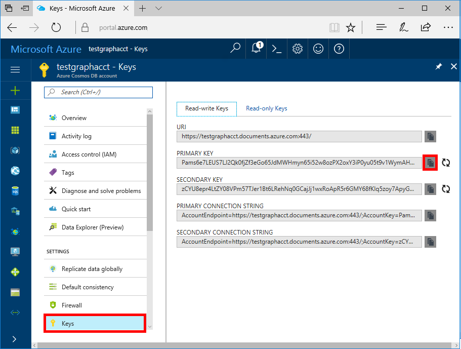
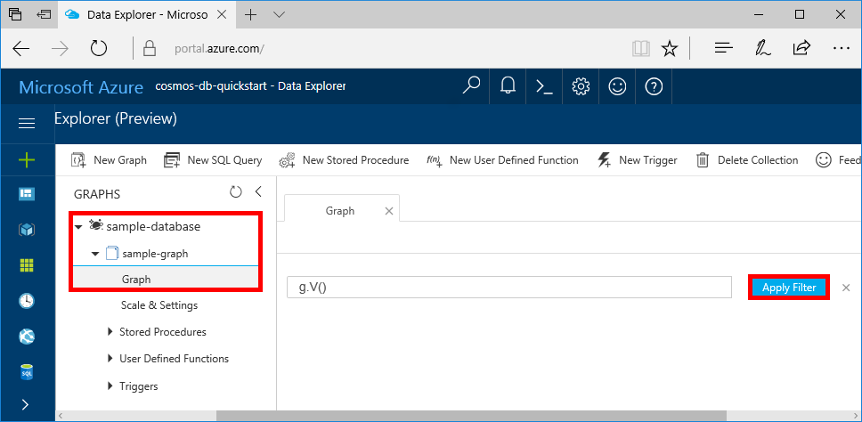
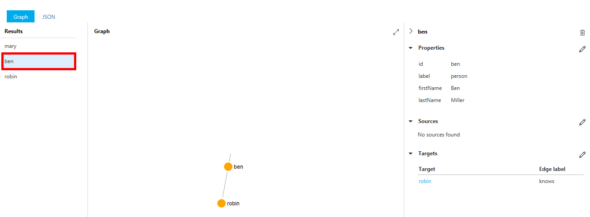
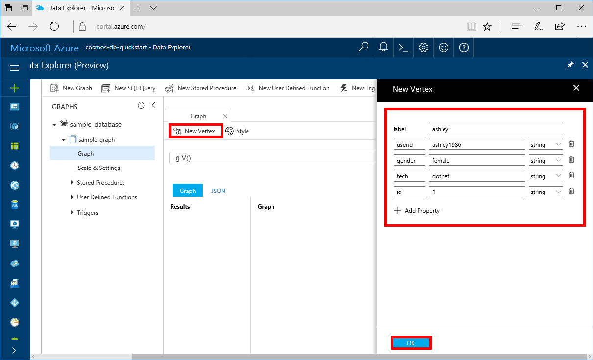
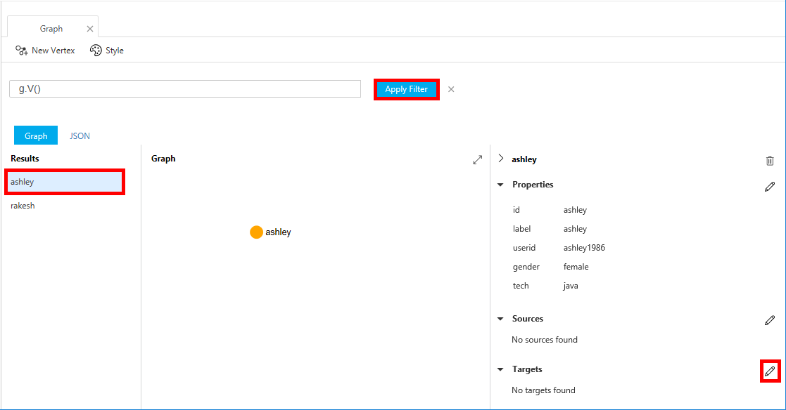

# Quickstart: Create a graph database in Azure Cosmos DB using the Java SDK 

> [!div class="op_single_selector"]
> * [Gremlin console](create-graph-gremlin-console.md)
> * [.NET](create-graph-dotnet.md)
> * [Java](create-graph-java.md)
> * [Node.js](create-graph-nodejs.md)
> * [Python](create-graph-python.md)
> * [PHP](create-graph-php.md)
>  

Azure Cosmos DB is Microsoft’s globally distributed multi-model database service. Using Azure Cosmos DB, you can quickly create and query managed document, table, and graph databases. 

This quickstart creates a simple graph database using the Azure portal tools for Azure Cosmos DB. This quickstart also shows you how to quickly create a Java console app using a [Gremlin API](graph-introduction.md) database using the OSS [Apache TinkerPop](https://tinkerpop.apache.org/) driver. The instructions in this quickstart can be followed on any operating system that is capable of running Java. This quickstart familiarizes you with creating and modifying graphs in either the UI or programmatically, whichever is your preference. 

## Prerequisites
[!INCLUDE [quickstarts-free-trial-note](../../includes/quickstarts-free-trial-note.md)]

In addition:

* [Java Development Kit (JDK) version 8](https://aka.ms/azure-jdks)
    * Be sure to set the JAVA_HOME environment variable to point to the folder where the JDK is installed.
* [Download](https://maven.apache.org/download.cgi) and [install](https://maven.apache.org/install.html) a [Maven](https://maven.apache.org/) binary archive
    * On Ubuntu, you can run `apt-get install maven` to install Maven.
* [Git](https://www.git-scm.com/)
    * On Ubuntu, you can run `sudo apt-get install git` to install Git.

## Create a database account

Before you can create a graph database, you need to create a Gremlin (Graph) database account with Azure Cosmos DB.

[!INCLUDE [cosmos-db-create-dbaccount-graph](../../includes/cosmos-db-create-dbaccount-graph.md)]

## Add a graph

[!INCLUDE [cosmos-db-create-graph](../../includes/cosmos-db-create-graph.md)]

## Clone the sample application

Now let's switch to working with code. Let's clone a Gremlin API app from GitHub, set the connection string, and run it. You'll see how easy it is to work with data programmatically.  

1. Open a command prompt, create a new folder named git-samples, then close the command prompt.

    ```bash
    md "C:\git-samples"
    ```

2. Open a git terminal window, such as git bash, and use the `cd` command to change to a folder to install the sample app.  

    ```bash
    cd "C:\git-samples"
    ```

3. Run the following command to clone the sample repository. This command creates a copy of the sample app on your computer. 

    ```bash
    git clone https://github.com/Azure-Samples/azure-cosmos-db-graph-java-getting-started.git
    ```

## Review the code

This step is optional. If you're interested in learning how the database resources are created in the code, you can review the following snippets. Otherwise, you can skip ahead to [Update your connection string](#update-your-connection-information).

The following snippets are all taken from the C:\git-samples\azure-cosmos-db-graph-java-getting-started\src\GetStarted\Program.java file.

* The Gremlin `Client` is initialized from the configuration in the C:\git-samples\azure-cosmos-db-graph-java-getting-started\src\remote.yaml file.

    ```java
    cluster = Cluster.build(new File("src/remote.yaml")).create();
    ...
    client = cluster.connect();
    ```

* Series of Gremlin steps are executed using the `client.submit` method.

    ```java
    ResultSet results = client.submit(gremlin);

    CompletableFuture<List<Result>> completableFutureResults = results.all();
    List<Result> resultList = completableFutureResults.get();

    for (Result result : resultList) {
        System.out.println(result.toString());
    }
    ```

## Update your connection information

Now go back to the Azure portal to get your connection information and copy it into the app. These settings enable your app to communicate with your hosted database.

1. In the [Azure portal](https://portal.azure.com/), click **Keys**. 

    Copy the first portion of the URI value.

    
2. Open the src/remote.yaml file and paste the unique ID value over `$name$` in `hosts: [$name$.graphs.azure.com]`.

    Line 1 of remote.yaml should now look similar to 

    `hosts: [test-graph.graphs.azure.com]`

3. Change `graphs` to `gremlin.cosmosdb` in the `endpoint` value. (If you created your graph database account before December 20, 2017, make no changes to the endpoint value and continue to the next step.)

    The endpoint value should now look like this:

    `"endpoint": "https://testgraphacct.gremlin.cosmosdb.azure.com:443/"`

4. In the Azure portal, use the copy button to copy the PRIMARY KEY and paste it over `$masterKey$` in `password: $masterKey$`.

    Line 4 of remote.yaml should now look similar to 

    `password: 2Ggkr662ifxz2Mg==`

5. Change line 3 of remote.yaml from

    `username: /dbs/$database$/colls/$collection$`

    to 

    `username: /dbs/sample-database/colls/sample-graph`

    If you used a unique name for your sample database or graph, update the values as appropriate.

6. Save the remote.yaml file.

## Run the console app

1. In the git terminal window, `cd` to the azure-cosmos-db-graph-java-getting-started folder.

    ```git
    cd "C:\git-samples\azure-cosmos-db-graph-java-getting-started"
    ```

2. In the git terminal window, use the following command to install the required Java packages.

   ```
   mvn package
   ```

3. In the git terminal window, use the following command to start the Java application.
    
    ```
    mvn exec:java -D exec.mainClass=GetStarted.Program
    ```

    The terminal window displays the vertices being added to the graph. 
    
    If you experience timeout errors, check that you updated the connection information correctly in [Update your connection information](#update-your-connection-information), and also try running the last command again. 
    
    Once the program stops, press Enter, then switch back to the Azure portal in your internet browser. 

<a id="add-sample-data"></a>
## Review and add sample data

You can now go back to Data Explorer and see the vertices added to the graph, and add additional data points.

1. Click **Data Explorer**, expand **sample-graph**, click **Graph**, and then click **Apply Filter**. 

   

2. In the **Results** list, notice the new users added to the graph. Select **ben** and notice that the user is connected to robin. You can move the vertices around by dragging and dropping, zoom in and out by scrolling the wheel of your mouse, and expand the size of the graph with the double-arrow. 

   

3. Let's add a few new users. Click the **New Vertex** button to add data to your graph.

   

4. In the label box, enter *person*.

5. Click **Add property** to add each of the following properties. Notice that you can create unique properties for each person in your graph. Only the id key is required.

    key|value|Notes
    ----|----|----
    id|ashley|The unique identifier for the vertex. If you don't specify an id, one is generated for you.
    gender|female| 
    tech | java | 

    > [!NOTE]
    > In this quickstart you create a non-partitioned collection. However, if you create a partitioned collection by specifying a partition key during the collection creation, then you need to include the partition key as a key in each new vertex. 

6. Click **OK**. You may need to expand your screen to see **OK** on the bottom of the screen.

7. Click **New Vertex** again and add an additional new user. 

8. Enter a label of *person*.

9. Click **Add property** to add each of the following properties:

    key|value|Notes
    ----|----|----
    id|rakesh|The unique identifier for the vertex. If you don't specify an id, one is generated for you.
    gender|male| 
    school|MIT| 

10. Click **OK**. 

11. Click the **Apply Filter** button with the default `g.V()` filter to display all the values in the graph. All of the users now show in the **Results** list. 

    As you add more data, you can use filters to limit your results. By default, Data Explorer uses `g.V()` to retrieve all vertices in a graph. You can change it to a different [graph query](tutorial-query-graph.md), such as `g.V().count()`, to return a count of all the vertices in the graph in JSON format. If you changed the filter, change the filter back to `g.V()` and click **Apply Filter** to display all the results again.

12. Now you can connect rakesh, and ashley. Ensure **ashley** is selected in the **Results** list, then click   next to **Targets** on lower right side. You may need to widen your window to see the button.

    

13. In the **Target** box type *rakesh*, and in the **Edge label** box type *knows*, and then click the checkbox.

    

14. Now select **rakesh** from the results list and see that ashley and rakesh are connected. 

    

    That completes the resource creation part of this tutorial. You can continue to add vertexes to your graph, modify the existing vertexes, or change the queries. Now let's review the metrics Azure Cosmos DB provides, and then clean up the resources. 

## Review SLAs in the Azure portal

[!INCLUDE [cosmosdb-tutorial-review-slas](../../includes/cosmos-db-tutorial-review-slas.md)]

## Clean up resources

[!INCLUDE [cosmosdb-delete-resource-group](../../includes/cosmos-db-delete-resource-group.md)]

## Next steps

In this quickstart, you've learned how to create an Azure Cosmos DB account, create a graph using the Data Explorer, and run an app. You can now build more complex queries and implement powerful graph traversal logic using Gremlin. 

> [!div class="nextstepaction"]
> [Query using Gremlin](tutorial-query-graph.md)

