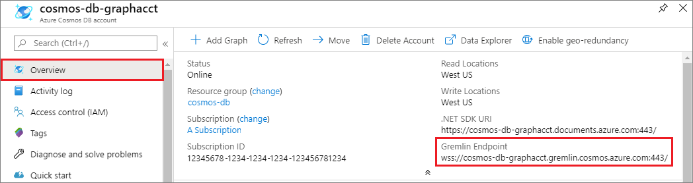

# Quickstart: Build a Node.js application by using Azure Cosmos DB Gremlin API account

> [!div class="op_single_selector"]
> * [Gremlin console](create-graph-gremlin-console.md)
> * [.NET](create-graph-dotnet.md)
> * [Java](create-graph-java.md)
> * [Node.js](create-graph-nodejs.md)
> * [Python](create-graph-python.md)
> * [PHP](create-graph-php.md)
>  

Azure Cosmos DB is the globally distributed multimodel database service from Microsoft. You can quickly create and query document, key/value, and graph databases, all of which benefit from the global distribution and horizontal scale capabilities at the core of Azure Cosmos DB. 

This quick start demonstrates how to create an Azure Cosmos DB [Gremlin API](graph-introduction.md) account, database, and graph using the Azure portal. You then build and run a console app by using the open-source [Gremlin Node.js](https://www.npmjs.com/package/gremlin) driver.

## Prerequisites

Before you can run this sample, you must have the following prerequisites:
* [Node.js](https://nodejs.org/en/) version v0.10.29 or later
* [Git](https://git-scm.com/)

[!INCLUDE [quickstarts-free-trial-note](../../includes/quickstarts-free-trial-note.md)]

## Create a database account

[!INCLUDE [cosmos-db-create-dbaccount-graph](../../includes/cosmos-db-create-dbaccount-graph.md)]

## Add a graph

[!INCLUDE [cosmos-db-create-graph](../../includes/cosmos-db-create-graph.md)]

## Clone the sample application

Now let's clone a Gremlin API app from GitHub, set the connection string, and run it. You'll see how easy it is to work with data programmatically. 

1. Open a command prompt, create a new folder named git-samples, then close the command prompt.

    ```bash
    md "C:\git-samples"
    ```

2. Open a git terminal window, such as git bash, and use the `cd` command to change to the new folder to install the sample app.

    ```bash
    cd "C:\git-samples"
    ```

3. Run the following command to clone the sample repository. This command creates a copy of the sample app on your computer.

    ```bash
    git clone https://github.com/Azure-Samples/azure-cosmos-db-graph-nodejs-getting-started.git
    ```

3. Open the solution file in Visual Studio. 

## Review the code

This step is optional. If you're interested in learning how the database resources are created in the code, you can review the following snippets. Otherwise, you can skip ahead to [Update your connection string](#update-your-connection-string). 

The following snippets are all taken from the app.js file.

* The Gremlin client is created.

    ```javascript
    const client = Gremlin.createClient(
        443, 
        config.endpoint, 
        { 
            "session": false, 
            "ssl": true, 
            "user": `/dbs/${config.database}/colls/${config.collection}`,
            "password": config.primaryKey
        });
    ```

  The configurations are all in `config.js`, which we edit in the [following section](#update-your-connection-string).

* A series of functions are defined to execute different Gremlin operations. This is one of them:

    ```javascript
    function addVertex1(callback)
    {
        console.log('Running Add Vertex1'); 
        client.execute("g.addV('person').property('id', 'thomas').property('firstName', 'Thomas').property('age', 44).property('userid', 1)", { }, (err, results) => {
          if (err) callback(console.error(err));
          console.log("Result: %s\n", JSON.stringify(results));
          callback(null)
        });
    }
    ```

* Each function executes a `client.execute` method with a Gremlin query string parameter. Here is an example of how `g.V().count()` is executed:

    ```javascript
    console.log('Running Count'); 
    client.execute("g.V().count()", { }, (err, results) => {
        if (err) return console.error(err);
        console.log(JSON.stringify(results));
        console.log();
    });
    ```

* At the end of the file, all methods are then invoked using the `async.waterfall()` method. This will execute them one after the other:

    ```javascript
    try{
        async.waterfall([
            dropGraph,
            addVertex1,
            addVertex2,
            addEdge,
            countVertices
            ], finish);
    } catch(err) {
        console.log(err)
    }
    ```


## Update your connection string

1. Open the config.js file. 

2. In config.js, fill in the `config.endpoint` key with the **Gremlin URI** value from the **Overview** page of the Azure portal. 

    `config.endpoint = "https://<your_Gremlin_account_name>.gremlin.cosmosdb.azure.com:443/";`

    

3. In config.js, fill in the config.primaryKey value with the **Primary Key** value from the **Keys** page of the Azure portal. 

    `config.primaryKey = "PRIMARYKEY";`

   

4. Enter the database name, and graph (container) name for the value of config.database and config.collection. 

Here's an example of what your completed config.js file should look like:

```javascript
var config = {}

// Note that this must not have HTTPS or the port number
config.endpoint = "https://testgraphacct.gremlin.cosmosdb.azure.com:443/"; 
config.primaryKey = "Pams6e7LEUS7LJ2Qk0fjZf3eGo65JdMWHmyn65i52w8ozPX2oxY3iP0yu05t9v1WymAHNcMwPIqNAEv3XDFsEg==";
config.database = "graphdb"
config.collection = "Persons"

module.exports = config;
```

## Run the console app

1. Open a terminal window and change (via `cd` command) to the installation directory for the package.json file that's included in the project.

2. Run `npm install` to install the required npm modules, including `gremlin`.

3. Run `node app.js` in a terminal to start your node application.

## Browse with Data Explorer

You can now go back to Data Explorer in the Azure portal to view, query, modify, and work with your new graph data.

In Data Explorer, the new database appears in the **Graphs** pane. Expand the database, followed by the container, and then select **Graph**.

The data generated by the sample app is displayed in the next pane within the **Graph** tab when you select **Apply Filter**.

Try completing `g.V()` with `.has('firstName', 'Thomas')` to test the filter. Note that the value is case sensitive.

## Review SLAs in the Azure portal

[!INCLUDE [cosmosdb-tutorial-review-slas](../../includes/cosmos-db-tutorial-review-slas.md)]

## Clean up your resources

[!INCLUDE [cosmosdb-delete-resource-group](../../includes/cosmos-db-delete-resource-group.md)]

## Next steps

In this article, you learned how to create an Azure Cosmos DB account, create a graph by using Data Explorer, and run an app. You can now build more complex queries and implement powerful graph traversal logic by using Gremlin. 

> [!div class="nextstepaction"]
> [Query by using Gremlin](tutorial-query-graph.md)
