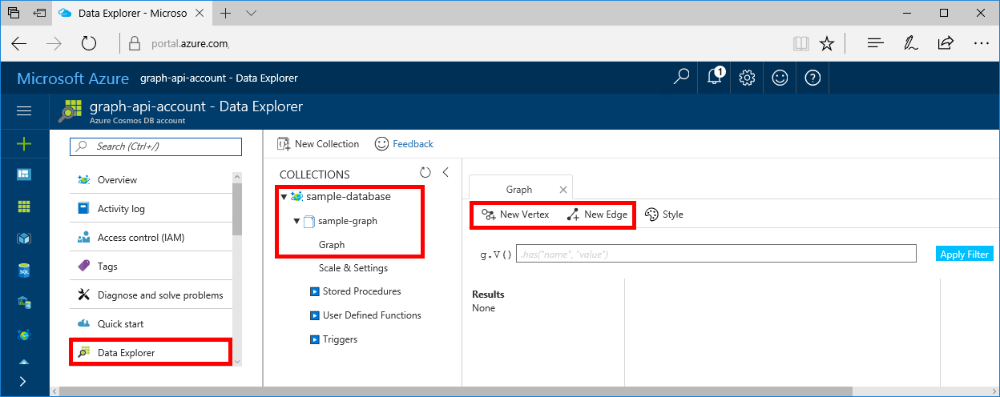
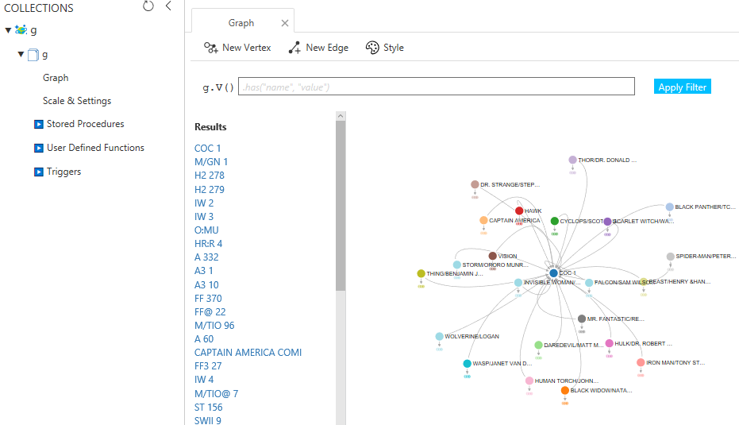

# Azure Cosmos DB: Build a Node.js application using the Graph API

Azure Cosmos DB is Microsoft’s globally distributed multi-model database service. You can quickly create and query document, key/value, and graph databases, all of which benefit from the global distribution and horizontal scale capabilities at the core of Azure Cosmos DB. 

This quick start demonstrates how to create an Azure Cosmos DB account, database, and graph using the Azure portal. You then build and run a console app using the OSS [Gremlin Node.js](https://aka.ms/gremlin-node) driver.  

## Prerequisites

* Before you can run this sample, you must have the following prerequisites:
	* [Node.js](https://nodejs.org/en/) version v0.10.29 or higher
	* [Git](http://git-scm.com/)

[!INCLUDE [quickstarts-free-trial-note](../../includes/quickstarts-free-trial-note.md)]

## Create a database account

[!INCLUDE [cosmosdb-create-dbaccount-graph](../../includes/cosmosdb-create-dbaccount-graph.md)]

## Add a graph

[!INCLUDE [cosmosdb-create-graph](../../includes/cosmosdb-create-graph.md)]

## Add sample data

You can now add data to your graph using Data Explorer.

1. In Data Explorer, expand **sample-database**, **sample-graph**, click **Graph**, and then click **New Vertex** and **New Edge** to add items to your graph. Note that the Data Explorer is also where you can scale your throughput, and add stored procedures, user defined functions, and triggers to your collection.

    

2. Once you've added some items, click the **Apply Filter** button, or right-click **Graph** and click **New Graph Query** to see the visual graph of your data. You can change how data is labeled and styled by clicking the **Style** button and changing your settings. Here's an example graph in Data Explorer, the labels, colors, and data shown can all be modified.

    

## Clone the sample application

Now let's clone a Graph API app from github, set the connection string, and run it. You'll see how easy it is to work with data programmatically. 

1. Open a git terminal window, such as git bash, and `cd` to a working directory.  

2. Run the following command to clone the sample repository. 

    ```bash
    git clone https://github.com/Azure-Samples/azure-cosmos-db-graph-nodejs-getting-started.git
    ```

3. Then open the solution file in Visual Studio. 

## Review the code

Let's make a quick review of what's happening in the app. Open the `app.js` file and you'll find that these lines of code.

* The Gremlin client is initialized.

    ```java
    const client = Gremlin.createClient(
        443, 
        "https://<fillme>.graphs.azure.com", 
        { 
            "session": false, 
            "ssl": true, 
            "user": "/dbs/<db>/colls/<coll>",
            "password": "<authKey>"
        });
    ```

* A series of Gremlin steps are executed using the `client.execute` method.

    ```java
    client.execute('g.V()', (err, results) => {
        if (!err) {
            console.log(results);
        }
    });
    ```

## Update your connection string

Now go back to the Azure portal to get your connection string information and copy it into the app.

1. In the [Azure portal](http://portal.azure.com/), in your Azure Cosmos DB account, in the left navigation click **Keys**, and then click **Read-write Keys**. You use the copy buttons on the right side of the screen to copy the URI and Primary Key into the `app.js` file in the next step.

    

2. Fill in your *endpoint*, *db*, *coll*, and *authKey* configurations in the `Program.java` file:

    ```nodejs
    const client = Gremlin.createClient(
        443, 
        "https://<endpoint>.graphs.azure.com", 
        { 
            "session": false, 
            "ssl": true, 
            "user": "/dbs/<db>/colls/<coll>",
            "password": "<authKey>"
        });
    ```

## Run the console app

1. Run `npm install` in a terminal to install required npm modules

2. Run `node app.js` in a terminal to start your node application.

You can now go back to Data Explorer and see query, modify, and work with this new data. 

## Browse using the Data Explorer

You can now go back to Data Explorer in the Azure portal and browse and query your new graph data.

* In Data Explorer, the new database appears in the Collections pane. Expand **graphdb**, **graphcoll**, and then click **Graph**.

    The data generated by the sample app is displayed in the Graphs pane.

## Review SLAs in the Azure portal

[!INCLUDE [cosmosdb-tutorial-review-slas](../../includes/cosmosdb-tutorial-review-slas.md)]

## Clean up resources

If you're not going to continue to use this app, delete all resources created by this quickstart in the Azure portal with the following steps: 

1. From the left-hand menu in the Azure portal, click **Resource groups** and then click the name of the resource you created. 
2. On your resource group page, click **Delete**, type the name of the resource to delete in the text box, and then click **Delete**.

## Next steps

In this quickstart, you've learned how to create an Azure Cosmos DB account, create a graph using the Data Explorer, and run an app. You can now build more complex queries and implement powerful graph traversal logic using Gremlin. 

> [!div class="nextstepaction"]
> [Query using Gremlin](tutorial-query-graph.md)

