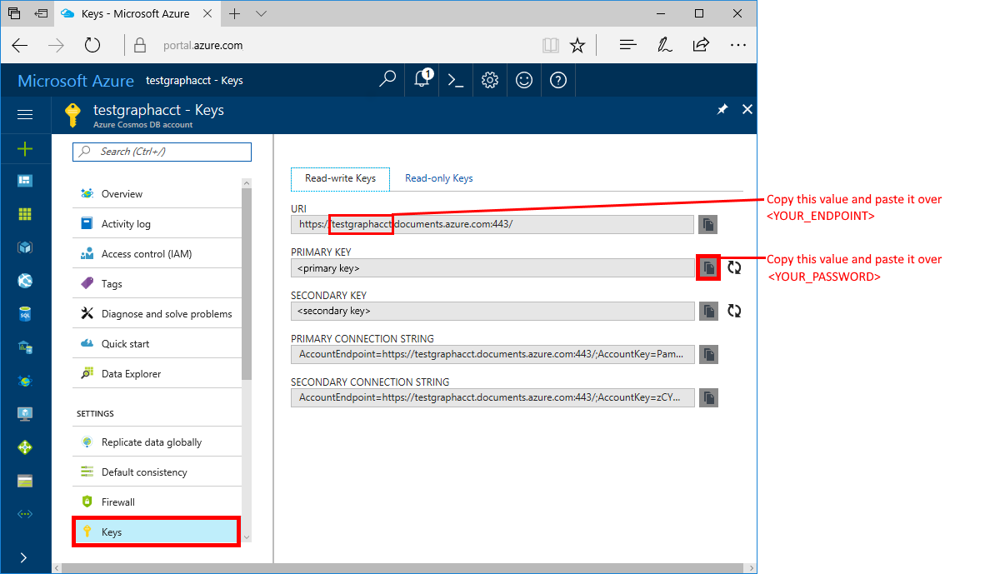
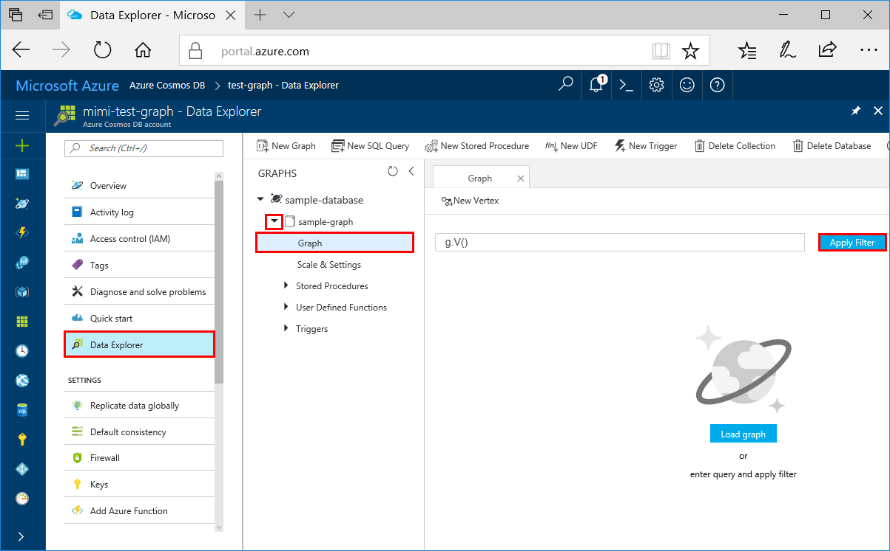
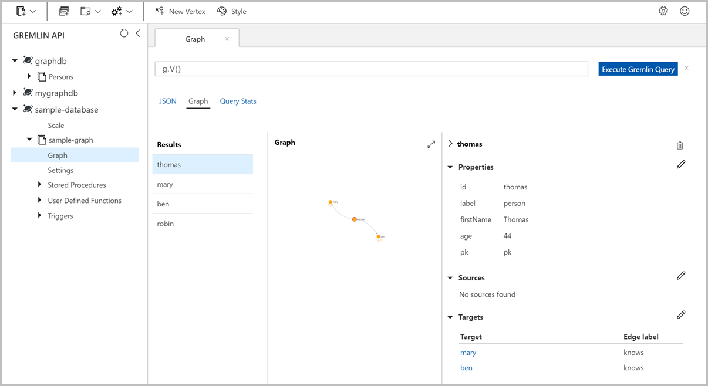

# Quickstart: Create a graph database in Azure Cosmos DB using Python and the Azure portal

> [!div class="op_single_selector"]
> * [Gremlin console](create-graph-gremlin-console.md)
> * [.NET](create-graph-dotnet.md)
> * [Java](create-graph-java.md)
> * [Node.js](create-graph-nodejs.md)
> * [Python](create-graph-python.md)
> * [PHP](create-graph-php.md)
>  

This quickstart shows how to use Python and the Azure Cosmos DB [Gremlin API](graph-introduction.md) to build a console app by cloning an example from GitHub. This quickstart also walks you through the creation of an Azure Cosmos DB account by using the web-based Azure portal.   

Azure Cosmos DB is Microsoft's globally distributed multi-model database service. You can quickly create and query document, table, key-value, and graph databases, all of which benefit from the global distribution and horizontal scale capabilities at the core of Azure Cosmos DB.  

> [!NOTE]
> This quickstart requires a graph database account created after December 20th, 2017. Existing accounts will support Python once they’re migrated to general availability.

## Prerequisites

[!INCLUDE [quickstarts-free-trial-note](../../includes/quickstarts-free-trial-note.md)] Alternatively, you can [Try Azure Cosmos DB for free](https://azure.microsoft.com/try/cosmosdb/) without an Azure subscription, free of charge and commitments.

In addition:
* [Python](https://www.python.org/downloads/) version v3.5 or newer
* [pip package manager](https://pip.pypa.io/en/stable/installing/)
* [Git](https://git-scm.com/)
* [Python Driver for Gremlin](https://github.com/apache/tinkerpop/tree/master/gremlin-python)

## Create a database account

Before you can create a graph database, you need to create a Gremlin (Graph) database account with Azure Cosmos DB.

[!INCLUDE [cosmos-db-create-dbaccount-graph](../../includes/cosmos-db-create-dbaccount-graph.md)]

## Add a graph

[!INCLUDE [cosmos-db-create-graph](../../includes/cosmos-db-create-graph.md)]

## Clone the sample application

Now let's switch to working with code. Let's clone a Gremlin API app from GitHub, set the connection string, and run it. You'll see how easy it is to work with data programmatically.  

1. Open a command prompt, create a new folder named git-samples, then close the command prompt.

    ```bash
    md "C:\git-samples"
    ```

2. Open a git terminal window, such as git bash, and use the `cd` command to change to a folder to install the sample app.  

    ```bash
    cd "C:\git-samples"
    ```

3. Run the following command to clone the sample repository. This command creates a copy of the sample app on your computer. 

    ```bash
    git clone https://github.com/Azure-Samples/azure-cosmos-db-graph-python-getting-started.git
    ```

## Review the code

This step is optional. If you're interested in learning how the database resources are created in the code, you can review the following snippets. The snippets are all taken from the connect.py file in the C:\git-samples\azure-cosmos-db-graph-python-getting-started\ folder. Otherwise, you can skip ahead to [Update your connection string](#update-your-connection-information). 

* The Gremlin `client` is initialized in line 104 in `connect.py`:

    ```python
    ...
    client = client.Client('wss://<YOUR_ENDPOINT>.gremlin.cosmosdb.azure.com:443/','g', 
        username="/dbs/<YOUR_DATABASE>/colls/<YOUR_COLLECTION_OR_GRAPH>", 
        password="<YOUR_PASSWORD>")
    ...
    ```

* A series of Gremlin steps are declared at the beginning of the `connect.py` file. They are then executed using the `client.submitAsync()` method:

    ```python
    client.submitAsync(_gremlin_cleanup_graph)
    ```

## Update your connection information

Now go back to the Azure portal to get your connection information and copy it into the app. These settings enable your app to communicate with your hosted database.

1. In the [Azure portal](https://portal.azure.com/), click **Keys**. 

    Copy the first portion of the URI value.

    

2. Open the connect.py file and in line 104 paste the URI value over `<YOUR_ENDPOINT>` in here:

    ```python
    client = client.Client('wss://<YOUR_ENDPOINT>.gremlin.cosmosdb.azure.com:443/','g', 
        username="/dbs/<YOUR_DATABASE>/colls/<YOUR_COLLECTION_OR_GRAPH>", 
        password="<YOUR_PASSWORD>")
    ```

    The URI portion of the client object should now look similar to this code:

    ```python
    client = client.Client('wss://test.gremlin.cosmosdb.azure.com:443/','g', 
        username="/dbs/<YOUR_DATABASE>/colls/<YOUR_COLLECTION_OR_GRAPH>", 
        password="<YOUR_PASSWORD>")
    ```

3. Change the second parameter of the `client` object to replace the `<YOUR_DATABASE>` and `<YOUR_COLLECTION_OR_GRAPH>` strings. If you used the suggested values, the parameter should look like this code:

    `username="/dbs/sample-database/colls/sample-graph"`

    The entire `client` object should now look like this code:

    ```python
    client = client.Client('wss://test.gremlin.cosmosdb.azure.com:443/','g', 
        username="/dbs/sample-database/colls/sample-graph", 
        password="<YOUR_PASSWORD>")
    ```

4. In the Azure portal, use the copy button to copy the PRIMARY KEY and paste it over `<YOUR_PASSWORD>` in the `password=<YOUR_PASSWORD>` parameter.

    The entire `client` object definition should now look like this code:
    ```python
    client = client.Client('wss://test.gremlin.cosmosdb.azure.com:443/','g', 
        username="/dbs/sample-database/colls/sample-graph", 
        password="asdb13Fadsf14FASc22Ggkr662ifxz2Mg==")
    ```

6. Save the `connect.py` file.

## Run the console app

1. In the git terminal window, `cd` to the azure-cosmos-db-graph-python-getting-started folder.

    ```git
    cd "C:\git-samples\azure-cosmos-db-graph-python-getting-started"
    ```

2. In the git terminal window, use the following command to install the required Python packages.

   ```
   pip install -r requirements.txt
   ```

3. In the git terminal window, use the following command to start the Python application.
    
    ```
    python connect.py
    ```

    The terminal window displays the vertices and edges being added to the graph. 
    
    If you experience timeout errors, check that you updated the connection information correctly in [Update your connection information](#update-your-connection-information), and also try running the last command again. 
    
    Once the program stops, press Enter, then switch back to the Azure portal in your internet browser.

<a id="add-sample-data"></a>
## Review and add sample data

You can now go back to Data Explorer and see the vertices added to the graph, and add additional data points.

1. Click **Data Explorer**, expand **sample-graph**, click **Graph**, and then click **Apply Filter**. 

   

2. In the **Results** list, notice the new users added to the graph. Select **ben** and notice that they're connected to robin. You can move the vertices around by dragging and dropping, zoom in and out by scrolling the wheel of your mouse, and expand the size of the graph with the double-arrow. 

   

3. Let's add a few new users. Click the **New Vertex** button to add data to your graph.

   

4. Enter a label of *person*.

5. Click **Add property** to add each of the following properties. Notice that you can create unique properties for each person in your graph. Only the id key is required.

    key|value|Notes
    ----|----|----
    id|ashley|The unique identifier for the vertex. If you don't specify an id, one is generated for you.
    gender|female| 
    tech | java | 

    > [!NOTE]
    > In this quickstart create a non-partitioned collection. However, if you create a partitioned collection by specifying a partition key during the collection creation, then you need to include the partition key as a key in each new vertex. 

6. Click **OK**. You may need to expand your screen to see **OK** on the bottom of the screen.

7. Click **New Vertex** again and add an additional new user. 

8. Enter a label of *person*.

9. Click **Add property** to add each of the following properties:

    key|value|Notes
    ----|----|----
    id|rakesh|The unique identifier for the vertex. If you don't specify an id, one is generated for you.
    gender|male| 
    school|MIT| 

10. Click **OK**. 

11. Click the **Apply Filter** button with the default `g.V()` filter to display all the values in the graph. All of the users now show in the **Results** list. 

    As you add more data, you can use filters to limit your results. By default, Data Explorer uses `g.V()` to retrieve all vertices in a graph. You can change it to a different [graph query](tutorial-query-graph.md), such as `g.V().count()`, to return a count of all the vertices in the graph in JSON format. If you changed the filter, change the filter back to `g.V()` and click **Apply Filter** to display all the results again.

12. Now we can connect rakesh and ashley. Ensure **ashley** is selected in the **Results** list, then click the edit button next to **Targets** on lower right side. You may need to widen your window to see the **Properties** area.

    

13. In the **Target** box type *rakesh*, and in the **Edge label** box type *knows*, and then click the check.

    

14. Now select **rakesh** from the results list and see that ashley and rakesh are connected. 

    

    That completes the resource creation part of this tutorial. You can continue to add vertexes to your graph, modify the existing vertexes, or change the queries. Now let's review the metrics Azure Cosmos DB provides, and then clean up the resources. 

## Review SLAs in the Azure portal

[!INCLUDE [cosmosdb-tutorial-review-slas](../../includes/cosmos-db-tutorial-review-slas.md)]

## Clean up resources

[!INCLUDE [cosmosdb-delete-resource-group](../../includes/cosmos-db-delete-resource-group.md)]

## Next steps

In this quickstart, you've learned how to create an Azure Cosmos DB account, create a graph using the Data Explorer, and run an app. You can now build more complex queries and implement powerful graph traversal logic using Gremlin. 

> [!div class="nextstepaction"]
> [Query using Gremlin](tutorial-query-graph.md)

