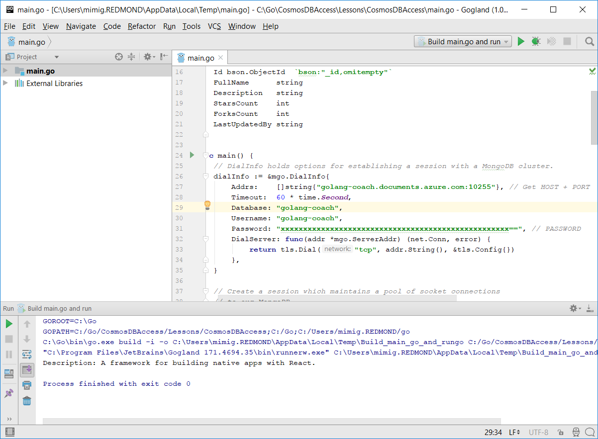
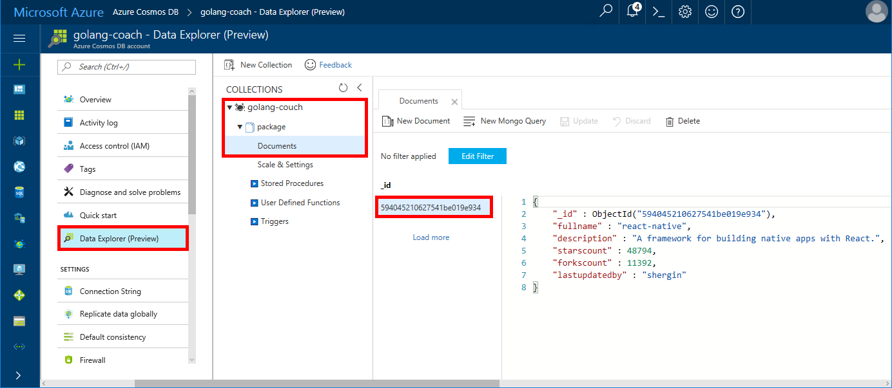

# Quickstart: Build a console app using Azure Cosmos DB's API for MongoDB and Golang SDK

> [!div class="op_single_selector"]
> * [.NET](create-mongodb-dotnet.md)
> * [Java](create-mongodb-java.md)
> * [Node.js](create-mongodb-nodejs.md)
> * [Python](create-mongodb-flask.md)
> * [Xamarin](create-mongodb-xamarin.md)
> * [Golang](create-mongodb-golang.md)
>  

Azure Cosmos DB is Microsoft’s globally distributed multi-model database service. You can quickly create and query document, key/value, and graph databases, all of which benefit from the global distribution and horizontal scale capabilities at the core of Cosmos DB.

This quickstart demonstrates how to take an existing MongoDB app written in [Golang](https://golang.org/) and connect it to your Cosmos database using the Azure Cosmos DB's API for MongoDB.

In other words, your Golang application only knows that it's connecting using a MongoDB client. It is transparent to the application that the data is stored in a Cosmos database.

## Prerequisites

- An Azure subscription. If you don’t have an Azure subscription, create a [free account](https://azure.microsoft.com/free) before you begin. 

  [!INCLUDE [cosmos-db-emulator-mongodb](../../includes/cosmos-db-emulator-mongodb.md)]

- [Go](https://golang.org/dl/) and a basic knowledge of the [Go](https://golang.org/) language.
- An IDE — [GoLand](https://www.jetbrains.com/go/) by Jetbrains, [Visual Studio Code](https://code.visualstudio.com/) by Microsoft, or [Atom](https://atom.io/). In this tutorial, I'm using GoLand.

<a id="create-account"></a>
## Create a database account

[!INCLUDE [cosmos-db-create-dbaccount](../../includes/cosmos-db-create-dbaccount-mongodb.md)]

## Clone the sample application

Clone the sample application and install the required packages.

1. Create a folder named CosmosDBSample inside the GOROOT\src folder, which is C:\Go\ by default.
2. Run the following command using a git terminal window such as git bash to clone the sample repository into the CosmosDBSample folder. 

    ```bash
    git clone https://github.com/Azure-Samples/azure-cosmos-db-mongodb-golang-getting-started.git
    ```
3.  Run the following command to get the mgo package. 

    ```
    go get gopkg.in/mgo.v2
    ```

The [mgo](https://labix.org/mgo) driver is a [MongoDB](https://www.mongodb.com/) driver for the [Go language](https://golang.org/) that implements a rich and well tested selection of features under a very simple API following standard Go idioms.

<a id="connection-string"></a>

## Update your connection string

Now go back to the Azure portal to get your connection string information and copy it into the app.

1. Click **Quick start** in the left navigation menu, and then click **Other** to view the connection string information required by the Go application.

2. In Goglang, open the main.go file in the GOROOT\CosmosDBSample directory and update the following lines of code using the connection string information from the Azure portal as shown in the following screenshot. 

    The Database name is the prefix of the **Host** value in the Azure portal connection string pane. For the account shown in the image below, the Database name is golang-coach.

    ```go
    Database: "The prefix of the Host value in the Azure portal",
    Username: "The Username in the Azure portal",
    Password: "The Password in the Azure portal",
    ```

    

3. Save the main.go file.

## Review the code

This step is optional. If you're interested in learning how the database resources are created in the code, you can review the following snippets. Otherwise, you can skip ahead to [Run the app](#run-the-app). 

The following snippets are all taken from the main.go file.

### Connecting the Go app to Cosmos DB

Azure Cosmos DB's API for MongoDB supports the SSL-enabled connection. To connect, you need to define the **DialServer** function in [mgo.DialInfo](https://godoc.org/gopkg.in/mgo.v2#DialInfo), and make use of the [tls.*Dial*](https://golang.org/pkg/crypto/tls#Dial) function to perform the connection.

The following Golang code snippet connects the Go app with Azure Cosmos DB's API for MongoDB. The *DialInfo* class holds options for establishing a session.

```go
// DialInfo holds options for establishing a session.
dialInfo := &mgo.DialInfo{
    Addrs:    []string{"golang-couch.documents.azure.com:10255"}, // Get HOST + PORT
    Timeout:  60 * time.Second,
    Database: "database", // It can be anything
    Username: "username", // Username
    Password: "Azure database connect password from Azure Portal", // PASSWORD
    DialServer: func(addr *mgo.ServerAddr) (net.Conn, error) {
        return tls.Dial("tcp", addr.String(), &tls.Config{})
    },
}

// Create a session which maintains a pool of socket connections
// to Cosmos database (using Azure Cosmos DB's API for MongoDB).
session, err := mgo.DialWithInfo(dialInfo)

if err != nil {
    fmt.Printf("Can't connect, go error %v\n", err)
    os.Exit(1)
}

defer session.Close()

// SetSafe changes the session safety mode.
// If the safe parameter is nil, the session is put in unsafe mode, 
// and writes become fire-and-forget,
// without error checking. The unsafe mode is faster since operations won't hold on waiting for a confirmation.
// 
session.SetSafe(&mgo.Safe{})
```

The **mgo.Dial()** method is used when there is no SSL connection. For an SSL connection, the **mgo.DialWithInfo()** method is required.

An instance of the **DialWIthInfo{}** object is used to create the session object. Once the session is established, you can access the collection by using the following code snippet:

```go
collection := session.DB("database").C("package")
```

<a id="create-document"></a>

### Create a document

```go
// Model
type Package struct {
    Id bson.ObjectId  `bson:"_id,omitempty"`
    FullName      string
    Description   string
    StarsCount    int
    ForksCount    int
    LastUpdatedBy string
}

// insert Document in collection
err = collection.Insert(&Package{
    FullName:"react",
    Description:"A framework for building native apps with React.",
    ForksCount: 11392,
    StarsCount:48794,
    LastUpdatedBy:"shergin",

})

if err != nil {
    log.Fatal("Problem inserting data: ", err)
    return
}
```

### Query or read a document

Cosmos DB supports rich queries against data stored in each collection. The following sample code shows a query that you can run against the documents in your collection.

```go
// Get a Document from the collection
result := Package{}
err = collection.Find(bson.M{"fullname": "react"}).One(&result)
if err != nil {
    log.Fatal("Error finding record: ", err)
    return
}

fmt.Println("Description:", result.Description)
```


### Update a document

```go
// Update a document
updateQuery := bson.M{"_id": result.Id}
change := bson.M{"$set": bson.M{"fullname": "react-native"}}
err = collection.Update(updateQuery, change)
if err != nil {
    log.Fatal("Error updating record: ", err)
    return
}
```

### Delete a document

Cosmos DB supports deletion of documents.

```go
// Delete a document
query := bson.M{"_id": result.Id}
err = collection.Remove(query)
if err != nil {
   log.Fatal("Error deleting record: ", err)
   return
}
```
    
## Run the app

1. In Golang, ensure that your GOPATH (available under **File**, **Settings**, **Go**, **GOPATH**) include the location in which the gopkg was installed, which is USERPROFILE\go by default. 
2. Comment out the lines that delete the document, lines 103-107, so that you can see the document after running the app.
3. In Golang, click **Run**, and then click **Run 'Build main.go and run'**.

    The app finishes and displays the description of the document created in [Create a document](#create-document).
    
    ```
    Description: A framework for building native apps with React.
    
    Process finished with exit code 0
    ```

    
    
## Review your document in Data Explorer

Go back to the Azure portal to see your document in Data Explorer.

1. Click **Data Explorer (Preview)** in the left navigation menu, expand **golang-coach**, **package**, and then click **Documents**. In the **Documents** tab, click the \_id to display the document in the right pane. 

    
    
2. You can then work with the document inline and click **Update** to save it. You can also delete the document, or create new documents or queries.

## Review SLAs in the Azure portal

[!INCLUDE [cosmosdb-tutorial-review-slas](../../includes/cosmos-db-tutorial-review-slas.md)]

## Clean up resources

[!INCLUDE [cosmosdb-delete-resource-group](../../includes/cosmos-db-delete-resource-group.md)]

## Next steps

In this quickstart, you've learned how to create a Cosmos account and run a Golang app. You can now import additional data to your Cosmos database. 

> [!div class="nextstepaction"]
> [Import MongoDB data into Azure Cosmos DB](mongodb-migrate.md)
