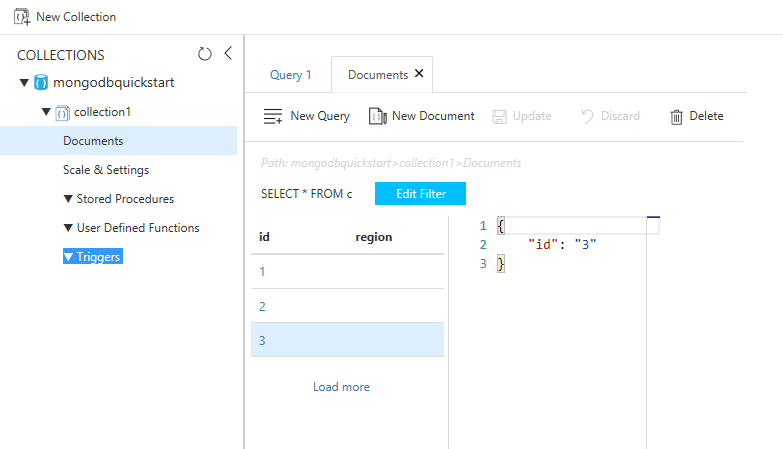

# Quickstart: Migrate an existing MongoDB Node.js web app to Azure Cosmos DB 

> [!div class="op_single_selector"]
> * [.NET](create-mongodb-dotnet.md)
> * [Java](create-mongodb-java.md)
> * [Node.js](create-mongodb-nodejs.md)
> * [Python](create-mongodb-flask.md)
> * [Xamarin](create-mongodb-xamarin.md)
> * [Golang](create-mongodb-go.md)
>  

In this quickstart, you create and manage an Azure Cosmos DB for Mongo DB API account by using the Azure Cloud Shell, and with a MEAN (MongoDB, Express, Angular, and Node.js) app cloned from GitHub. Azure Cosmos DB is a multi-model database service that lets you quickly create and query document, table, key-value, and graph databases with global distribution and horizontal scale capabilities.

## Prerequisites
- An Azure account with an active subscription. [Create one for free](https://azure.microsoft.com/free/?ref=microsoft.com&utm_source=microsoft.com&utm_medium=docs&utm_campaign=visualstudio). Or [try Azure Cosmos DB for free](https://azure.microsoft.com/try/cosmosdb/) without an Azure subscription. You can also use the [Azure Cosmos DB Emulator](https://aka.ms/cosmosdb-emulator) with the connection string `.mongodb://localhost:C2y6yDjf5/R+ob0N8A7Cgv30VRDJIWEHLM+4QDU5DE2nQ9nDuVTqobD4b8mGGyPMbIZnqyMsEcaGQy67XIw/Jw==@localhost:10255/admin?ssl=true`.
- [Node.js](https://nodejs.org/), and a working knowledge of Node.js.
- [Git](https://git-scm.com/downloads).
- If you don't want to use Azure Cloud Shell, [Azure CLI 2.0+](/cli/azure/install-azure-cli).

[!INCLUDE [cloud-shell-try-it](../../includes/cloud-shell-try-it.md)]

## Clone the sample application

Run the following commands to clone the sample repository. This sample repository contains the default [MEAN.js](https://meanjs.org/) application.

1. Open a command prompt, create a new folder named git-samples, then close the command prompt.

    ```bash
    mkdir "C:\git-samples"
    ```

2. Open a git terminal window, such as git bash, and use the `cd` command to change to the new folder to install the sample app.

    ```bash
    cd "C:\git-samples"
    ```

3. Run the following command to clone the sample repository. This command creates a copy of the sample app on your computer. 

    ```bash
    git clone https://github.com/prashanthmadi/mean
    ```

## Run the application

This MongoDB app written in Node.js connects to your Azure Cosmos DB database, which supports MongoDB client. In other words, it is transparent to the application that the data is stored in an Azure Cosmos DB database.

Install the required packages and start the application.

```bash
cd mean
npm install
npm start
```
The application will try to connect to a MongoDB source and fail, go ahead and exit the application when the output returns "[MongoError: connect ECONNREFUSED 127.0.0.1:27017]".

## Sign in to Azure

If you choose to install and use the CLI locally, this topic requires that you are running the Azure CLI version 2.0 or later. Run `az --version` to find the version. If you need to install or upgrade, see [Install Azure CLI]. 

If you are using an installed Azure CLI, sign in to your Azure subscription with the [az login](/cli/azure/reference-index#az-login) command and follow the on-screen directions. You can skip this step if you're using the Azure Cloud Shell.

```azurecli
az login 
``` 
   
## Add the Azure Cosmos DB module

If you are using an installed Azure CLI, check to see if the `cosmosdb` component is already installed by running the `az` command. If `cosmosdb` is in the list of base commands, proceed to the next command. You can skip this step if you're using the Azure Cloud Shell.

If `cosmosdb` is not in the list of base commands, reinstall [Azure CLI](/cli/azure/install-azure-cli).

## Create a resource group

Create a [resource group](../azure-resource-manager/management/overview.md) with the [az group create](/cli/azure/group#az-group-create). An Azure resource group is a logical container into which Azure resources like web apps, databases and storage accounts are deployed and managed. 

The following example creates a resource group in the West Europe region. Choose a unique name for the resource group.

If you are using Azure Cloud Shell, select **Try It**, follow the onscreen prompts to login, then copy the command into the command prompt.

```azurecli-interactive
az group create --name myResourceGroup --location "West Europe"
```

## Create an Azure Cosmos DB account

Create a Cosmos account with the [az cosmosdb create](/cli/azure/cosmosdb#az-cosmosdb-create) command.

In the following command, please substitute your own unique Cosmos account name where you see the `<cosmosdb-name>` placeholder. This unique name will be used as part of your Cosmos DB endpoint (`https://<cosmosdb-name>.documents.azure.com/`), so the name needs to be unique across all Cosmos accounts in Azure. 

```azurecli-interactive
az cosmosdb create --name <cosmosdb-name> --resource-group myResourceGroup --kind MongoDB
```

The `--kind MongoDB` parameter enables MongoDB client connections.

When the Azure Cosmos DB account is created, the Azure CLI shows information similar to the following example. 

> [!NOTE]
> This example uses JSON as the Azure CLI output format, which is the default. To use another output format, see [Output formats for Azure CLI commands](https://docs.microsoft.com/cli/azure/format-output-azure-cli).

```json
{
  "databaseAccountOfferType": "Standard",
  "documentEndpoint": "https://<cosmosdb-name>.documents.azure.com:443/",
  "id": "/subscriptions/00000000-0000-0000-0000-000000000000/resourceGroups/myResourceGroup/providers/Microsoft.Document
DB/databaseAccounts/<cosmosdb-name>",
  "kind": "MongoDB",
  "location": "West Europe",
  "name": "<cosmosdb-name>",
  "readLocations": [
    {
      "documentEndpoint": "https://<cosmosdb-name>-westeurope.documents.azure.com:443/",
      "failoverPriority": 0,
      "id": "<cosmosdb-name>-westeurope",
      "locationName": "West Europe",
      "provisioningState": "Succeeded"
    }
  ],
  "resourceGroup": "myResourceGroup",
  "type": "Microsoft.DocumentDB/databaseAccounts",
  "writeLocations": [
    {
      "documentEndpoint": "https://<cosmosdb-name>-westeurope.documents.azure.com:443/",
      "failoverPriority": 0,
      "id": "<cosmosdb-name>-westeurope",
      "locationName": "West Europe",
      "provisioningState": "Succeeded"
    }
  ]
} 
```

## Connect your Node.js application to the database

In this step, you connect your MEAN.js sample application to the Azure Cosmos DB database account you just created. 

<a name="devconfig"></a>
## Configure the connection string in your Node.js application

In your MEAN.js repository, open `config/env/local-development.js`.

Replace the content of this file with the following code. Be sure to also replace the two `<cosmosdb-name>` placeholders with your Cosmos account name.

```javascript
'use strict';

module.exports = {
  db: {
    uri: 'mongodb://<cosmosdb-name>:<primary_master_key>@<cosmosdb-name>.documents.azure.com:10255/mean-dev?ssl=true&sslverifycertificate=false'
  }
};
```

## Retrieve the key

In order to connect to a Cosmos database, you need the database key. Use the [az cosmosdb keys list](/cli/azure/cosmosdb/keys#az-cosmosdb-keys-list) command to retrieve the primary key.

```azurecli-interactive
az cosmosdb keys list --name <cosmosdb-name> --resource-group myResourceGroup --query "primaryMasterKey"
```

The Azure CLI outputs information similar to the following example. 

```json
"RUayjYjixJDWG5xTqIiXjC..."
```

Copy the value of `primaryMasterKey`. Paste this over the  `<primary_master_key>` in `local-development.js`.

Save your changes.

### Run the application again.

Run `npm start` again. 

```bash
npm start
```

A console message should now tell you that the development environment is up and running. 

Go to `http://localhost:3000` in a browser. Select **Sign Up** in the top menu and try to create two dummy users. 

The MEAN.js sample application stores user data in the database. If you are successful and MEAN.js automatically signs into the created user, then your Azure Cosmos DB connection is working. 


## View data in Data Explorer

Data stored in a Cosmos database is available to view and query in the Azure portal.

To view, query, and work with the user data created in the previous step, login to the [Azure portal](https://portal.azure.com) in your web browser.

In the top Search box, enter **Azure Cosmos DB**. When your Cosmos account blade opens, select your Cosmos account. In the left navigation, select **Data Explorer**. Expand your collection in the Collections pane, and then you can view the documents in the collection, query the data, and even create and run stored procedures, triggers, and UDFs. 




## Deploy the Node.js application to Azure

In this step, you deploy your Node.js application to Cosmos DB.

You may have noticed that the configuration file that you changed earlier is for the development environment (`/config/env/local-development.js`). When you deploy your application to App Service, it will run in the production environment by default. So now, you need to make the same change to the respective configuration file.

In your MEAN.js repository, open `config/env/production.js`.

In the `db` object, replace the value of `uri` as show in the following example. Be sure to replace the placeholders as before.

```javascript
'mongodb://<cosmosdb-name>:<primary_master_key>@<cosmosdb-name>.documents.azure.com:10255/mean?ssl=true&sslverifycertificate=false',
```

> [!NOTE] 
> The `ssl=true` option is important because of Cosmos DB requirements. For more information, see [Connection string requirements](connect-mongodb-account.md#connection-string-requirements).
>
>

In the terminal, commit all your changes into Git. You can copy both commands to run them together.

```bash
git add .
git commit -m "configured MongoDB connection string"
```
## Clean up resources

[!INCLUDE [cosmosdb-delete-resource-group](../../includes/cosmos-db-delete-resource-group.md)]

## Next steps

In this quickstart, you learned how to create an Azure Cosmos DB MongoDB API account using the Azure Cloud Shell, and create and run a MEAN.js app to add users to the account. You can now import additional data to your Azure Cosmos DB account.

> [!div class="nextstepaction"]
> [Import MongoDB data into Azure Cosmos DB](mongodb-migrate.md)
