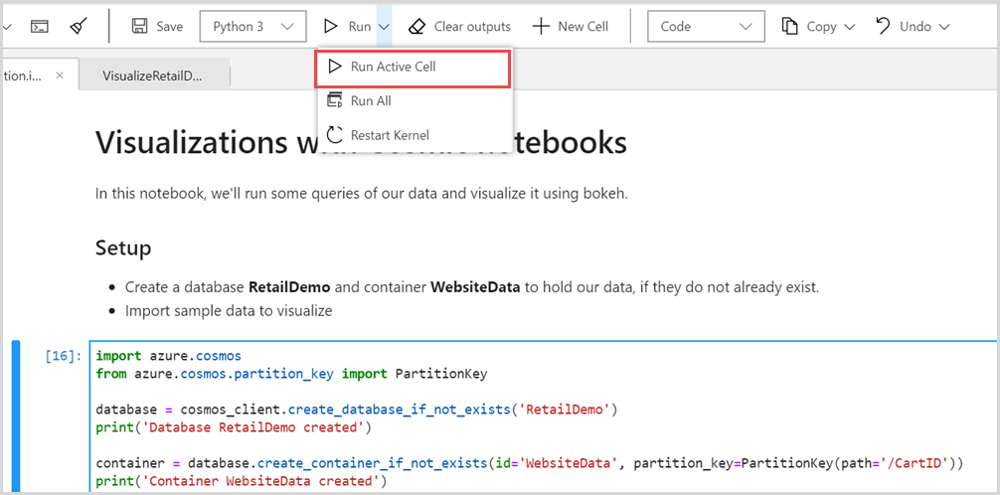
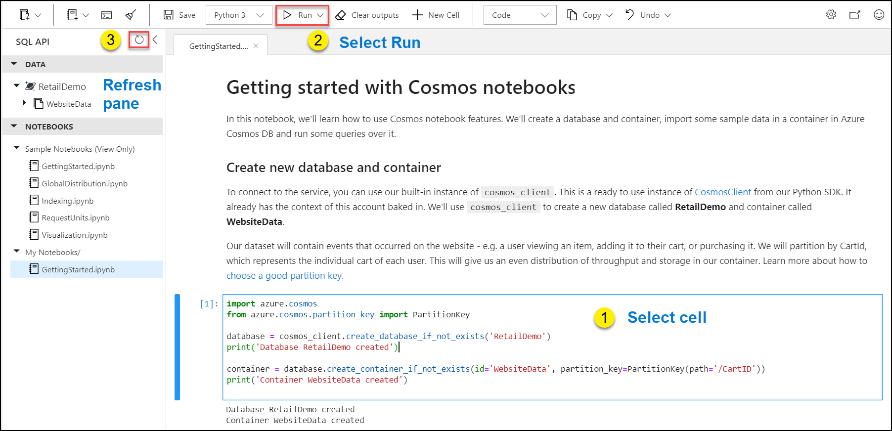
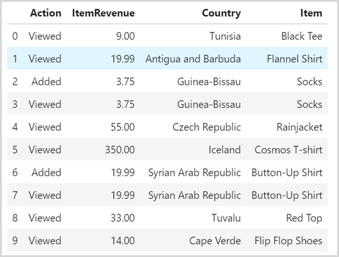
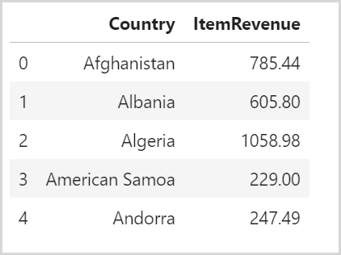
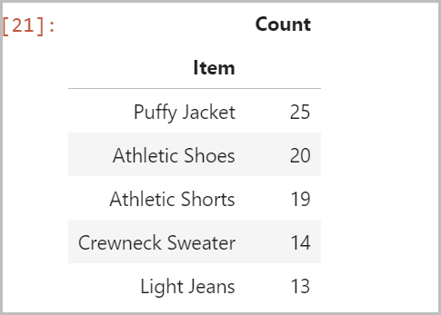
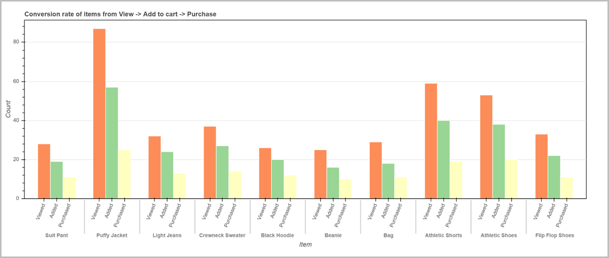

# Tutorial: Create a notebook in Azure Cosmos DB to analyze and visualize the data

This article describes how to use built-in Jupyter notebooks to import sample retail data to Azure Cosmos DB. You will see how to use the SQL and Azure Cosmos DB magic commands to run queries, analyze the data, and visualize the results.

## Prerequisites

* [Enable notebooks support while creating the Azure Cosmos account](enable-notebooks.md)

## Create the resources and import data
 
In this section, you will create the Azure Cosmos database, container, and import the retail data to the container.

1. Navigate to your Azure Cosmos account and open the **Data Explorer.**

1. Go to the **Notebooks** tab, select `…` next to **My Notebooks** and create a **New Notebook**. Select **Python 3** as the default Kernel.

   

1. After a new notebook is created, you can rename it to something like **VisualizeRetailData.ipynb.**

1. Next you will create a database named "RetailDemo" and a container named "WebsiteData" to store the retail data. You can use /CartID as the partition key. Copy and paste the following code to a new cell in your notebook and run it:

   ```python
   import azure.cosmos
   from azure.cosmos.partition_key import PartitionKey

   database = cosmos_client.create_database_if_not_exists('RetailDemo')
   print('Database RetailDemo created')

   container = database.create_container_if_not_exists(id='WebsiteData', partition_key=PartitionKey(path='/CartID'))
   print('Container WebsiteData created')
   ```

   To run a cell, select `Shift + Enter` Or select the cell and choose **Run Active Cell** option at the data explorer navigation bar.

   

   The database and container are created in your current Azure Cosmos account. The container is provisioned with 400 RU/s. You will see the following output after the database and container is created. 

   ```console
    Database RetailDemo created
    Container WebsiteData created
   ```

   You can also refresh the **Data** tab and see the newly created resources:

   

1. Next you will import the sample retail data into Azure Cosmos container. Here is the format of an item from the retail data:

   ```json
    {
       "CartID":5399,
       "Action":"Viewed",
       "Item":"Cosmos T-shirt",
       "Price":350,
       "UserName":"Demo.User10",
       "Country":"Iceland",
       "EventDate":"2015-06-25T00:00:00",
       "Year":2015,"Latitude":-66.8673,
       "Longitude":-29.8214,
       "Address":"852 Modesto Loop, Port Ola, Iceland",
       "id":"00ffd39c-7e98-4451-9b91-b2bcf2f9a32d"
    }
   ```

   For the tutorial purpose, the sample retail data is stored in the Azure blob storage. You can import it to the Azure Cosmos container by pasting the following code into a new cell. You can confirm that the data is successfully imported by running a query to select the number of items.

   ```python
    # Read data from storage
    import urllib.request, json

    with urllib.request.urlopen("https://cosmosnotebooksdata.blob.core.windows.net/notebookdata/websiteData.json") as url:
      data = json.loads(url.read().decode())

    print("Importing data. This will take a few minutes...\n")

    for event in data:
     try: 
        container.upsert_item(body=event)
     except errors.CosmosHttpResponseError as e:
        raise
        
    ## Run a query against the container to see number of documents
    query = 'SELECT VALUE COUNT(1) FROM c'
    result = list(container.query_items(query, enable_cross_partition_query=True))

    print('Container with id \'{0}\' contains \'{1}\' items'.format(container.id, result[0]))
   ```

   When you run the previous query, it returns the following output:

   ```console
   Importing data. This will take a few minutes...

   Container with id 'WebsiteData' contains '2654' items
   ```

## Get your data into a DataFrame

Before running queries to analyze the data, you can read the data from container to a [Pandas DataFrame](https://pandas.pydata.org/pandas-docs/stable/reference/api/pandas.DataFrame.html) for analysis. Use the following sql magic command to read the data into a DataFrame:

```bash
%%sql --database {database_id} --container {container_id} --output outputDataframeVar 
{Query text}
```

To learn more, see the [built-in notebook commands and features in Azure Cosmos DB](use-python-notebook-features-and-commands.md) article. You will run the query- `SELECT c.Action, c.Price as ItemRevenue, c.Country, c.Item FROM c`. The results will be saved into a Pandas DataFrame named df_cosmos. Paste the following command in a new notebook cell and run it:

```python
%%sql --database RetailDemo --container WebsiteData --output df_cosmos
SELECT c.Action, c.Price as ItemRevenue, c.Country, c.Item FROM c
```

In a new notebook cell, run the following code to read the first 10 items from the output:

```python
# See a sample of the result
df_cosmos.head(10)
```



## Run queries and analyze your data

In this section, you will run some queries on the data retrieved.

* **Query1:** Run a Group by query on the DataFrame to get the sum of total sales revenue for each country/region and display 5 items from the results. In a new notebook cell, run the following code:

   ```python
   df_revenue = df_cosmos.groupby("Country").sum().reset_index()
   display(df_revenue.head(5))
   ```

   

* **Query2:** To get a list of top five purchased items, open a new notebook cell and run the following code:

   ```python
   import pandas as pd

   ## What are the top 5 purchased items?
   pd.DataFrame(df_cosmos[df_cosmos['Action']=='Purchased'].groupby('Item').size().sort_values(ascending=False).head(5), columns=['Count'])
   ```

   

## Visualize your data  

1. Now that we have our data on revenue from the Azure Cosmos container, you can visualize your data with a visualization library of your choice. In this tutorial, we will use Bokeh library. Open a new notebook cell and run the following code to install the Bokeh library. After all the requirements are satisfied, the library will be installed.

   ```python
   import sys
   !{sys.executable} -m pip install bokeh --user
   ```

1. Next prepare to plot the data on a map. Join the data in Azure Cosmos DB with country/region information located in Azure Blob storage and convert the result to GeoJSON format. Copy the following code to a new notebook cell and run it.

   ```python
   import urllib.request, json
   import geopandas as gpd

   # Load country/region information for mapping
   countries = gpd.read_file("https://cosmosnotebooksdata.blob.core.windows.net/notebookdata/countries.json")

   # Merge the countries/regions dataframe with our data in Azure Cosmos DB, joining on country/region code
   df_merged = countries.merge(df_revenue, left_on = 'admin', right_on = 'Country', how='left')

   # Convert to GeoJSON so bokeh can plot it
   merged_json = json.loads(df_merged.to_json())
   json_data = json.dumps(merged_json)
   ```

1. Visualize the sales revenue of different countries/regions on a world map by running the following code in a new notebook cell:

   ```python
   from bokeh.io import output_notebook, show
   from bokeh.plotting import figure
   from bokeh.models import GeoJSONDataSource, LinearColorMapper, ColorBar
   from bokeh.palettes import brewer
    
   #Input GeoJSON source that contains features for plotting.
   geosource = GeoJSONDataSource(geojson = json_data)
    
   #Choose our choropleth color palette: https://bokeh.pydata.org/en/latest/docs/reference/palettes.html
   palette = brewer['YlGn'][8]
    
   #Reverse color order so that dark green is highest revenue
   palette = palette[::-1]
    
   #Instantiate LinearColorMapper that linearly maps numbers in a range, into a sequence of colors.
   color_mapper = LinearColorMapper(palette = palette, low = 0, high = 1000)
    
   #Define custom tick labels for color bar.
   tick_labels = {'0': '$0', '250': '$250', '500':'$500', '750':'$750', '1000':'$1000', '1250':'$1250', '1500':'$1500','1750':'$1750', '2000': '>$2000'}
    
   #Create color bar. 
   color_bar = ColorBar(color_mapper=color_mapper, label_standoff=8,width = 500, height = 20,
   border_line_color=None,location = (0,0), orientation = 'horizontal', major_label_overrides = tick_labels)
    
   #Create figure object.
   p = figure(title = 'Sales revenue by country', plot_height = 600 , plot_width = 1150, toolbar_location = None)
   p.xgrid.grid_line_color = None
   p.ygrid.grid_line_color = None
    
   #Add patch renderer to figure. 
   p.patches('xs','ys', source = geosource,fill_color = {'field' :'ItemRevenue', 'transform' : color_mapper},
              line_color = 'black', line_width = 0.25, fill_alpha = 1)
    
   #Specify figure layout.
   p.add_layout(color_bar, 'below')
    
   #Display figure inline in Jupyter Notebook.
   output_notebook()
   
   #Display figure.
   show(p)
   ```

   The output displays the world map with different colors. The colors darker to lighter represent the countries/regions with highest revenue to lowest revenue.

   

1. Let's see another case of data visualization. The WebsiteData container has record of users who viewed an item, added to their cart, and purchased the item. Let's plot the conversion rate of items purchased. Run the following code in a new cell to visualize the conversion rate for each item:

   ```python
   from bokeh.io import show, output_notebook
   from bokeh.plotting import figure
   from bokeh.palettes import Spectral3
   from bokeh.transform import factor_cmap
   from bokeh.models import ColumnDataSource, FactorRange
       
   # Get the top 10 items as an array
   top_10_items = df_cosmos[df_cosmos['Action']=='Purchased'].groupby('Item').size().sort_values(ascending=False)[:10].index.values.tolist()
    
   # Filter our data to only these 10 items
   df_top10 = df_cosmos[df_cosmos['Item'].isin(top_10_items)]
    
   # Group by Item and Action, sorting by event count
   df_top10_sorted = df_top10.groupby(['Item', 'Action']).count().rename(columns={'Country':'ResultCount'}, inplace=False).reset_index().sort_values(['Item', 'ResultCount'], ascending = False).set_index(['Item', 'Action'])
    
   # Get sorted X-axis values - this way, we can display the funnel of view -> add -> purchase
   x_axis_values = df_top10_sorted.index.values.tolist()
    
   group = df_top10_sorted.groupby(['Item', 'Action'])
    
   # Specifiy colors for X axis
   index_cmap = factor_cmap('Item_Action', palette=Spectral3, factors=sorted(df_top10.Action.unique()), start=1, end=2)
    
   # Create the plot
    
   p = figure(plot_width=1200, plot_height=500, title="Conversion rate of items from View -> Add to cart -> Purchase", x_range=FactorRange(*x_axis_values), toolbar_location=None, tooltips=[("Number of events", "@ResultCount_max"), ("Item, Action", "@Item_Action")])
    
   p.vbar(x='Item_Action', top='ItemRevenue_max', width=1, source=group,
           line_color="white", fill_color=index_cmap, )
    
   #Configure how the plot looks
   p.y_range.start = 0
   p.x_range.range_padding = 0.05
   p.xgrid.grid_line_color = None
   p.xaxis.major_label_orientation = 1.2
   p.outline_line_color = "black"
   p.xaxis.axis_label = "Item"
   p.yaxis.axis_label = "Count"
    
   #Display figure inline in Jupyter Notebook.
   output_notebook()
    
   #Display figure.
   show(p)
   ```

   

## Next steps

* To learn more about Python notebook commands, see [how to use built-in notebook commands and features in Azure Cosmos DB](use-python-notebook-features-and-commands.md) article.
