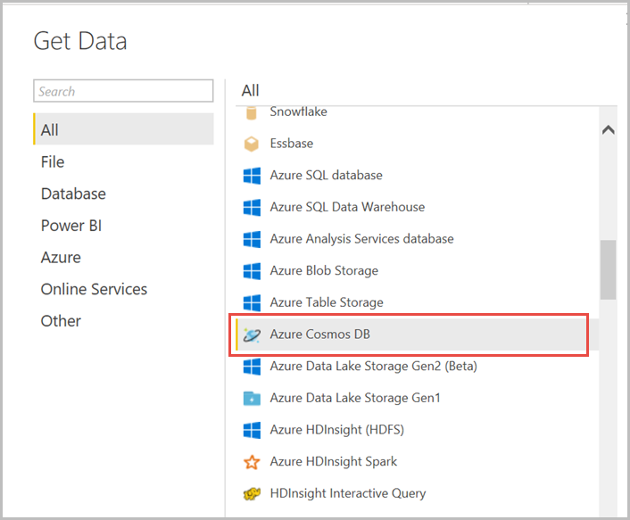
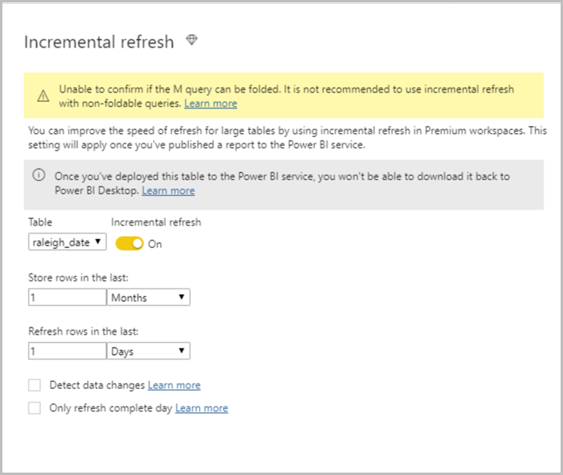
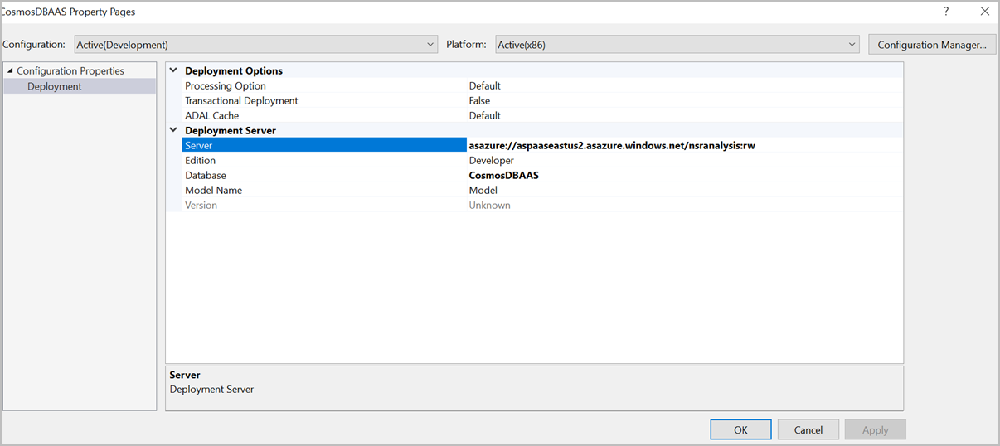

# Create a real-time dashboard using Azure Cosmos DB and Power BI

This article describes the steps required to create a live weather dashboard in Power BI using Azure Cosmos DB and Azure Analysis Services. The Power BI dashboard will display charts to show real-time information about temperature and rainfall in a region.

## Reporting scenarios

There are multiple ways to set up reporting dashboards on data stored in Azure Cosmos DB. Depending on the staleness requirements and the size of the data, the following table describes the reporting setup for each scenario:


|Scenario |Setup |
|---------|---------|
|1. Generating ad-hoc reports (no refresh)    |  [Power BI Azure Cosmos DB connector with import mode](powerbi-visualize.md)       |
|2. Generating ad-hoc reports with periodic refresh   |  [Power BI Azure Cosmos DB connector with import mode (Scheduled periodic refresh)](powerbi-visualize.md)       |
|3. Reporting on large data sets (< 10 GB)     |  Power BI Azure Cosmos DB connector with incremental refresh       |
|4. Reporting real time on large data sets    |  Power BI Azure Analysis Services connector with direct query + Azure Analysis Services (Azure Cosmos DB connector)       |
|5. Reporting on live data with aggregates     |  [Power BI Spark connector with direct query + Azure Databricks + Cosmos DB Spark connector.](https://github.com/Azure/azure-cosmosdb-spark/wiki/Connecting-Cosmos-DB-with-PowerBI-using-spark-and-databricks-premium)       |
|6. Reporting on live data with aggregates on large data sets   |  Power BI Azure Analysis Services connector with direct query + Azure Analysis Services + Azure Databricks + Cosmos DB Spark connector.       |

Scenarios 1 and 2 can be easily set up using the Azure Cosmos DB Power BI connector. This article describes the setups for scenarios 3 and 4.

### Power BI with incremental refresh

Power BI has a mode where incremental refresh can be configured. This mode eliminates the need to create and manage Azure Analysis Services partitions. Incremental refresh can be set up to filter only the latest updates in large datasets. However, this mode works only with Power BI Premium service that has a dataset limitation of 10 GB.

### Power BI Azure Analysis connector + Azure Analysis Services

Azure Analysis Services provides a fully managed platform as a service that hosts enterprise-grade data models in the cloud. Massive data sets can be loaded from Azure Cosmos DB into Azure Analysis Services. To avoid querying the entire dataset all the time, the datasets can be subdivided into Azure Analysis Services partitions, which can be refreshed independently at different frequencies.

## Power BI incremental refresh

### Ingest weather data into Azure Cosmos DB

Set up an ingestion pipeline to load [weather data](https://catalog.data.gov/dataset/local-weather-archive) to Azure Cosmos DB. You can set up an [Azure Data Factory (ADF)](../data-factory/connector-azure-cosmos-db.md) job to periodically load the latest weather data into Azure Cosmos DB using the HTTP Source and Cosmos DB sink.


### Connect Power BI to Azure Cosmos DB

1. **Connect Azure Cosmos account to Power BI** - Open the Power BI Desktop and use the Azure Cosmos DB connector to select the right database and container.

   

1. **Configure incremental refresh** - Follow the steps in [incremental refresh with Power BI](/power-bi/service-premium-incremental-refresh) article to configure incremental refresh for the dataset. Add the **RangeStart** and **RangeEnd** parameters as shown in the following screenshot:

   

   Since the dataset has a Date column that is in text form, the **RangeStart** and **RangeEnd** parameters should be transformed to use the following filter. In the **Advanced Editor** pane, modify your query add the following text to filter the rows based on the RangeStart and RangeEnd parameters:

   ```
   #"Filtered Rows" = Table.SelectRows(#"Expanded Document", each [Document.date] > DateTime.ToText(RangeStart,"yyyy-MM-dd") and [Document.date] < DateTime.ToText(RangeEnd,"yyyy-MM-dd"))
   ```
   
   Depending on which column and data type is present in the source dataset, you can change the RangeStart and RangeEnd fields accordingly

   
   |Property  |Data type  |Filter  |
   |---------|---------|---------|
   |_ts	    |   Numeric      |  [_ts] > Duration.TotalSeconds(RangeStart - #datetime(1970, 1, 1, 0, 0, 0)) and [_ts] < Duration.TotalSeconds(RangeEnd - #datetime(1970, 1, 1, 0, 0, 0)))       |
   |Date (for example:- 2019-08-19)     |   String      | [Document.date]> DateTime.ToText(RangeStart,"yyyy-MM-dd") and [Document.date] < DateTime.ToText(RangeEnd,"yyyy-MM-dd")        |
   |Date (for example:- 2019-08-11 12:00:00)   |  String       |  [Document.date]> DateTime.ToText(RangeStart," yyyy-mm-dd HH:mm:ss") and [Document.date] < DateTime.ToText(RangeEnd,"yyyy-mm-dd HH:mm:ss")       |


1. **Define the refresh policy** - Define the refresh policy by navigating to the **Incremental refresh** tab on the **context** menu for the table. Set the refresh policy to refresh **every day** and store the last month data.

   

   Ignore the warning that says *the M query cannot be confirmed to be folded*. The Azure Cosmos DB connector folds filter queries.

1. **Load the data and generate the reports** - By using the data you have loaded earlier, create the charts to report on temperature and rainfall.

   

1. **Publish the report to Power BI premium** - Since incremental refresh is a Premium only feature, the publish dialog only allows selection of a workspace on Premium capacity. The first refresh may take longer to import the historical data. Subsequent data refreshes are much quicker because they use incremental refresh.


## Power BI Azure Analysis connector + Azure Analysis Services 

### Ingest weather data into Azure Cosmos DB 

Set up an ingestion pipeline to load [weather data](https://catalog.data.gov/dataset/local-weather-archive) to Azure Cosmos DB. You can set up an Azure Data Factory(ADF) job to periodically load the latest weather data into Azure Cosmos DB using the HTTP Source and Cosmos DB Sink.

### Connect Azure Analysis Services to Azure Cosmos account

1. **Create a new Azure Analysis Services cluster** - [Create an instance of Azure Analysis services](../analysis-services/analysis-services-create-server.md) in the same region as the Azure Cosmos account and the Databricks cluster.

1. **Create a new Analysis Services Tabular Project in Visual Studio** -  [Install the SQL Server Data Tools (SSDT)](/sql/ssdt/download-sql-server-data-tools-ssdt?view=sql-server-2017) and create an Analysis Services Tabular project in Visual Studio.

   

   Choose the **Integrated Workspace** instance and the set the Compatibility Level to **SQL Server 2017 / Azure Analysis Services (1400)**

   

1. **Add the Azure Cosmos DB data source** - Navigate to **Models**> **Data Sources** > **New Data Source** and add the Azure Cosmos DB data source as shown in the following screenshot:

   

   Connect to Azure Cosmos DB by providing the **account URI**, **database name**, and the **container name**. You can now see the data from Azure Cosmos container is imported into Power BI.

   

1. **Construct the Analysis Services model** - Open the query editor, perform the required operations to optimize the loaded data set:

   * Extract only the weather-related columns (temperature and rainfall)

   * Extract the month information from the table. This data is useful in creating partitions as described in the next section.

   * Convert the temperature columns to number

   The resulting M expression is as follows:

   ```
    let
        Source=#"DocumentDB/https://[ACCOUNTNAME].documents.azure.com:443/",
        #"Expanded Document" = Table.ExpandRecordColumn(Source, "Document", {"id", "_rid", "_self", "_etag", "fogground", "snowfall", "dust", "snowdepth", "mist", "drizzle", "hail", "fastest2minwindspeed", "thunder", "glaze", "snow", "ice", "fog", "temperaturemin", "fastest5secwindspeed", "freezingfog", "temperaturemax", "blowingsnow", "freezingrain", "rain", "highwind", "date", "precipitation", "fogheavy", "smokehaze", "avgwindspeed", "fastest2minwinddir", "fastest5secwinddir", "_attachments", "_ts"}, {"Document.id", "Document._rid", "Document._self", "Document._etag", "Document.fogground", "Document.snowfall", "Document.dust", "Document.snowdepth", "Document.mist", "Document.drizzle", "Document.hail", "Document.fastest2minwindspeed", "Document.thunder", "Document.glaze", "Document.snow", "Document.ice", "Document.fog", "Document.temperaturemin", "Document.fastest5secwindspeed", "Document.freezingfog", "Document.temperaturemax", "Document.blowingsnow", "Document.freezingrain", "Document.rain", "Document.highwind", "Document.date", "Document.precipitation", "Document.fogheavy", "Document.smokehaze", "Document.avgwindspeed", "Document.fastest2minwinddir", "Document.fastest5secwinddir", "Document._attachments", "Document._ts"}),
        #"Select Columns" = Table.SelectColumns(#"Expanded Document",{"Document.temperaturemin", "Document.temperaturemax", "Document.rain", "Document.date"}),
        #"Duplicated Column" = Table.DuplicateColumn(#"Select Columns", "Document.date", "Document.month"),
        #"Extracted First Characters" = Table.TransformColumns(#"Duplicated Column", {{"Document.month", each Text.Start(_, 7), type text}}),
        #"Sorted Rows" = Table.Sort(#"Extracted First Characters",{{"Document.date", Order.Ascending}}),
        #"Changed Type" = Table.TransformColumnTypes(#"Sorted Rows",{{"Document.temperaturemin", type number}, {"Document.temperaturemax", type number}}),
        #"Filtered Rows" = Table.SelectRows(#"Changed Type", each [Document.month] = "2019-07")
    in
        #"Filtered Rows"
   ```

   Additionally, change the data type of the temperature columns to Decimal to make sure that these values can be plotted in Power BI.

1. **Create Azure Analysis partitions** - Create partitions in Azure Analysis Services to divide the dataset into logical partitions that can be refreshed independently and at different frequencies. In this example, you create two partitions that would divide the dataset into the most recent month’s data and everything else.

   

   Create the following two partitions in Azure Analysis Services:

   * **Latest Month** - `#"Filtered Rows" = Table.SelectRows(#"Sorted Rows", each [Document.month] = "2019-07")`
   * **Historical** -  `#"Filtered Rows" = Table.SelectRows(#"Sorted Rows", each [Document.month] <> "2019-07")`

1. **Deploy the Model to the Azure Analysis Server** - Right click on the Azure Analysis Services project and choose **Deploy**. Add the server name in the **Deployment Server properties** pane.

   

1. **Configure partition refreshes and merges** - Azure Analysis Services allows independent processing of partitions. Since we want the **Latest Month** partition to be constantly updated with the most recent data, set the refresh interval to 5 minutes. It's not required to refresh the data in historical partition. Additionally, you need to write some code to consolidate the latest month partition to the historical partition and create a new latest month partition.


## Connect Power BI to Analysis Services

1. **Connect to the Azure Analysis Server using the Azure Analysis Services database Connector** - Choose the **Live mode** and connect to the Azure Analysis Services instance as shown in the following screenshot:

   

1. **Load the data and generate reports** - By using the data you have loaded earlier, create charts to report on temperature and rainfall. Since you are creating a live connection, the queries should be executed on the data in the Azure Analysis Services model that you have deployed in the previous step. The temperature charts will be updated within five minutes after the new data is loaded into Azure Cosmos DB.

   

## Next steps

* To learn more about Power BI, see [Get started with Power BI](https://powerbi.microsoft.com/documentation/powerbi-service-get-started/).

* [Connect Qlik Sense to Azure Cosmos DB and visualize your data](visualize-qlik-sense.md)