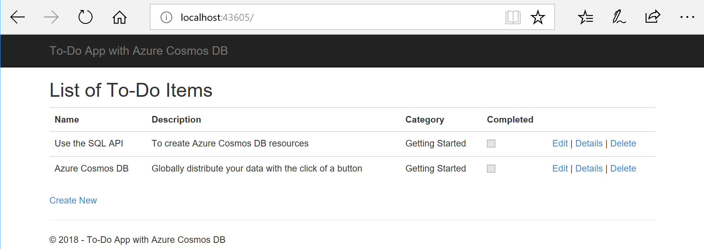
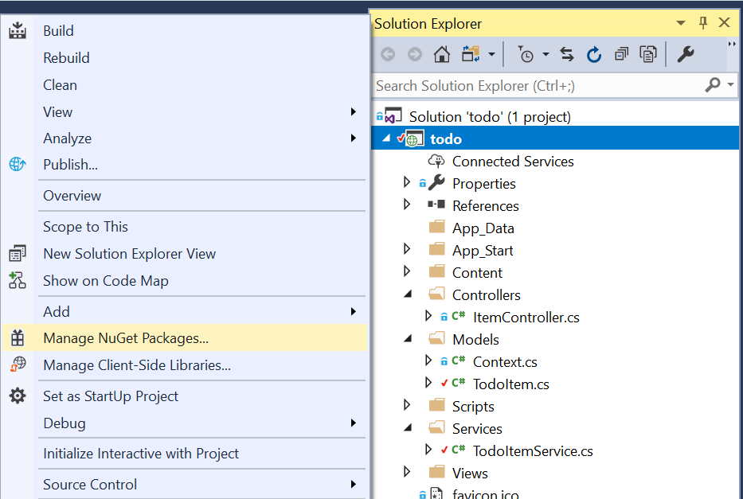
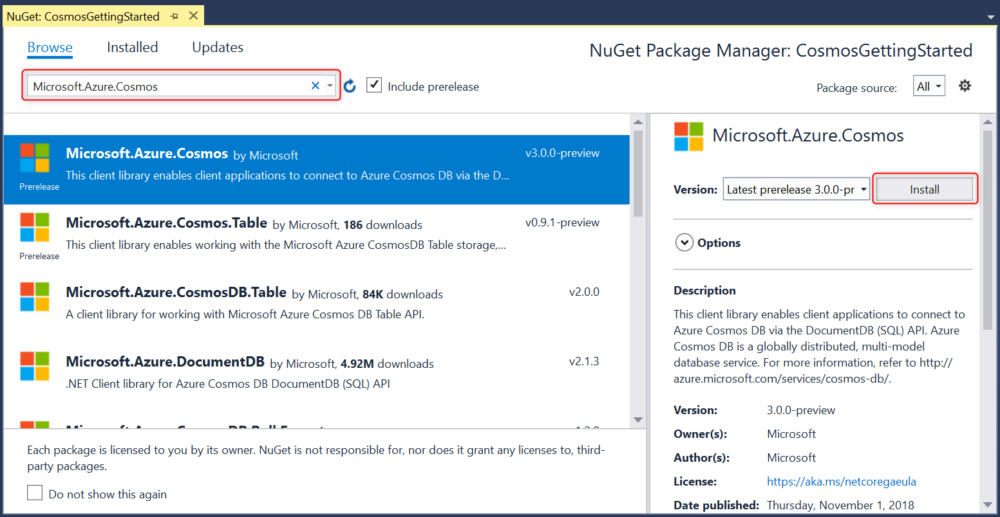

# Quickstart: Build an ASP.NET web app using Azure Cosmos DB SQL API account

> [!div class="op_single_selector"]
> * [.NET (Preview)](create-sql-api-dotnet-preview.md)
> * [.NET](create-sql-api-dotnet.md)
> * [Java](create-sql-api-java.md)
> * [Node.js](create-sql-api-nodejs.md)
> * [Python](create-sql-api-python.md)
> * [Xamarin](create-sql-api-xamarin-dotnet.md)
>  
> 

Azure Cosmos DB is Microsoft’s globally distributed, highly available, multi-model database service. You can quickly create and query document, key/value, and graph databases, all of which benefit from the global distribution and horizontal scale capabilities at the core of Azure Cosmos DB. 

This quick start demonstrates how to create an Azure Cosmos DB [SQL API](sql-api-introduction.md) account, database, and container using the Azure portal. You'll then build and deploy an ASP.NET To-do List web app built on the [SQL .NET API](sql-api-sdk-dotnet.md), as shown in the following screenshot. 

This quick start uses Version 3.0+ of the Azure Cosmos DB .NET SDK. 



## Prerequisites

If you don’t already have Visual Studio 2019 installed, you can download and use the **free** [Visual Studio 2019 Community Edition](https://www.visualstudio.com/downloads/). Make sure that you enable the **Azure development** workload during the Visual Studio setup.

[!INCLUDE [quickstarts-free-trial-note](../../includes/quickstarts-free-trial-note.md)] 
[!INCLUDE [cosmos-db-emulator-docdb-api](../../includes/cosmos-db-emulator-docdb-api.md)]  

<a id="create-account"></a>
## Create an Azure Cosmos account

[!INCLUDE [cosmos-db-create-dbaccount-preview](../../includes/cosmos-db-create-dbaccount-preview.md)]

<a id="create-collection"></a>
## Add a container

[!INCLUDE [cosmos-db-create-collection-preview](../../includes/cosmos-db-create-collection-preview.md)]

<a id="add-sample-data"></a>
## Add sample data

[!INCLUDE [cosmos-db-create-sql-api-add-sample-data](../../includes/cosmos-db-create-sql-api-add-sample-data.md)]

## Query your data

[!INCLUDE [cosmos-db-create-sql-api-query-data](../../includes/cosmos-db-create-sql-api-query-data.md)]

## Clone the sample application

Now let's switch to working with code. Let's clone a [SQL API app from GitHub](https://github.com/Azure-Samples/cosmos-dotnet-todo-app), set the connection string, and run it. 

1. Open a command prompt, create a new folder named git-samples, then close the command prompt.

    ```bash
    md "C:\git-samples"
    ```

2. Open a git terminal window, such as git bash, and use the `cd` command to change to the new folder to install the sample app.

    ```bash
    cd "C:\git-samples"
    ```

3. Run the following command to clone the sample repository. This command creates a copy of the sample app on your computer.

    ```bash
    git clone https://github.com/Azure-Samples/cosmos-dotnet-todo-app.git
    ```

4. Open the **todo.sln** solution file in Visual Studio. 

## Review the code

This step is optional. If you're interested in learning how the database resources are created in the code, you can review the following snippets. Otherwise, you can skip ahead to [Update your connection string](#update-your-connection-string). 

Note, if you are familiar with the previous version of the .NET SDK, you may be used to seeing the terms 'collection' and 'document.' Because Azure Cosmos DB supports multiple API models, version 3.0+ of the .NET SDK uses the generic terms 'container' and 'item.' A container can be a collection, graph, or table. An item can be a document, edge/vertex, or row, and is the content inside a container. [Learn more about databases, containers, and items.](databases-containers-items.md)

The following snippets are all taken from the ToDoItemService.cs file.

* The CosmosClient is initialized on lines 68 - 69.

    ```csharp
    CosmosConfiguration config = new CosmosConfiguration(Endpoint, PrimaryKey);
    client = new CosmosClient(config);
    ```

* A new database is created on line 71.

    ```csharp
    CosmosDatabase database = await client.Databases.CreateDatabaseIfNotExistsAsync(DatabaseId);
    ```

* A new container is created on line 72 with partition key "/category."

    ```csharp
    CosmosContainer container = await database.Containers.CreateContainerIfNotExistsAsync(ContainerId, "/category");
    ```

## Update your connection string

Now go back to the Azure portal to get your connection string information and copy it into the app.

1. In the [Azure portal](https://portal.azure.com/), in your Azure Cosmos DB account, in the left navigation select **Keys**, and then select **Read-write Keys**. You'll use the copy buttons on the right side of the screen to copy the URI and Primary Key into the web.config file in the next step.

    

2. In Visual Studio, open the **web.config** file. 

3. Copy your URI value from the portal (using the copy button) and make it the value of the ``endpoint`` key in web.config. 

    `<add key="endpoint" value="FILLME" />`

4. Then copy your PRIMARY KEY value from the portal and make it the value of the ``primarykey`` in web.config. 

    `<add key="primaryKey" value="FILLME" />`
    
5. Then update the database and container value to match the name of the database and container you created earlier. You've now updated your app with all the info it needs to communicate with Azure Cosmos DB. 

    `<add key="database" value="Tasks" />`

    `<add key="container" value="Items" />`
    
## Run the web app

1. In the **Solution Explorer**, right click on your new console application project, which is under your Visual Studio solution, and then click **Manage NuGet Packages...**
    
    
1. In the **NuGet** tab, click **Browse**, and type **Microsoft.Azure.Cosmos** in the search box.
1. Within the results, find **Microsoft.Azure.Cosmos** and click **Install**.
   The package ID for the Azure Cosmos DB SQL API Client Library is [Microsoft Azure Cosmos DB Client Library](https://www.nuget.org/packages/Microsoft.Azure.Cosmos/).

   

    If you get a message about reviewing changes to the solution, click **OK**. If you get a message about license acceptance, click **I accept**.

1. Select CTRL + F5 to run the application. Your app displays in your browser. 

1. Select **Create New** in the browser and create a few new tasks in your to-do app. You should also see the tasks you created in [Add sample data](#add-sample-data)

   

You can now go back to Data Explorer and see, query, modify, and work with this new data. 

## Review SLAs in the Azure portal

[!INCLUDE [cosmosdb-tutorial-review-slas](../../includes/cosmos-db-tutorial-review-slas.md)]

## Clean up resources

[!INCLUDE [cosmosdb-delete-resource-group](../../includes/cosmos-db-delete-resource-group.md)]

## Next steps

In this quickstart, you've learned how to create an Azure Cosmos DB account, create a container and add items to it using the Data Explorer, and run a web app. You can now import additional data to your Cosmos DB account. 

> [!div class="nextstepaction"]
> [Import data into Azure Cosmos DB](import-data.md)


